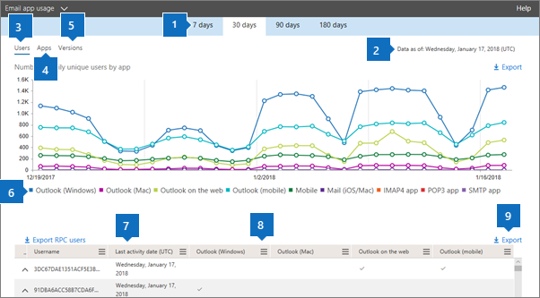
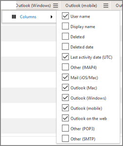

# Отчеты Microsoft 365 в центре администрирования — использование почтовых приложений

На панели мониторинга **отчетов** Microsoft 365 вы увидите обзор действий по продуктам в вашей организации. Вы можете просмотреть отчеты по отдельным продуктам, чтобы получить более подробные сведения о действиях с каждым приложением. Ознакомьтесь со статьей [Обзор отчетов](activity-reports.md). В отчете об использовании почтовых приложений можно узнать, сколько почтовых приложений подключаются к Exchange Online. Вы также можете просмотреть сведения об используемых версиях приложений Outlook, чтобы найти сотрудников, которые используют неподдерживаемые версий.
  
> [!NOTE]
> Для просмотра отчетов необходимо быть глобальным администратором, глобальным читателям или читателями отчетов в Microsoft 365 или Exchange, SharePoint, Teams Service, Team Communications или Skype для бизнеса.  
 
## Получение отчета о почтовых приложениях

1. В центре администрирования перейдите в раздел **отчеты о** \> <a href="https://go.microsoft.com/fwlink/p/?linkid=2074756" target="_blank">использование</a> страницы.

    
2. В раскрывающемся списке **выберите отчет** выберите **Exchange** \> **использование почтовых приложений**Exchange.
  
## Интерпретация отчета о почтовых приложениях

Вы можете получить представление об активности почтовых приложений, изучив диаграммы **пользователей** и **клиентов** . 
  

  
|||
|:-----|:-----|
|1.    |Отчет **об использовании почтовых приложений** можно просмотреть для тенденций за последние 7, 30, 90 дней или 180 дней. Тем не менее, если выбрать определенный день в отчете, в таблице (7) будут отображаться данные в течение 28 дней с текущей даты (не Дата создания отчета).    |
|2.    |Данные в каждом отчете обычно закрываются в течение последних 24 – 48 часов.    |
|3.    |В представлении **Пользователи** показано количество уникальных пользователей, которые подключались к Exchange Online с помощью любой почтовой программы.    |
|4.    |В представлении **Приложения** отображается количество уникальных пользователей по приложениям за выбранный период.    |
|5.    |В представлении **версии** отображается количество уникальных пользователей для каждой версии Outlook в Windows.    |
|6.    | На диаграмме **Пользователи** ось Y представляет общее количество уникальных пользователей, которые подключались к приложению в любой день отчетного периода.     Ось X на диаграмме **Пользователи** представляет число уникальных пользователей, которые использовали приложение в течение отчетного периода.     На диаграмме **Приложения** ось Y представляет общее количество уникальных пользователей, которые использовали определенное приложение в течение отчетного периода.     На оси X диаграммы **Приложения** представлен список приложений в организации.     На диаграмме **Версии** ось Y представляет общее количество уникальных пользователей определенной версии классического приложения Outlook. Если номер версии Outlook неизвестен, вместо количества будет указано "Не определено".     На оси X диаграммы **Версии** представлен список приложений в организации.    |
|7.    |Вы можете отфильтровать ряды, которые вы видите на диаграмме, селектинган элемент в условных обозначениях. Например, на диаграмме **Пользователи** выберите **Mac-почта** или список **Outlook**  для просмотра только сведений, относящихся к этой категории. При выборе другого значения данные в таблице-сетке не меняются. Примерами почтовых приложений являются Почта Mac, Outlook для Mac, Outlook Mobile, классическая версия Outlook и Outlook в Интернете.    |
|8.    | В столбцах могут быть не все указанные ниже элементы, если не добавить их.  **Username** имя владельца почтового приложения.    **Дата последнего действия** — это самая поздняя дата, когда пользователь прочитает или отправил сообщение электронной почты.    Примерами почтовых приложений являются **Почта Mac**, **Outlook для Mac**, **Outlook**, **Outlook Mobile** и **Outlook в Интернете**.     Если политики организации не позволяют просматривать отчеты, в которых есть личные сведения пользователей, можно изменить параметр конфиденциальности для всех отчетов. Ознакомьтесь с разделом " **как скрыть сведения о уровне пользователя?** " в [отчетах об активности в центре администрирования Microsoft 365](activity-reports.md).    |
|9.    |Выберите **Управление столбцами** , чтобы добавить столбцы в отчет или удалить их из него.    |
|десяти.    |Вы также можете экспортировать данные отчета в CSV-файл Excel, выбрав ссылку **Экспорт** . При этом данные всех пользователей будут экспортированы в формат, позволяющий сортировать и фильтровать их для дальнейшего анализа. Если у вас менее 2000 пользователей, вы можете сортировать и фильтровать значения в самой таблице отчета. Если пользователей больше 2000, для фильтрации и сортировки потребуется экспортировать данные.    |
|||
   

