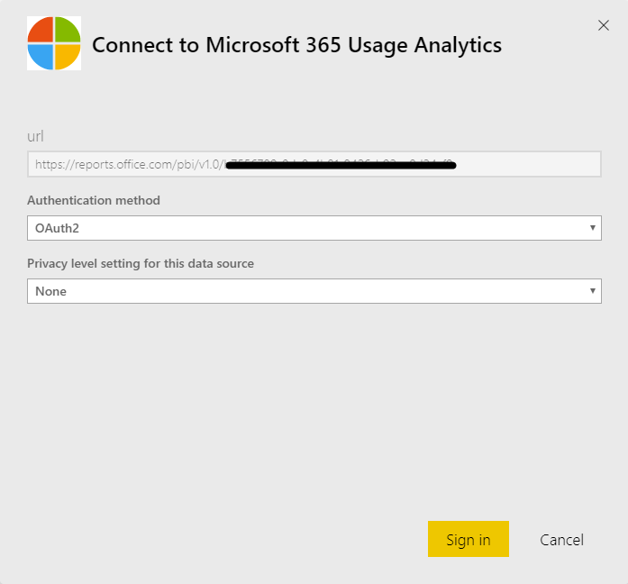

# Включение аналитики использования Microsoft 365

::: moniker range="o365-21vianet"

> [!NOTE]
> Изменяется Центр администрирования. Если ваш интерфейс не соответствует приведенным здесь сведениям, см. раздел [О новом Центре администрирования Microsoft 365](https://docs.microsoft.com/microsoft-365/admin/microsoft-365-admin-center-preview?view=o365-21vianet).

::: moniker-end

Служба анализа сведений об использовании Microsoft 365 также доступна для сообщества 365 Майкрософт для государственных учреждений США.
  
## Действия по включению анализа сведений об использовании Microsoft 365

Чтобы приступить к анализу использования Microsoft 365, сначала необходимо сделать данные доступными в центре администрирования Microsoft 365, а затем запустить его в Power BI.
  
### Получение Power BI

Если у вас еще нет Power BI, вы можете [зарегистрироваться в Power BI Pro](https://go.microsoft.com/fwlink/p/?linkid=845347). Выберите вариант **попробовать бесплатно** , чтобы получить пробную версию, или **купите сейчас** , чтобы получить Power BI Pro.
  
  
Вы также можете развернуть раздел **Продукты** и приобрести Power BI. 

> [!NOTE]
> Для установки, настройки и распространения приложения-шаблона необходима лицензия Power BI Pro. Дополнительные сведения можно найти в разделе [Предварительные требования](https://docs.microsoft.com/power-bi/service-template-apps-install-distribute?source=docs#prerequisites).

Для предоставления общего доступа к контенту требуется лицензия Power BI Pro, а для пользователей, которым вы хотите предоставить общий доступ, или контент должен находиться в рабочей области с [расширенными возможностями](https://docs.microsoft.com/power-bi/service-premium-what-is). 
  
### Включение приложения шаблона

Чтобы включить приложение-шаблон, необходимо быть **глобальным администратором**, **средством чтения отчетов**, **администратором Exchange**, **администратором Skype для бизнеса**или **администратором SharePoint**. 
  
Более подробную информацию можно узнать в статье [сведения о ролях администратора](../add-users/about-admin-roles.md) . 
  
1. В центре администрирования перейдите в раздел **отчеты о** \> <a href="https://go.microsoft.com/fwlink/p/?linkid=2074756" target="_blank">использование</a> страницы. 
    
2. На странице " **Использование** " выберите карточку **службы аналитики использования Microsoft 365** и нажмите кнопку **начать работу**.
    
3. В открывшейся панели Отчеты установите для параметра **доступ к данным службы Microsoft 365 об использовании службы Power BI доступ** **к** \> **сохраненным**данным. 
  
Это инициирует процесс сбора данных и будет выполняться в течение 2 – 48 часов в зависимости от размера клиента. При завершении сбора данных кнопка " **Перейти к Power BI** " будет включена (перестает быть серым). 
    
### Запуск шаблона приложения

Для запуска приложения-шаблона необходимо быть **глобальным администратором**, **средством чтения отчетов**, **администратором Exchange**, **администратором Skype для бизнеса**или **администратором SharePoint**. 
  
1. Скопируйте идентификатор клиента и выберите пункт **Перейти в Power BI**.
    
2.  When you get to Power BI, sign in. В меню навигации выберите пункт приложения >получить приложения.    
  
3. На вкладке **приложения** введите Microsoft 365 в поле поиска, а затем выберите **Microsoft 365 использование аналитики** для \> **получения**.

    
    
4.  После установки приложения. Щелкните плитку, чтобы открыть ее.

5.  Нажмите кнопку **Просмотреть приложение** , чтобы просмотреть приложение с примерами данных. Нажмите кнопку **Подключиться** , чтобы подключить приложение к данным вашей организации.

6.  После нажатия кнопки **подключить**на экране **Подключение к службе анализа использования Microsoft 365** введите идентификатор клиента (без тире), скопированный на шаге (1), и нажмите кнопку **Далее**.
    
7. На следующем экране выберите **oAuth2** в качестве **метода проверки подлинности** \> **Вход**. Если вы выбрали другой способ проверки подлинности, подключение к приложению шаблона завершится с ошибками.
    
    
  
8. После создания экземпляра приложения шаблона панель мониторинга анализа использования Microsoft 365 будет доступна в Power BI в Интернете. Начальная загрузка панели мониторинга займет от 2 до 30 минут.
  
Статистические функции на уровне клиента будут доступны во всех отчетах. **Сведения на уровне пользователя становятся доступны только по истечении первого или 15-го дня в календарном месяце после пропуска**. Это повлияет на все отчеты в разделе действия пользователя (дополнительные советы по просмотру и использованию отчетов представлены [в статье Навигация и использование отчетов в аналитике использования Microsoft 365](navigate-and-utilize-reports.md) ).
    
## Как сделать собранные данные анонимными?

Данные, собираемые для отчетов, может сделать анонимными только глобальный администратор. Это приведет к скрытию идентифицируемых сведений, таких как имена пользователей, групп и сайтов, в отчетах и в приложении-шаблоне.
  
1. В центре администрирования откройте **раздел Параметры** \> **Организации**, а затем на вкладке **службы** выберите **отчеты**.
    
2. Выберите **отчеты**, а затем выберите для **отображения анонимных идентификаторов**. Этот параметр применяется как к отчетам об использовании, так и к приложению шаблона.
  
3. Нажмите кнопку **Сохранить изменения**.
