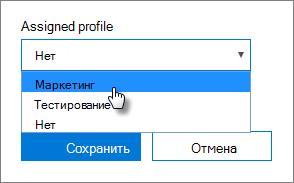

# Создание и изменение профилей AutoPilot

## Создание профиля

Профиль относится к устройству или группе устройств.
  
1. В центре администрирования Microsoft 365 Business выберите **устройства** \> **автопилот**.
  
2. На странице **автопилот** выберите вкладку \> **Профили** **Создание профиля**.
    
3. На странице " **Создание профиля** " введите имя профиля, помогающее определить его, например "маркетинг". Включите нужный параметр, а затем нажмите кнопку **сохранить**. Дополнительные сведения о параметрах профиля автопилота см [.](autopilot-profile-settings.md)
    
    
  
### Применение профиля к устройству

После создания профиля его можно применить к устройству или группе устройств. Вы можете выбрать существующий профиль в пошаговом [руководстве](add-autopilot-devices-and-profile.md) и применить его к новым устройствам или заменить существующий профиль для устройства или группы устройств. 
  
1. На странице **Подготовка Windows** перейдите на вкладку **Устройства**. 
    
2. Установите флажок рядом с именем устройства, а затем на панели Device ( **устройство** ) выберите профиль в раскрывающемся \> списке **назначенный профиль** **сохранить**.
    
    
  
## Изменение и удаление профиля

После назначения профиля устройству вы можете изменить его, даже если вы уже выдали устройство пользователю. Когда устройство подключается к Интернету, в процессе настройки на него скачивается последняя версия профиля. Когда пользователь сбрасывает устройство до заводских настроек, на него снова скачивается обновленный профиль. 
  
### Изменение профиля

1. На странице **Подготовка Windows** перейдите на вкладку **Профили**. 
    
2. Установите флажок рядом с именем устройства, а затем в панели **профилей** обновите все доступные параметры \> **сохранения**.
    
    Если сделать это до того, как устройство подключится к Интернету, профиль будет применен в процессе настройки.
    
### Удаление профиля

1. На странице **Подготовка Windows** перейдите на вкладку **Профили**. 
    
2. Установите флажок рядом с именем устройства, а затем на панели **профилей** выберите **Удалить** \> **Сохранение**профиля.
    
    При удалении профиля он перестает действовать для устройства или группы устройств, которым он был назначен.
    
### Отмена назначения профиля

1. На странице **Подготовка Windows** перейдите на вкладку **Устройства**. 
    
2. Установите флажок рядом с именем устройства, а затем на панели **устройство** выберите **нет** в раскрывающемся \> списке **назначенный профиль** **сохранить**.
    
