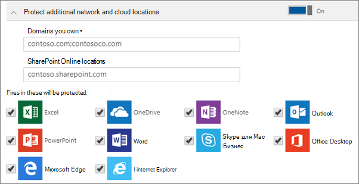

# Настройка параметров защиты приложений для устройств с Windows 10Set application protection settings for Windows 10 devices

Эта статья относится к Microsoft 365 Business Premium.This article applies to Microsoft 365 Business Premium.

## Создание политики управления приложениями для Windows 10Create an app management policy for Windows 10

Если у ваших пользователей есть личные устройства с Windows 10, используемые для выполнения рабочих задач, на этих устройствах также можно настроить защиту данных компании.If your users have personal Windows 10 devices on which they perform work tasks, you can protect your data on those devices as well.
  
1. Перейдите в Центр администрирования <a href="https://go.microsoft.com/fwlink/p/?linkid=837890" target="_blank">https://admin.microsoft.com</a>.Go to the admin center at <a href="https://go.microsoft.com/fwlink/p/?linkid=837890" target="_blank">https://admin.microsoft.com</a>. 
    
2. В левой панели навигации выберите пункт **Devices** \> **политики** устройств \> **Добавить**.On the left nav, choose **Devices** \> **Policies** \> **Add**.

3. На панели **Добавить политику** введите уникальное имя политики.On the **Add policy** pane, enter a unique name for this policy. 
    
4. В поле **Тип политики** выберите **Управление приложениями для Windows 10**.Under **Policy type**, choose **Application Management for Windows 10**.
    
5. В разделе **тип устройства**выберите **персональный** или **принадлежащий компании**.Under **Device type**, choose either **Personal** or **Company Owned**.
    
6. Параметр **Шифровать рабочие файлы** включается автоматически.The **Encrypt work files** is turned on automatically. 
    
7. Если вы не хотите, чтобы пользователи сохраняли рабочие файлы на компьютере, **включите** параметр **Запретить копирование данных компании в личные файлы и обязать хранить рабочие файлы в OneDrive для бизнеса**.Set **Prevent users from copying company data to personal files and force them to save work files to OneDrive for Business** to **On** if you don't want the users to save work files on their PC. 
    
9. Разверните узел **Восстановление данных на устройствах с Windows**.Expand **Recover data on Windows devices**. Рекомендуем **включить его.**We recommend that you turn it **On**.
    
    Прежде чем переходить к расположению сертификата агента восстановления данных, необходимо сначала создать его.Before you can browse to the location of the Data Recovery Agent certificate, you have to first create one. Инструкции приведены в разделе [Создание и проверка сертификата агента восстановления шифрованной файловой системы (DRA](https://go.microsoft.com/fwlink/p/?linkid=853700)).For instructions, see [Create and verify an Encrypting File System (EFS) Data Recovery Agent (DRA) certificate](https://go.microsoft.com/fwlink/p/?linkid=853700).
    
    По умолчанию рабочие файлы шифруются с помощью секретного ключа, хранящегося на устройстве и связанного с профилем пользователя.By default, work files are encrypted using a secret key that is stored on the device and associated with the user's profile. Открыть и расшифровать файл может только пользователь.Only the user can open and decrypt the file. Однако в случае потери устройства или удаления пользователя файл может остаться в зашифрованном виде.However, if a device is lost or a user is removed, a file can be stuck in an encrypted state. Администратор может использовать сертификат агента восстановления данных (DRA) для расшифровки файла.An admin can use the Data Recovery Agent (DRA) certificate to decrypt the file.
    
    
  
10. Разверните раздел **Защита дополнительных сетевых и облачных расположений** , если вы хотите добавить дополнительные домены или расположения SharePoint Online, чтобы обеспечить защиту файлов во всех перечисленных приложениях.Expand **Protect additional network and cloud locations** if you want to add additional domains or SharePoint Online locations to make sure that files in all the listed apps are protected. Если в каком-либо поле вам нужно ввести несколько элементов, разделяйте их точкой с запятой (;).If you need to enter more than one item for either field, use a semicolon (;) between the items.
    
    
  
11. Next decide **Who will get these settings?** If you don't want to use the default **All Users** security group, choose **Change**, choose the security groups who will get these settings \> **Select**.Next decide **Who will get these settings?** If you don't want to use the default **All Users** security group, choose **Change**, choose the security groups who will get these settings \> **Select**.
    
12. Нажмите кнопку **Добавить**, чтобы сохранить политику и назначить ее устройствам.Finally, choose **Add** to save the policy, and assign it to devices. 
