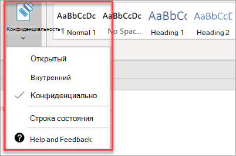

# Настройка функций обеспечения соответствия требованиям

Microsoft 365 Business Premium поставляется с функциями для защиты данных и устройств, а также для обеспечения безопасности конфиденциальной информации ваших клиентов.

## Настройка функций DLP

В разделе [Создание политики защиты от потери данных в шаблоне](https://support.office.com/article/59414438-99f5-488b-975c-5023f2254369) приведен пример того, как настроить политику для защиты от персональных данных (PII). 
  
DLP включает множество готовых шаблонов политик для множества разных языковых стандартов. Например, финансовые данные для Австралии, персональные данные для Канады, финансовые данные США и т. д. Узнайте [, какие шаблоны политики защиты от потери данных входят в](https://support.office.com/article/c2e588d3-8f4f-4937-a286-8c399f28953a) полный список. Все эти шаблоны можно включить аналогично примеру шаблона PII. 
  
## Настройка хранения электронной почты с помощью архивации на базе Exchange Online

 Функции лицензии на **архивацию на базе Exchange Online** помогают поддерживать соответствие стандартам и нормативным требованиям, сохраняя содержимое электронной почты для обнаружения электронных данных. Это также способствует снижению риска при наличии судебного реагирования и способе восстановления данных после нарушения безопасности или при необходимости восстановления удаленных элементов. Вы можете использовать удержание для судебного разбирательства, чтобы сохранить все содержимое пользователя, или использовать политики хранения для настройки того, что нужно сохранить.
  
**Удержание для судебного разбирательства:** Вы можете сохранить все содержимое почтового ящика, включая удаленные элементы, поместив весь почтовый ящик пользователя на удержание для судебного разбирательства. 
    
Чтобы поместить почтовый ящик на удержание для судебного разбирательства, в центре администрирования:
    
1. В левой панели навигации выберите **Пользователи** \> **Активные**пользователи.
    
2. Выберите пользователя, чей почтовый ящик вы хотите поместить на удержание для судебного разбирательства. В области пользователя разверните узел **Параметры почты**и рядом с пунктом **Дополнительные параметры**выберите команду **изменить свойства Exchange**.
    
3. На странице почтовый ящик пользователя выберите * * функции почтовых ящиков * * в левой панели навигации, а затем щелкните ссылку **включить** в разделе **удержание для судебного разбирательства**.
    
4. В диалоговом окне " **удержание для судебного разбирательства** " можно указать продолжительность хранения для судебного разбирательства в поле **длительность удержания для судебного** разбирательства. Оставьте это поле пустым, если хотите разместить бесконечное удержание. Вы также можете добавить заметки и направить владельца почтового ящика на веб-сайт, который может пояснить дополнительные сведения о хранении для судебного разбирательства. \>**Сохранить**.
    
**Хранение:** Можно включить специальные политики хранения, например, для сохранения в течение определенного периода времени или окончательного удаления контента в конце периода хранения. Чтобы узнать больше, ознакомьтесь [со статьей Обзор политик хранения](https://docs.microsoft.com/microsoft-365/compliance/retention-policies).

## Настройка меток конфиденциальности

Метки конфиденциальности поставляются с планом 1 Azure Information Protection (точка административной защиты) и помогают классифицировать и дополнительно защищать документы и электронные письма, применяя метки. Метки можно автоматически применять администраторы, которые определяют правила и условия, вручную или с помощью комбинации, в которой пользователи получают рекомендации.

Чтобы настроить метки конфиденциальности, просмотрите видео [Создание меток о конфиденциальности и управление ими](https://support.office.com/article/2fb96b54-7dd2-4f0c-ac8d-170790d4b8b9) .

### Установка клиента Azure Information Protection вручную

Для установки клиента АДМИНИСТРАТИВной установки вручную выполните следующие действия.

1. Скачайте **AzinfoProtection_UL. exe** из [центра загрузки Майкрософт](https://www.microsoft.com/download/details.aspx?id=53018).
 
2. Чтобы убедиться, что установка проработала, просмотрите документ Word и убедитесь, что параметр " **чувствительность** " доступен на вкладке " **Главная** ".
 

Для получения дополнительных сведений обратитесь [к разделу Установка клиента](https://docs.microsoft.com/azure/information-protection/infoprotect-tutorial-step3).
