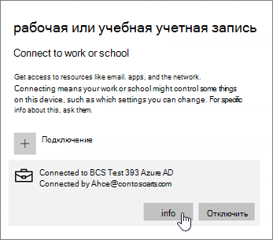

# Настройка устройств с Windows для пользователей Microsoft 365 Business

## Необходимые компоненты

Перед настройкой устройств с Windows для пользователей Microsoft 365 Business убедитесь, что на всех устройствах установлена система Windows 10 Pro версии 1703 (обновление Creators Update). Наличие ОС Windows 10 Pro является необходимым условием для развертывания Windows 10 Business — набора облачных служб и функций управления устройствами, который дополняет возможности этой операционной системы и предназначен для централизованного управления средой Windows 365 Business и ее безопасностью.
  
Если у вас есть устройства с Windows под управлением операционной системы Windows 7 Pro, Windows 8 Pro или Windows 8.1 Pro, вы можете перейти на Windows 10 в рамках подписки Microsoft 365 Business.
  
Дополнительные сведения о переводе устройств с Windows на версию Windows 10 Pro Creators Update приведены в следующей статье: [Обновление устройств с Windows до Windows Pro Creators Update](upgrade-to-windows-pro-creators-update.md)
  
Ознакомьтесь со статьей убедитесь, что [устройство подключено к Azure AD](#verify-the-device-is-connected-to-azure-ad) , чтобы проверить, что у вас есть обновление, или чтобы убедиться в том, что обновление работало.

Посмотрите короткое видео о подключении Windows к Microsoft 365.  

> [!VIDEO https://www.microsoft.com/videoplayer/embed/RE3yXh3] 

Если этот видео помогло вам, ознакомьтесь с [полным учебным курсом для малых предприятий и новых пользователей Microsoft 365](https://support.office.com/article/6ab4bbcd-79cf-4000-a0bd-d42ce4d12816).
  
## Добавление устройств с Windows 10 в каталог Azure AD организации

Когда все устройства с Windows в вашей организации обновлены до версии Windows 10 профессиональная Creators или уже запущены обновление Windows 10 Pro Creators, вы можете присоединить эти устройства к Azure Active Directory вашей организации. После подключения к устройствам они будут автоматически обновлены до Windows 10 Business, которая входит в состав подписки на Microsoft 365 Business.
  
### Для новых (или недавно переведенных) устройств с Windows 10 Pro

Для новых устройств с системой Windows 10 Pro Creators Update и устройств, которые были переведены на эту версию, но для которых еще не выполнена настройка Windows 10, следуйте инструкциям ниже.
  
1. Начните настройку Windows 10 на устройстве и дойдите до страницы **Выбор способа настройки**. 
    
    
  
2. Выберите вариант **Настроить для организации** и введите имя пользователя и пароль для Microsoft 365 Business. 
    
3. Завершите настройку Windows 10 на устройстве.
    
   После завершения этой процедуры пользователь будет добавлен в каталог Azure AD организации. Чтобы проверить, так ли это, ознакомьтесь со статьей [Проверка подключения устройства к Azure AD](#verify-the-device-is-connected-to-azure-ad). 
  
### Для устройства, на котором уже установлена и настроена система Windows 10 Pro

 **Подключение пользователей к Azure AD**
  
1. На пользовательском компьютере под управлением Windows 10 Pro версии 1703 (Creators Update) (см. [необходимые условия](pre-requisites-for-data-protection.md)) щелкните логотип Windows, а затем значок параметров.
  
   
  
2. В окне **Параметры** выберите элемент **Учетные записи**.
  
   
  
3. На странице **Ваши данные** выберите **Доступ к учетной записи места работы или учебного заведения** \> **Подключить**.
  
   
  
4. В диалоговом окне **Настроить учетную запись компании или учебного заведения** в разделе **Другие действия** выберите **Присоединить это устройство к Azure Active Directory**.
  
   
  
5. On the **Let's get you signed in** page, enter your work or school account \> **Next**.
  
   On the **Enter password** page, enter your password \> **Sign in**.
  
   
  
6. Убедитесь, что на странице **ваша организация** указана правильная информация, и нажмите кнопку **присоединиться**.
  
   На странице **Готово!** нажмите кнопку **Готово**.
  
   
  
Если вы добавляете файлы в OneDrive для бизнеса, синхронизируйте их в обратном направлении. Если для переноса профилей и файлов использовалось стороннее средство, также синхронизируйте их с новым профилем.
  
## Проверка подключения устройства к Azure AD

Чтобы проверить состояние синхронизации, на странице **Доступ к учетной записи места работы или учебного заведения** окна **Параметры** щелкните в области **Подключен к** _ \<organization name\> _, чтобы появились кнопки **Сведения** и **Отключить**. Чтобы узнать состояние синхронизации, нажмите кнопку **Сведения**. 
  
На странице состояния синхронизации нажмите кнопку "Синхронизировать", чтобы получить сведения о последних политиках мобильных устройств на компьютере.
  
Чтобы начать работу с учетной записью Microsoft 365 Business, перейдите к кнопке **Пуск** Windows, щелкните правой кнопкой мыши текущий рисунок учетной записи, а затем **Переключить учетную запись**. Войдите, используя адрес электронной почты и пароль организации.
  

  
## Проверка перевода устройства на Windows 10 для бизнеса

Убедитесь, что устройства с Windows 10, добавленные в домен Azure AD, переведены на версию Windows 10 для бизнеса в составе подписки на Microsoft 365 Business.
  
1. Выберите **Параметры** \> **Система** \> **Сведения**.
    
2. Убедитесь, что в поле **Выпуск** указано **Windows 10 для бизнеса**.
    
    
  
## Дальнейшие действия

Сведения о настройке мобильных устройств см. в статьях [Настройка мобильных устройств для пользователей Microsoft 365 Business](set-up-mobile-devices.md), о настройке защиты и политик защиты устройств — в статье [Управление Microsoft 365 Business](manage.md).
  
## См. также

[учебные видео по Microsoft 365 бизнес](https://support.office.com/article/6ab4bbcd-79cf-4000-a0bd-d42ce4d12816)
