# <a name="manage-the-lifecycle-of-sharepoint-documents-with-retention-labels"></a><span data-ttu-id="94454-104">Управление жизненным циклом документов SharePoint с помощью меток хранения</span><span class="sxs-lookup"><span data-stu-id="94454-104">Manage the lifecycle of SharePoint documents with retention labels</span></span>

<span data-ttu-id="94454-105">В этой статье описывается, как управлять жизненным циклом хранящихся в SharePoint Online документах, связанных с продуктами, с помощью меток хранения Office 365 и, в частности, путем автоматического применения меток и настройки хранения на базе событий.</span><span class="sxs-lookup"><span data-stu-id="94454-105">This article describes how you can manage the lifecycle of product-related documents stored in SharePoint Online by using Office 365 retention labels, and specifically by auto-applying labels and configuring event-based retention.</span></span> <span data-ttu-id="94454-106">Функциональность автоматического применения применяет классификацию документов с использованием метаданных SharePoint.</span><span class="sxs-lookup"><span data-stu-id="94454-106">The auto-apply functionality leverages document classification by the use of SharePoint metadata.</span></span> <span data-ttu-id="94454-107">Сценарий, описываемый в этой статье, основан на документах, связанных с продуктами, но такой же поход можно использовать и в других сценариях.</span><span class="sxs-lookup"><span data-stu-id="94454-107">The scenario in this article is based on product-related documents, but the same concepts can be used for other scenarios.</span></span> <span data-ttu-id="94454-108">Например, в нефтегазовой отрасли можно управлять жизненным циклом документов, связанных с физическими активами, например, добывающими платформами, журналами скважин и лицензиями на производство.</span><span class="sxs-lookup"><span data-stu-id="94454-108">For example, in the oil and gas industry, you could manage the lifecycle of documents related to physical assets such as oil platforms, well logs, or production licenses.</span></span> <span data-ttu-id="94454-109">В отрасли финансовых услуг можно управлять документами, которые связаны с банковскими счетами, ипотекой или страховыми договорами.</span><span class="sxs-lookup"><span data-stu-id="94454-109">In the financial services industry, you can manage documents related to bank accounts, mortgages, or insurance contracts.</span></span> <span data-ttu-id="94454-110">В государственном секторе можно управлять документами, связанными с разрешениями на строительство или с налоговыми формами.</span><span class="sxs-lookup"><span data-stu-id="94454-110">In the public sector, you can manage documents related to construction permits or tax forms.</span></span>

<span data-ttu-id="94454-111">Рассмотрим сценарий, описываемый в этой статье.</span><span class="sxs-lookup"><span data-stu-id="94454-111">Let's look at the scenario for this article.</span></span> <span data-ttu-id="94454-112">Мы изучим информационную архитектуру и определение меток хранения.</span><span class="sxs-lookup"><span data-stu-id="94454-112">We'll look at the information architecture and the definition of the retention labels.</span></span> <span data-ttu-id="94454-113">Затем мы перейдем к классификации документов путем автоматического применения меток, а затем будем формировать события, запускающие начало срока хранения.</span><span class="sxs-lookup"><span data-stu-id="94454-113">Then we'll look at classifying documents by auto-applying the labels, and finally generating the events that initiate the start of the retention period.</span></span>

## <a name="information-architecture"></a><span data-ttu-id="94454-114">Информационная архитектура</span><span class="sxs-lookup"><span data-stu-id="94454-114">Information architecture</span></span>

<span data-ttu-id="94454-115">Сценарий, описываемый в этой статье, основан на работе производственной компании, в которой для хранения всех документов, связанных с продуктами, которые разрабатывает эта компания, используется Office 365 SharePoint Online.</span><span class="sxs-lookup"><span data-stu-id="94454-115">The scenario for this article is based on a manufacturing company that uses Office 365 SharePoint Online to store all the documents related to the products the company develops.</span></span> <span data-ttu-id="94454-116">В число этих документов входят: спецификации продуктов, соглашения с поставщиками и руководства пользователя.</span><span class="sxs-lookup"><span data-stu-id="94454-116">These documents include product specifications, agreements with suppliers, and user manuals.</span></span> <span data-ttu-id="94454-117">Для этих документов при хранении в SharePoint в рамках корпоративных политик управления содержимым определяются метаданные, которые используются для классификации документов.</span><span class="sxs-lookup"><span data-stu-id="94454-117">When these documents are stored in SharePoint as part of the Enterprise Content Management policies, document metadata is defined and used to classify them.</span></span> <span data-ttu-id="94454-118">Каждый документ обладает следующими свойствами метаданных:</span><span class="sxs-lookup"><span data-stu-id="94454-118">Each document has the following metadata properties:</span></span>

- <span data-ttu-id="94454-119">**Doc Type** — тип документа (например, спецификация продукта, соглашение или руководство пользователя)</span><span class="sxs-lookup"><span data-stu-id="94454-119">**Doc Type** (such as product specification, agreement, and user manual)</span></span>

- <span data-ttu-id="94454-120">**Product Name** — название продукта</span><span class="sxs-lookup"><span data-stu-id="94454-120">**Product Name**</span></span>

- <span data-ttu-id="94454-121">**Status** — состояние (черновик или окончательная версия)</span><span class="sxs-lookup"><span data-stu-id="94454-121">**Status** (draft or final)</span></span>

<span data-ttu-id="94454-122">Эти метаданные образуют базовый тип контента **Производственный документ** для всех документов.</span><span class="sxs-lookup"><span data-stu-id="94454-122">This metadata forms the base content type called **Production Document** for all documents.</span></span>


> [!NOTE]
> <span data-ttu-id="94454-124">Свойства **Doc Type** и **Status** используются политиками хранения на более позднем этапе этого сценария для классификации и автоматического применения меток хранения.</span><span class="sxs-lookup"><span data-stu-id="94454-124">The **Doc Type** and **Status** properties are used by retention policies later in the scenario to classify and auto-apply retention labels.</span></span>

<span data-ttu-id="94454-125">Может быть несколько типов контента для разных типов документов, но мы будем работать с документацией по продуктам.</span><span class="sxs-lookup"><span data-stu-id="94454-125">We can have several content types that represent different types of documents, but let's focus on the Product Documentation.</span></span>

<span data-ttu-id="94454-126">В этом сценарии мы используем службу управляемых метаданных и банк терминов, чтобы создать один набор терминов для **Doc Type** и еще один для **Product Name**.</span><span class="sxs-lookup"><span data-stu-id="94454-126">In this scenario, we use the Managed Metadata service and the Term store to create a term set for **Doc Type** and another one for **Product Name**.</span></span> <span data-ttu-id="94454-127">В каждом наборе терминов мы создаем термин для каждого значения.</span><span class="sxs-lookup"><span data-stu-id="94454-127">For each term set, we create a term for each value.</span></span> <span data-ttu-id="94454-128">В банке терминов вашей организации SharePoint это будет выглядеть примерно так:</span><span class="sxs-lookup"><span data-stu-id="94454-128">It would look like something like this in Term store for your SharePoint organization:</span></span>

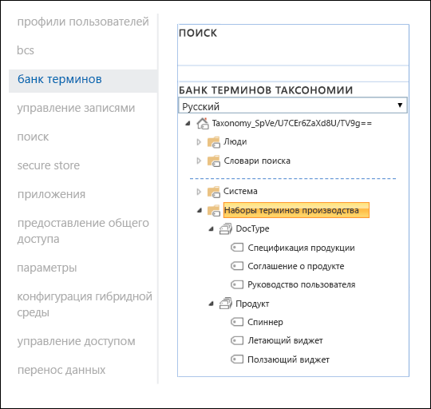

<span data-ttu-id="94454-130">Тип контента можно создать и опубликовать с помощью [центра типов контента](https://support.office.com/article/manage-content-type-publishing-06f39ac0-5576-4b68-abbc-82b68334889b).</span><span class="sxs-lookup"><span data-stu-id="94454-130">Content Type can be created and published using the [Content Type Hub](https://support.office.com/article/manage-content-type-publishing-06f39ac0-5576-4b68-abbc-82b68334889b).</span></span> <span data-ttu-id="94454-131">Тип контента также можно создать и опубликовать с помощью средств подготовки сайта, например [платформы подготовки PnP](https://docs.microsoft.com/sharepoint/dev/solution-guidance/pnp-provisioning-framework) или [схемы JSON для макетов сайта](https://docs.microsoft.com/sharepoint/dev/declarative-customization/site-design-json-schema#define-a-new-content-type).</span><span class="sxs-lookup"><span data-stu-id="94454-131">A content type can also be created and published using site provisioning tools such as the [PnP provisioning framework](https://docs.microsoft.com/sharepoint/dev/solution-guidance/pnp-provisioning-framework) or the [site design JSON schema](https://docs.microsoft.com/sharepoint/dev/declarative-customization/site-design-json-schema#define-a-new-content-type).</span></span>

<span data-ttu-id="94454-132">У каждого продукта есть отдельный сайт SharePoint Online, содержащий одну библиотеку документов, в которой разрешены соответствующие типы контента.</span><span class="sxs-lookup"><span data-stu-id="94454-132">Each product has a dedicated SharePoint Online site that contains one document library, with the right content types enabled.</span></span> <span data-ttu-id="94454-133">Все документы хранятся в этой библиотеке документов.</span><span class="sxs-lookup"><span data-stu-id="94454-133">All documents are stored in this document library.</span></span>


> [!NOTE]
> <span data-ttu-id="94454-135">Вместо использования одного сайта SharePoint Online для каждого продукта производственная компания в этом сценарии могла бы использовать Microsoft Team для каждого продукта, поскольку в этом случае поддерживаются функции сотрудничества с членами команды, включая постоянный чат и управление документами на вкладке **Файлы**.</span><span class="sxs-lookup"><span data-stu-id="94454-135">Instead of having a SharePoint Online site per product, the manufacturing company in this scenario could use a Microsoft Team per product that would support collaboration with members of the team, such as persistent chat and use the **Files** tab in the team for document management.</span></span> <span data-ttu-id="94454-136">В этой статье мы рассматриваем только документы, поэтому будем использовать только сайт.</span><span class="sxs-lookup"><span data-stu-id="94454-136">In this article we only focus on documents, therefore we will only use a site.</span></span>

<span data-ttu-id="94454-137">Вот как выглядит библиотека документов для продукта Spinning Widget:</span><span class="sxs-lookup"><span data-stu-id="94454-137">Here's a view of the document library for the Spinning Widget product:</span></span>


<span data-ttu-id="94454-139">Итак, мы располагаем базовой информационной архитектурой для управления документами. Теперь рассмотрим стратегии хранения и ликвидации документов, использующие метаданные и классификацию документов.</span><span class="sxs-lookup"><span data-stu-id="94454-139">Now that we have the basic information architecture in place for document management, let's look at the retention and disposal strategy of the documents that use the metadata and classification of documents.</span></span>

## <a name="retention-and-disposition"></a><span data-ttu-id="94454-140">Хранение и ликвидация</span><span class="sxs-lookup"><span data-stu-id="94454-140">Retention and disposition</span></span>

<span data-ttu-id="94454-141">Политики управления данными и соблюдения нормативных требований, действующие в производственной компании, устанавливают порядок хранения и ликвидации данных.</span><span class="sxs-lookup"><span data-stu-id="94454-141">The manufacturing company's compliance and data governance policies dictate the way data is preserved and disposed of.</span></span> <span data-ttu-id="94454-142">Документы, связанные с продуктами, должны храниться в течение всего времени производства продукта, а также в течение определенного срока после прекращения производства.</span><span class="sxs-lookup"><span data-stu-id="94454-142">Product-related documents must be kept for as long as the product is manufactured, and for a certain period after that.</span></span> <span data-ttu-id="94454-143">Этот срок различается для спецификаций продуктов, соглашений и руководств пользователя.</span><span class="sxs-lookup"><span data-stu-id="94454-143">This period is different for product specifications, agreements, and user manuals.</span></span> <span data-ttu-id="94454-144">Требования к хранению и ликвидации указаны в следующей таблице.</span><span class="sxs-lookup"><span data-stu-id="94454-144">The following table indicates the retention and disposition requirements:</span></span>

| <span data-ttu-id="94454-145">**Тип документа**</span><span class="sxs-lookup"><span data-stu-id="94454-145">**Document type**</span></span>          | <span data-ttu-id="94454-146">**Хранение**</span><span class="sxs-lookup"><span data-stu-id="94454-146">**Retention**</span></span>                          | <span data-ttu-id="94454-147">**Ликвидация**</span><span class="sxs-lookup"><span data-stu-id="94454-147">**Disposition**</span></span>                              |
| -------------------------- | -------------------------------------- | -------------------------------------------- |
| <span data-ttu-id="94454-148">Спецификация продукта</span><span class="sxs-lookup"><span data-stu-id="94454-148">Product specification</span></span>      | <span data-ttu-id="94454-149">5 лет после прекращения производства</span><span class="sxs-lookup"><span data-stu-id="94454-149">5 years after cessation of production</span></span>  | <span data-ttu-id="94454-150">Удаление</span><span class="sxs-lookup"><span data-stu-id="94454-150">Delete</span></span>                                       |
| <span data-ttu-id="94454-151">Соглашение о продукте</span><span class="sxs-lookup"><span data-stu-id="94454-151">Product agreement</span></span>          | <span data-ttu-id="94454-152">10 лет после прекращения производства</span><span class="sxs-lookup"><span data-stu-id="94454-152">10 years after cessation of production</span></span> | <span data-ttu-id="94454-153">Проверка</span><span class="sxs-lookup"><span data-stu-id="94454-153">Review</span></span>                                       |
| <span data-ttu-id="94454-154">Руководство пользователя</span><span class="sxs-lookup"><span data-stu-id="94454-154">User manual</span></span>                | <span data-ttu-id="94454-155">5 лет после прекращения производства</span><span class="sxs-lookup"><span data-stu-id="94454-155">5 years after cessation of production</span></span>  | <span data-ttu-id="94454-156">Удаление</span><span class="sxs-lookup"><span data-stu-id="94454-156">Delete</span></span>                                       |
| <span data-ttu-id="94454-157">Все остальные типы документов</span><span class="sxs-lookup"><span data-stu-id="94454-157">All other types of documents</span></span> | <span data-ttu-id="94454-158">Не использовать активное хранение других документов</span><span class="sxs-lookup"><span data-stu-id="94454-158">Don't actively retain other documents</span></span>  | <span data-ttu-id="94454-159">Удалять документы старше 3 лет<sup>\*</sup></span><span class="sxs-lookup"><span data-stu-id="94454-159">Delete when document is older than 3 years<sup>\*</sup></span></span>  |
|||

> [!NOTE]
> <span data-ttu-id="94454-160"><sup>\*</sup> Документ считается старше 3 лет, если он не изменялся в течение последних 3 лет.</span><span class="sxs-lookup"><span data-stu-id="94454-160"><sup>\*</sup> A document is considered older than 3 years if it hasn't been modified within the last 3 years.</span></span>

<span data-ttu-id="94454-161">С помощью Центра безопасности и соответствия требованиям мы создаем следующие метки хранения:</span><span class="sxs-lookup"><span data-stu-id="94454-161">Using the security and compliance center, we create the following retention labels:</span></span>

  - <span data-ttu-id="94454-162">Спецификация продукта</span><span class="sxs-lookup"><span data-stu-id="94454-162">Product Specification</span></span>

  - <span data-ttu-id="94454-163">Соглашение о продукте</span><span class="sxs-lookup"><span data-stu-id="94454-163">Product Agreement</span></span>

  - <span data-ttu-id="94454-164">Руководство пользователя</span><span class="sxs-lookup"><span data-stu-id="94454-164">User Manual</span></span>

<span data-ttu-id="94454-165">В этой статье рассматривается создание и автоматическое применение только метки хранения "Спецификация продукта".</span><span class="sxs-lookup"><span data-stu-id="94454-165">In this article, we only show how to create and auto-apply the Product Specification retention label.</span></span> <span data-ttu-id="94454-166">Чтобы реализовать полный сценарий, следует создать и автоматически применять метки хранения для двух остальных типов документов.</span><span class="sxs-lookup"><span data-stu-id="94454-166">To implement the complete scenario, you would create and auto-apply retention labels for the other two document types.</span></span>

### <a name="settings-for-the-product-specification-retention-label"></a><span data-ttu-id="94454-167">Параметры метки хранения "Спецификация продукта"</span><span class="sxs-lookup"><span data-stu-id="94454-167">Settings for the Product Specification retention label</span></span>

<span data-ttu-id="94454-168">Вот [план хранения](file-plan-manager.md) для метки хранения "Спецификация продукта":</span><span class="sxs-lookup"><span data-stu-id="94454-168">Here's the [file plan](file-plan-manager.md) for the Product Specification retention label:</span></span> 

- <span data-ttu-id="94454-169">**Название:** Спецификация продукта</span><span class="sxs-lookup"><span data-stu-id="94454-169">**Name:** Product Specification</span></span>

- <span data-ttu-id="94454-170">**Описание для администраторов:** метка "Спецификация продукта", хранить пять лет после прекращения производства, автоматически удалять, хранение на основе событий, тип события — "Прекращение производства".</span><span class="sxs-lookup"><span data-stu-id="94454-170">**Description for admins:** Product Specification Label, retain for five years after cessation of production, auto delete, event-based retention, event type is Product Cessation.</span></span>

- <span data-ttu-id="94454-171">**Описание для пользователей:** хранить пять лет после прекращения производства.</span><span class="sxs-lookup"><span data-stu-id="94454-171">**Description for users:** Retain for five years after cessation of production.</span></span>

- <span data-ttu-id="94454-172">**Действие хранения:** хранение и удаление</span><span class="sxs-lookup"><span data-stu-id="94454-172">**Retention action:** Keep and delete</span></span>

- <span data-ttu-id="94454-173">**Срок хранения:** пять лет (1825 дней)</span><span class="sxs-lookup"><span data-stu-id="94454-173">**Retention duration:** Five years (1825 days)</span></span>

- <span data-ttu-id="94454-174">**Метка записи**: настроить метку хранения для классификации содержимого в качестве[записи](labels.md#using-retention-labels-for-records-management) (документы, классифицированные как записи, не могут быть изменены или удалены пользователями)</span><span class="sxs-lookup"><span data-stu-id="94454-174">**Record label**: Configure the retention label to classify content as a [record](labels.md#using-retention-labels-for-records-management) (documents that are classified as a record can't be modified or deleted by users)</span></span>

- <span data-ttu-id="94454-175">**Дескрипторы плана хранения:** (для упрощения сценария файловые дескрипторы не предоставлены)</span><span class="sxs-lookup"><span data-stu-id="94454-175">**File plan descriptors:** (for simplifying the scenario, no file descriptors are provided)</span></span>

<span data-ttu-id="94454-176">На следующем снимке экрана показаны настройки при создании [метки хранения](labels.md) "Спецификация продукта" в Центре безопасности и соответствия требованиям.</span><span class="sxs-lookup"><span data-stu-id="94454-176">The following screenshot shows the settings when you create the Product Specification [retention label](labels.md) in the security and compliance center.</span></span> <span data-ttu-id="94454-177">При создании метки хранения можно создать тип событий **Прекращение производства**.</span><span class="sxs-lookup"><span data-stu-id="94454-177">You can create the **Product Cessation** event type when you create the retention label.</span></span> <span data-ttu-id="94454-178">См. инструкции ниже.</span><span class="sxs-lookup"><span data-stu-id="94454-178">See the steps below.</span></span>


> [!NOTE]
> <span data-ttu-id="94454-180">Для удобства (и чтобы не ждать 5 лет для автоматического удаления документа) установите срок хранения равным 1 дню, если вы воспроизводите этот сценарий в тестовой среде.</span><span class="sxs-lookup"><span data-stu-id="94454-180">For the practical purposes and to avoid having to wait 5 years to see a document automatically deleted, set the retention duration to 1 day if you're recreating this scenario in your test environment.</span></span>

### <a name="create-an-event-type-when-creating-a-retention-label"></a><span data-ttu-id="94454-181">Создайте тип события при создании метки хранения.</span><span class="sxs-lookup"><span data-stu-id="94454-181">Create an event type when creating a retention label</span></span>

1. <span data-ttu-id="94454-182">В раскрывающемся списке **Хранить или удалить содержимое в зависимости от** выберите **событие**.</span><span class="sxs-lookup"><span data-stu-id="94454-182">In the **Retain or delete content based** on dropdown list, select **an event**.</span></span>

2. <span data-ttu-id="94454-183">Щелкните **Выберите тип события**.</span><span class="sxs-lookup"><span data-stu-id="94454-183">Select **Choose an event type**.</span></span>

   

3. <span data-ttu-id="94454-185">На странице **Выберите тип события** щелкните **Здесь можно создать новые типы событий**.</span><span class="sxs-lookup"><span data-stu-id="94454-185">On the **Choose an event type** page, select **You can create new event types here**.</span></span>

4. <span data-ttu-id="94454-186">Создайте тип событий **Прекращение производства**, укажите описание и нажмите кнопку **Готово**, чтобы завершить создание.</span><span class="sxs-lookup"><span data-stu-id="94454-186">Create an event type named **Product Cessation**, give a description, and select **Finish** to create it.</span></span> 

5. <span data-ttu-id="94454-187">На странице **Выберите тип события** выберите только что созданный тип события **Прекращение производства** и нажмите кнопку **Добавить**.</span><span class="sxs-lookup"><span data-stu-id="94454-187">Back on the **Choose an event type** page, select the **Product Cessation** event type that you created, and then select **Add**.</span></span>

<span data-ttu-id="94454-188">Вот как должны выглядеть параметры метки хранения "Спецификация продукта".</span><span class="sxs-lookup"><span data-stu-id="94454-188">Here's what the settings look like for the Product Specification retention label.</span></span> <span data-ttu-id="94454-189">Щелкните **Создать эту метку**, чтобы создать ее.</span><span class="sxs-lookup"><span data-stu-id="94454-189">Select **Create this label** to create it.</span></span>

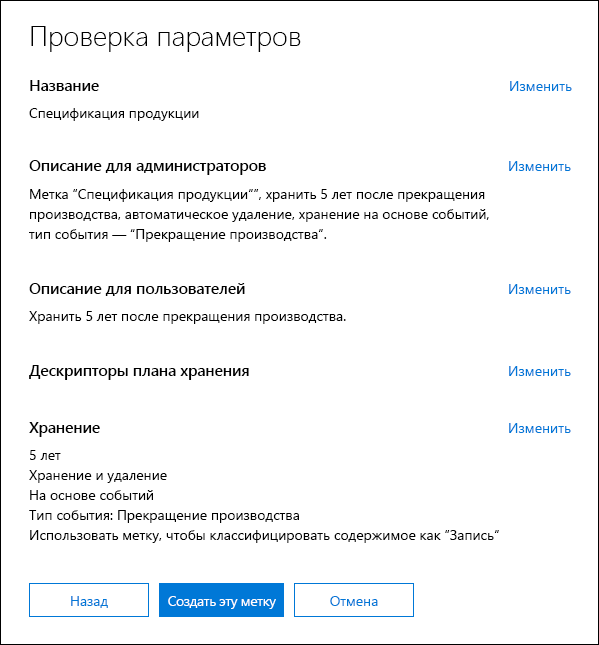

> [!TIP]
> <span data-ttu-id="94454-191">Подробное описание действий см. в разделе [Создание метки со сроком хранения на основе события](event-driven-retention.md#step-1-create-a-label-whose-retention-period-is-based-on-an-event).</span><span class="sxs-lookup"><span data-stu-id="94454-191">For more detailed steps, see [Create a label whose retention period is based on an event](event-driven-retention.md#step-1-create-a-label-whose-retention-period-is-based-on-an-event).</span></span>

<span data-ttu-id="94454-192">Итак, метка хранения создана. Перейдем к автоматическому применению этой метки хранения к содержимому спецификаций продуктов.</span><span class="sxs-lookup"><span data-stu-id="94454-192">Now that the retention label is created, let's look at auto-applying the retention label to product specification content.</span></span>

## <a name="classifying-content-by-auto-applying-retention-labels"></a><span data-ttu-id="94454-193">Классификация содержимого путем автоматического применения меток хранения</span><span class="sxs-lookup"><span data-stu-id="94454-193">Classifying content by auto-applying retention labels</span></span>

<span data-ttu-id="94454-194">Мы будем [автоматически применять](labels.md#applying-a-retention-label-automatically-based-on-conditions) метки хранения, созданные для этого сценария, с помощью языка KQL.</span><span class="sxs-lookup"><span data-stu-id="94454-194">We're going to [auto-apply](labels.md#applying-a-retention-label-automatically-based-on-conditions) the retention labels that we've created for this scenario by using Keyword Query Language (KQL).</span></span> <span data-ttu-id="94454-195">KQL — это язык, который используется для создания поисковых запросов.</span><span class="sxs-lookup"><span data-stu-id="94454-195">KQL is the language used to build search queries.</span></span> <span data-ttu-id="94454-196">С помощью KQL можно выполнять поиск по ключевым словам или управляемым свойствам.</span><span class="sxs-lookup"><span data-stu-id="94454-196">In KQL, you can search by using keywords or managed properties.</span></span> <span data-ttu-id="94454-197">Для получения дополнительных сведениях о KQL см. <https://docs.microsoft.com/sharepoint/dev/general-development/keyword-query-language-kql-syntax-reference></span><span class="sxs-lookup"><span data-stu-id="94454-197">For more information about KQL, see <https://docs.microsoft.com/sharepoint/dev/general-development/keyword-query-language-kql-syntax-reference></span></span>

<span data-ttu-id="94454-198">Коротко говоря, мы должны дать команду системе Office 365 применять метку хранения **Спецификация продукта** ко всем документам, у которых свойство **Status** имеет значение **Final**,а свойство **Doc Type** имеет значение **Спецификация продукта**.</span><span class="sxs-lookup"><span data-stu-id="94454-198">At a high level, we want to tell Office 365 to "apply the **Product Specification** retention label to all documents that have a **Status** of **Final** and a **Doc Type** of **Product Specification**.</span></span> <span data-ttu-id="94454-199">Помните, что **Status** и **Doc Type** — столбцы сайта, которые мы ранее определили для типа контента "Product Documentation", в разделе [Информационная архитектура](#information-architecture).</span><span class="sxs-lookup"><span data-stu-id="94454-199">Recall that **Status** and **Doc Type** are the site columns we previously defined for Product Documentation content type in the [Information architecture](#information-architecture) section.</span></span> <span data-ttu-id="94454-200">Для получения этого результата нужно настроить схему поиска.</span><span class="sxs-lookup"><span data-stu-id="94454-200">To achieve this, we need to configure the search schema.</span></span>

<span data-ttu-id="94454-201">Когда система SharePoint индексирует содержимое, она автоматически создает свойства для обхода для каждого столбца сайта.</span><span class="sxs-lookup"><span data-stu-id="94454-201">When SharePoint indexes content, it automatically generates crawled properties for each site column.</span></span> <span data-ttu-id="94454-202">В этом сценарии нас интересуют свойства **Doc Type** и **Status**.</span><span class="sxs-lookup"><span data-stu-id="94454-202">For this scenario, we're interested in the **Doc Type** and **Status** properties.</span></span> <span data-ttu-id="94454-203">Чтобы поисковая система создала свойства для обхода, в библиотеке должны быть документы с нужным типом содержимого, а также должны быть заполнены столбцы сайта.</span><span class="sxs-lookup"><span data-stu-id="94454-203">We need documents in the library using the right content type and have the site columns filled in, in order for search to create the crawled properties.</span></span>

<span data-ttu-id="94454-204">В Центре администрирования SharePoint можно открыть конфигурацию поиска и выбрать **Управление схемой поиска**, чтобы просмотреть и настроить свойства для обхода.</span><span class="sxs-lookup"><span data-stu-id="94454-204">In the SharePoint admin center, we can open the Search configuration, and select **Manage Search Schema** to view and configure the crawled properties.</span></span>

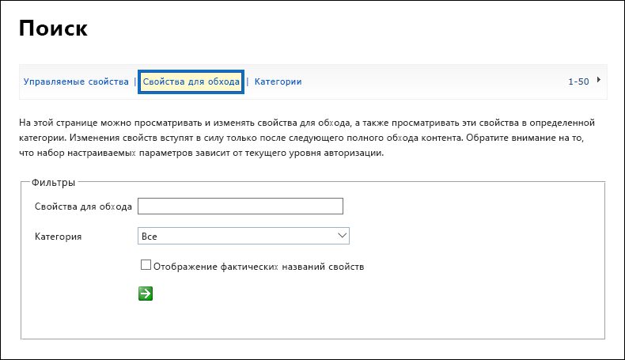

<span data-ttu-id="94454-206">Если ввести **status** в поле **Свойства для обхода** и щелкнуть зеленую стрелку, появится приблизительно такой результат:</span><span class="sxs-lookup"><span data-stu-id="94454-206">If we type **status** in the **Crawled properties** box, and select the green arrow, we should see a result like this:</span></span>


<span data-ttu-id="94454-208">Нас интересует свойство **ows\_\_Status** (обратите внимание на двойной символ подчеркивания).</span><span class="sxs-lookup"><span data-stu-id="94454-208">The property **ows\_\_Status** (notice the double underscore) is the one that interests us.</span></span> <span data-ttu-id="94454-209">Оно соответствует свойству **Status** типа контента "Production Document".</span><span class="sxs-lookup"><span data-stu-id="94454-209">This maps to the **Status** property of the Production Document content type.</span></span>

<span data-ttu-id="94454-210">Если ввести **ows\_doc** и щелкнуть зеленую стрелку, появится примерно следующее:</span><span class="sxs-lookup"><span data-stu-id="94454-210">Now if we type **ows\_doc** and select the green arrow we should see something like this:</span></span>


<span data-ttu-id="94454-212">Свойство **ows\_Doc\_x0020\_Type** — второй интересующее нас свойство.</span><span class="sxs-lookup"><span data-stu-id="94454-212">The property **ows\_Doc\_x0020\_Type** is the second property that interests us.</span></span> <span data-ttu-id="94454-213">Оно соответствует свойству **Doc Type** типа контента "Production Document".</span><span class="sxs-lookup"><span data-stu-id="94454-213">This maps to the **Doc Type** property of the Production Document content type.</span></span>

> [!TIP]
> <span data-ttu-id="94454-214">Чтобы определить имя свойства для обхода для этого сценария, перейдите в библиотеку документов, содержащую производственные документы, а затем перейдите к параметрам библиотеки.</span><span class="sxs-lookup"><span data-stu-id="94454-214">To identify the name of a crawled property for this scenario, go the document library that contains the production documents and then go to the library settings.</span></span> <span data-ttu-id="94454-215">В разделе **Столбцы** выберите имя столбца (например, **Status** или **Doc Type**), чтобы открыть страницу этого столбца сайта.</span><span class="sxs-lookup"><span data-stu-id="94454-215">In the **Columns**, select the name of the column (for example, **Status** or **Doc Type**) to open the site column page.</span></span> <span data-ttu-id="94454-216">Параметр **Поле** в URL-адресе этой страницы содержит имя поля.</span><span class="sxs-lookup"><span data-stu-id="94454-216">The **Field** parameter in the URL for that page contains the name of the field.</span></span> <span data-ttu-id="94454-217">Имя поля с префиксом "ows_" является именем свойства для обхода.</span><span class="sxs-lookup"><span data-stu-id="94454-217">This field name, prefixed with "ows_", is the name of the crawled property.</span></span> <span data-ttu-id="94454-218">Например, URL-адрес `https://tenantname.sharepoint.com/sites/SpinningWidget/_layouts/15/FldEdit.aspx?List=%7BC38C2F45-3BD6-4C3B-AA3B-EF5DF6B3D172%7D&Field=_Status` соответствует свойству для обхода **ows\_\_Status**.</span><span class="sxs-lookup"><span data-stu-id="94454-218">For example, the URL `https://tenantname.sharepoint.com/sites/SpinningWidget/_layouts/15/FldEdit.aspx?List=%7BC38C2F45-3BD6-4C3B-AA3B-EF5DF6B3D172%7D&Field=_Status` corresponds to the **ows\_\_Status** crawled property.</span></span>

<span data-ttu-id="94454-219">Если нужные свойства для обхода отсутствуют в разделе "Управление схемой поиска" в Центре администрирования SharePoint, возможны следующие причины:</span><span class="sxs-lookup"><span data-stu-id="94454-219">If the crawled properties you're looking for don't appear in the Manage Search Schema section in the SharePoint admin center, it could be for one of the following reasons:</span></span>

- <span data-ttu-id="94454-220">Документы не были проиндексированы.</span><span class="sxs-lookup"><span data-stu-id="94454-220">The documents haven't been indexed.</span></span> <span data-ttu-id="94454-221">Можно принудительно выполнить повторное индексирование библиотеки. Для этого перейдите в раздел "Параметры библиотеки документов" > "Дополнительные параметры".</span><span class="sxs-lookup"><span data-stu-id="94454-221">You can force a re-index of the library by going to Document library settings > Advanced Settings.</span></span>

- <span data-ttu-id="94454-222">Если библиотека документов находится на современном сайте, убедитесь, что администратор SharePoint также является администратором семейства веб-сайтов.</span><span class="sxs-lookup"><span data-stu-id="94454-222">If the document library is in a modern site, make sure that the SharePoint admin is also a site collection admin.</span></span>

<span data-ttu-id="94454-223">Дополнительные сведения о свойствах для обхода и управляемых свойствах см. в статье [Автоматически создаваемые управляемые свойства в SharePoint Server](https://docs.microsoft.com/sharepoint/technical-reference/automatically-created-managed-properties-in-sharepoint).</span><span class="sxs-lookup"><span data-stu-id="94454-223">For more information about crawled and managed properties, see [Automatically created managed properties in SharePoint Server](https://docs.microsoft.com/sharepoint/technical-reference/automatically-created-managed-properties-in-sharepoint).</span></span>

### <a name="mapping-crawled-properties-to-pre-defined-managed-properties"></a><span data-ttu-id="94454-224">Сопоставление свойств для обхода с заранее заданными управляемыми свойствами</span><span class="sxs-lookup"><span data-stu-id="94454-224">Mapping crawled properties to pre-defined managed properties</span></span>

<span data-ttu-id="94454-225">KQL не может использовать свойства для обхода в поисковых запросах.</span><span class="sxs-lookup"><span data-stu-id="94454-225">KQL can't use crawled properties in search queries.</span></span> <span data-ttu-id="94454-226">Необходимо использовать управляемое свойство.</span><span class="sxs-lookup"><span data-stu-id="94454-226">It has to use a managed property.</span></span> <span data-ttu-id="94454-227">В обычном сценарии поиска мы создаем управляемое свойство и сопоставляем его с нужным нам свойством для обхода.</span><span class="sxs-lookup"><span data-stu-id="94454-227">In a normal search scenario, we create a managed property and map it to the crawled property that we need.</span></span> <span data-ttu-id="94454-228">Тем не менее, для автоматически применяемых меток хранения можно указать на языке KQL только заранее заданные управляемые свойства, а не настраиваемые управляемые свойства.</span><span class="sxs-lookup"><span data-stu-id="94454-228">However, for auto-applying retention labels, you can only specify in KQL pre-defined managed properties and not custom managed properties.</span></span> <span data-ttu-id="94454-229">В системе уже есть набор заранее заданных управляемых свойств, созданных для строк с RefinableString00 по RefinableString199. Мы воспользуемся этими свойствами.</span><span class="sxs-lookup"><span data-stu-id="94454-229">There's a set of predefined managed properties already created in the system for string RefinableString00 to RefinableString199 that can be used.</span></span> <span data-ttu-id="94454-230">Полный список см. в разделе [Управляемые свойства, не используемые по умолчанию](https://docs.microsoft.com/sharepoint/manage-search-schema#default-unused-managed-properties).</span><span class="sxs-lookup"><span data-stu-id="94454-230">For a complete list, see [Default unused managed properties](https://docs.microsoft.com/sharepoint/manage-search-schema#default-unused-managed-properties).</span></span> <span data-ttu-id="94454-231">Эти управляемые свойства по умолчанию обычно используются для определения уточнений поиска.</span><span class="sxs-lookup"><span data-stu-id="94454-231">These default managed properties are typically used for defining search refiners.</span></span>

<span data-ttu-id="94454-232">Чтобы запрос на языке KQL работал и автоматически применял нужную метку хранения к документам о продуктах мы сопоставим свойства для обхода **ows\_Doc\_x0020\_Type** и **ows\_\_Status** с двумя уточняемыми управляемыми свойствами.</span><span class="sxs-lookup"><span data-stu-id="94454-232">For the KQL query to work and automatically apply the correct retention label to product document content, we map the crawled properties **ows\_Doc\_x0020\_Type** and **ows\_\_Status** to two refinable managed properties.</span></span> <span data-ttu-id="94454-233">В нашей тестовой среде для этого сценария **RefinableString00** и **RefinableString01** не используются.</span><span class="sxs-lookup"><span data-stu-id="94454-233">In our test environment for this scenario, **RefinableString00** and **RefinableString01** aren't being used.</span></span> <span data-ttu-id="94454-234">Мы определили это, ознакомившись с разделом **Управляемые свойства** на странице **Управление схемой поиска** в Центре администрирования SharePont.</span><span class="sxs-lookup"><span data-stu-id="94454-234">We determined this by looking at **Managed Properties** in the **Manage Search Schema** in the SharePont admin center.</span></span>

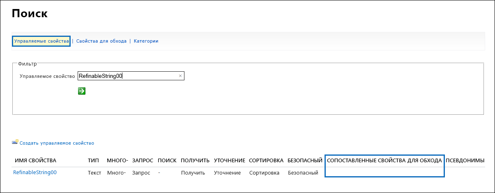

<span data-ttu-id="94454-236">Обратите внимание, что столбец **Сопоставленные свойства для обхода** на предыдущем снимке экрана пуст.</span><span class="sxs-lookup"><span data-stu-id="94454-236">Notice that the **Mapped Crawled Properties** column in the previous screenshot is empty.</span></span>

<span data-ttu-id="94454-237">Чтобы сопоставить свойство для обхода **ows\_Doc\_x0020\_Type**, выполните следующие действия:</span><span class="sxs-lookup"><span data-stu-id="94454-237">To map the **ows\_Doc\_x0020\_Type** crawled property, do the following:</span></span>

1. <span data-ttu-id="94454-238">В поле фильтра **Управляемое свойство** введите **RefinableString00** и щелкните зеленую стрелку.</span><span class="sxs-lookup"><span data-stu-id="94454-238">In the **Managed property** filter box, type **RefinableString00** and select the green arrow.</span></span>

2. <span data-ttu-id="94454-239">В списке результатов щелкните ссылку **RefinableString00** и прокрутите вниз до раздела **Сопоставления со свойствами для обхода**.</span><span class="sxs-lookup"><span data-stu-id="94454-239">In the results list, select the **RefinableString00** link, and then scroll down to the **Mappings to crawled properties** section.</span></span>  

3. <span data-ttu-id="94454-240">Щелкните **Добавить сопоставление** и введите **ows\_Doc\_x0020\_Type** в поле **Поиск имени свойства для обхода** в окне **Выбор свойства для обхода**.</span><span class="sxs-lookup"><span data-stu-id="94454-240">Select **Add a Mapping**, and then type **ows\_Doc\_x0020\_Type** in the **Search for a crawled property name** box in the **Crawled property selection** window.</span></span> <span data-ttu-id="94454-241">Нажмите кнопку **Найти**.</span><span class="sxs-lookup"><span data-stu-id="94454-241">Select **Find**.</span></span>  

4. <span data-ttu-id="94454-242">В списке результатов выберите **ows\_Doc\_x0020\_Type** и нажмите кнопку **ОК**.</span><span class="sxs-lookup"><span data-stu-id="94454-242">In the results list, select **ows\_Doc\_x0020\_Type** and then select **OK**.</span></span>

   <span data-ttu-id="94454-243">В раздел **Сопоставленные свойства для обхода** должен выглядеть примерно так, как на этом снимке экрана:</span><span class="sxs-lookup"><span data-stu-id="94454-243">In the **Mapped Crawled Properties** section, you should see something similar to this screenshot:</span></span>

   

5. <span data-ttu-id="94454-245">Прокрутите страницу вниз и нажмите кнопку **ОК**, чтобы сохранить сопоставление.</span><span class="sxs-lookup"><span data-stu-id="94454-245">Scroll to the bottom of the page and select **OK** to save the mapping.</span></span>

<span data-ttu-id="94454-246">Повторите эту процедуру для сопоставления RefinableString01 и ows\_\_Status.</span><span class="sxs-lookup"><span data-stu-id="94454-246">Repeat this same procedure to map RefinableString01 and ows\_\_Status.</span></span>

<span data-ttu-id="94454-247">Теперь у вас должно быть два управляемых свойства, сопоставленных с двумя свойствами для обхода:</span><span class="sxs-lookup"><span data-stu-id="94454-247">Now you should have two managed properties mapped to the two crawled properties:</span></span>

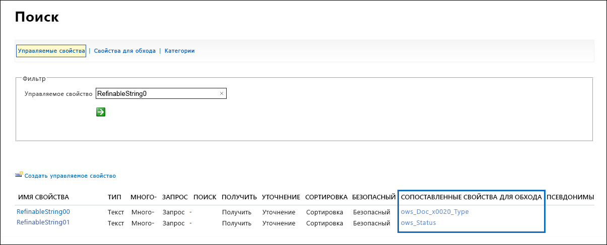

<span data-ttu-id="94454-249">Давайте проверим правильность настройки, запустив корпоративный поиск.</span><span class="sxs-lookup"><span data-stu-id="94454-249">Let's verify that all this is set up correctly by running an enterprise search.</span></span> <span data-ttu-id="94454-250">В браузере перейдите по адресу https://yourtenant.sharepoint.com/search.</span><span class="sxs-lookup"><span data-stu-id="94454-250">In a browser, go to https://yourtenant.sharepoint.com/search.</span></span> <span data-ttu-id="94454-251">В поле поиска введите **RefinableString00:"Спецификация продукта"** и нажмите клавишу ВВОД.</span><span class="sxs-lookup"><span data-stu-id="94454-251">In the search box, type **RefinableString00:"Product Specification"** and press enter.</span></span> <span data-ttu-id="94454-252">Этот поисковый запрос должен возвратить все документы, у которых свойство **Doc Type** имеет значение "Спецификация продукта".</span><span class="sxs-lookup"><span data-stu-id="94454-252">This should return all documents that have Product Specification as **Doc Type**.</span></span>

<span data-ttu-id="94454-253">Теперь введите в поле поиска **RefinableString00:"Спецификация продукта" AND RefinableString01:Final** и нажмите клавишу ВВОД.</span><span class="sxs-lookup"><span data-stu-id="94454-253">Now in the search box, type **RefinableString00:"Product Specification" AND RefinableString01:Final** and press enter.</span></span> <span data-ttu-id="94454-254">Этот поисковый запрос должен возвратить все документы, у которых свойство **Doc Type** имеет значение "Status" имеет значение **Final**.</span><span class="sxs-lookup"><span data-stu-id="94454-254">This should return all documents that have Product Specification as **Doc Type** and a Status of **Final**.</span></span>

### <a name="creating-the-auto-apply-label-policies"></a><span data-ttu-id="94454-255">Создание политики автоматического применения меток</span><span class="sxs-lookup"><span data-stu-id="94454-255">Creating the auto-apply label policies</span></span>

<span data-ttu-id="94454-256">Итак, мы убедились, что запрос KQL правильно работает. Теперь нужно создать политику меток, использующую запрос KQL для автоматического применения метки хранения "Спецификация продукта" к соответствующим документам.</span><span class="sxs-lookup"><span data-stu-id="94454-256">Now that we verified that the KQL query is working correctly, let's create the label policy that uses a KQL query to auto-apply the Product Specification retention label to the appropriate documents.</span></span>

1. <span data-ttu-id="94454-257">В [Центре безопасности и соответствия требованиям](https://protection.office.com) перейдите в раздел **Классификация** > **Метки хранения**,затем щелкните **Автоматическое применение метки**.</span><span class="sxs-lookup"><span data-stu-id="94454-257">In the [security and compliance center](https://protection.office.com), go to **Classification** > **Retention labels**, and then select **Auto-apply a label**.</span></span> 

   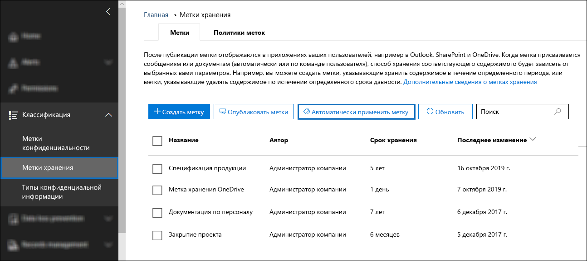

2. <span data-ttu-id="94454-259">На странице мастера **Выбор метки для автоматического применения** щелкните **Выбор метки для автоматического применения**.</span><span class="sxs-lookup"><span data-stu-id="94454-259">On the **Choose a label to auto-apply** wizard page, select **Choose a label to auto-apply**.</span></span>

3. <span data-ttu-id="94454-260">В списке меток выберите **Спецификация продукта**, нажмите кнопку **Добавить**, затем нажмите кнопку **Далее**.</span><span class="sxs-lookup"><span data-stu-id="94454-260">In the list of labels, select **Product Specification**, select **Add**, and then select **Next**.</span></span>

4. <span data-ttu-id="94454-261">Выберите **Применить метку к содержимому с определенными словами или фразами**, затем нажмите кнопку **Далее**.</span><span class="sxs-lookup"><span data-stu-id="94454-261">Select **Apply label to content that contains specific words or phrases, or properties**, and then select **Next**.</span></span>

   

   <span data-ttu-id="94454-263">На следующем шаге нужно будет указать тот же запрос KQL, который мы протестировали в предыдущем разделе.</span><span class="sxs-lookup"><span data-stu-id="94454-263">In the next step, you will provide the same KQL search query that we tested in the previous section.</span></span> <span data-ttu-id="94454-264">Если помните, этот запрос возвратил все документы "Спецификация продукта" со статусом "Final".</span><span class="sxs-lookup"><span data-stu-id="94454-264">As you recall, this query returned all Product Specification documents that have a status of Final.</span></span> <span data-ttu-id="94454-265">Если воспользоваться этим же запросом в политике меток, то метка хранения "Спецификация продукта" будет автоматически применена ко всем документам, которые соответствуют этому поисковому запросу.</span><span class="sxs-lookup"><span data-stu-id="94454-265">The result of using this same query in the label policy means that the Product Specification retention label will be automatically applied to all documents that match this search query.</span></span>

5. <span data-ttu-id="94454-266">В поле **Редактор запросов по ключевому слову** введите **RefinableString00:"Спецификация продукта" AND RefinableString01:Final**, затем нажмите кнопку **Далее**.</span><span class="sxs-lookup"><span data-stu-id="94454-266">In the **Keyword query editor** box, type **RefinableString00:"Product Specification" AND RefinableString01:Final**, and then select **Next**.</span></span>

   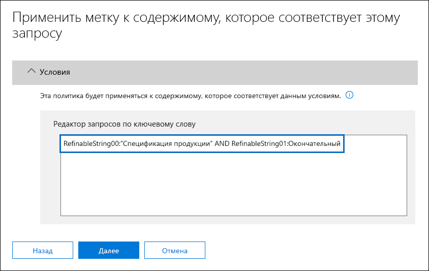

6. <span data-ttu-id="94454-268">Введите имя (например, **Автоматическое применение метки "Спецификация продукта"**) и необязательное описание этой политики меток, затем нажмите кнопку **Далее**.</span><span class="sxs-lookup"><span data-stu-id="94454-268">Type a name (for example, **Auto apply Product Specification label**) and an optional description for the label policy, and then select **Next**.</span></span> 

7. <span data-ttu-id="94454-269">На странице мастера **Выберите расположения** нужно выбрать расположения содержимого, к которым следует применить эту политику.</span><span class="sxs-lookup"><span data-stu-id="94454-269">On the **Choose locations** wizard page, you select the content locations that you want to apply the policy to.</span></span> <span data-ttu-id="94454-270">В этом сценарии мы применяем политику только к расположениям SharePoint, поскольку все производственные документы хранятся только в библиотеках документов SharePoint.</span><span class="sxs-lookup"><span data-stu-id="94454-270">For this scenario, we apply the policy only to SharePoint locations because all production documents are stored only in SharePoint document libraries.</span></span> <span data-ttu-id="94454-271">Щелкните **Позволить мне выбрать расположения**, выключите переключатели для электронной почты Exchange, учетных записей OneDrive и групп Office 365. Убедитесь, что переключатель для сайтов SharePoint включен.</span><span class="sxs-lookup"><span data-stu-id="94454-271">Select **Let me choose specific locations**, toggle the status for Exchange email, OneDrive accounts, and Office 365 groups to off and make sure the status for SharePoint sites is toggled on.</span></span> 

    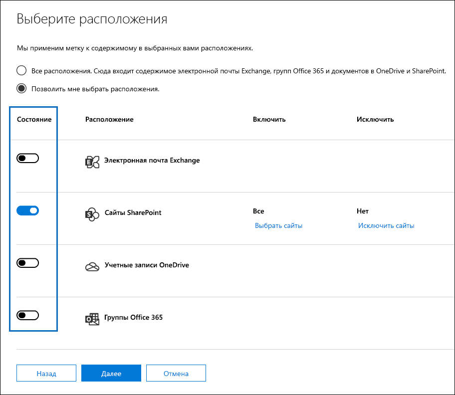

   > [!TIP]
   > <span data-ttu-id="94454-273">Вместо применения политики ко всем сайтам SharePoint можно щелкнуть **Выбрать сайты** и добавить URL-адреса определенных сайтов SharePoint.</span><span class="sxs-lookup"><span data-stu-id="94454-273">Instead of applying the policy to all SharePoint sites, you can select **Choose sites** and add the URLs for specific SharePoint sites.</span></span>

8. <span data-ttu-id="94454-274">Нажмите кнопку **Далее**, чтобы открыть страницу **Проверьте параметры**.</span><span class="sxs-lookup"><span data-stu-id="94454-274">Select **Next** to display the **Review your settings** page.</span></span> 

    

9. <span data-ttu-id="94454-276">Щелкните **Автоматическое применение**, чтобы создать политику меток.</span><span class="sxs-lookup"><span data-stu-id="94454-276">Select **Auto-apply** to create the label policy.</span></span> <span data-ttu-id="94454-277">Автоматическое применение метки "Спецификация продукта" ко всем документам, соответствующим указанному запросу KQL, может занять до семи дней.</span><span class="sxs-lookup"><span data-stu-id="94454-277">It takes up to seven days to automatically apply the Product Specification label to all documents that match the KQL search query that you provided.</span></span>

### <a name="verifying-the-retention-label-was-automatically-applied"></a><span data-ttu-id="94454-278">Проверка автоматического применения метки хранения</span><span class="sxs-lookup"><span data-stu-id="94454-278">Verifying the retention label was automatically applied</span></span>

<span data-ttu-id="94454-279">Через семь дней используйте [Обозреватель действий с метками](view-label-activity-for-documents.md) в Центре безопасности и соответствия требованиям, чтобы убедиться, что созданная нами политика меток автоматически применила метки хранения к документам о продуктах.</span><span class="sxs-lookup"><span data-stu-id="94454-279">After seven days, use the [Label activity explorer](view-label-activity-for-documents.md) in the security and compliance center to see that the label policy that we created has automatically applied the retention labels in this scenario to the product documents.</span></span> <span data-ttu-id="94454-280">На следующем снимке экрана метки хранения также применены к соглашениям о продуктах и руководствам пользователей, хотя в этой статье мы не рассматривали создание этих меток хранения и политик меток.</span><span class="sxs-lookup"><span data-stu-id="94454-280">In the following screenshot, retention labels have also been applied to product agreements and user manuals, even though we didn't cover creating those retention labels and label policies in this article.</span></span>


<span data-ttu-id="94454-282">Еще один этап проверки — свойства документа в библиотеке документов.</span><span class="sxs-lookup"><span data-stu-id="94454-282">Another verification step is to look at the properties of the document in the Document Library.</span></span> <span data-ttu-id="94454-283">В области сведений видно, что к выбранному документу применена метка хранения.</span><span class="sxs-lookup"><span data-stu-id="94454-283">In the information panel, you can see that the retention label is applied to a selected document.</span></span>

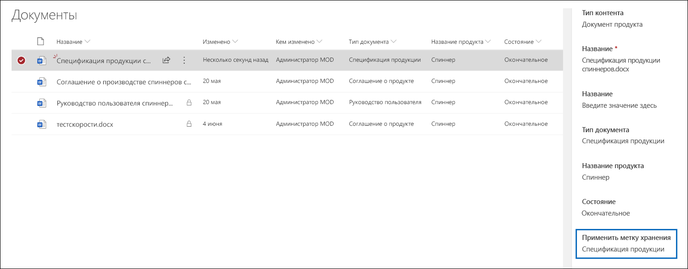

<span data-ttu-id="94454-285">Метки хранения были автоматически применены к документам, поэтому документа защищены от удаления (метки хранения настроены таким образом, что документы объявлены записями).</span><span class="sxs-lookup"><span data-stu-id="94454-285">Because the retention labels have been auto-applied to documents, the documents are protected from being deleted because the retention label was configured to declare the documents as records.</span></span> <span data-ttu-id="94454-286">Пример такой защиты: если попытаться удалить один из этих документов, появится сообщение об ошибке, показанное на следующем снимке экрана.</span><span class="sxs-lookup"><span data-stu-id="94454-286">As an example of this protection, we receive an error message shown in the following screenshot when we try to delete one of these documents.</span></span>


## <a name="generating-the-events-that-trigger-the-start-of-the-retention-period"></a><span data-ttu-id="94454-288">Создание событий, включающих начало срока хранения</span><span class="sxs-lookup"><span data-stu-id="94454-288">Generating the events that trigger the start of the retention period</span></span>

<span data-ttu-id="94454-289">Итак, метки хранения успешно применены автоматически. Теперь перейдем к событию, которое будет означать прекращение производства определенного продукта.</span><span class="sxs-lookup"><span data-stu-id="94454-289">Now that the retention labels were successfully automatically applied, let's focus on the event that will indicate the end of production for a particular product.</span></span> <span data-ttu-id="94454-290">Когда это событие произойдет, оно запустит начало срока хранения, заданного в метках хранения, которые были автоматически применены к документам.</span><span class="sxs-lookup"><span data-stu-id="94454-290">When this event occurs, it triggers the beginning of the retention period defined in retention labels auto-applied to documents.</span></span> <span data-ttu-id="94454-291">Например, для спецификаций продуктов пятилетний срок хранения начинается при срабатывании события "прекращение производства".</span><span class="sxs-lookup"><span data-stu-id="94454-291">For example, for product specification documents, the five-year retention period begins when the "end of production" event is triggered.</span></span>

<span data-ttu-id="94454-292">Можно вручную создать это событие в Центре безопасности и соответствия требованиям (для этого перейдите в раздел **Управление записями** > **События**), выбрать тип события, настроить идентификаторы ресурсов и ввести дату события.</span><span class="sxs-lookup"><span data-stu-id="94454-292">You can manually create the event in the security and compliance center by going to **Records Managements** > **Events** and choosing the event type, setting the correct Asset Ids, and entering a date for the event.</span></span> <span data-ttu-id="94454-293">Дополнительные сведения см. в статье [Хранение на основе событий](event-driven-retention.md).</span><span class="sxs-lookup"><span data-stu-id="94454-293">For more information, see [Overview of event-driven retention](event-driven-retention.md).</span></span>

<span data-ttu-id="94454-294">В этом сценарии мы автоматически создадим это событие, сформировав его из внешней производственной системы.</span><span class="sxs-lookup"><span data-stu-id="94454-294">For this scenario, we'll automatically create the event by generating it from an external production system.</span></span> <span data-ttu-id="94454-295">В данном случае система, формирующее событие, представляет собой простой список SharePoint, указывающий, осуществляется ли производство продукта, а также поток [Microsoft Flow](https://docs.microsoft.com/flow/getting-started), который связан с этим списком и будет запускать это событие.</span><span class="sxs-lookup"><span data-stu-id="94454-295">In this case, the system that generates the event is a simple SharePoint list that indicates whether a product is in production and a [Microsoft Flow](https://docs.microsoft.com/flow/getting-started) that's associated with the list and will trigger the event.</span></span> <span data-ttu-id="94454-296">В реальном сценарии это событие может формироваться любой системой, например системой отдела кадров или CRM-системой.</span><span class="sxs-lookup"><span data-stu-id="94454-296">In a real-world scenario, it could be any system that generates the event, such as an HR or CRM system.</span></span> <span data-ttu-id="94454-297">Microsoft Flow содержит множество готовых взаимодействий и компонентов для нагрузок Office 365, таких как Exchange, SharePoint, Teams и Dynamics 365, а также для сторонних приложений, таких как Twitter, Box, Salesforce и Workdays.</span><span class="sxs-lookup"><span data-stu-id="94454-297">Flow contains many ready-to-use interactions and building block for Office 365 workloads such as Exchange, SharePoint, Teams, and Dynamics 365, and third-party apps such as Twitter, Box, Salesforce, and Workdays.</span></span> <span data-ttu-id="94454-298">За счет этого обеспечивается удобство интеграции Flow с этими системами.</span><span class="sxs-lookup"><span data-stu-id="94454-298">This makes it easy to integrate Flow with these systems.</span></span> <span data-ttu-id="94454-299">Дополнительные сведения см. в статье [Автоматизация хранения на основе событий](automate-event-driven-retention.md).</span><span class="sxs-lookup"><span data-stu-id="94454-299">For more information, see [Automate event-driven retention](automate-event-driven-retention.md).</span></span>

<span data-ttu-id="94454-300">На следующем снимке экрана показан список SharePoint, который будет использован для запуска этого события:</span><span class="sxs-lookup"><span data-stu-id="94454-300">The following screenshot shows the SharePoint list that will be used the trigger the event:</span></span> 


<span data-ttu-id="94454-302">В настоящее время два продукта находятся в производстве: об этом свидетельствует значение **Да** в столбце **В производстве**.</span><span class="sxs-lookup"><span data-stu-id="94454-302">There are two products currently in production, which is indicated by the value of **Yes** in the **In Production** column.</span></span> <span data-ttu-id="94454-303">Если для какого-либо продукта в этом столбце указано значение **Нет**, поток, связанный с этим списком, автоматически сформирует событие.</span><span class="sxs-lookup"><span data-stu-id="94454-303">When the value in this column is set to **No** for a product, the flow associated with the list will automatically generate the event.</span></span> <span data-ttu-id="94454-304">Из-за этого, в свою очередь, сработает начало срока хранения для метки хранения, которая была применена к соответствующим документам о продуктах.</span><span class="sxs-lookup"><span data-stu-id="94454-304">This in turn triggers the start of the retention period for the retention label that was auto-applied to the corresponding product documents.</span></span>

<span data-ttu-id="94454-305">В этом сценарии мы используем случае поток для срабатывания события:</span><span class="sxs-lookup"><span data-stu-id="94454-305">For this scenario, we use the following flow to trigger the event:</span></span>

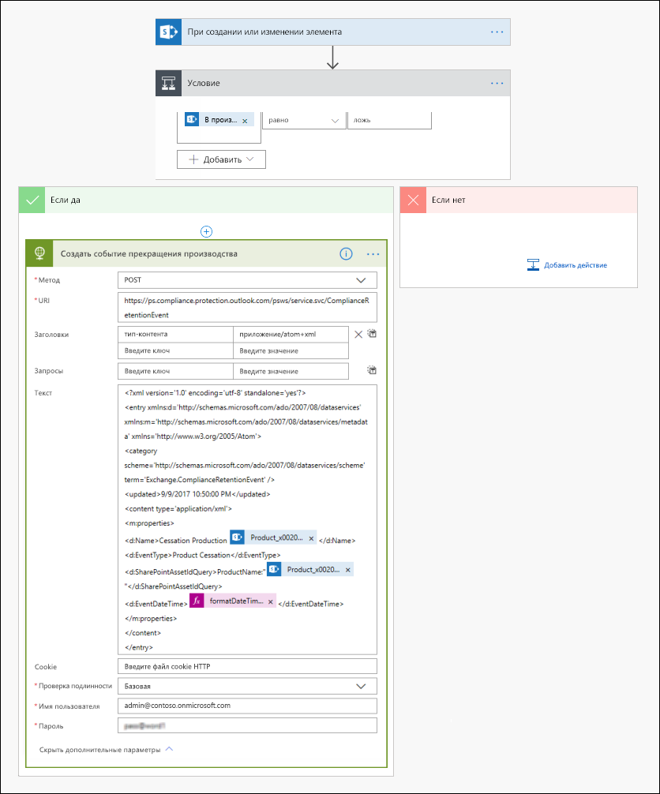

<span data-ttu-id="94454-307">Чтобы создать этот поток, начните с соединителя SharePoint и выберите триггер **При создании или изменении элемента**.</span><span class="sxs-lookup"><span data-stu-id="94454-307">To create this flow, start from a SharePoint connector and select the **When an item is created or modified** trigger.</span></span> <span data-ttu-id="94454-308">Укажите адрес сайта и имя списка, затем добавьте условие для столбце **В производстве** этого списка при установке значения **Нет** (или значения "false" в карточке условия).</span><span class="sxs-lookup"><span data-stu-id="94454-308">Specify the site address and list name, and then add a condition based on when the **In Production** list column value is set to **No** (or equal to false in the condition card).</span></span> <span data-ttu-id="94454-309">Затем добавьте действие на основе встроенного шаблона HTTP.</span><span class="sxs-lookup"><span data-stu-id="94454-309">Then add an action based on the built-in HTTP template.</span></span> <span data-ttu-id="94454-310">Для настройки действия HTTP используйте значения, указанные в следующем разделе.</span><span class="sxs-lookup"><span data-stu-id="94454-310">Use the values in the following section to configure the HTTP action.</span></span> <span data-ttu-id="94454-311">Можно скопировать значения свойств "URI" и "Текст" из раздела ниже и вставить их в шаблон.</span><span class="sxs-lookup"><span data-stu-id="94454-311">You can copy the values for the URI and Body properties from the section below and then paste them into the template.</span></span>

- <span data-ttu-id="94454-312">**Метод**: POST</span><span class="sxs-lookup"><span data-stu-id="94454-312">**Method**: POST</span></span>
- <span data-ttu-id="94454-313">**URI**: https://ps.compliance.protection.outlook.com/psws/service.svc/ComplianceRetentionEvent</span><span class="sxs-lookup"><span data-stu-id="94454-313">**URI**: https://ps.compliance.protection.outlook.com/psws/service.svc/ComplianceRetentionEvent</span></span>
- <span data-ttu-id="94454-314">**Заголовки**: Key = Content-Type, Value = application/atom+xml</span><span class="sxs-lookup"><span data-stu-id="94454-314">**Headers**: Key = Content-Type, Value = application/atom+xml</span></span>
- <span data-ttu-id="94454-315">**Текст**:</span><span class="sxs-lookup"><span data-stu-id="94454-315">**Body**:</span></span>

```HTML
<?xml version='1.0' encoding='utf-8' standalone='yes'>
<entry xmlns:d='https://schemas.microsoft.com/ado/2007/08/dataservices' xmlns:m='https://schemas.microsoft.com/ado/2007/08/dataservices/metadata' xmlns='https://www.w3.org/2005/Atom'>
<category scheme='https://schemas.microsoft.com/ado/2007/08/dataservices/scheme' term='Exchange.ComplianceRetentionEvent'>
<updated>9/9/2017 10:50:00 PM</updated>
<content type='application/xml'>
<m:properties>
<d:Name>Cessation Production @{triggerBody()?['Product_x0020_Name']?['Value']}</d:Name>
<d:EventType>Product Cessation&lt;</d:EventType>
<d:SharePointAssetIdQuery>ProductName:&quot;@{triggerBody()?['Product_x0020_Name']?['Value']}<d:SharePointAssetIdQuery>
<d:EventDateTime>@{formatDateTime(utcNow(),'yyyy-MM-dd')}</d:EventDateTime>
</m:properties>
</content&gt>
</entry>
```

<span data-ttu-id="94454-316">Следующий раздел описывает параметры в свойстве *Текст* действия, которое должно быть настроено для этого сценария.</span><span class="sxs-lookup"><span data-stu-id="94454-316">The following section describes the parameters within the *Body* property of the action that must be configured specifically for this scenario.</span></span>

- <span data-ttu-id="94454-317">**Name**. Этот параметр указывает имя события, которое будет создано в Центре безопасности и соответствия требованиям.</span><span class="sxs-lookup"><span data-stu-id="94454-317">**Name**: This parameter specifies the name of the event that will be created in the security and compliance center.</span></span> <span data-ttu-id="94454-318">В нашем случае используется имя "Cessation Production xxx", где xxx — значение созданного ранее управляемого свойства ProductName.</span><span class="sxs-lookup"><span data-stu-id="94454-318">For this scenario, the name is "Cessation Production xxx", where xxx is the value of the ProductName managed property that we created earlier.</span></span>
- <span data-ttu-id="94454-319">**EventType**. Значение этого параметра соответствует типу событий, к которому будет применяться созданное событие.</span><span class="sxs-lookup"><span data-stu-id="94454-319">**EventType**: The value for this parameter corresponds to the event type that the created event will apply to.</span></span> <span data-ttu-id="94454-320">Этот тип событий был определен при создании метки хранения.</span><span class="sxs-lookup"><span data-stu-id="94454-320">This event type was defined when you created the retention label.</span></span> <span data-ttu-id="94454-321">В этом сценарии тип события — "Прекращение производства".</span><span class="sxs-lookup"><span data-stu-id="94454-321">For this scenario, the event type is "Product Cessation".</span></span>
- <span data-ttu-id="94454-322">**SharePointAssetIdQuery**. Этот параметр определяет идентификатор ресурса для события.</span><span class="sxs-lookup"><span data-stu-id="94454-322">**SharePointAssetIdQuery**:This parameter defines the Asset Id for the event.</span></span> <span data-ttu-id="94454-323">Для хранения на основе событий требуется уникальный идентификатор документа.</span><span class="sxs-lookup"><span data-stu-id="94454-323">Event-based retention needs a unique identifier for the document.</span></span> <span data-ttu-id="94454-324">С помощью идентификаторов ресурсов можно обозначить документы, к которым применяется определенное событие, или, как мы поступаем в этом сценарии, обозначить столбец метаданных — наше собственное название продукта.</span><span class="sxs-lookup"><span data-stu-id="94454-324">We can use Asset Ids to identify the documents that a particular event applies to, or as we do for this scenario, a metadata column, our own Product Name.</span></span> <span data-ttu-id="94454-325">Для этого нужно создать новое управляемое свойство ProductName, которое можно использовать в запросе KQL (вместо создания нового управляемого свойства можно использовать RefinableString00).</span><span class="sxs-lookup"><span data-stu-id="94454-325">To do  this, we have to create a new managed property named ProductName that can be used in the KQL query (or we could have used RefinableString00 instead of creating a new managed property).</span></span> <span data-ttu-id="94454-326">Также нужно сопоставить это новое управляемое свойство со свойством для обхода ows_Product_x0020_Name.</span><span class="sxs-lookup"><span data-stu-id="94454-326">We also need to map this new managed property to the ows_Product_x0020_Name crawled property.</span></span> <span data-ttu-id="94454-327">Вот снимок экрана этого управляемого свойства.</span><span class="sxs-lookup"><span data-stu-id="94454-327">Here's a screenshot of this managed property.</span></span>

    

- <span data-ttu-id="94454-329">**EventDateTime**. Этот параметр определяет дату, когда происходит событие.</span><span class="sxs-lookup"><span data-stu-id="94454-329">**EventDateTime**: This parameter defines the date the event occurs.</span></span> <span data-ttu-id="94454-330">Используйте текущий формат даты: *formatDateTime(utcNow(),'yyyy-MM-dd'*)</span><span class="sxs-lookup"><span data-stu-id="94454-330">Use the current date format: *formatDateTime(utcNow(),'yyyy-MM-dd'*)</span></span>

### <a name="putting-it-all-together"></a><span data-ttu-id="94454-331">Готовое решение</span><span class="sxs-lookup"><span data-stu-id="94454-331">Putting it all together</span></span>

<span data-ttu-id="94454-332">Итак, метка хранения создана и автоматически применена, поток настроен и создан. Вот что произойдет, когда значение в столбце **В производстве** для продукта "Spinning Widget" в списке "Продукты" изменится с **Да** на **Нет**.</span><span class="sxs-lookup"><span data-stu-id="94454-332">Now that the retention label is created and auto-applied and the flow is configured and created, here's what happens when the value in the **In Production** column for the Spinning Widget product in the Products list is changed from **Yes** to **No**.</span></span> <span data-ttu-id="94454-333">Поток запускается и создает событие.</span><span class="sxs-lookup"><span data-stu-id="94454-333">The flow is triggered and creates the event.</span></span> <span data-ttu-id="94454-334">Чтобы увидеть это событие в Центре безопасности и соответствия требованиям, перейдите в раздел **Управление записями** > **События**.</span><span class="sxs-lookup"><span data-stu-id="94454-334">To see this event in the security and compliance center, go to **Records management** > **Events**.</span></span>


<span data-ttu-id="94454-336">Выберите событие, чтобы просмотреть сведения на всплывающей странице.</span><span class="sxs-lookup"><span data-stu-id="94454-336">Select the event to view the details on the flyout page.</span></span> <span data-ttu-id="94454-337">Обратите внимание, что хотя событие создано, сведения в разделе состояния события указывают, что нет обработанных сайтов или документов SharePoint.</span><span class="sxs-lookup"><span data-stu-id="94454-337">Notice that even though the event is created, the details in the event status show that no SharePoint sites or documents have been processed.</span></span>

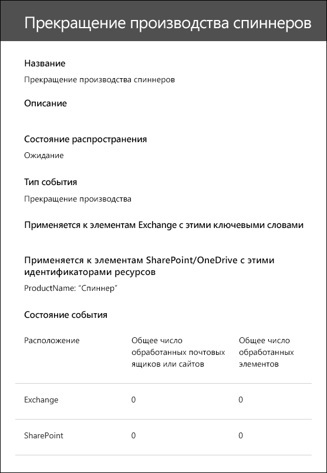

<span data-ttu-id="94454-339">Через некоторое время в разделе состояния события появится информация о том, что обработан сайт SharePoint и документ SharePoint.</span><span class="sxs-lookup"><span data-stu-id="94454-339">But after some time, the event status section shows that for a SharePoint site and a SharePoint document have been processed.</span></span>  


 
<span data-ttu-id="94454-341">Это означает, что запущен срок хранения для метки, примененной к документу о продукте "Spinning Widget", на основании даты события "Cessation Production Spinning Widget".</span><span class="sxs-lookup"><span data-stu-id="94454-341">This means the retention period for the label applied to the Spinning Widget product document has been initiated, based on the event date of the Cessation Production Spinning Widget event.</span></span> <span data-ttu-id="94454-342">Если в сценарии в тестовой среде настроен срок хранения в один день, можно перейти в библиотеку документов о продуктах через несколько дней после создания этого события и убедиться, что документ удален (после запуска задания удаления в SharePoint).</span><span class="sxs-lookup"><span data-stu-id="94454-342">Assuming you implemented the scenario in your test environment by configuring a one-day retention period, you can go to the document library for your product documents a few days after the event was created and verify that the document is deleted (after the deletion job in SharePoint has run).</span></span>

### <a name="more-about-asset-ids"></a><span data-ttu-id="94454-343">Подробнее об идентификаторах ресурсов</span><span class="sxs-lookup"><span data-stu-id="94454-343">More about Asset Ids</span></span>

<span data-ttu-id="94454-344">Как указано в разделе [обзор хранения на основ событий](event-driven-retention.md), важно понимать взаимоотношения между типами событий, метками, событиями и идентификаторами ресурсов.</span><span class="sxs-lookup"><span data-stu-id="94454-344">As explained in the [overview of event-driven retention](event-driven-retention.md), it's important to understand the relationship between event types, labels, events, and asset Ids.</span></span> <span data-ttu-id="94454-345">Идентификатор ресурса — это лишь еще одно свойство документа в SharePoint и OneDrive.</span><span class="sxs-lookup"><span data-stu-id="94454-345">The Asset Id is simply another document property in SharePoint and OneDrive.</span></span> <span data-ttu-id="94454-346">С его помощью можно обозначить документы, срок хранения которых будет запускаться событием.</span><span class="sxs-lookup"><span data-stu-id="94454-346">It helps you to further identify the documents whose retention period will be triggered by the event.</span></span> <span data-ttu-id="94454-347">По умолчанию в SharePoint есть свойство идентификатора ресурса, которое можно использовать для хранения на основе событий:</span><span class="sxs-lookup"><span data-stu-id="94454-347">By default, SharePoint has an Asset Id property that you can use for event-driven retention:</span></span>

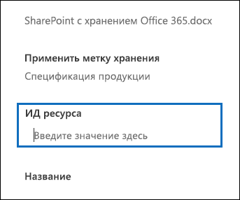

<span data-ttu-id="94454-349">Как показано на следующем снимке экрана, управляемое свойство идентификатора ресурса называется **ComplianceAssetId**.</span><span class="sxs-lookup"><span data-stu-id="94454-349">As shown in the following screenshot, the Asset Id managed property is called **ComplianceAssetId**.</span></span>


<span data-ttu-id="94454-351">Вместо свойства идентификатора ресурса по умолчанию можно использовать другое свойство, как мы и поступаем в этом сценарии.</span><span class="sxs-lookup"><span data-stu-id="94454-351">Instead of using the default Asset Id property, you can also use any other property, as we do in this scenario.</span></span> <span data-ttu-id="94454-352">При этом важно помнить, что если не указать идентификатор ресурса или ключевые слова события, то событие запустит срок хранения для всего содержимое с меткой данного типа событий.</span><span class="sxs-lookup"><span data-stu-id="94454-352">But it's important to understand that if you don't specify an asset ID or keywords for an event, all of the content with a label of that event type will have its retention period triggered by the event.</span></span>

### <a name="using-advanced-search-in-sharepoint"></a><span data-ttu-id="94454-353">Использование расширенного поиска в SharePoint</span><span class="sxs-lookup"><span data-stu-id="94454-353">Using advanced search in SharePoint</span></span>

<span data-ttu-id="94454-354">На предыдущем снимке экрана также видно, что существует еще одно управляемое свойство, связанное с метками хранения. Оно называется **ComplianceTag** и сопоставлено со свойством для обхода. </span><span class="sxs-lookup"><span data-stu-id="94454-354">In the previous screenshot, we can also see that there's another managed property related to retention labels called **ComplianceTag** and that it's mapped to a crawled property.</span></span> <span data-ttu-id="94454-355">Управляемое свойство **ComplianceAssetId** также сопоставлено со свойством для обхода.</span><span class="sxs-lookup"><span data-stu-id="94454-355">The **ComplianceAssetId** managed property is also mapped to a crawled property.</span></span> <span data-ttu-id="94454-356">Это означает, что можно использовать эти управляемые свойства в расширенном поиска для получения всех документов, помеченных меткой хранения.</span><span class="sxs-lookup"><span data-stu-id="94454-356">This means you can use these managed properties in advanced search to retrieve all documents that have been tagged with a retention label.</span></span>

## <a name="summary"></a><span data-ttu-id="94454-357">Сводка</span><span class="sxs-lookup"><span data-stu-id="94454-357">Summary</span></span>

<span data-ttu-id="94454-358">В этой статье описан сценарий управления документами, в котором мы автоматически применили метку хранения на основе столбца сайта в SharePoint.</span><span class="sxs-lookup"><span data-stu-id="94454-358">This article illustrated a document management scenario where we automatically applied a retention label based on a site column in SharePoint.</span></span> <span data-ttu-id="94454-359">Затем мы воспользовались хранением на основе событий и Microsoft Flow для автоматического запуска начала периода хранения на основе внешнего события.</span><span class="sxs-lookup"><span data-stu-id="94454-359">Then we used event-based retention and Microsoft Flow to automatically trigger the start of the retention period based on an external event.</span></span>

## <a name="credits"></a><span data-ttu-id="94454-360">Сведения об авторах</span><span class="sxs-lookup"><span data-stu-id="94454-360">Credits</span></span>

<span data-ttu-id="94454-361">Авторы этого сценария:</span><span class="sxs-lookup"><span data-stu-id="94454-361">This scenario was authored by:</span></span> 

<span data-ttu-id="94454-362">Фредерик Лапьер</span><span class="sxs-lookup"><span data-stu-id="94454-362">Frederic Lapierre</span></span><br/><span data-ttu-id="94454-363">Главный консультант, Microsoft Services</span><span class="sxs-lookup"><span data-stu-id="94454-363">Principal Consultant, Microsoft Services</span></span>
