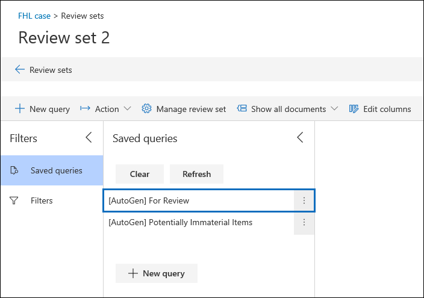

# Настройка параметров поиска и аналитики

Вы можете настроить параметры для каждого расширенного случая обнаружения электронных данных, чтобы управлять следующими функциями.

- Почти повторяющиеся элементы и почтовые потоки

- Темы

- Автоматически сформированный запрос на проверку набора

- Игнорировать текст

- Распознавание текста

Чтобы настроить параметры поиска и аналитики для случая:

1. На странице **Advanced eDiscovery (дополнительные функции обнаружения электронных** данных) выберите вариант.

2. На вкладке **Параметры** в группе **Поиск & Analytics**нажмите кнопку **выбрать**.

   Отобразится страница "Параметры обращения". Эти параметры применяются ко всем наборам проверки в случае.

   

## Почти повторяющиеся элементы и почтовые потоки

В этом разделе можно задать параметры обнаружения дубликатов, поиска повторяющихся сообщений и почтовых потоков. Дополнительные сведения см. в статье [Обнаружение повторяющихся](near-duplicates.md) данных и [цепочка электронной почты](email-threading.md).

- **Почти повторяющиеся значения и цепочки электронной почты:** Если этот параметр включен, Поиск повторяющихся данных, Поиск повторяющихся данных и цепочка электронной почты включены как часть рабочего процесса при выполнении аналитики для данных в наборе рецензирования.

- **Порог подобия для документа и электронной почты:** Если уровень сходства двух документов превышает пороговое значение, оба документа помещаются в один и тот же самый близкий к дублированному набору.

- **Минимальное и максимальное число слов:** Эти параметры указывают, что почти повторяющиеся и почтовые потоки будут выполняться только для документов, которые содержат по крайней мере минимальное количество слов и максимальное количество слов.

## Темы

В этом разделе можно задать параметры для тем. Более подробную информацию можно узнать в статье [Themes](themes-in-advanced-ediscovery.md).

- **Темы:** Когда этот параметр включен, кластеризация тем выполняется в рамках рабочего процесса при выполнении аналитики для данных в наборе рецензирования.

- **Максимальное число тем:** Указывает максимальное количество тем, которые могут быть созданы при выполнении аналитики для данных в наборе проверки.

- **Включение цифр в темы:** Если этот режим включен, при создании тем используются цифры (которые идентифицируют тему). 

- **Подгонять максимальное число тем динамически:** В некоторых случаях в наборе рецензирования может отсутствовать количество документов, чтобы получить необходимое количество тем. Если этот параметр включен, расширенные функции обнаружения электронных данных настраивают максимальное число тем динамически, а не предоставляя максимальное количество тем.

## Просмотр запроса Set

Если установлен флажок **автоматически создавать сохраненный поиск после выполнения анализа** , Advanced eDiscovery автоматически создает запрос на проверку набора с именем **.** 

Этот запрос, по сути, отфильтровывает повторяющиеся элементы из набора рецензирования. Это позволяет просматривать уникальные элементы в наборе проверки. Этот запрос создается только при выполнении аналитики для набора проверки в случае. Более подробную информацию о запросах Set можно узнать [в статье запрос данных в наборе рецензирования](review-set-search.md).

## Игнорировать текст

Существуют ситуации, в которых определенный текст будет проявить качество анализа, например, длительные заявления об отказе, которые добавляются в сообщения электронной почты независимо от содержимого сообщения. Если вы знаете текст, который следует игнорировать, можно исключить его из аналитики, указав текстовую строку и функции аналитики (почти-дубликаты, почтовые потоки, темы и релевантность), для которых следует исключить текст. Кроме того, поддерживается использование регулярных выражений (RegEx) в качестве игнорируемого текста. 

## Оптическое распознавание текста (OCR)

Если этот параметр включен, OCR будет выполняться для файлов изображений, которые добавляются к наборам проверки, чтобы можно было просматривать, искать, размечать и анализировать текст изображения. Извлеченный текст можно просмотреть в средстве просмотра текста выбранного файла изображения в наборе рецензирования. Дополнительные сведения см. в указанных ниже статьях.

- [Добавление результатов поиска в набор для проверки](add-data-to-review-set.md#optical-character-recognition)

- [Поддерживаемые типы файлов изображений](supported-filetypes-ediscovery20.md#image)
