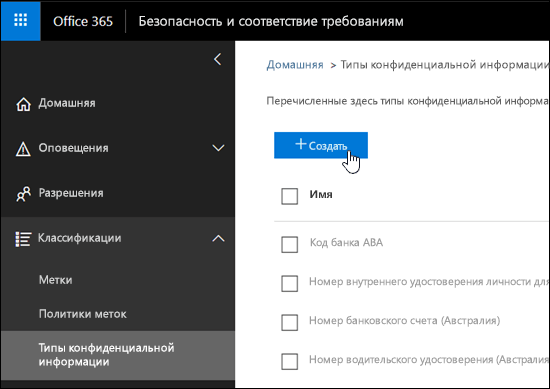
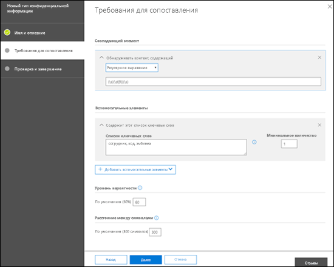
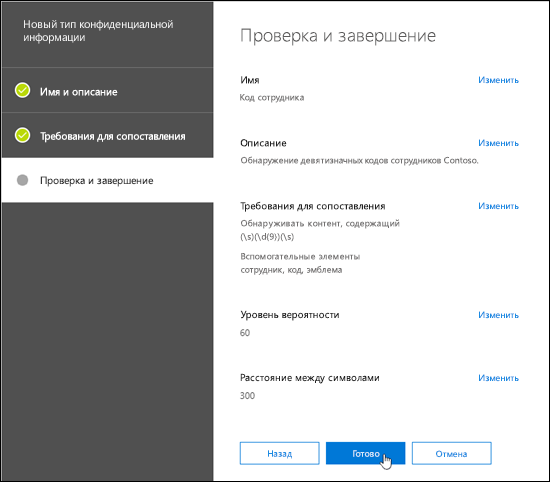
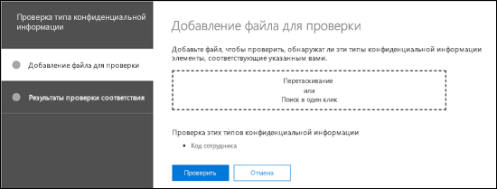

<!-- rename md file to match the display name -->
# Создание пользовательского типа конфиденциальной информации в Центре безопасности и соответствия требованиям

Ознакомьтесь с этой статьей, чтобы создать [пользовательский тип конфиденциальной информации](custom-sensitive-info-types.md) в Центре безопасности и соответствия требованиям ([https://protection.office.com](https://protection.office.com)). Пользовательские типы конфиденциальной информации, создаваемые этим методом, добавляются в пакет правил `Microsoft.SCCManaged.CustomRulePack`.

Вы также можете создавать пользовательские типы конфиденциальной информации с помощью PowerShell и функций точного совпадения данных. Дополнительные сведения об этих методах см. в следующих статьях:
- [Создание пользовательского типа конфиденциальной информации в PowerShell Центра безопасности и соответствия требованиям](create-a-custom-sensitive-information-type-in-scc-powershell.md)
- [Создание пользовательского типа конфиденциальной информации для защиты от потери данных с помощью точного совпадения данных (EDM)](create-custom-sensitive-information-types-with-exact-data-match-based-classification.md)

## Перед началом работы

> [!NOTE]
> Чтобы создать, тестировать и развернуть собственный тип конфиденциальной информации с помощью пользовательского интерфейса, необходимы разрешения глобального администратора или администратора соответствия требованиям. См. [сведения о ролях администраторов](https://docs.microsoft.com/office365/admin/add-users/about-admin-roles?view=o365-worldwide) в Office 365.

- У вашей организации должна быть подписка, например на Office 365 корпоративный, включающая защиту от потери данных (DLP). См. статью [Описание политики обмена сообщениями и соответствия требованиям](https://docs.microsoft.com/office365/servicedescriptions/exchange-online-protection-service-description/messaging-policy-and-compliance-servicedesc). 

- Custom sensitive information types require familiarity with regular expressions (RegEx). For more information about the Boost.RegEx (formerly known as RegEx++) engine that's used for processing the text, see [Boost.Regex 5.1.3](https://www.boost.org/doc/libs/1_68_0/libs/regex/doc/html/).

  Центр обслуживания клиентов Майкрософт не может оказывать помощь при создании пользовательских категорий или шаблонов регулярных выражений. Инженеры службы поддержки могут оказывать ограниченную поддержку по этой функции, например предоставлять примеры шаблонов регулярных выражений для тестирования или помогать с устранением неполадок имеющегося шаблона, который не срабатывает должным образом, но не могут гарантировать, что то или иное решение для сопоставления контента будет соответствовать вашим требованиям или обязательствам.

- В службе защиты от потери данных используется агент данных для выявления и классификации конфиденциальной информации на сайтах SharePoint Online и OneDrive для бизнеса. Для выявления в имеющемся контенте элементов, относящихся к новому пользовательскому типу конфиденциальной информации, необходимо заново выполнить его обход. Обход контента выполняется по расписанию, но вы можете повторно выполнить обход контента вручную для семейства веб-сайтов, списка или библиотеки. Дополнительные сведения см. в статье [Ручной запрос обхода контента и переиндексации сайта, библиотеки или списка](https://docs.microsoft.com/sharepoint/crawl-site-content).

## Создание пользовательского типа конфиденциальной информации в Центре безопасности и соответствия требованиям

В Центре безопасности и соответствия требованиям выберите **Классификации** \> **Типы конфиденциальной информации** и нажмите **Создать**.

Параметры не требуют особых пояснений и описываются на соответствующей странице мастера.

- **Имя**

- **Описание**

- **Расстояние**

- **Уровень вероятности**

- **Элемент основного шаблона** (ключевые слова, регулярное выражение или словарь)

- Необязательные **элементы вспомогательного шаблона** (ключевые слова, регулярное выражение или словарь) и соответствующее значение **минимальной стоимости**.

Here's a scenario: You want a custom sensitive information type that detects 9-digit employee numbers in content, along with the keywords "employee" "ID" and "badge". To create this custom sensitive information type, do the following steps:

1. В Центре безопасности и соответствия требованиям выберите **Классификации** \> **Типы конфиденциальной информации** и нажмите **Создать**.

    

2. На открывшейся странице **Выберите имя и описание** введите следующие значения:

  - **Имя**: "ИД сотрудника".

  - **Описание**: "Обнаружение девятизначных кодов сотрудников Contoso".

    

    По завершении нажмите кнопку **Далее**.

3. На открывшейся странице **Требования для сопоставления** нажмите **Добавить элемент** и настройте указанные ниже параметры.

    - Чтобы настроить **Обнаруживать контент, содержащий**:
 
      a. Click **Any of these** and select **Regular expression**.

      b. In the regular expression box, enter `(\s)(\d{9})(\s)` (nine-digit numbers surrounded by white space).
  
    - Чтобы настроить **Вспомогательные элементы**, нажмите **Добавить вспомогательные элементы** и выберите **Содержит этот список ключевых слов**.

    - В открывшейся области **Содержит этот список ключевых слов** настройте указанные ниже параметры.

      - **Список ключевых слов.** Введите следующее значение: сотрудник,ИД,бейдж.

      - **Минимальное количество.** Оставьте значение по умолчанию (1).

    - Оставьте для параметра **Уровень вероятности** значение по умолчанию (60). 

    - Оставьте для параметра **Расстояние между символами** значение по умолчанию (300).

    

    По завершении нажмите кнопку **Далее**.

4. На открывшейся странице **Проверка и завершение** проверьте параметры и нажмите кнопку **Готово**.

    

5. The next page encourages you to test the new custom sensitive information type by clicking **Yes**. For more information, see [Test custom sensitive information types in the Security & Compliance Center](#test-custom-sensitive-information-types-in-the-security--compliance-center). To test the rule later, click **No**.

    

### Как убедиться, что все получилось?

Чтобы убедиться, что вы успешно создали новый тип конфиденциальной информации, выполните любое из указанных ниже действий.

  - Откройте раздел **Классификации** \> **Типы конфиденциальной информации** и убедитесь, что новый тип присутствует в списке.

  - Test the new custom sensitive information type. For more information, see [Test custom sensitive information types in the Security & Compliance Center](#test-custom-sensitive-information-types-in-the-security--compliance-center).

## Редактирование пользовательских типов конфиденциальной информации в Центре безопасности и соответствия требованиям

**Примечания**.
<!-- check to see if this note contradicts the guidance in "customize a built in sensitive information type customize-a-built-in-sensitive-information-type it sure seems like it does-->
- You can only modify custom sensitive information types; you can't modify built-in sensitive information types. But you can use PowerShell to export built-in custom sensitive information types, customize them, and import them as custom sensitive information types. For more information, see [Customize a built-in sensitive information type](customize-a-built-in-sensitive-information-type.md).

- You can only modify custom sensitive information types that you created in the UI. If you used the [PowerShell procedure](create-a-custom-sensitive-information-type-in-scc-powershell.md) to import a custom sensitive information type rule package, you'll get an error.

В Центре безопасности и соответствия требованиям откройте раздел **Классификации** \> **Типы конфиденциальной информации**, выберите нужный пользовательский тип и нажмите кнопку **Изменить**.

  

The same options are available here as when you created the custom sensitive information type in the Security & Compliance Center. For more information, see [Create custom sensitive information types in the Security & Compliance Center](#create-custom-sensitive-information-types-in-the-security--compliance-center).

### Как убедиться, что все получилось?

Чтобы убедиться, что вы успешно изменили тип конфиденциальной информации, выполните любое из указанных ниже действий.

  - Откройте раздел **Классификации** \> **Типы конфиденциальной информации** и проверьте параметры измененного типа. 

  - Test the modified custom sensitive information type. For more information, see [Test custom sensitive information types in the Security & Compliance Center](#test-custom-sensitive-information-types-in-the-security--compliance-center).

## Удаление пользовательского типа конфиденциальной информации в Центре безопасности и соответствия требованиям 

**Примечания**:

- Удалять можно только пользовательские типы конфиденциальной информации. Удалить встроенный тип невозможно.

- Перед удалением пользовательского типа конфиденциальной информации убедитесь, что политики защиты от потери данных и правила потока обработки почты Exchange (также называемые правилами транспорта) не ссылаются на этот тип.

1. В Центре безопасности и соответствия требованиям откройте раздел **Классификации** \> **Типы конфиденциальной информации** и выберите один или несколько пользовательских типов.

2. В открывшемся всплывающем окне нажмите **Удалить** (или **Удалить типы конфиденциальной информации**, если выбрано несколько типов).

    

3. В появившемся предупреждающем сообщении нажмите **Да**.

### Как убедиться, что все получилось?

Чтобы убедиться, что вы успешно удалили пользовательский тип конфиденциальной информации, откройте раздел **Классификации** \> **Типы конфиденциальной информации** и проверьте, исчез ли этот тип из списка.

## Тестирование пользовательских типов конфиденциальной информации в Центре безопасности и соответствия требованиям

1. В Центре безопасности и соответствия требованиям выберите **Классификации** \> **Типы конфиденциальной информации**.

2. Select one or more custom sensitive information types to test. In the fly-out that opens, click **Test type** (or **Test sensitive info types** if you selected more than one).

    

3. На открывшейся странице **Добавление файла для тестирования** отправьте документ на проверку, перетащив файл или нажав кнопку **Обзор** и выбрав файл.

    

4. Нажмите кнопку **Тестировать**, чтобы проверить документ на совпадения с шаблоном.

5. На странице **Результаты проверки соответствия** нажмите кнопку **Готово**.

    
