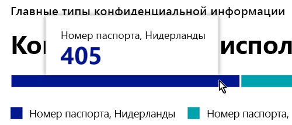
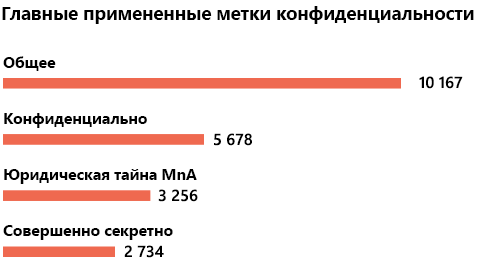

# Общие сведения о классификации данных (предварительная версия)Data classification overview (preview)

В качестве администратора Microsoft 365 или администратора соответствия вы можете оценивать и затем маркировать содержимое в своей организации, чтобы контролировать путь его направления, защищать вне зависимости от расположения, а также гарантировать его сохранность и удаление в соответствии с потребностями вашей организации.As a Microsoft 365 administrator or compliance administrator, you can evaluate and then tag content in your organization in order to control where it goes, protect it no matter where it is and to ensure that it is preserved and deleted according your your organizations needs. Это можно сделать посредством применения [меток конфиденциальности](sensitivity-labels.md), [меток хранения](labels.md)и классификации типов конфиденциальной информации.You do this through the application of [sensitivity labels](sensitivity-labels.md), [retention labels](labels.md), and sensitive information type classification. Существуют различные способы обнаружения, оценки и маркировки, но в результате у вас может быть очень большое количество документов и электронных писем, которые помечены и классифицированы одной или обеими этими метками.There are various ways to do the discovery, evaluation and tagging, but the end result is that you may have very large numbers of documents and emails that are tagged and classified with one or both of these labels. После применения своих меток хранения и меток конфиденциальности вы захотите увидеть, каким образом метки используются вашим клиентом и что происходит с этими элементами.After you apply  your retention labels and sensitivity labels, you’ll want to see how the labels are being used across your tenant and what is being done with those items. На странице классификации данных можно увидеть этот текст содержимого, а именно:The data classification page provides visibility into that body of content, specifically:

- количество элементов, которые были классифицированы как тип конфиденциальной информации, и характер этих классификацийthe number items that have been classified as a sensitive information type and what those classifications are
- наиболее часто используемые метки конфиденциальности, применяемые в Microsoft 365 и Azure Information Protectionthe top applied sensitivity labels in both Microsoft 365 and Azure Information Protection
- наиболее часто используемые метки храненияthe top applied retention labels
- сводка действий, выполняемых пользователями с вашим конфиденциальным содержимымa summary of activities that users are taking on your sensitive content
- расположение ваших конфиденциальных и сохраненных данныхthe locations of your sensitive and retained data

Классификация данных приведена в **Центре соответствия требованиям Microsoft 365** или **Центре безопасности Microsoft 365** > **Классификация** > **Классификация данных**.You can find data classification in the **Microsoft 365 compliance center** or **Microsoft 365 security center** > **Classification** > **Data Classification**.

## Типы конфиденциальных данных, которые наиболее часто используются в вашем содержимомSensitive information types used most in your content

Microsoft 365 поставляется со многими определениями типов конфиденциальной информации, такими как элемент, содержащий номер социального страхования или номер кредитной карты.Microsoft 365 comes with many definitions of sensitive information types, such as an item containing a social security number or a credit card number. Дополнительные сведения о типах конфиденциальной информации см. в статье [Что позволяют искать типы конфиденциальной информации](what-the-sensitive-information-types-look-for.md).For more information on sensitive information types, see [What the sensitive information types look for](what-the-sensitive-information-types-look-for.md).

На карточке типа конфиденциальной информации отображаются наиболее часто используемые типы конфиденциальной информации, которые были найдены и помечены в вашей организации.The sensitive information type card shows the top sensitive information types that have been found and labeled across your organization.

Чтобы узнать количество элементов в той или иной категории классификации, наведите указатель мыши на панель этой категории.To find out how many items are in any given classification category, hover over the bar for the category.

> [!NOTE]
> Если на карточке отображается сообщение «Данные с конфиденциальной информацией не найдены»,If the card displays the message "No data found with sensitive information". то это означает, что в вашей организации отсутствуют элементы, классифицированные как тип конфиденциальной информации, или отсутствуют обойденные элементы.It means that there are no items in your organization that have been classified as being a sensitive information type or no items that have been crawled. Чтобы приступить к работе с метками, см. следующие статьи:To get started with labels, see:
>- [Метки конфиденциальностиSensitivity labels](sensitivity-labels.md)
>- [Метки храненияRetention labels](labels.md)
>- [Что позволяют искать типы конфиденциальной информацииWhat the sensitive information types look for](what-the-sensitive-information-types-look-for.md)

## Наиболее часто используемые метки конфиденциальности, применяемые для содержимогоTop sensitivity labels applied to content

Когда вы применяете метку конфиденциальности к элементу с использованием Microsoft 365 или Azure Information Protection (AIP), то происходят две вещи:When you apply a sensitivity label to an item either through Microsoft 365 or Azure Information Protection (AIP), two things happen:

- тег, который обозначает значение элемента для вашей организации, встраивается в документ и будет повсюду следовать за нимa tag that indicates the value of the item to your org is embedded in the document and will follow it everywhere it goes
- наличие тега включает различные защитные действия, такие как обязательные водяные знаки или шифрование.the presence of the tag enables various protective behaviors, such as mandatory watermarking or encryption. С включенной защитой конечной точки вы можете даже не позволить элементу выйти из под управления вашей организации.With end point protection enabled you can even prevent an item from leaving your organizational control.

Дополнительные сведения о метках конфиденциальности см. в статье [Сведения о метках конфиденциальности](sensitivity-labels.md).For more information on sensitivity labels, see: [Learn about sensitivity labels](sensitivity-labels.md)

Для файлов SharePoint и OneDrive должны быть включены метки конфиденциальности, чтобы соответствующие данные отображались на странице классификации данных.Sensitivity labels must be enabled for files that are in SharePoint and OneDrive in order for the corresponding data to surface in the data classification page. Дополнительные сведения см. в статье [Включение меток конфиденциальности для файлов Office в SharePoint и OneDrive (общедоступная предварительная версия)](sensitivity-labels-sharepoint-onedrive-files.md).For more information, see [Enable sensitivity labels for Office files in SharePoint and OneDrive (public preview)](sensitivity-labels-sharepoint-onedrive-files.md).

На карточке с меткой конфиденциальности отображается количество элементов (электронная почта или документ) по уровню конфиденциальности.The sensitivity label card shows the number of items (email or document) by sensitivity level.

> [!NOTE]
> Если вы не создали или не опубликовали какие-либо метки конфиденциальности или к содержимому не применена метка конфиденциальности, то на этой карточке будет отображаться сообщение «Метки конфиденциальности не обнаружены».If you haven't created or published any sensitivity labels or no content has had a sensitivity label applied, this card will display the message "No sensitivity labels detected". Чтобы приступить к работе с метками, см. следующие статьи:To get started with labels, see:
>- [метки конфиденциальности](sensitivity-labels.md) или для AIP [Настройка политики защиты данных Azure](https://docs.microsoft.com/azure/information-protection/configure-policy)[sensitivity labels](sensitivity-labels.md) or for AIP [Configure the Azure information protection policy](https://docs.microsoft.com/azure/information-protection/configure-policy)

## Наиболее часто используемые метки хранения, применяемые для содержимогоTop retention labels applied to content

Метки хранения используются для управления ликвидацией содержимого в вашей организации.Retention labels are used to manage the disposition of content in your organization. В случае применения их можно использовать для контроля следующего: время хранения документа до удаления, необходимость просмотра до удаления, завершение срока хранения и должен ли документ быть помечен в качестве записи, которую никогда нельзя удалять.When applied, they can be used to control how long a document will be kept before deletion, whether it should be reviewed prior to deletion, when it's retention period expires, or whether it should be marked as a record which can never be deleted. Дополнительную информацию см. в разделе [Обзор меток хранения](labels.md).For more information see, [Overview of retention labels](labels.md).

Карточка наиболее часто используемых меток хранения показывает количество элементов, которым была присвоена метка хранения.The top applied retention labels card shows you how many items have a given retention label.

> [!NOTE]
> Если в этой карточке отображается сообщение: «Метки хранения не обнаружены», то это обозначает, что вы не создали или не опубликовали какие-либо метки хранения или к содержимому не была применена метка хранения.If this card displays the message, "No retention labels detected, it means you haven't created or published any retention  labels or no content has had a retention label applied. Чтобы приступить к работе с метками хранения, см. следующие статьи:To get started with retention labels, see:
>- [Обзор меток храненияOverview of retention labels](labels.md)

## Основные обнаруженные действияTop activities detected

В этой карточке представлен краткий обзор основных действий, которые пользователи выполняют с элементами, отмеченными в качестве конфиденциальных.This card provides a quick summary of the most common actions that users are taking on the sensitivity labeled items. Используйте [Обозреватель действий](data-classification-activity-explorer.md), чтобы углубленно изучить восемь различных действий, которые Microsoft 365 отслеживает по отмеченному содержимому и содержимому, размещенному в конечных точках Windows 10.You can use the [Activity explorer](data-classification-activity-explorer.md) to drill deep down on eight different activities that Microsoft 365 tracks on labeled content and content that is located on Windows 10 endpoints.

> [!NOTE]
> Если в этой карточке отображается сообщение «Действие не обнаружено», то это означает отсутствие действий с файлом или то, что аудит пользователя и администратора не включен.If this card displays the message, "No activity detected" it means that there's been no activity on the files or that user and admin auditing isn't turned on. Для включения журналов аудита см. сведения в следующих статьях:To turn the audit logs on , see:
>- [Поиск журнала аудита в Центре безопасности и соответствия требованиямSearch the audit log in security & compliance center](search-the-audit-log-in-security-and-compliance.md)

## Данные с метками конфиденциальности и хранения по расположениюSensitivity and retention labeled data by location

Суть отчетов о классификации данных заключается в обеспечении наглядного представления о количестве элементов с меткой, а также об их расположении.The point of the data classification reporting is to provide visibility into the number of items that have which label as well as their location. Эти карточки дадут вам представление о количестве отмеченных элементов в Exchange, SharePoint, OneDrive и т. д.These cards let you know how many labeled items the are in Exchange, SharePoint, and OneDrive etc.

> [!NOTE]
> Если в этой карточке отображается сообщение: «Расположения не обнаружены», то это обозначает, что вы не создали или не опубликовали какие-либо метки конфиденциальности или к содержимому не была применена метка хранения.If this card displays the message, "No locations detected, it means you haven't created or published any sensitivity labels or no content has had a retention label applied. Чтобы приступить к работе с метками конфиденциальности, см. следующие статьи:To get started with sensitivity labels, see:
>- [Метки конфиденциальностиSensitivity labels](sensitivity-labels.md)

## См. такжеSee also

- [Просмотр действий с метками (предварительная версия)View label activity (preview)](data-classification-activity-explorer.md)
- [Просмотр содержимого с метками (предварительная версия)View labeled content (preview)](data-classification-content-explorer.md)
- [Метки конфиденциальностиSensitivity labels](sensitivity-labels.md)
- [Метки храненияRetention labels](labels.md)
- [Что позволяют искать типы конфиденциальной информацииWhat the sensitive information types look for](what-the-sensitive-information-types-look-for.md)
- [Обзор политик храненияOverview of retention policies](retention-policies.md)
