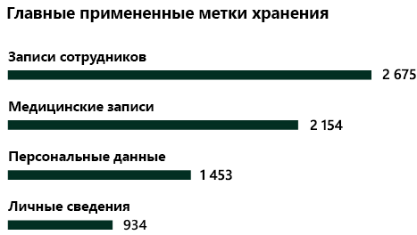

# Общие сведения о классификации данных (предварительная версия)

В качестве администратора Microsoft 365 или администратора соответствия вы можете оценивать и затем маркировать содержимое в своей организации, чтобы контролировать путь его направления, защищать вне зависимости от расположения, а также гарантировать его сохранность и удаление в соответствии с потребностями вашей организации. Это можно сделать посредством применения [меток конфиденциальности](sensitivity-labels.md), [меток хранения](labels.md)и классификации типов конфиденциальной информации. Существуют различные способы обнаружения, оценки и маркировки, но в результате у вас может быть очень большое количество документов и электронных писем, которые помечены и классифицированы одной или обеими этими метками. После применения своих меток хранения и меток конфиденциальности вы захотите увидеть, каким образом метки используются вашим клиентом и что происходит с этими элементами. На странице классификации данных можно увидеть этот текст содержимого, а именно:

- количество элементов, которые были классифицированы как тип конфиденциальной информации, и характер этих классификаций
- наиболее часто используемые метки конфиденциальности, применяемые в Microsoft 365 и Azure Information Protection
- наиболее часто используемые метки хранения
- сводка действий, выполняемых пользователями с вашим конфиденциальным содержимым
- расположение ваших конфиденциальных и сохраненных данных

Классификация данных приведена в **Центре соответствия требованиям Microsoft 365** или **Центре безопасности Microsoft 365** > **Классификация** > **Классификация данных**.

## Типы конфиденциальных данных, которые наиболее часто используются в вашем содержимом

Microsoft 365 поставляется со многими определениями типов конфиденциальной информации, такими как элемент, содержащий номер социального страхования или номер кредитной карты. Дополнительные сведения о типах конфиденциальной информации см. в статье [Что позволяют искать типы конфиденциальной информации](what-the-sensitive-information-types-look-for.md).

На карточке типа конфиденциальной информации отображаются наиболее часто используемые типы конфиденциальной информации, которые были найдены и помечены в вашей организации.

Чтобы узнать количество элементов в той или иной категории классификации, наведите указатель мыши на панель этой категории.

> [!NOTE]
> Если на карточке отображается сообщение «Данные с конфиденциальной информацией не найдены», то это означает, что в вашей организации отсутствуют элементы, классифицированные как тип конфиденциальной информации, или отсутствуют обойденные элементы. Чтобы приступить к работе с метками, см. следующие статьи:
>- [Метки конфиденциальности](sensitivity-labels.md)
>- [Метки хранения](labels.md)
>- [Что позволяют искать типы конфиденциальной информации](what-the-sensitive-information-types-look-for.md)

## Наиболее часто используемые метки конфиденциальности, применяемые для содержимого

Когда вы применяете метку конфиденциальности к элементу с использованием Microsoft 365 или Azure Information Protection (AIP), то происходят две вещи:

- тег, который обозначает значение элемента для вашей организации, встраивается в документ и будет повсюду следовать за ним
- наличие тега включает различные защитные действия, такие как обязательные водяные знаки или шифрование. С включенной защитой конечной точки вы можете даже не позволить элементу выйти из под управления вашей организации.

Дополнительные сведения о метках конфиденциальности см. в статье [Сведения о метках конфиденциальности](sensitivity-labels.md).

Для файлов SharePoint и OneDrive должны быть включены метки конфиденциальности, чтобы соответствующие данные отображались на странице классификации данных. Дополнительные сведения см. в статье [Включение меток конфиденциальности для файлов Office в SharePoint и OneDrive (общедоступная предварительная версия)](sensitivity-labels-sharepoint-onedrive-files.md).

На карточке с меткой конфиденциальности отображается количество элементов (электронная почта или документ) по уровню конфиденциальности.

> [!NOTE]
> Если вы не создали или не опубликовали какие-либо метки конфиденциальности или к содержимому не применена метка конфиденциальности, то на этой карточке будет отображаться сообщение «Метки конфиденциальности не обнаружены». Чтобы приступить к работе с метками, см. следующие статьи:
>- [метки конфиденциальности](sensitivity-labels.md) или для AIP [Настройка политики защиты данных Azure](https://docs.microsoft.com/azure/information-protection/configure-policy)

## Наиболее часто используемые метки хранения, применяемые для содержимого

Метки хранения используются для управления ликвидацией содержимого в вашей организации. В случае применения их можно использовать для контроля следующего: время хранения документа до удаления, необходимость просмотра до удаления, завершение срока хранения и должен ли документ быть помечен в качестве записи, которую никогда нельзя удалять. Дополнительную информацию см. в разделе [Обзор меток хранения](labels.md).

Карточка наиболее часто используемых меток хранения показывает количество элементов, которым была присвоена метка хранения.

> [!NOTE]
> Если в этой карточке отображается сообщение: «Метки хранения не обнаружены», то это обозначает, что вы не создали или не опубликовали какие-либо метки хранения или к содержимому не была применена метка хранения. Чтобы приступить к работе с метками хранения, см. следующие статьи:
>- [Обзор меток хранения](labels.md)

## Основные обнаруженные действия

В этой карточке представлен краткий обзор основных действий, которые пользователи выполняют с элементами, отмеченными в качестве конфиденциальных. Используйте [Обозреватель действий](data-classification-activity-explorer.md), чтобы углубленно изучить восемь различных действий, которые Microsoft 365 отслеживает по отмеченному содержимому и содержимому, размещенному в конечных точках Windows 10.

> [!NOTE]
> Если в этой карточке отображается сообщение «Действие не обнаружено», то это означает отсутствие действий с файлом или то, что аудит пользователя и администратора не включен. Для включения журналов аудита см. сведения в следующих статьях:
>- [Поиск журнала аудита в Центре безопасности и соответствия требованиям](search-the-audit-log-in-security-and-compliance.md)

## Данные с метками конфиденциальности и хранения по расположению

Суть отчетов о классификации данных заключается в обеспечении наглядного представления о количестве элементов с меткой, а также об их расположении. Эти карточки дадут вам представление о количестве отмеченных элементов в Exchange, SharePoint, OneDrive и т. д.

> [!NOTE]
> Если в этой карточке отображается сообщение: «Расположения не обнаружены», то это обозначает, что вы не создали или не опубликовали какие-либо метки конфиденциальности или к содержимому не была применена метка хранения. Чтобы приступить к работе с метками конфиденциальности, см. следующие статьи:
>- [Метки конфиденциальности](sensitivity-labels.md)

## См. также

- [Просмотр действий с метками (предварительная версия)](data-classification-activity-explorer.md)
- [Просмотр содержимого с метками (предварительная версия)](data-classification-content-explorer.md)
- [Метки конфиденциальности](sensitivity-labels.md)
- [Метки хранения](labels.md)
- [Что позволяют искать типы конфиденциальной информации](what-the-sensitive-information-types-look-for.md)
- [Обзор политик хранения](retention-policies.md)
