# Развертывание соединителя для архивации данных бизнес-страниц FacebookDeploy a connector to archive Facebook Business pages data

В этой статье представлено пошаговое руководство по развертыванию соединителя, использующего службу импорта Microsoft 365 для импорта данных из бизнес-страниц Facebook в Microsoft 365.This article contains the step-by-step process to deploy a connector that uses the Microsoft 365 Import service to import data from Facebook Business pages to Microsoft 365. Общий обзор этого процесса и список необходимых компонентов, необходимых для развертывания соединителя Facebook, приведены в разделе [Настройка соединителя для архивации данных Facebook](archive-facebook-data-with-sample-connector.md).For a high-level overview of this process and a list of prerequisites required to deploy a Facebook connector, see [Set up a connector to archive Facebook data](archive-facebook-data-with-sample-connector.md). 

## Шаг 1: создание приложения в Azure Active DirectoryStep 1: Create an app in Azure Active Directory

1. Перейдите на <https://portal.azure.com> страницу и войдите, используя учетные данные глобального администратора Office 365.Go to <https://portal.azure.com> and sign in using the credentials of an Office 365 global admin account.

    

2. В области навигации слева выберите **Azure Active Directory**.In the left navigation pane, click **Azure Active Directory**.

    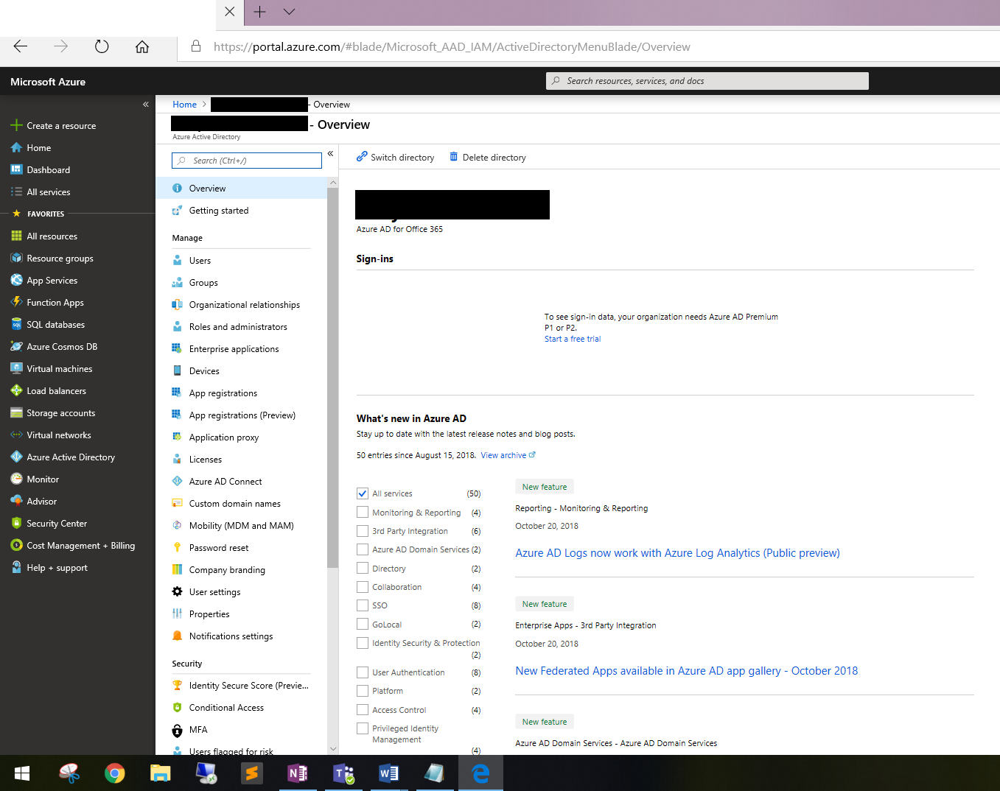

3. В левой области навигации щелкните **Регистрация приложений (Предварительная версия)** , а затем нажмите кнопку **создать регистрацию**.In the left navigation pane, click **App registrations (Preview)** and then click **New registration**.

    

4. Зарегистрируйте приложение.Register the application. В разделе URI перенаправления выберите пункт веб-сайт в раскрывающемся списке Тип <https://portal.azure.com> приложения, а затем введите в поле для URI.Under Redirect URI, select Web in the application type dropdown list and then type <https://portal.azure.com> in the box for the URI.

   

5. Скопируйте идентификатор **приложения (идентификатор клиента)** и **идентификатор каталога (клиента)** и сохраните их в текстовый файл или другое надежное расположение.Copy the **Application (client) ID** and **Directory (tenant) ID** and save them to a text file or other safe location. Эти идентификаторы используются на последующих этапах.You use these IDs in later steps.

   

6. Перейдите к разделу **сертификаты & секреты для нового приложения.**Go to **Certificates & secrets for the new app.**

   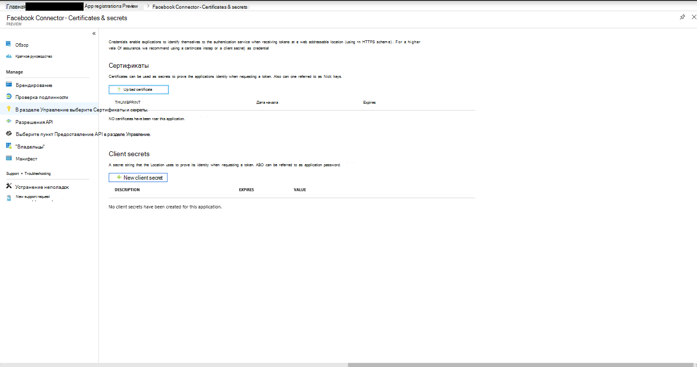

7. Щелкните **новый секрет клиента**Click **New client secret**

   

8. Создайте новый секрет.Create a new secret. В поле Описание введите секрет, а затем выберите срок действия.In the description box, type the secret and then choose an expiration period. 

    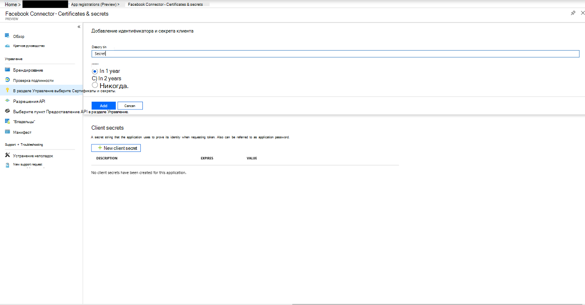

9. Скопируйте значение секрета и сохраните его в текстовый файл или другое место хранения.Copy the value of the secret and save it to a text file or other storage location. Это секрет приложения AAD, который вы используете в дальнейших действиях.This is the AAD application secret that you use in later steps.

   

## Шаг 2: разверните веб-службу соединителя из GitHub в учетную запись Azure.Step 2: Deploy the connector web service from GitHub to your Azure account

1. Перейдите на [этот сайт GitHub](https://github.com/microsoft/m365-sample-connector-csharp-aspnet) и нажмите кнопку **развернуть в Azure**.Go to [this GitHub site](https://github.com/microsoft/m365-sample-connector-csharp-aspnet) and click **Deploy to Azure**.

    

2. После нажатия кнопки **развернуть в Azure**вы будете перенаправлены на портал Azure с настраиваемой страницей шаблона.After you click **Deploy to Azure**, you will be redirected to an Azure portal with a custom template page. Заполните сведения о **основных** **параметрах и параметрах** , а затем щелкните **купить**.Fill in the **Basics** and **Settings** details and then click **Purchase**.

    - **Подписка:** Выберите свою подписку на Azure, в которую вы хотите развернуть веб-службу соединителя для бизнес-страниц Facebook.**Subscription:** Select your Azure subscription that you want to deploy the Facebook Business pages connector web service to.
    
    - **Группа ресурсов:** Выберите или создайте новую группу ресурсов.**Resource group:** Choose or create a new resource group. Группа ресурсов — это контейнер, в котором хранятся связанные ресурсы для решения Azure.A resource group is a container that holds related resources for an Azure solution.

    - **Расположение:** Выберите расположение.**Location:** Choose a location.

    - **Имя веб-приложения:** Укажите уникальное имя для веб-приложения соединителя.**Web App Name:** Provide a unique name for the connector web app. Длина имени должна составлять от 3 до 18 символов.Th name must be between 3 and 18 characters in length. Это имя используется для создания URL-адреса службы приложений Azure; Например, если указать имя веб-приложения **фбконнектор** , URL-адрес службы приложений Azure будет **fbconnector.azurewebsites.NET**.This name is used to create the Azure app service URL; for example, if you provide the Web app name of **fbconnector** then the Azure app service URL  will be **fbconnector.azurewebsites.net**.
    
    - **tenantId:** Идентификатор клиента вашей организации Microsoft 365, который вы скопировали после создания приложения соединителя Facebook в Azure Active Directory на этапе 1.**tenantId:** The tenant ID of your Microsoft 365 organization that you copied after creating the Facebook connector app in Azure Active Directory in Step 1.
    
   - **Аписекреткэй:** В качестве секрета можно ввести любое значение.**APISecretKey:** You can type any value as the secret. Он используется для доступа к веб-приложению Connector в действии 5.This is used to access the connector web app in Step 5.
   
     

3. После успешного развертывания страница будет выглядеть примерно так, как показано на следующем снимке экрана:After the deployment is successful, the page will look similar to the following screenshot:

     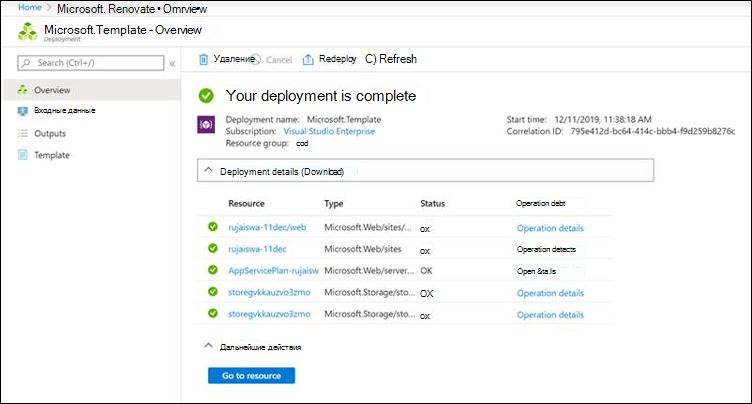

## Шаг 3: регистрация приложения FacebookStep 3: Register the Facebook app

1. Перейдите к <https://developers.facebook.com>, войдите в систему, используя учетные данные для учетной записи для бизнес-страниц Facebook вашей организации, а затем щелкните **Добавить новое приложение**.Go to <https://developers.facebook.com>, log in using the credentials for the account for your organization’s Facebook Business pages, and then click **Add New App**.

   

2. Создайте идентификатор нового приложения.Create a new app ID.

   

3. В левой области навигации щелкните **Добавить продукты** , а затем — **Настройка** на плитке **входа Facebook** .In the left navigation pane, click **Add Products** and then click **Set Up** in the **Facebook Login** tile.

   

4. На странице Интеграция входа в Facebook нажмите кнопку **веб**.On the Integrate Facebook Login page, click **Web**.

   

5. Добавьте URL-адрес службы приложений Azure; например `https://fbconnector.azurewebsites.net`:.Add the Azure app service URL; for example `https://fbconnector.azurewebsites.net`.

   

6. Заполните раздел Краткое руководство по настройке входа в Facebook.Complete the QuickStart section of the Facebook Login setup.

   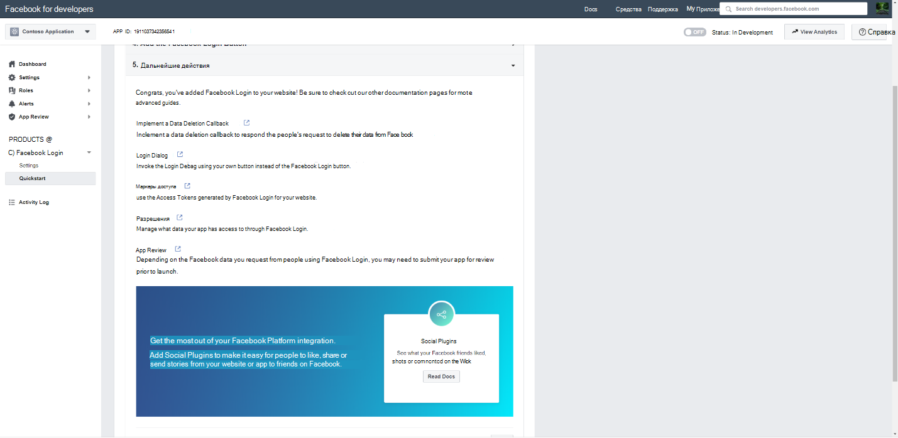

7. В левой области навигации в разделе **Login Facebook**щелкните **Параметры**, а затем добавьте URI перенаправления OAuth в поле **допустимые URI переадресации OAuth** .In the left navigation pane under **Facebook Login**, click **Settings**, and add the OAuth redirect URI in the **Valid OAuth Redirect URIs** box. Используйте формат \*\* \<коннекторсервицеури>/виевс/фацебукоаус\*\*, где значением коннекторсервицеури является URL-адрес службы приложений Azure для вашей организации; Пример: `https://fbconnector.azurewebsites.net`.Use the format **\<connectorserviceuri>/Views/FacebookOAuth**, where the value for connectorserviceuri is the Azure app service URL for your organization; for example, `https://fbconnector.azurewebsites.net`.

   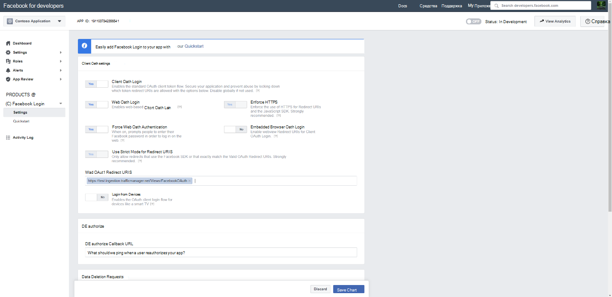

8. В левой области навигации щелкните **Добавить продукты** и выберите **веб-перехватчики.**In the left navigation pane, click **Add Products** and then click **Webhooks.** В раскрывающемся меню **Page (страница** ) выберите пункт **Page (страница**).In the **Page** pull-down menu, click **Page**. 

   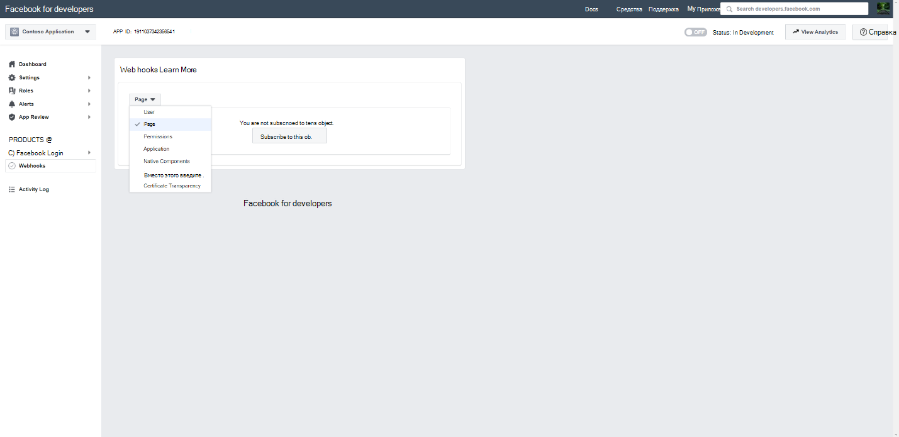

9. Добавьте URL-адрес обратного вызова для веб-перехватчиков и добавьте маркер проверки.Add Webhooks Callback URL and add a verify token. Формат URL-адреса обратного вызова, используйте формат \*\* <connectorserviceuri>/АПИ/фбпажевебхук\*\*, где значение параметра коннекторсервицеури — это URL-адрес службы приложений Azure для вашей организации; например `https://fbconnector.azurewebsites.net`:.The format of the callback URL, use the format **<connectorserviceuri>/api/FbPageWebhook**, where the value for connectorserviceuri is the Azure app service URL for your organization; for example `https://fbconnector.azurewebsites.net`. 

    Маркер проверки должен быть похож на надежный пароль.The verify token should similar to a strong password. Скопируйте токен проверки в текстовый файл или другое место хранения.Copy the verify token to a text file or other storage location.

        

10. Протестируйте и подпишитесь на конечную точку для веб-канала.Test and subscribe to the endpoint for feed.

    

11. Добавьте URL-адрес конфиденциальности, значок приложения и использование для бизнеса.Add a privacy URL, app icon, and business use. Кроме того, скопируйте идентификатор приложения и секрет приложения в текстовый файл или другое место хранения.Also, copy the app ID and app secret to a text file or other storage location.

    

12. Сделайте приложение общедоступным.Make the app public.

    

13. Добавьте пользователя к роли администратора или тестера.Add user to the admin or tester role.

    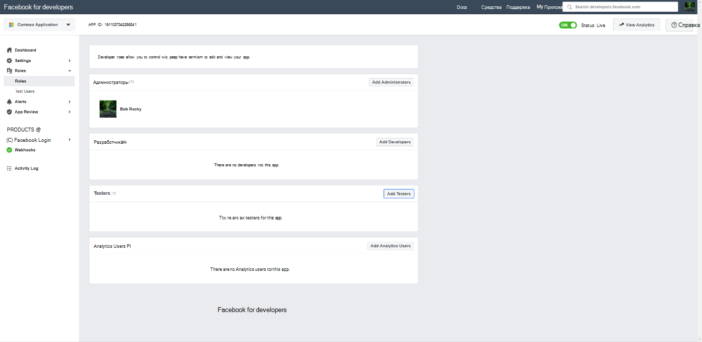

14. Добавьте разрешение на **доступ к общему содержимому страницы** .Add the **Page Public Content Access** permission.

    

15. Разрешение "добавить Управление страницами".Add Manage Pages permission.

    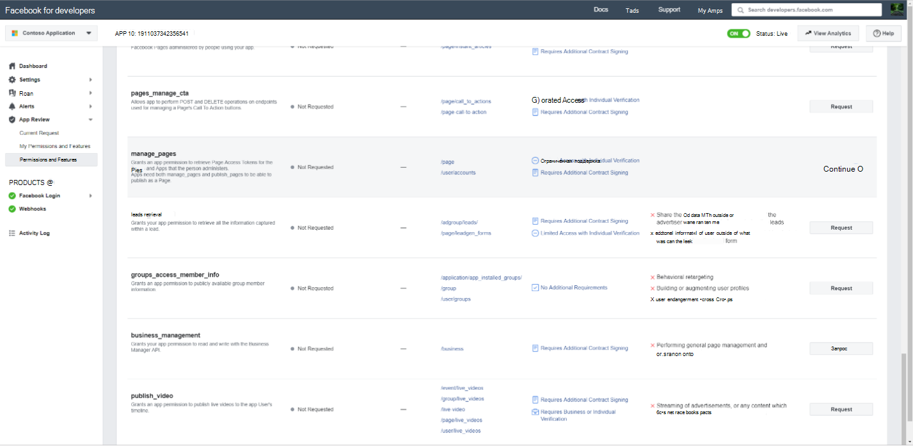

16. Получение приложения, проверенного Facebook.Get the application reviewed by Facebook.

    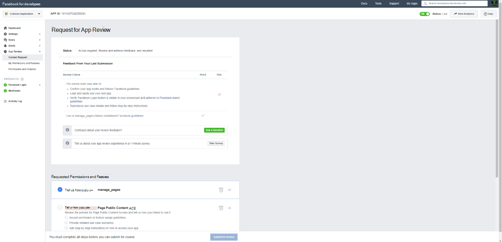

## Шаг 4: Настройка веб-приложения соединителяStep 4: Configure the connector web app

1. Перейдите в раздел\<https://азуреаппресаурценаме>. azurewebsites.NET (где азуреаппресаурценаме — имя ресурса приложения Azure, имя которого указано в шаге 4) например, если имя — **фбконнектор**, перейдите на `https://fbconnector.azurewebsites.net`страницу.Go to https://\<AzureAppResourceName>.azurewebsites.net (where AzureAppResourceName is the name of your Azure app resource that you named in Step 4) For example, if the name is **fbconnector**, go to `https://fbconnector.azurewebsites.net`. Домашняя страница приложения будет выглядеть, как на следующем снимке экрана:The home page of the app will look like the following screenshot:

   

2. Нажмите кнопку **настроить** , чтобы отобразить страницу входа.Click **Configure** to display a sign in page.
 
   

3. В поле Идентификатор клиента введите или вставьте идентификатор клиента (полученный на шаге 2).In the Tenant Id box, type or paste your tenant Id (that you obtained in Step 2). В поле Пароль введите или вставьте Аписекреткэй (полученное в действии 2), а затем нажмите кнопку **Настройка параметров конфигурации** , чтобы отобразить страницу сведений о конфигурации.In the password box, type or paste the APISecretKey (that you obtained in Step 2), and then click **Set Configuration Settings** to display the configuration details page.

    

4. Введите следующие параметры конфигурацииEnter the following configuration settings 

   - **Идентификатор приложения Facebook:** Идентификатор приложения для приложения Facebook, полученного на шаге 3.**Facebook application ID:** The app ID for the Facebook application that you obtained in Step 3.
   
   - **Секрет приложения Facebook:** Секрет приложения для приложения Facebook, полученного на шаге 3.**Facebook application secret:** The app secret for the Facebook application that you obtained in Step 3.
   
   - **Веб-перехватчики Facebook проверьте маркер:** Токен проверки, созданный на шаге 3.**Facebook webhooks verify token:** The verify token that you created in Step 3.
   
   - **Идентификатор приложения AAD:** Идентификатор приложения для приложения Azure Active Directory, созданного на шаге 1.**AAD application ID:** The application ID for the Azure Active Directory app that you created in Step 1.
   
   - **Секрет приложения AAD:** Значение секрета Аписекреткэй, созданного на шаге 1.**AAD application secret:** The value for the APISecretKey secret that you created in Step 1.

5. Нажмите кнопку **сохранить** , чтобы сохранить параметры соединителя.Click **Save** to save the connector settings.

## Шаг 5: Настройка соединителя Facebook в центре соответствия требованиям Microsoft 365Step 5: Set up a Facebook connector in the Microsoft 365 compliance center

1. В левой [https://compliance.microsoft.com](https://compliance.microsoft.com) панели навигации выберите элемент **соединители данных и нажмите кнопку соединители данных** .Go to [https://compliance.microsoft.com](https://compliance.microsoft.com) and then click **Data connectors** in the left nav.

2. На странице " **соединители данных (Предварительная версия)** " в разделе **Facebook Business Pages**нажмите кнопку **Просмотр**.On the **Data connectors (preview)** page under **Facebook Business pages**, click **View**.

3. На странице **Facebook Business Pages** (добавить соединитель) нажмите кнопку **Добавить соединитель**.On the **Facebook business pages** page, click **Add connector**.

4. На странице **условия обслуживания** нажмите кнопку **принять**.On the **Terms of service** page, click **Accept**.

5.  На странице " **Добавление учетных данных для приложения соединителя** " введите следующие сведения и нажмите кнопку **проверить подключение**.On the **Add credentials for your connector app** page, enter the following information and then click **Validate connection**.

    

    - В поле **имя** введите имя соединителя, например **Страница новостей Facebook**.In the **Name** box, type a name for the connector, such as **Facebook news page**.
    
    - В поле **URL-адрес подключения** введите или вставьте URL-адрес службы приложений Azure; например `https://fbconnector.azurewebsites.net`:.In the **Connection URL** box, type or paste the Azure app service URL; for example `https://fbconnector.azurewebsites.net`.
    
    - В поле **пароль** введите или вставьте значение аписекреткэй, добавленное на шаге 2.In the **Password** box, type or paste the value of the APISecretKey that you added in Step 2.
    
    - В поле **идентификатор приложения Azure** введите или вставьте значение идентификатора приложения (клиента), который также называется идентификатором приложения AAD, созданным на шаге 1.In the **Azure App ID** box, type or paste the value of the Application (client) ID also called as AAD Application ID that you created in Step 1.
 
6. После успешной проверки подключения нажмите кнопку **Далее**.After the connection is successfully validated, click **Next**.

7. На странице **авторизовать Microsoft 365 to Import Data (разрешить Microsoft** ) введите или вставьте аписекреткэй еще раз, а затем нажмите кнопку **Login Web App**.On the **Authorize Microsoft 365 to import data** page, type or paste the APISecretKey again and then click **Login web app**.

8. На странице " **Настройка приложения соединителя Facebook Connector** " щелкните **Вход с Facebook** и войдите в систему, используя учетные данные для учетной записи для бизнес-страниц Facebook Организации.On the **Configure Facebook connector app** page, click **Login with Facebook** and log in using the credentials for the account for your organization's Facebook Business pages. Убедитесь, что учетной записи Facebook, в которую вы вошли в систему, назначена роль администратора для бизнес-страниц Facebook вашей организации.Make sure the Facebook account that you logged in to is assigned the admin role for your organization's Facebook Business pages.

   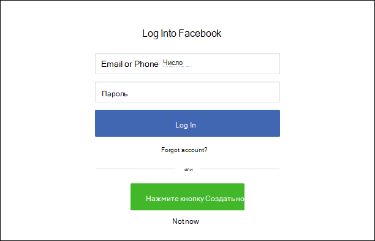

9. Отображается список бизнес-страниц, управляемых учетной записью Facebook, в которой выполнен вход.A list of the business pages managed by the Facebook account that you logged in to is displayed. Выберите страницу для архивации и нажмите кнопку **Далее**.Select the page to archive and then click **Next**.

    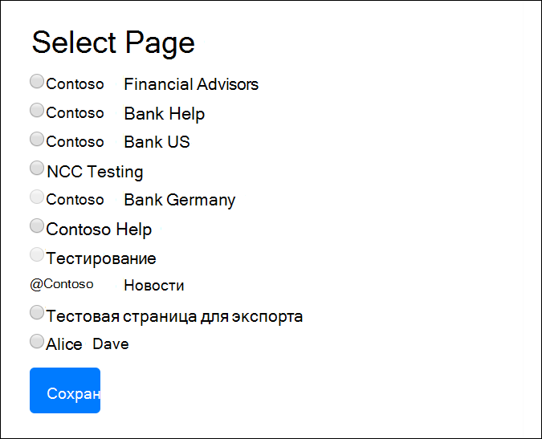

10. Нажмите кнопку **продолжить** , чтобы выйти из программы установки приложения службы соединителя.Click **Continue** to exit the setup of the connector service app.

11. На странице " **Настройка фильтров** " можно применить фильтр для начального импорта элементов с определенным сроком хранения.On the **Set filters** page, you can apply a filter to initially import items that are a certain age. Выберите возраст, а затем нажмите кнопку **Далее**.Select an age, and then click **Next**.

12. На странице **Выбор места хранения** введите адрес электронной почты почтового ящика Microsoft 365, в который будут импортированы элементы Facebook, а затем нажмите кнопку **Далее**.On the **Choose storage location** page, type the email address of Microsoft 365 mailbox that the Facebook items will be imported to, and then click **Next**.

13. На странице **предоставление разрешений администратора**щелкните **предоставить согласие** и следуйте инструкциям.On the **Provide admin consent**, click **Provide consent** and then follow the steps. Вы должны быть глобальным администратором, чтобы предоставить разрешение службе импорта Office 365 для доступа к данным в Организации.You must be a global admin to provide consent for the Office 365 Import service to access data in your organization.

14. Нажмите кнопку **Далее** , чтобы проверить параметры соединителя, а затем нажмите кнопку **Готово** , чтобы завершить настройку соединителя.Click **Next** to review the connector settings and then click **Finish** to complete the connector setup.

15. В центре соответствия требованиям откройте страницу " **соединители данных** " и перейдите на вкладку **соединители** , чтобы просмотреть ход процесса импорта.In the compliance center, go to the **Data connectors** page, and click the **Connectors** tab to see the progress of the import process.
