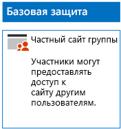
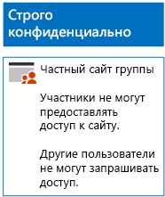

# Развертывание сайтов SharePoint Online с тремя уровнями защитыDeploy SharePoint Online sites for three tiers of protection

В этой статье приводятся инструкции по разработке и развертыванию сайтов групп SharePoint Online с базовым, конфиденциальным и строго конфиденциальным уровнями защиты. Дополнительные сведения об этих трех уровнях защиты см. в статье [Secure SharePoint Online sites and files](../security/office-365-security/secure-sharepoint-online-sites-and-files.md) (Защита сайтов и файлов SharePoint Online).Use the steps in this article to design and deploy baseline, sensitive, and highly confidential SharePoint Online team sites. For more information about these three tiers of protection, see [Secure SharePoint Online sites and files](../security/office-365-security/secure-sharepoint-online-sites-and-files.md).
  
## Сайты групп SharePoint Online с базовым уровнем защитыBaseline SharePoint Online team sites

Базовый уровень защиты распространяется на частные и общедоступные сайты групп. Обнаруживать общедоступные сайты групп и получать к ним доступ может любой пользователь в организации. Обнаруживать частные сайты и получать к ним доступ могут только участники группы Microsoft 365, связанной с сайтом группы. Оба этих типа сайтов групп позволяют участникам предоставлять доступ к сайту другим пользователям.Baseline protection includes both public and private team sites. Public team sites can be discovered and accessed by anybody in the organization. Private sites can only be discovered and accessed by members of the Microsoft 365 group associated with the team site. Both of these types of team sites allow members to share the site with others.
  
### ОткрытыйPublic

Чтобы создать сайт группы SharePoint Online с базовым уровнем защиты и общим доступом и разрешениями, выполните [эти инструкции](https://support.office.com/article/create-a-team-site-in-sharepoint-ef10c1e7-15f3-42a3-98aa-b5972711777d).To create a baseline SharePoint Online team site with public access and permissions, follow [these instructions](https://support.office.com/article/create-a-team-site-in-sharepoint-ef10c1e7-15f3-42a3-98aa-b5972711777d).

Ниже показана итоговая конфигурация.Here is your resulting configuration.
  

  
### Личные сведенияPrivate

Чтобы создать сайт группы SharePoint Online с базовым уровнем защиты, закрытым доступом и разрешениями, выполните [эти инструкции](https://support.office.com/article/create-a-team-site-in-sharepoint-ef10c1e7-15f3-42a3-98aa-b5972711777d).To create a baseline SharePoint Online team site with private access and permissions, follow [these instructions](https://support.office.com/article/create-a-team-site-in-sharepoint-ef10c1e7-15f3-42a3-98aa-b5972711777d).
  
Ниже показана итоговая конфигурация.Here is your resulting configuration.
  

  
## Конфиденциальные сайты группы SharePoint OnlineSensitive SharePoint Online team sites

Создание конфиденциального сайта группы SharePoint Online начинается с закрытого сайта группы.A sensitive SharePoint Online team site starts as a private team site.
  
Сначала создайте закрытый сайт группы SharePoint Online, следуя [этим инструкциям](https://support.office.com/article/create-a-team-site-in-sharepoint-ef10c1e7-15f3-42a3-98aa-b5972711777d).First, create the private SharePoint Online team site with [these instructions](https://support.office.com/article/create-a-team-site-in-sharepoint-ef10c1e7-15f3-42a3-98aa-b5972711777d).

С помощью действий, приведенных ниже, настройте дополнительные параметры разрешений на новом сайте группы SharePoint Online.Next, from the new SharePoint Online team site, configure additional permission settings with these steps.

1.  На панели инструментов сайта группы SharePoint щелкните значок параметров и выберите вариант **Разрешения для сайта**.In the tool bar of the SharePoint team site, click the settings icon, and then click **Site permissions**.
2.  В области **Разрешения для сайта** в разделе **Параметры общего доступа** щелкните **Изменить параметры общего доступа**.In the **Site permissions** pane, under **Sharing Settings**, click **Change sharing settings**.
3.  В разделе **Разрешения на предоставление общего доступа** выберите **Только владельцы сайта могут делиться файлами, папками и сайтом** и щелкните **Сохранить**.Under **Sharing permissions**, choose **Only site owners can share files, folders, and the site**, and then click **Save**.

Ознакомьтесь с результатами настройки разрешений.The results of these permission settings are:

- Для участников отключена возможность предоставления общего доступа другим участникам.The ability for members to share with other members is disabled.
- Для пользователей, не входящих в группу, включена возможность запроса доступа.The ability for non-members to request access is enabled.

Ниже показана полученная в итоге конфигурация.Here is your resulting configuration.
  

  
Благодаря членству в одной из групп доступа участники сайта теперь могут безопасно работать с ресурсами сайта.The members of the site, through group membership in one of the access groups, can now securely collaborate on the resources of the site.
  
## Сайты групп SharePoint Online со строго конфиденциальным уровнем защитыHighly confidential SharePoint Online team sites

Сайт группы SharePoint Online со строго конфиденциальным уровнем защиты — это закрытый сайт группы с дополнительными параметрами разрешений.A highly confidential SharePoint Online team site is a private team site with additional permissions settings.

Сначала создайте закрытый сайт группы SharePoint Online, следуя [этим инструкциям](https://support.office.com/article/create-a-team-site-in-sharepoint-ef10c1e7-15f3-42a3-98aa-b5972711777d).First, create the private SharePoint Online team site with [these instructions](https://support.office.com/article/create-a-team-site-in-sharepoint-ef10c1e7-15f3-42a3-98aa-b5972711777d).

С помощью действий, приведенных ниже, настройте дополнительные параметры разрешений на новом сайте группы SharePoint Online.Next, from the new SharePoint Online team site, configure additional permission settings with these steps.

1.  На панели инструментов сайта группы SharePoint щелкните значок параметров и выберите вариант **Разрешения для сайта**.In the tool bar of the SharePoint team site, click the settings icon, and then click **Site permissions**.
2.  В области **Разрешения для сайта** в разделе **Параметры общего доступа** щелкните **Изменить параметры общего доступа**.In the **Site permissions** pane, under **Sharing Settings**, click **Change sharing settings**.
3.  В разделе **Разрешения на предоставление общего доступа** установите флажок **Только владельцы сайта могут делиться файлами, папками и сайтом**.Under **Sharing permissions**, choose **Only site owners can share files, folders, and the site**.
4. Отключите параметр **Разрешить запросы на доступ** и нажмите кнопку **Сохранить**.Turn off **Allow access requests**, and then click **Save**.

Ознакомьтесь с результатами настройки разрешений.The results of these permission settings are:

- Для участников отключена возможность предоставления общего доступа другим участникам.The ability for members to share with other members is disabled.
- Для пользователей, не являющихся участниками, отключена возможность запроса доступа.The ability for non-members to request access is disabled.

Ниже показана полученная в итоге конфигурация.Here is your resulting configuration.
  

  
Благодаря членству в одной из групп доступа участники сайта теперь могут безопасно работать с ресурсами сайта.The members of the site, through group membership in one of the access groups, can now securely collaborate on the resources of the site.
  
## Следующий шагNext step

[Защита файлов SharePoint Online с помощью меток и DLPProtect SharePoint Online files with labels and DLP](protect-sharepoint-online-files-with-office-365-labels-and-dlp.md)

## См. такжеSee also

[Руководство по безопасности (Майкрософт) для политических кампаний, некоммерческих и других динамических организацийMicrosoft Security Guidance for Political Campaigns, Nonprofits, and Other Agile Organizations](../security/office-365-security/microsoft-security-guidance-for-political-campaigns-nonprofits-and-other-agile-o.md)
  
[Освоение облака и гибридные решенияCloud adoption and hybrid solutions](https://docs.microsoft.com/office365/enterprise/cloud-adoption-and-hybrid-solutions)
