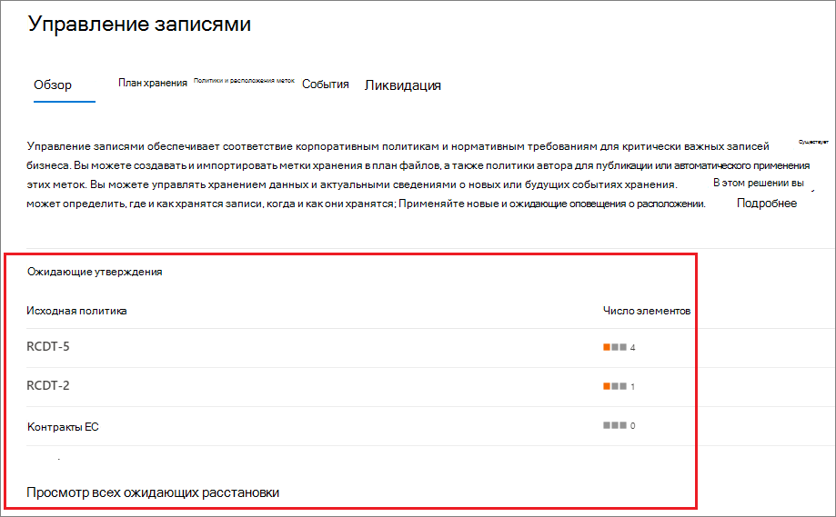
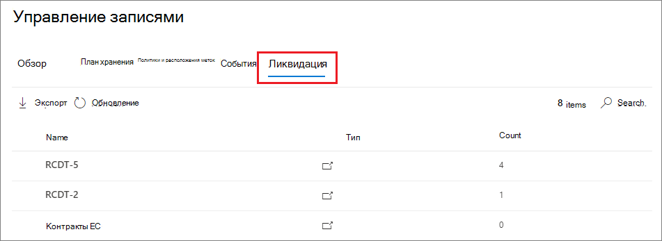
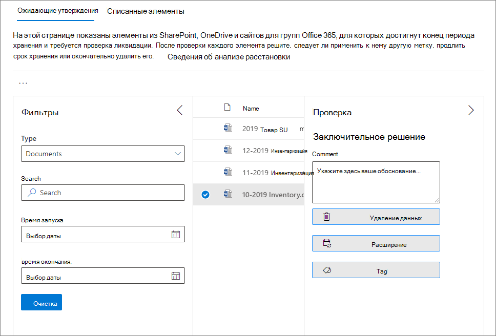
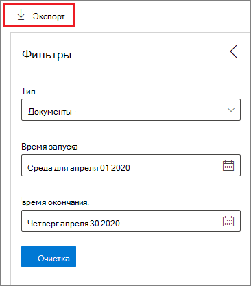
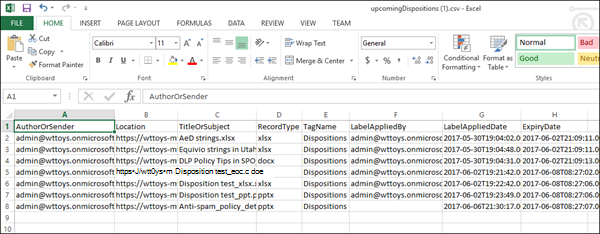

# Расстановка контентаDisposition of content

>*[Руководство по лицензированию Microsoft 365 для обеспечения безопасности и соответствия требованиям](https://aka.ms/ComplianceSD).**[Microsoft 365 licensing guidance for security & compliance](https://aka.ms/ComplianceSD).*

Используйте вкладку " **положение** " из списка " **Управление записями** " в центре соответствия требованиям Microsoft 365 для управления проверками расстановки и просмотра [записей](records.md) , которые были автоматически удалены в конце срока хранения.Use the **Disposition** tab from **Records Management** in the Microsoft 365 compliance center to manage disposition reviews and view [records](records.md) that have been automatically deleted at the end of their retention period. 

## Необходимые условия для просмотра расстановки содержимогоPrerequisites for viewing content dispositions

Для управления обзорами ликвидации и подтверждения того, что записи удалены, необходимо иметь достаточные разрешения, и аудит должен быть включен.To manage disposition reviews and confirm that records have been deleted, you must have sufficient permissions and auditing must be enabled.

### Разрешения для ликвидацииPermissions for disposition

Для успешного доступа к вкладке " **положение** " в центре соответствия требованиям Microsoft 365 необходимо быть участником роли **управления ликвидацией** и ролью " **журналы аудита только для просмотра** ".To successfully access the **Disposition** tab in the Microsoft 365 compliance center, you must be members of the **Disposition Management** role and the **View-Only Audit Logs** role. Мы рекомендуем создать новую группу ролей с именем **проверяющих**и добавить эти две роли в эту группу ролей.We recommend creating a new role group called **Disposition Reviewers**, and add these two roles to that role group. 

Относится только к роли **журналов аудита только для просмотра** :Specific to the **View-Only Audit Logs** role:

- Так как базовый командлет, используемый для поиска в журнале аудита, является командлетом Exchange Online, ему необходимо назначить эту роль с помощью [центра администрирования Exchange в Exchange Online](https://docs.microsoft.com/Exchange/exchange-admin-center), а не с помощью страницы **разрешений** в центре безопасности & соответствия требованиям.Because the underlying cmdlet used to search the audit log is an Exchange Online cmdlet, you must assign users this role by using the [Exchange admin center in Exchange Online](https://docs.microsoft.com/Exchange/exchange-admin-center), rather than by using the **Permissions** page in the Security & Compliance Center. Инструкции см в разделе [Управление группами ролей в Exchange Online](https://docs.microsoft.com/Exchange/permissions-exo/role-groups).For instructions, see [Manage role groups in Exchange Online](https://docs.microsoft.com/Exchange/permissions-exo/role-groups).

- Группы Microsoft 365 ([ранее группы Office 365](https://techcommunity.microsoft.com/t5/microsoft-365-blog/office-365-groups-will-become-microsoft-365-groups/ba-p/1303601)) не поддерживаются для этой роли.Microsoft 365 Groups ([formerly Office 365 Groups](https://techcommunity.microsoft.com/t5/microsoft-365-blog/office-365-groups-will-become-microsoft-365-groups/ba-p/1303601)) aren't supported for this role. Вместо этого назначьте почтовые ящики пользователей, почтовые пользователи или группы безопасности с включенной поддержкой почты.Instead, assign user mailboxes, mail users, or mail-enabled security groups.

Инструкции по предоставлению пользователям роли **управления ликвидацией** и созданию новой роли **проверяющих проверяющих** можно узнать в статье [предоставление пользователям доступа к центру безопасности &amp; и соответствия требованиям Office 365](../security/office-365-security/grant-access-to-the-security-and-compliance-center.md).For instructions to grant users the **Disposition Management** role and create your new **Disposition Reviewers** role, see [Give users access to the Office 365 Security &amp; Compliance Center](../security/office-365-security/grant-access-to-the-security-and-compliance-center.md).

### Включение аудитаEnable auditing

Убедитесь, что аудит включен по крайней мере один день перед первым действием ликвидации.Make sure that auditing is enabled at least one day before the first disposition action. Дополнительные сведения можно найти в статье [Поиск в журнале аудита в центре безопасности &amp; и соответствия требованиям Office 365](search-the-audit-log-in-security-and-compliance.md).For more information, see [Search the audit log in the Office 365 Security &amp; Compliance Center](search-the-audit-log-in-security-and-compliance.md). 

## Проверки перед ликвидациейDisposition reviews

Когда содержимое достигает окончания срока хранения, существует несколько причин, по которым может потребоваться проверить, можно ли его удалить ("удалено").When content reaches the end of its retention period, there are several reasons why you might want to review that content to decide whether it can be safely deleted ("disposed"). Например, может потребоваться выполнить следующие действия:For example, you might need to:
  
- Приостановить удаление релевантного контента в случае судебного разбирательства или аудита.Suspend the deletion of relevant content in the event of litigation or an audit.
    
- Удаление контента из списка расстановки для хранения в архиве, если это содержимое содержит исследование или историческое значение.Remove content from the disposition list to store in an archive, if that content has research or historical value.
    
- Назначьте другой срок хранения содержимому, возможно, из-за того, что первоначальные параметры хранения были временными или предварительными решениями.Assign a different retention period to the content, perhaps because the original retention settings were a temporary or provisional solution.
    
- Возврат контента клиентам или их передача в другую организацию.Return the content to clients or transfer it to another organization.

Когда проверка ликвидации инициируется в конце периода хранения:When a disposition review is triggered at the end of the retention period:
  
- Выбранные пользователи получат уведомление по электронной почте о том, что у них есть контент для просмотра.The people you choose receive an email notification that they have content to review. Этими рецензентами могут быть отдельные пользователи, группы рассылки или группы безопасности или группы Office 365.These reviewers can be individual users, distribution or security groups, or Office 365 groups. Обратите внимание, что уведомления отправляются еженедельно.Note that notifications are sent on a weekly basis.
    
- Рецензенты отправляются на вкладку " **положение** " в центре соответствия требованиям Microsoft 365, чтобы проверить содержимое и решить, следует ли окончательно удалить его, продлить срок хранения или применить другую метку хранения.The reviewers go to the **Disposition** tab in the Microsoft 365 compliance center to review the content and decide whether to permanently delete it, extend its retention period, or apply a different retention label.

Обзор ликвидации может включать контент в почтовые ящики Exchange, сайты SharePoint, учетные записи OneDrive и группы Microsoft 365.A disposition review can include content in Exchange mailboxes, SharePoint sites, OneDrive accounts, and Microsoft 365 groups. Содержимое, ожидающее проверки ликвидации в этих расположениях, удаляется только после того, как рецензент выберет окончательное удаление контента.Content awaiting a disposition review in those locations is deleted only after a reviewer chooses to permanently delete the content.

Обзор всех ожидающих расстановки можно просмотреть на вкладке **Обзор** . Например:You can see an overview of all pending dispositions in the **Overview** tab. For example:

Когда вы выбираете **Просмотр всех ожидающих расстановки**, вы перейдете на страницу " **положение** ".When you select the **View all pending dispositions**, you're taken to the **Disposition** page. Пример:For example:

### Рабочий процесс для проверки ликвидацииWorkflow for a disposition review

Это базовый рабочий процесс для проверки ликвидации, когда подпись хранения публикуется и затем вручную применяется пользователем.This is the basic workflow for a disposition review when a retention label is published and then manually applied by a user. Кроме того, метка хранения, настроенная для проверки ликвидации, может быть автоматически применена к содержимому.Alternatively, a retention label configured for a disposition review can be auto-applied to content.
  

  
Включение проверки ликвидации в конце периода хранения — это параметр конфигурации, доступный только с [меткой хранения](labels.md).Triggering a disposition review at the end of the retention period is a configuration option that's available only with a [retention label](labels.md). Этот параметр недоступен в политике хранения.This option is not available in a retention policy.
  

 
> [!NOTE]
> При выборе параметра **уведомлять этих пользователей о наличии элементов, готовых к просмотру**, укажите пользователя или группу безопасности с включенной поддержкой почты.When you select the option **Notify these people when there are items ready to review**, specify a user or mail-enabled security group. Группы Microsoft 365 ([ранее группы Office 365](https://techcommunity.microsoft.com/t5/microsoft-365-blog/office-365-groups-will-become-microsoft-365-groups/ba-p/1303601)) не поддерживаются этим параметром.Microsoft 365 groups ([formerly Office 365 groups](https://techcommunity.microsoft.com/t5/microsoft-365-blog/office-365-groups-will-become-microsoft-365-groups/ba-p/1303601)) are not supported for this option.

### Просмотр и удаление контентаViewing and disposing of content

Когда проверяющий получает уведомление по электронной почте о том, что контент готов к просмотру, он переходит на вкладку " **положение** " в разделе **Управление записями** в центре соответствия требованиям Microsoft 365.When a reviewer is notified by email that content is ready to review, they go to the **Disposition** tab from **Records Management** in the Microsoft 365 compliance center. Проверяющие могут видеть, сколько элементов для каждой метки хранения ожидают расстановки, а затем выберите метку хранения, чтобы просмотреть все содержимое с этой меткой.The reviewers can see how many items for each retention label are awaiting disposition, and then select a retention label to see all content with that label.

После выбора метки хранения вы увидите все ожидающие утверждения для этой метки на вкладке **Отложенное расположение** . Выберите один или несколько элементов, в которых можно выбрать действие и ввести комментарий по обоснования:After you select a retention label, you then see all pending dispositions for that label from the **Pending disposition** tab. Select one or more items where you can then choose an action and enter a justification comment:

Как видно на рисунке, поддерживаемые действия:As you can see from the picture, the actions supported are: 
  
- Окончательное удаление элементаPermanently delete the item
- Продление срока храненияExtend the retention period
- Применение другой метки храненияApply a different retention label

Если у вас есть разрешения на доступ к расположению и содержимому, вы можете использовать ссылку в столбце " **Расположение** ", чтобы просматривать документы в их исходном расположении.Providing you have permissions to the location and the content, you can use the link in the **Location** column to view documents in their original location. Во время проверки ликвидации содержимое никогда не перемещается из исходного расположения и никогда не удаляется до тех пор, пока проверяющий не решит это.During a disposition review, the content never moves from its original location, and it's never deleted until the reviewer chooses to do so.
  
Уведомления по электронной почте автоматически отправляются рецензентам по неделям.The email notifications are sent automatically to reviewers on a weekly basis. Этот запланированный процесс означает, что когда содержимое достигает окончания срока хранения, рецензентам может потребоваться до семи дней, чтобы рецензенты получали уведомление о том, что содержимое ожидает расстановки.This scheduled process means that when content reaches the end of its retention period, it might take up to seven days for reviewers to receive the email notification that content is awaiting disposition.
  
Все действия ликвидации можно подвергать аудиту.All disposition actions can be audited.
  
### Время до окончательного удаления ликвидации контентаHow long until disposed content is permanently deleted

Контент, ожидающий проверки ликвидации, удаляется только после того, как рецензент выберет окончательное удаление контента.Content awaiting a disposition review is deleted only after a reviewer chooses to permanently delete the content. Когда проверяющий выбирает этот параметр, контент на сайте SharePoint или в учетной записи OneDrive становится доступным для стандартного процесса очистки, описанного в разделе [как политика хранения работает с контентом на месте](retention-policies.md#how-a-retention-policy-works-with-content-in-place).When the reviewer chooses this option, the content in the SharePoint site or OneDrive account becomes eligible for the standard cleanup process described in [How a retention policy works with content in place](retention-policies.md#how-a-retention-policy-works-with-content-in-place).

## Расстановка записейDisposition of records

> [!NOTE]
> Возможность просматривать записи, которые были автоматически удалены без проверки ликвидации, постепенно превышена до клиентов в течение апреля и мая 2020, поэтому вы можете не видеть этот интерфейс немедленно.The ability to see records that were automatically deleted without a disposition review is gradually rolling out to tenants during April and May 2020, so you might not see this experience immediately.

Используйте вкладку " **расстановка** " на странице " **Управление записями** ", чтобы определить записи, которые автоматически удаляются.Use the **Disposition** tab from the **Records Management** page to identify records that are automatically deleted. Эти элементы отображают **записи** , которые удалены в столбце **тип** .These items display **Records Disposed** in the **Type** column. Пример:For example:

Элементы, отображаемые на вкладке **выгруженных элементов** для меток записи, хранятся в течение 7 лет после удаления элемента с предельным числом 1 000 000 элементов на запись для этого периода.Items that are shown in the **Disposed Items** tab for record labels are kept for up to 7 years after the item was disposed, with a limit of one million items per record for that period. Если вы **видите число, близкое к этому** ограничению 1 000 000, и вам требуется подтверждение расстановки записей, обратитесь в [службу поддержки Майкрософт](https://docs.microsoft.com/office365/admin/contact-support-for-business-products).If you see the **Count** number nearing this limit of one million, and you need proof of disposition for your records, contact [Microsoft Support](https://docs.microsoft.com/office365/admin/contact-support-for-business-products).

> [!NOTE]
> Эта функция основана на сведениях из [единого журнала аудита](search-the-audit-log-in-security-and-compliance.md) и, следовательно, требует [включения и поиска](turn-audit-log-search-on-or-off.md) соответствующих событий.This functionality is based on information from the [unified audit log](search-the-audit-log-in-security-and-compliance.md) and therefore requires auditing to be [enabled and searchable](turn-audit-log-search-on-or-off.md) so the corresponding events are captured.
    
## Фильтрация и экспорт представленийFilter and export the views

При выборе метки хранения на странице **размещения** , вкладка **ожидающее расположение** (если это возможно) и вкладка **Удаленные элементы** позволяют фильтровать представления для упрощения поиска элементов.When you select a retention label from the **Disposition** page, the **Pending disposition** tab (if applicable) and the **Disposed items** tab let you filter the views to help you more easily find items. 

Для ожидающих расстановки диапазон времени зависит от даты истечения срока действия.For pending dispositions, the time range is based on the expiration date. Для списанных элементов диапазон времени зависит от даты удаления.For disposed items, the time range is based on the deletion date.
  
Вы можете экспортировать информацию о элементах в любом представлении в виде CSV-файла, который можно сортировать и управлять с помощью Excel:You can export information about the items in either view as a .csv file that you can then sort and manage using Excel:

  

