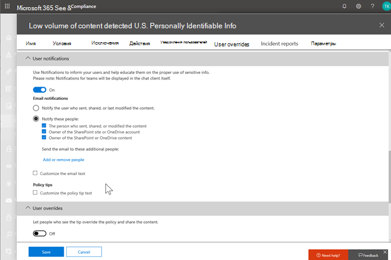
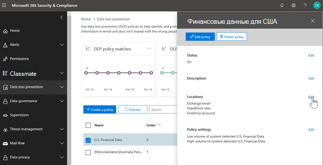
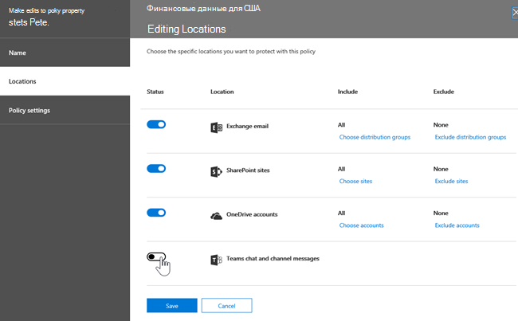
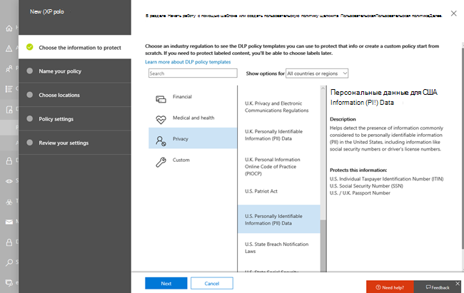
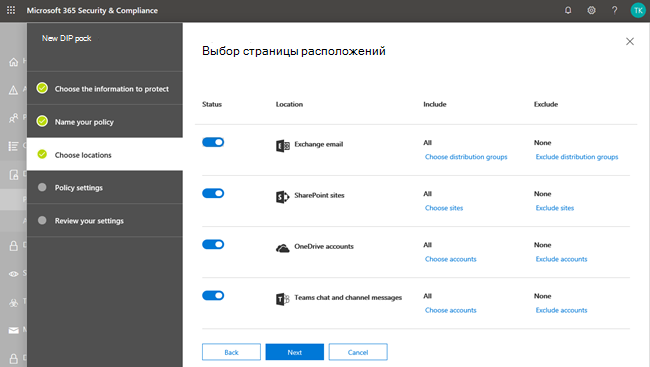
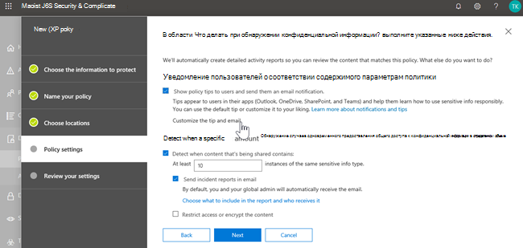
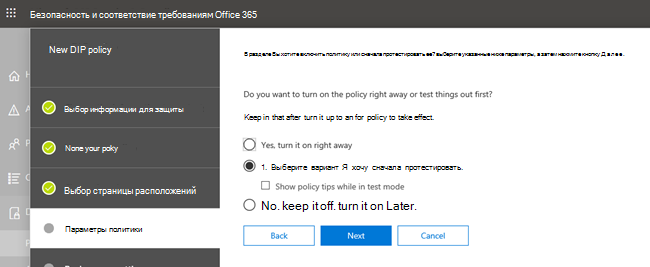

# Защита от потери данных и Microsoft Teams

> [!NOTE]
> Функции защиты от потери данных были недавно добавлены в сообщения чата и каналов Microsoft Teams для пользователей с лицензиями на продукт Office 365 Advanced Compliance, который доступен в качестве отдельной функции и включен в планы Office 365 E5 и "Соответствие требованиям Microsoft 365 E5". Office 365 и Microsoft 365 E3 включают защиту от потери данных для SharePoint Online, OneDrive и Exchange Online. Сюда также входят файлы, которые совместно используются в Teams, так как teams использует SharePoint Online и OneDrive для предоставления общего доступа к файлам.
Для поддержки защиты от потери данных в Microsoft Teams требуется переговаривать.
Дополнительные сведения о требованиях к лицензированию см. в статье [Рекомендации по лицензированию служб на уровне клиента Microsoft 365](https://docs.microsoft.com/office365/servicedescriptions/microsoft-365-service-descriptions/microsoft-365-tenantlevel-services-licensing-guidance).

## Общие сведения о защите от потери данных для Microsoft Teams

Недавно возможности [защиты от потери данных](data-loss-prevention-policies.md) (DLP) были расширены для включения бесед Microsoft Teams и сообщений канала, **включая сообщения частного канала**.

Если в вашей организации используется DLP, можно определить политики, которые не позволяют пользователям обмениваться конфиденциальной информацией в канале Microsoft Teams или сеансе чата. Ниже приведено несколько примеров работы этой защиты:

- **Пример 1: Защита конфиденциальной информации в сообщениях**. Предположим, что кто-то пытается поделиться конфиденциальной информацией в чате или канале с гостями (внешние пользователи). Если у вас есть политика защиты от потери данных, то сообщения с конфиденциальными сведениями, отправляемыми внешним пользователям, удаляются. Это происходит автоматически и в течение секунд в соответствии с настройками политики защиты от потери данных.

    > [!NOTE]
    > DLP для Microsoft Teams блокирует конфиденциальное содержимое при совместной работе с пользователями Microsoft Teams, имеющими: - [гостевой доступ](https://docs.microsoft.com/MicrosoftTeams/guest-access) в Teams и каналах; также - [внешний доступ к](https://docs.microsoft.com/MicrosoftTeams/manage-external-access) собраниям и сеансам чата. 
Защита от потери данных для внешних сеансов чата будет работать, только если отправитель и получатель находятся в режиме "только Teams" и используют [собственную федерацию Microsoft Teams](https://docs.microsoft.com/microsoftteams/manage-external-access). DLP для Teams не блокирует сообщения в [взаимодействии](https://docs.microsoft.com/microsoftteams/teams-and-skypeforbusiness-coexistence-and-interoperability#interoperability-of-teams-and-skype-for-business) со Skype для бизнеса или несобственным сеансом федеративного чата.

- **Пример 2: Защита конфиденциальной информации в документах**. Предположим, что кто-то пытается поделиться документом с гостями в канале или чате Microsoft Teams, и документ содержит конфиденциальную информацию. Если у вас есть политика защиты от потери данных, этот документ не будет открыт для этих пользователей. Обратите внимание, что в этом случае политика защиты от потери данных должна включать SharePoint и OneDrive, чтобы защититься от использования. (Это пример защиты от потери данных для SharePoint, который показывается в Microsoft Teams и поэтому требует, чтобы пользователи были лицензированы для Office 365 DLP (входит в состав Office 365 E3), но не требуют, чтобы пользователи были лицензированы для Office 365 Advanced соответствие.)

## Подсказки политики помогают обучать пользователям

Аналогично работе защиты от потери данных в [Exchange, Outlook, Outlook в Интернете, на](data-loss-prevention-policies.md#policy-evaluation-in-exchange-online-outlook-and-outlook-on-the-web) [сайтах SharePoint Online, OneDrive для бизнеса](data-loss-prevention-policies.md#policy-evaluation-in-onedrive-for-business-and-sharepoint-online-sites)и [настольных клиентах Office](data-loss-prevention-policies.md#policy-evaluation-in-the-office-desktop-programs), подсказки политики появляются, когда действие конфликтует с политикой защиты от потери данных. Ниже приведен пример подсказки политики:

В этом случае отправитель попытался поделиться номером социального страхования в канале Microsoft Teams. Ссылка **что можно сделать?** открывает диалоговое окно, в котором представлены параметры, позволяющие отправителю решить проблему. Обратите внимание, что в этом случае отправитель может переопределить политику или уведомить администратора о необходимости просмотреть и устранить ее.

В Организации можно разрешить пользователям переопределять политику защиты от потери данных. При настройке политик защиты от потери данных можно использовать подсказки политики по умолчанию или [настроить подсказки политики](#to-customize-policy-tips) для Организации.

В нашем примере показано, где отправитель предоставил номер социального страхования в канале teams:

Ссылка **что это такое?** открывает [статью](data-loss-prevention-policies.md) о политиках защиты от потери данных, которая поможет объяснить причину блокировки сообщения.

### Настройка подсказок политики

Для выполнения этой задачи необходимо назначить роль с разрешениями на изменение политик защиты от потери данных. Дополнительные сведения см. в статье [Разрешения](data-loss-prevention-policies.md#permissions).

1. Перейдите в центр безопасности & соответствия требованиям ( [https://protection.office.com](https://protection.office.com) ) и войдите в систему.

2. Выберите **Политика защиты от потери данных**  >  **Policy**.

3. Выберите политику и нажмите кнопку **изменить**рядом с пунктом **Параметры политики**.

4. Либо создайте новое правило, либо измените существующее правило для этой политики.  

5. На вкладке **уведомления пользователей** выберите **Настройка текста электронной почты** и/или Настройка параметров **текста подсказки политики** .    

6. Укажите текст, который будет использоваться для уведомлений электронной почты и/или подсказок политики, а затем нажмите кнопку **сохранить**.

7. На вкладке **Параметры политики** нажмите кнопку **сохранить**.

Разрешите примерно один час, чтобы изменения работали через центр обработки данных и выполняли синхронизацию с учетными записями пользователей.
 <!-- why are these syncing to user accounts? -->
## Добавление Microsoft Teams в качестве местоположения к существующим политикам защиты от потери данных

Для выполнения этой задачи необходимо назначить роль с разрешениями на изменение политик защиты от потери данных. Дополнительные сведения см. в статье [Разрешения](data-loss-prevention-policies.md#permissions).

1. Перейдите в центр безопасности & соответствия требованиям ( [https://protection.office.com](https://protection.office.com) ) и войдите в систему.

2. Выберите **Политика защиты от потери данных**  >  **Policy**.

3. Выберите политику и посмотрите значения в разделе **Locations (расположения**). Если вы видите **сообщения группы "беседы и канал**", все готово. В противном случае нажмите кнопку **изменить**.  

4. В столбце **состояние** включите политику для **бесед в Teams и сообщений о каналах**.  

5. Оставьте параметры по умолчанию для всех учетных записей или укажите учетные записи, которые необходимо включить или исключить.

6. Нажмите кнопку **Сохранить**.

Разрешите примерно один час, чтобы изменения работали через центр обработки данных и выполняли синхронизацию с учетными записями пользователей.
<!-- again, why user accounts? -->
## Определение новой политики защиты от потери данных для Microsoft Teams

Для выполнения этой задачи необходимо назначить роль с разрешениями на изменение политик защиты от потери данных. Дополнительные сведения см. в статье [Разрешения](data-loss-prevention-policies.md#permissions).

1. Перейдите в центр безопасности & соответствия требованиям ( [https://protection.office.com](https://protection.office.com) ) и войдите в систему.

2. Выберите **Политика защиты от потери данных**  >  **Policy**  >  **и создайте политику**.

3. Выберите [шаблон](data-loss-prevention-policies.md#dlp-policy-templates), а затем нажмите кнопку **Далее**. В нашем примере мы выбрали шаблон данных личных сведений США.  

4. На вкладке **назвать политику** укажите имя и описание политики, а затем нажмите кнопку **Далее**.

5. На вкладке **Выбор расположений** оставьте параметр по умолчанию для всех расположений или выберите пункт **Разрешить мне выбор определенных расположений**, а затем нажмите кнопку **Далее**. Если выбраны определенные расположения, выберите их для политики защиты от потери данных, а затем нажмите кнопку **Далее**.  
    > [!NOTE]
    > Чтобы гарантировать, что документы, содержащие конфиденциальные сведения, не будут совместно использоваться в Microsoft Teams, убедитесь, что **сайты SharePoint** и **учетные записи OneDrive** включены, а также **сообщения о каналах и сообщениях в Teams**.

 

6. На вкладке **Параметры политики** в разделе **Настройка типа контента, который требуется защитить**, оставьте простые параметры по умолчанию или выберите **использовать дополнительные параметры**, а затем нажмите кнопку **Далее**. Если вы выбрали дополнительные параметры, вы можете создавать и изменять правила для политики. (Чтобы получить помощь, ознакомьтесь с разделами [Простые параметры и дополнительные параметры](data-loss-prevention-policies.md#simple-settings-vs-advanced-settings).)

7.  На вкладке **Параметры политики** в разделе **что следует делать при обнаружении конфиденциальной информации?** проверьте параметры. (Здесь вы можете сохранить подсказки политики по умолчанию [и уведомления по электронной почте](use-notifications-and-policy-tips.md), а также настроить их.)  Завершив просмотр или изменение параметров, нажмите кнопку **Далее**.

8. На вкладке **Параметры политики** в разделе **вы хотите включить политику или сначала протестировать ее?**, выберите, следует ли включить политику, [проверить ее сначала](data-loss-prevention-policies.md#roll-out-dlp-policies-gradually-with-test-mode)или отключить, а затем нажмите кнопку **Далее**.  

9. На вкладке **Проверка параметров** просмотрите параметры новой политики. Чтобы внести изменения, нажмите кнопку **изменить** . Когда все будет готово, нажмите кнопку **создать**.

Предоставьте примерно один час, чтобы новая политика работала через центр обработки данных и синхронизирует учетные записи пользователей.

## Статьи по теме

[Создание, тестирование и настройка политики защиты от потери данных](create-test-tune-dlp-policy.md)

[Отправка почтовых уведомлений и отображение подсказок для политик защиты от потери данных](use-notifications-and-policy-tips.md)
