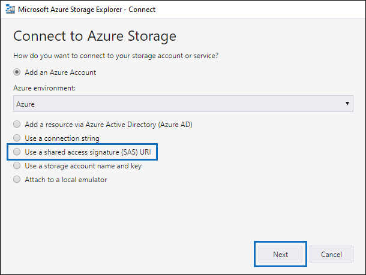
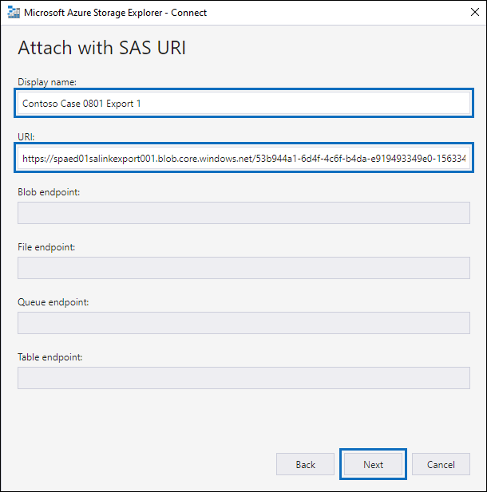
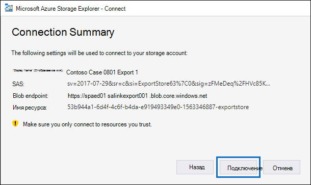
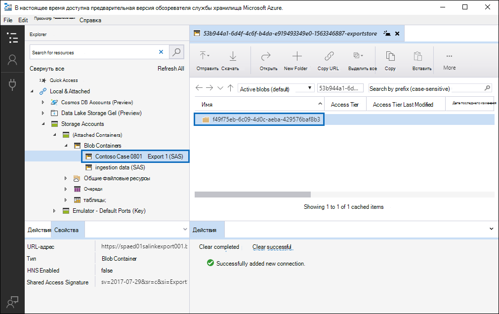
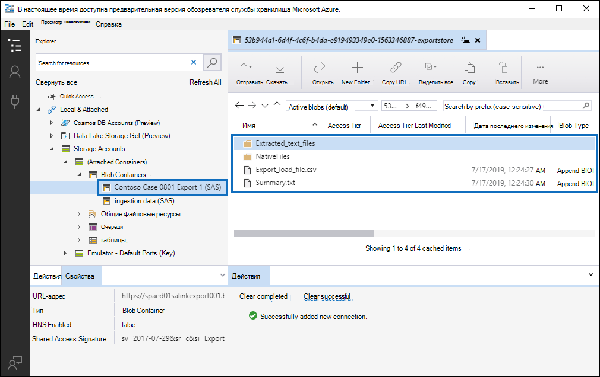

# Скачивание заданий экспортаDownload export jobs

При экспорте документов из свидетельства в расследования данных документы передаются в хранилище Azure, предоставленное Майкрософт, или в место хранения Azure, управляемое вашей организацией.When you export documents from evidence in a data investigation, the documents are uploaded to a Microsoft-provided Azure Storage location or to an Azure Storage location managed by your organization. Тип используемого расположения хранилища Azure зависит от того, какой параметр был выбран при экспорте документов.The type of Azure Storage location used depends on which option was selected when the documents were exported. 

В этой статье приведены инструкции по использованию обозревателя хранилищ Microsoft Azure для подключения к хранилищу Azure для просмотра и скачивания экспортированных документов.This article provides instructions for how to use the Microsoft Azure Storage Explorer to connect to an Azure Storage location to browse and download the exported documents. Дополнительные сведения об обозревателе хранилищ Azure можно найти в статье [Краткое руководство: use Azure Storage Explorer](https://docs.microsoft.com/azure/storage/blobs/storage-quickstart-blobs-storage-explorer).For more information about Azure Storage Explorer, see [Quickstart: Use Azure Storage Explorer](https://docs.microsoft.com/azure/storage/blobs/storage-quickstart-blobs-storage-explorer).

## Шаг 1: Установка обозревателя хранилищ AzureStep 1: Install the Azure Storage Explorer

Первый шаг — скачать и установить Обозреватель хранилищ Azure.The first step is to download and install the Azure Storage Explorer. Для получения инструкций обратитесь к разделу [средство "Обозреватель хранилищ Azure](https://go.microsoft.com/fwlink/p/?LinkId=544842)".For instructions, see [Azure Storage Explorer tool](https://go.microsoft.com/fwlink/p/?LinkId=544842). Это средство используется для подключения к и скачивания экспортированных документов на шаге 3.You use this tool to connect to and download the exported documents in Step 3.

## Шаг 2: получение URL-адреса SAS из задания экспортаStep 2: Obtain the SAS URL from the export job

Следующий шаг — получение URL-адреса общего доступа к подписи доступа (SAS), созданного при создании задания экспорта для [экспорта документов из набора рецензирования](export-documents-from-review-set.md).The next step is to obtain the shared access signature (SAS) URL that's generated when you created the export job to [export documents from a review set](export-documents-from-review-set.md). Вы можете скопировать URL-адрес SAS для документов, которые передаются в хранилище Azure, предоставленное Майкрософт, или место хранения Azure, управляемое вашей организацией.You can copy the SAS URL for documents that are uploaded to a Microsoft-provided Azure Storage location or an Azure Storage location managed by your organization. В любом случае URL-адрес SAS используется для подключения к расположению хранилища Azure на шаге 3.In either case, you use the SAS URL to connect to the Azure Storage location in Step 3.

1. На странице **расследования данных** перейдите к разделу исследование, а затем щелкните вкладку **экспорты** .On the **Data investigations** page, go to the investigation, and then click the **Exports** tab.

2. На вкладке " **Экспорт** " щелкните задание экспорта, которое нужно скачать.On the **Exports** tab, click the export job that you want to download.

3. На всплывающей странице в разделе **расположения**скопируйте отображаемый URL-адрес SAS.On the flyout page, under **Locations**, copy the SAS URL that's displayed. При необходимости вы можете сохранить его в файл, чтобы получить к нему доступ на шаге 3.If necessary, you can save it to a file so you can access it in Step 3.
 
   

## Шаг 3: подключение к хранилищу AzureStep 3: Connect to the Azure Storage location

Последним шагом является использование обозревателя хранилищ Azure и URL-адреса SAS для подключения к расположению хранилища Azure и загрузки документов, экспортированных на локальный компьютер.The final step is to use the Azure Storage Explorer and the SAS URL to connect to the Azure Storage location and download the documents that you exported to a local computer.

1.  Откройте оснастку Azure Storage Explorer, установленную на шаге 1.Open the Azure Storage Explorer that you installed in Step 1.

2. Щелкните значок **Добавить учетную запись** .Click the **Add account** icon. Кроме того, можно щелкнуть правой кнопкой мыши **учетные записи хранения**.Alternatively, you can right-click **Storage Accounts**.

   

3.  На странице " **Подключение к хранилищу Azure** " щелкните **использовать универсальный код ресурса (URI) для подписи общего доступа (SAS)** и нажмите кнопку **Далее**.On the **Connect to Azure Storage** page, click **Use a shared access signature (SAS) URI** and then click **Next**.

    

4.  На странице " **присоединение с URI SAS** " щелкните в поле URI и вставьте URL-адрес SAS, полученный на шаге 2.On the **Attach with SAS URI** page, click in the URI box, and then paste the SAS URL that you obtained in Step 2. 

    

    Обратите внимание, что часть URL-адреса SAS отображается в поле **Отображаемое имя** .Notice that a portion of the SAS URL is displayed in the **Display name** box. Он будет использоваться в качестве отображаемого имени контейнера, созданного в **учетных записях хранения** после подключения к месту хранения.This will be used as the display name of the container that's created under the **Storage accounts** after you connect to the storage location. Это имя состоит из идентификатора расследования данных от и уникального идентификатора.This name consists of the ID of the data investigation is from and a unique identifier. Вы можете оставить отображаемое имя по умолчанию или изменить его.You can keep the default display name or change it. Если изменить его, отображаемое имя должно быть уникальным.If you change it, the display name must be unique.

5.  Нажмите кнопку **Далее**.Click **Next**.

    Отобразится страница " **Сводка подключения** ".The **Connection summary** page is displayed.
   
    

6. На странице **Сводка по подключению** просмотрите сведения о подключении, а затем нажмите кнопку **подключить**.On the **Connection summary** page, review the connection information, and then click **Connect**. 

    Будет открыт узел **контейнеры больших двоичных объектов** (в разделе **учетные записи** > хранения **(прикрепленные контейнеры)** \> .The **Blob containers** node (under **Storage Accounts** > **(Attached Containers)** \> is opened. 

    

    Он содержит контейнер с именем, отображаемым на шаге 4.It contains a container named with the display name from step 4. Этот контейнер содержит папку для каждого созданного задания экспорта.This container contains a folder for each export job that you've created. Имена этих папок с ИДЕНТИФИКАТОРом, соответствующим ИДЕНТИФИКАТОРу задания экспорта.These folders are named with an ID that corresponds to the ID of the export job. Эти коды экспорта (и имя экспорта) можно найти в разделе **сведения о поддержке** на всплывающей странице для каждого **подготовить данные для задания экспорта** , указанного на вкладке **задания** .You can find these export IDs (and the name of the export) under **Support information** on the flyout page for each **Preparing data for export** job listed on the **Jobs** tab.

7. Дважды щелкните папку задания экспорта, чтобы открыть ее.Double-click the export job folder to open it.

   Отобразится список папок и отчетов экспорта.A list of folders and export reports is displayed.
   
    

   Папка заданий экспорта содержит указанные ниже элементы.The export job folder contains the following items. Фактические элементы в папке экспорта определяются параметрами экспорта, настроенными при создании задания экспорта.The actual items in the export folder are determined by the export options configured when the export job was created. Дополнительные сведения см в разделе [Экспорт документов из набора рецензирования](export-documents-from-review-set.md).For more information, see [Export documents from a review set](export-documents-from-review-set.md).

    - Export_load_file. csv: этот CSV-файл является подробным отчетом о экспорте, который содержит сведения о каждом экспортированном документе.Export_load_file.csv: This CSV file is a detail export report that contains information about each exported document. Файл состоит из столбца для каждого свойства метаданных документа.The file consists of a column for each metadata property for a document. Список и описание метаданных, включенных в этот отчет, представлены в столбце **имя экспортируемого поля** в таблице в [полях метаданные документа в разделе Advanced eDiscovery](document-metadata-fields.md).For a list and description of the metadata that's included in this report, see the **Exported field name** column in the table in [Document metadata fields in Advanced eDiscovery](document-metadata-fields.md).
    
    - Summary. txt: текстовый файл, содержащий сводку по экспорту, включая статистику экспорта.Summary.txt: A text file that contains a summary of the export including export statistics.
    
    - Extracted_text_files: в этой папке содержится текстовый файл каждого экспортированного документа.Extracted_text_files: This folder contains a text file version of each exported document.
     
    - Нативефилес: в этой папке содержится собственная версия каждого экспортированного документа.NativeFiles: This folder contains a native file version of each exported document.
    
    - Error_files: в этой папке содержатся следующие элементы, если задание экспорта содержит какие бы то ни было файлы ошибок:Error_files: This folder includes the following items when the export job contains any error files: 
        
      - Екстрактионеррор. csv: этот CSV-файл содержит доступные метаданные для файлов, которые не были правильно извлечены из родительского элемента.ExtractionError.csv: This CSV file contains the available metadata for files that weren't properly extracted from their parent item.
        
      - Процессинжеррор: в этой папке содержатся документы с ошибками обработки.ProcessingError: This folder contains documents with processing errors. Это содержимое находится на уровне элемента, что означает, что при возникновении ошибки обработки вложения в эту папку также будет включен документ, содержащий вложение.This content is at an item level, which means if an attachment had a processing error, the document that contains the attachment will also be included in this folder.
 
8. Чтобы экспортировать все содержимое в экспорте, выберите папку экспорт и нажмите кнопку **загрузить**.To export all contents in the export, select the export folder, and then click **Download**.

9. Укажите расположение, в которое вы хотите скачать экспортируемые файлы, а затем нажмите кнопку **выбрать папку**.Specify the location where you want to download the exported files, and then click **Select folder**.

    В обозревателе службы хранилища Azure запускается процесс экспорта.The Azure Storage Explorer starts the export process. Состояние скачивания экспортированных элементов отображается в области **действия** .The status of the downloading the exported items is displayed in the **Activities** pane. По завершении скачивания отображается сообщение.A message is displayed when the download is finished.

    

> [!NOTE]
> Вместо того чтобы скачивать все задания экспорта, можно выбрать определенные элементы для скачивания.Instead of downloading the entire export job, you can select specific items to download. А вместо скачивания элементов можно дважды щелкнуть элемент, чтобы просмотреть его.And instead of downloading items, you can double-click an item to view it.

