# Общие сведения о диспетчере плана хранения

>*[Руководство по лицензированию Microsoft 365 для обеспечения безопасности и соответствия требованиям](https://aka.ms/ComplianceSD).*

Диспетчер плана хранения предоставляет расширенные функции управления для меток хранения и связанных с ними политик, а также встроенные возможности просмотра меток и действий от меток до содержимого для всего жизненного цикла содержимого — создания, совместной работы, объявления записей, хранения и окончательного удаления. 

Чтобы открыть диспетчер плана хранения в Центре безопасности и соответствия требованиям, выберите **Управление записями** > **План хранения**.

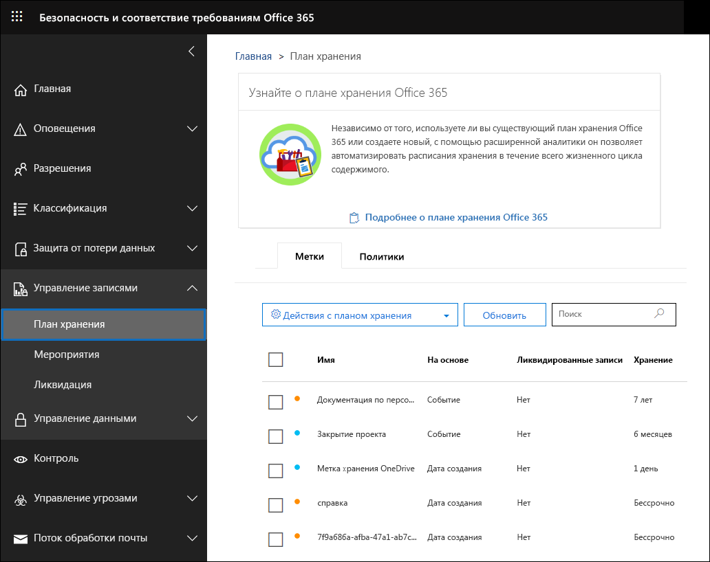

## Доступ к диспетчеру плана хранения

Для доступа к диспетчеру планов хранения вам потребуется одна из следующих ролей администраторов:
    
- диспетчер хранения;

- диспетчер хранения только для просмотра.

## Метки хранения и политика меток по умолчанию

Если в Центре безопасности и соответствия требованиям отсутствуют метки хранения, при первом выборе в левой области навигации пункта **План хранения** создается политика меток под названием **Политика публикации управления данными по умолчанию**. 

Эта политика меток содержит три метки хранения:

- **Рабочая процедура**
- **Общие для предприятия**
- **Контрактное соглашение**

Эти метки хранения настроены только для хранения содержимого, а не его удаления. Эта политика меток публикуется для всей организации и может быть отключена или удалена. 

Вы можете определить, кто открывал диспетчер плана хранения и выполнил взаимодействие при первом запуске, просмотрев журнал аудита для действий **Созданная политика хранения** и **Созданная конфигурация хранения для политики хранения**.

> [!NOTE]
> По просьбам пользователей мы убрали эту функцию, создающую приведенные выше метки хранения и политику меток хранения по умолчанию. Эти метки хранения и политика отображаются, только если вы открыли диспетчер плана хранения до 11 апреля 2019 г.

## Навигация в плане хранения

Диспетчер плана хранения упрощает просмотр и изучение параметров всех ваших политик и меток хранения в одном представлении.

Обратите внимание на то, что метки хранения, созданные вне плана хранения, будут доступны в плане хранения и наоборот.

На вкладке **Метки** плана хранения доступна приведенная ниже дополнительная информация и возможности.

### Столбцы параметров меток

- **На основе** определяет тип триггера, который устанавливает начало периода хранения. Допустимые значения:
    - Событие
    - Дата создания
    - Дата последнего изменения
    - Дата метки
- **Запись** определяет, станет ли элемент объявленной записью после присвоения метки. Допустимые значения:
    - Нет
    - Да
    - Да (норматив)
- **Хранение** определяет тип хранения. Допустимые значения:
    - Оставить
    - Оставить и удалить
    - Удалить
- **Ликвидация** определяет, что произойдет с содержимым в конце периода хранения. Допустимые значения:
    - пусто
    - Нет действий
    - Автоматическое удаление
    - Требуется проверка (т. е. проверка перед ликвидацией)

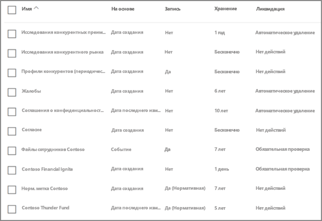

### Столбцы дескрипторов плана хранения для меток

Теперь вы можете добавлять больше информации при настройке меток хранения. Вставка дескрипторов плана хранения в метки повышает управляемость и организацию плана хранения.

Для быстрого начала работы диспетчер плана хранения содержит некоторые встроенные значения для: функции/отдела, категории, типа сертификации и положения или предписания. Вы можете добавлять новые значения дескриптора плана хранения при создании или изменении метки хранения. Вы также можете указать дескрипторы плана хранения при импорте меток хранения в свой план. 

Вот представление этапа дескрипторов плана хранения при создании или изменении метки хранения.

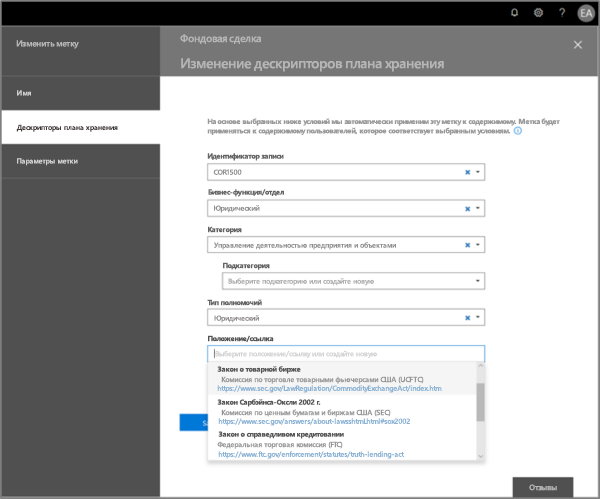

Вот представление столбцов дескрипторов плана хранения на вкладке **Метки** диспетчера плана хранения.

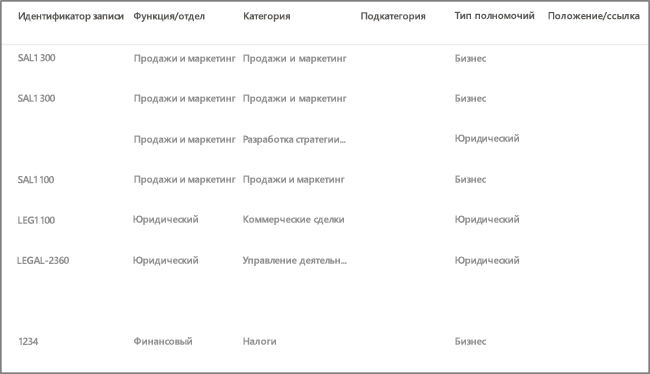

## Экспорт всех имеющихся меток хранения для анализа и/или проведения автономных проверок

Из диспетчера плана хранения можно экспортировать сведения о всех метках хранения в файл .csv, что упростит проведение периодических проверок соответствия требованиям с заинтересованными лицами в сфере управления данными в вашей организации.

Чтобы экспортировать все метки хранения, на странице **План хранения** выберите **Действия плана хранения** \> **Экспортировать метки**.

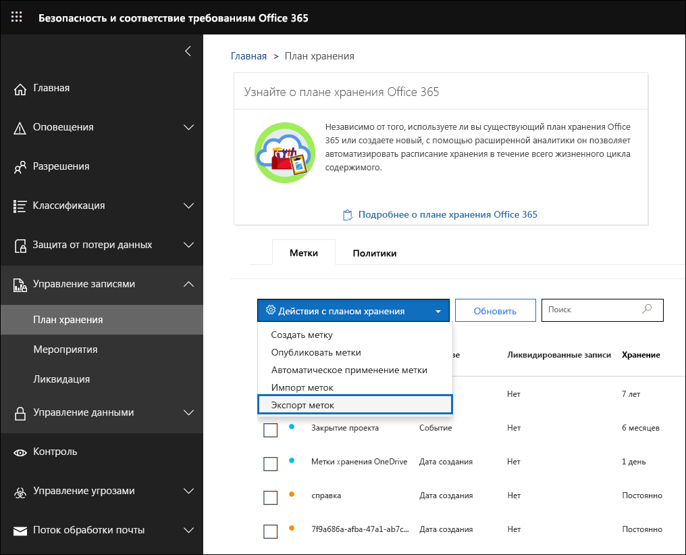

Откроется файл с расширением *.csv, содержащий все существующие метки хранения.

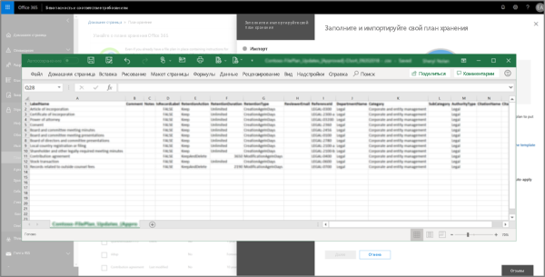

## Импорт меток в план хранения

В диспетчере плана хранения можно выполнить массовый импорт новых меток и изменить существующие.

Чтобы импортировать новые метки и изменить существующие метки хранения: 

1. На странице **План хранения** выберите **Действия плана хранения** > **Импортировать метки**.

   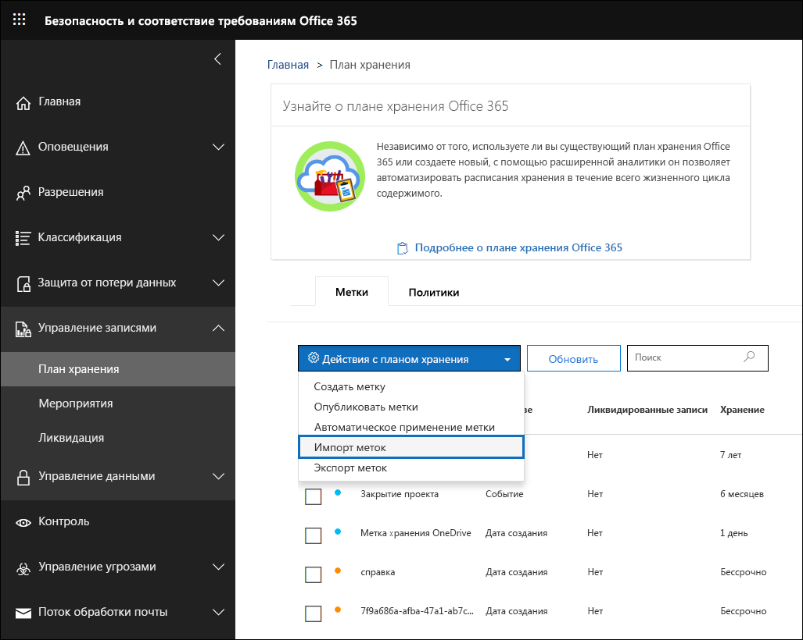

   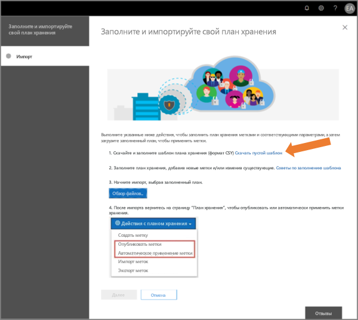

2. Скачайте пустой шаблон, чтобы импортировать новые метки хранения. Или можно начать с CSV-файла, экспортированного при экспорте существующих меток хранения в организации.

   

3. Заполните шаблон. Ниже представлены свойства и допустимые значения для каждого свойства в шаблоне плана хранения. 

   |**Свойство**|**Тип**|**Допустимые значения**|
   |:-----|:-----|:-----|
   |LabelName|String|Это свойство указывает имя метки хранения.|
   |Comment|String|Используйте это свойство для добавления описания метки хранения для администраторов. Это описание отображается только для администраторов, управляющих метками в Центре безопасности и соответствия требованиям.|
   |Notes|String|Используйте это свойство для добавления описания метки хранения для пользователей. Это описание отображается при наведении пользователем указателя мыши на метку в таких приложениях, как Outlook, SharePoint и OneDrive. Если оставить это свойство пустым, будет отображаться описание по умолчанию, разъясняющее параметры метки хранения. |
   |IsRecordLabel|String|Это свойство указывает, является ли метка меткой записи. Элементы, помеченные меткой записи, объявляются записями. Допустимые значения: **TRUE**. Метка является меткой записи. Обратите внимание, что элементы, объявленные записями, удалить невозможно.  **FALSE**. Метка не является меткой записи. Это значение используется по умолчанию.|
   |RetentionAction|String|Это свойство указывает, какое действие нужно выполнить после истечения срока действия, установленного значением свойства RetentionDuration. Допустимые значения: **Delete**. Элементы старше значения, указанного свойством RetentionDuration, удаляются. **Keep**. Хранение элементов в течение срока, указанного свойством RetentionDuration. После истечения срока никакие действия не выполняются.  **KeepAndDelete**. Хранение элементов в течение срока, указанного свойством RetentionDuration. После истечения срока элементы удаляются.   |
   |RetentionDuration|String|Это свойство указывает срок хранения содержимого (в днях). Допустимые значения: **Unlimited**. Элементы будут храниться без ограничения срока.  ***n*** — положительное целое число, например **365**. 
   |RetentionType|String|Это свойство указывает, рассчитывается ли срок хранения с даты создания содержимого, даты события, даты пометки (присвоения тега) или даты последнего изменения. Допустимые значения: **CreationAgeInDays** **EventAgeInDays** **TaggedAgeInDays** **ModificationAgeInDays** |
   |ReviewerEmail|SmtpAddress|Если это свойство заполнено, по истечении срока хранения запускается проверка перед ликвидацией. Это свойство указывает адрес электронной почты проверяющего для действий хранения **Delete** и **KeepAndDelete**. Вы можете указать адрес электронной почты отдельных пользователей, группы рассылки или безопасности. Можно указать несколько адресов электронной почты, разделив их точками с запятой.|
   |ReferenceId|String|Это свойство указывает значение, отображаемое в дескрипторе плана хранения **Идентификатор записи**.| 
   |DepartmentName|String|Это свойство указывает значение, отображаемое в дескрипторе плана хранения **Функция/отдел**.|
   |Категория|String|Это свойство указывает значение, отображаемое в дескрипторе плана хранения **Категория**.|
   |SubCategory|String|Это свойство указывает значение, отображаемое в дескрипторе плана хранения **Подкатегория**.|
   |AuthorityType|String|Это свойство указывает значение, отображаемое в дескрипторе плана хранения **Тип органа**.|
   |CitationName|String|Это свойство указывает название предписания, отображаемое в дескрипторе плана хранения **Положение или предписание**, например "Закон Сарбейнса-Оксли или 2002". |
   |CitationUrl|String|Это свойство указывает URL-адрес, отображаемый в дескрипторе плана хранения **Положение или предписание**.|
   |CitationJurisdiction|String|Это свойство указывает юрисдикцию или агентство, отображаемое в дескрипторе плана хранения **Положение или предписание**, например "Комиссия по ценным бумагам и биржам США (SEC)".|
   |Regulatory|String|Оставьте пустым. В настоящее время это свойство не используется.|
   |EventType|String|Это свойство указывает правило хранения, связанное с меткой. Можно использовать любое значение, уникальным образом идентифицирующее правило. Пример: **имя** **различающееся имя (DN)** **GUID**  Чтобы просмотреть доступные правила хранения, можно использовать командлет [Get-RetentionComplianceRule](https://docs.microsoft.com/powershell/module/exchange/policy-and-compliance-retention/get-retentioncompliancerule?view=exchange-ps). Обратите внимание, что при экспорте меток из одной организации Office 365 нельзя использовать значения свойства EventType из этой организации в случае импорта меток в другую организацию Office 365. Это обусловлено уникальностью значений EventType для организации. |
   |||

   Ниже приведен пример шаблона, содержащего сведения о метках хранения.

   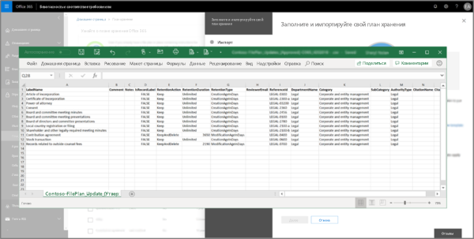

4. В действии 3 на странице мастера импорта плана хранения нажмите кнопку **Выбрать файлы**, чтобы добавить заполненный шаблон. 

   Диспетчер плана хранения проверит записи и отобразит статистику импорта.

   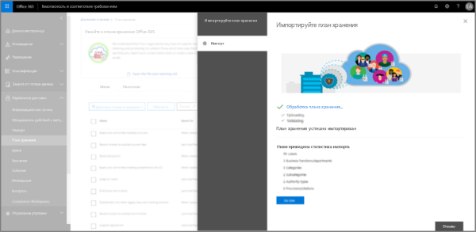

   В случае ошибки проверки в импортированном плане хранения по-прежнему будет проверяться каждая запись в импортированном файле и будут отображаться все ошибки, ссылающиеся на номера строк в импортированном файле. Копируйте отображаемые результаты ошибок, чтобы легко возвращаться к импортированному файлу и исправить ошибки.

5. По завершении импорта вернитесь к диспетчеру плана хранения, чтобы связать новые метки хранения с новыми или существующими политиками.

   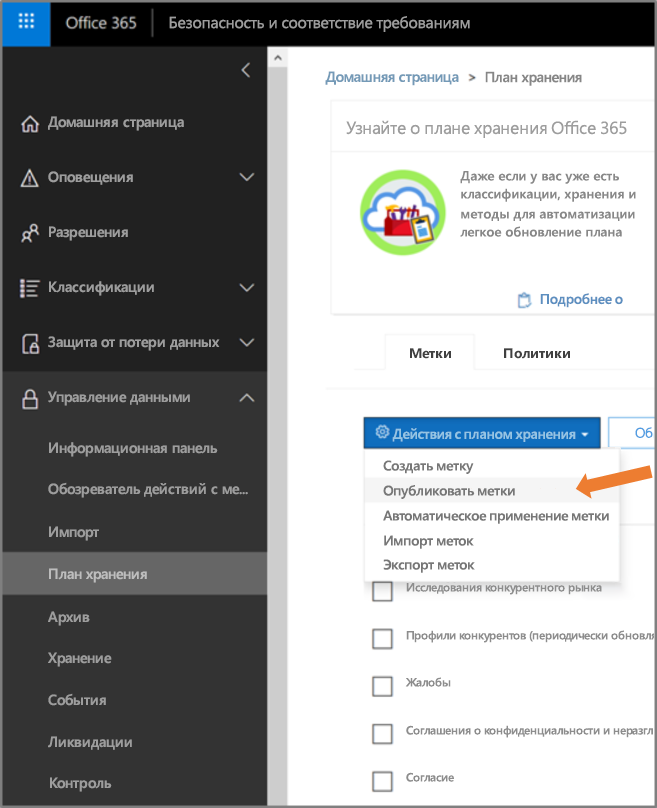
