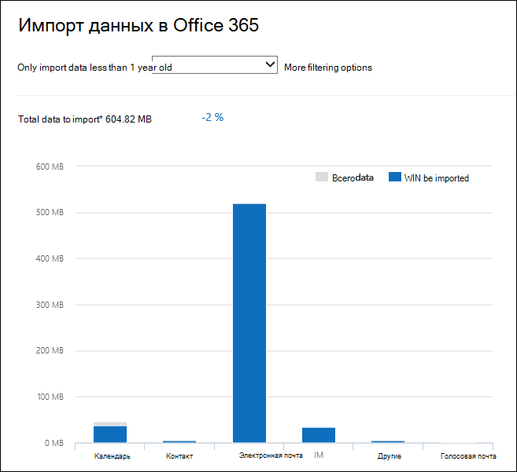
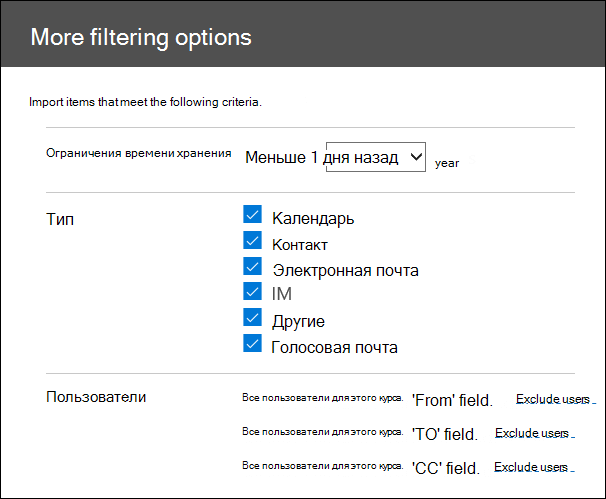

# Фильтрация данных при импорте PST-файлов в Office 365

Используйте новый компонент интеллектуального импорта в службе импорта Office 365, чтобы отфильтровать элементы в PST-файлах, которые фактически импортируются в целевые почтовые ящики. Вот как это работает:
  
- После создания и отправки задания импорта PST-файлов в область хранилища Azure в облаке Майкрософт.
    
- Office 365 анализирует данные в PST-файлах безопасным и безопасным способом, определяя возраст элементов почтового ящика и различные типы сообщений, включенные в PST-файлы.
    
- После завершения анализа и данных, готовых к импорту, можно импортировать все данные в PST-файлах как есть или обрезать импортируемые данные, задав фильтры, которые контролируют, какие данные следует импортировать. Например, можно выбрать один из следующих вариантов:
    
  - Импортировать только элементы определенного возраста.
    
  - Импорт выбранных типов сообщений.
    
  - Исключение сообщений, отправленных или полученных определенными пользователями.
    
- После настройки параметров фильтра Office 365 импортирует только те данные, которые соответствуют критериям фильтрации, с целевыми почтовыми ящиками, указанными в задании импорта.
    
На приведенном ниже рисунке показан процесс интеллектуального импорта, в котором выделены выполняемые задачи и задачи, выполняемые в Office 365.
  

  
## До начала работы

- Действия, описанные в этом разделе, предполагают, что вы создали задание импорта PST в службе импорта Office 365, используя отправку по сети или доставку дисков. Пошаговые инструкции представлены в одном из следующих разделов:
    
  - [Импорт PST-файлов в Office 365 с помощью отправки по сети](use-network-upload-to-import-pst-files.md)
    
  - [Импорт PST-файлов в Office 365 с помощью отправки дисков](use-drive-shipping-to-import-pst-files-to-office-365.md)
    
- После создания задания импорта с помощью команды "Отправка по сети" состояние задания импорта на странице "Импорт" центра соответствия требованиям & безопасности настроено на **анализ**, что означает, что Office 365 анализирует данные в отправленных вами PST-файлах. Нажмите **** обновление, чтобы обновить состояние задания импорта. 
    
- Для заданий импорта доставки дисков данные анализируются в Office 365 после того, как сотрудники центра обработки данных Майкрософт получат жесткий диск и отправит PST-файлы в область хранилища Azure для вашей организации.
  
## Фильтрация данных, которые импортируются в почтовые ящики

После создания задания импорта PST-файла выполните следующие действия, чтобы отфильтровать данные перед их импортом в Office 365.
  
1. Откройте страницу [https://protection.office.com/](https://protection.office.com/) и войдите с данными учетной записи администратора вашей организации Office 365. 
    
2. Щелкните **** \> **PST-файлы импорта**для управления **сведениями** \> .
    
    Задания импорта для Организации перечислены на странице " **Импорт PST-файлов** ". Обратите внимание, что в столбце **состояние** **Завершено значение анализ** указывает, что задания импорта были проанализированы в Office 365 и готовы к импорту. 
    
    
  
3. Нажмите кнопку **Готово, чтобы импортировать в Office 365** для задания импорта, которое требуется выполнить. 
    
    Появится страница со сведениями о PST-файлах и другой информацией о задании импорта.
    
4. Нажмите кнопку **Импорт в Office 365**.
    
    Откроется страница **Отфильтровать данные**. Он содержит сведения о данных в PST-файлах для задания импорта, в том числе сведения о сроке хранения данных. 
    
    
  
5. В зависимости от того, хотите ли вы обрезать данные, импортированные в Office 365, в разделе **для фильтрации данных**выполните одно из следующих действий:
    
    а. Нажмите кнопку **Да, я хочу отфильтровать его перед импортом** , чтобы обрезать импортируемые данные, а затем нажмите кнопку **Далее**.
    
    На странице **Импорт данных в office 365** отображается подробная информация об анализе данных, выполненном при анализе, выполненном в Office 365. 
    
    
  
    На диаграмме на этой странице отображается объем данных, которые будут импортированы. Сведения о каждом типе сообщений, обнаруженном в PST-файлах, отображаются на диаграмме. Вы можете навести курсор на каждую панель, чтобы отобразить конкретные сведения об этом типе сообщения. Кроме того, существует раскрывающийся список с разными значениями возраста на основе анализа PST-файлов. При выборе возраста в раскрывающемся списке диаграмма обновляется, чтобы показать, сколько данных будет импортировано для выбранного возраста. 
    
    б. Чтобы настроить фильтры сложения для уменьшения объема импортируемых данных, щелкните **Дополнительные параметры фильтрации**.
    
    
  
    Вы можете настроить эти фильтры:
    
      - **Age** — Выберите возраст, чтобы импортироваться только элементы новее указанного возраста. В разделе [More Information (Дополнительные сведения](#more-information) ) представлено описание того, как Office 365 определяет периоды хранения для фильтра **возраста** . 
    
      - **Type** — в этом разделе показаны все типы сообщений, обнаруженные в PST-файлах для задания импорта. Вы можете снять флажок рядом с типом сообщения, которое нужно исключить. Обратите внимание, что вы не можете исключить другой тип сообщения. Список элементов почтовых ящиков, включенных в другую категорию, представлен в разделе [Дополнительные сведения](#more-information) . 
    
      - **Пользователи** — вы можете исключить сообщения, отправленные или полученные определенными пользователями. Чтобы исключить пользователей, которые отображаются в поле "от:", "Кому:" или "копия: сообщения", нажмите кнопку **исключить пользователей** рядом с этим типом получателя. Введите адрес электронной почты (SMTP-адрес) пользователя, щелкните **Добавить** , чтобы добавить его в список исключенных пользователей для этого типа получателя, а затем нажмите кнопку **сохранить** , чтобы сохранить список исключенных пользователей. 
    
        > [!NOTE]
        > В Office 365 не отображается информация о том, что в результате настройки фильтра **людей** не отображается. Тем не менее, если вы настроили этот фильтр, чтобы исключить сообщения, отправленные или полученные определенными пользователями, эти сообщения будут исключены во время фактического процесса импорта. 
  
    в. Нажмите кнопку **Применить** на странице **Дополнительные параметры фильтрации** , чтобы сохранить параметры фильтра. 
    
    Сведения, содержащиеся на странице **Импорт данных в Office 365** , обновляются на основе параметров фильтра, в том числе общий объем данных, которые будут импортированы на основе параметров фильтра. Обратите внимание, что также отображается сводка по параметрам фильтра. При необходимости можно нажать кнопку **изменить** рядом с фильтром, чтобы изменить значение. 
    
    
  
    г. Нажмите кнопку **Далее**.
    
    Отображается страница состояния, на которой показаны параметры фильтра. Опять же, вы можете изменить любой из параметров фильтра.
    
    д. Нажмите кнопку **Импорт данных** , чтобы начать импорт. Обратите внимание, что отображается общий объем данных, которые будут импортированы. 
    
    или
    
    а. Нажмите кнопку **нет, я хочу импортировать** все данные из PST-файлов в Office 365, а затем нажмите кнопку **Далее**.
    
    б. На странице **Импорт данных в Office 365** щелкните **Импорт данных** , чтобы начать импорт. Обратите внимание, что отображается общий объем данных, которые будут импортированы. 
    
6. На странице " **Импорт PST-файлов** " нажмите кнопку](../media/165fb3ad-38a8-4dd9-9e76-296aefd96334.png) **Обновить** ![обновление. Состояние задания импорта отображается в столбце **состояние** . 
    
7. Щелкните Импорт задания, чтобы отобразить более подробные сведения, такие как состояние каждого PST-файла и параметры фильтра, которые вы настроили.

  
## Дополнительные сведения

- Как Office 365 определяет приращения для фильтра возраста? Когда Office 365 анализирует PST-файл, он анализирует отметку времени отправки или получения каждого элемента (если для элемента задана отметка времени отправки и получения, выбирается самая старая Дата). После этого Office 365 просматривает значение года для этой временной метки и сравнивает его с текущей датой для определения возраста элемента. Эти простои используются в качестве значений в раскрывающемся списке для фильтра **возраста** . Например, если PST-файл содержит сообщения от 2016, 2015 и 2014, то значения в фильтре **возраста** будут составлять **1 год**, **2 года**и **3 года**.
    
- В следующей таблице приведены типы сообщений, которые включены в категорию " **другие** " в поле " **тип** фильтра" на странице " **Дополнительные параметры** " на лету (см. шаг 5b в предыдущей процедуре). В настоящее время вы не можете исключить элементы из категории "другие" при импорте PST в Office 365. 
    
    |**Идентификатор класса сообщений**|**Элементы почтового ящика, которые используют этот класс сообщений**|
    |:-----|:-----|
    |IPM.Activity    |Записи журнала    |
    |IPM.Document    |Документы и файлы (не вложенные в сообщение электронной почты)    |
    |Класс. Файлу    |(то же, что и IPM. Документов    |
    |IPM.Note.IMC.Notification    |Отчеты, отправляемые службой почты Интернета, которая является шлюзом Exchange Server в Интернет    |
    |Класс. Note. Microsoft. Fax    |Факсимильные сообщения    |
    |Класс. Note. rules. отсутствие на работе. Template. Microsoft    |Сообщения автоответа об отсутствии на месте    |
    |IPM.Note.Rules.ReplyTemplate.Microsoft    |Ответы, отправленные правилом папки "Входящие"    |
    |IPM.OLE.Class    |Исключения для повторяющихся рядов    |
    |IPM.Recall.Report    |Отчеты об отзыве сообщения    |
    |IPM.Remote    |Удаленные сообщения электронной почты    |
    |IPM.Report    |Отчеты о состоянии элементов    |
