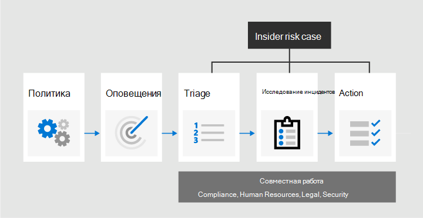
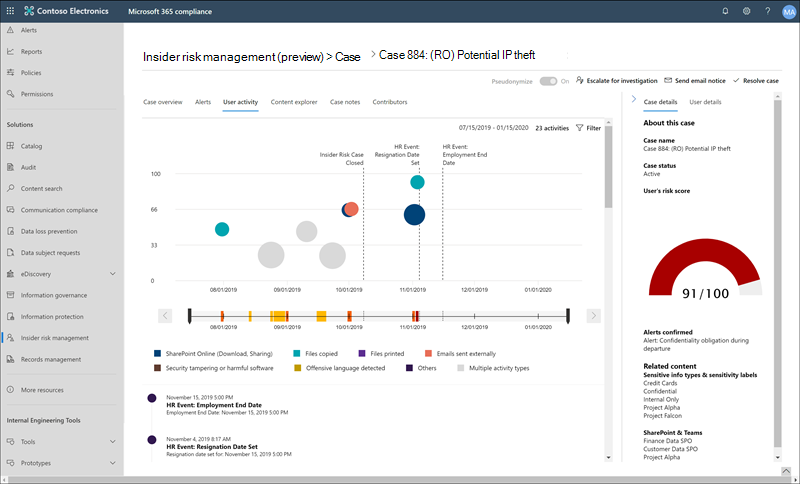

# Предварительная оценка управления рисками в Microsoft 365

Центр развертывания рисков — это решение в Microsoft 365, которое помогает минимизировать внутренние риски, позволяя обнаруживать, анализировать и принимать меры по рискованным действиям в Организации. Настраиваемые политики позволяют обнаруживать и предпринимать действия при атаках на вредоносные и непреднамеренные риски в Организации, в том числе расширяющие обращения для расширенного обнаружения электронных данных Майкрософт, если это необходимо. С помощью аналитик риска в Организации можно быстро выполнять соответствующие действия, чтобы убедиться, что пользователи соответствуют стандартам соответствия требованиям вашей организации.

Посмотрите видео ниже, чтобы узнать, как управление рисками для оценки безопасности поможет вашей организации предотвратить, обнаруживать и содержать риски при приоритизации значений в Организации, культуры и опыта работы сотрудников:
 
 
>[!VIDEO https://www.microsoft.com/videoplayer/embed/RE4j9CN]

## Вопросы, появляющиеся в современных рисках

Управление и минимизация риска в Организации начинается с понимания типов рисков, обнаруженных на современном рабочем месте. Некоторые риски управляются внешними событиями и факторами и выходят за рамки прямого управления. Другие риски определяются внутренними событиями и действиями сотрудников, которые можно устранить и избежать. В некоторых примерах есть риски, связанные с незаконным, неприемлемым, несанкционированным действием и действиями сотрудников и руководителей. К ним относятся разнообразные внутренние риски от сотрудников:

- Утечки конфиденциальных данных и переноса данных
- Нарушения конфиденциальности
- Хищение интеллектуальной собственности (IP)
- Мошенническ
- Торговля для участников программы предварительной оценки
- Нарушения соответствия нормативным требованиям

Сотрудники на современном рабочем месте имеют доступ к данным для создания, управления и совместного использования данных в широком спектре платформ и служб. В большинстве случаев Организации имеют ограниченные ресурсы и инструменты для определения и устранения рисков на уровне Организации, а также для собраний по стандартам конфиденциальности сотрудников.

Функция предварительной оценки рисков в Microsoft 365 использует все индикаторы обслуживания и сторонних производителей, позволяющие быстро определить, рассмотреть и предпринять действия по риску. С помощью журналов из Office 365 и Microsoft Graph управление рисками для оценки позволяет определить конкретные политики для определения индикаторов риска. Эти политики позволяют определить рискованные действия и предпринять меры по устранению этих рисков.

Управление рисками для предварительной оценки выравниваются по следующим принципам:

- **Прозрачность**: Балансировка конфиденциальности сотрудников и рисков в Организации с использованием архитектуры конфиденциальности.
- Возможность **настройки**: настраиваемые политики на основе отраслевых, географических и бизнес-групп.
- **Интеграция**: интегрированный рабочий процесс для решений соответствия требованиям Microsoft 365.
- **Действия с действиями**: предоставление аналитики для включения уведомлений сотрудников, исследований данных и расследования сотрудников.

## Рабочий процесс

Управление рисками для предварительной оценки помогает определить, исследовать и принять меры по устранению внутренних рисков в Организации. С помощью шаблонов политик "отсортированный", комплексных сигналов об активности в службе Microsoft 365 и гибком рабочем процессе можно использовать подробные сведения о действии, чтобы быстро определить и устранить рискованное поведение.

Определение и разрешение проблем с внутренними рисками и проблем с соответствием требованиям к управлению рисками в Microsoft 365 использует следующий рабочий процесс:

### Политики

Политики управления рисками для предварительной оценки создаются с помощью предопределенных шаблонов и условий политики, которые определяют, какие индикаторы риска проверяются в функциональных областях Microsoft 365. Эти условия включают сведения о том, как индикаторы используются для оповещений, какие пользователи включены в политику, какие службы имеют приоритет и за какой период времени мониторинга.

Чтобы быстро начать работу с управлением рисками для оценки, можно выбрать следующие [шаблоны политики](insider-risk-management-policies.md#policy-templates) .

- Частичная кража данных сотрудников
- Утечки данных
- Оскорбительный язык в сообщении электронной почты

Дополнительные [сведения см.](insider-risk-management-policies.md)

### Оповещения

Оповещения автоматически создаются индикаторами риска, которые удовлетворяют условиям политики и отображаются в **панели мониторинга оповещений**. Эта панель мониторинга позволяет быстро просмотреть все оповещения, которые требуют проверки, открыть оповещения с течением времени и статистику оповещений для вашей организации. Все оповещения политики отображаются со связанными сведениями, которые помогают быстро определить текущее состояние существующих оповещений и новые оповещения, требующие действия.

- Состояние
- Severity
- Время обнаружения
- Ситуация
- Состояние обращения

Для получения дополнительных сведений см [оповещения об управлении рисками](insider-risk-management-alerts.md).

### Сортировки

Новые действия, требующие расследования, автоматически создают оповещения, которым назначено состояние *проверки потребностей* . Рецензенты могут быстро определить эти оповещения и прокручивать их для оценки и рассмотрения. 

Оповещения разрешаются с помощью открытия нового случая, назначения оповещения для существующего случая или закрытия оповещения. С помощью фильтров оповещений легко можно быстро определить оповещения по состоянию, серьезности или времени обнаружения. В ходе процесса рассмотрения проверяющие могут просматривать сведения о сопоставлении политики, просматривать действия пользователей, связанные с этим сопоставлением, просматривать сведения об активности пользователей и просматривать сведения о профилях пользователей.

### Учит

Обращения создаются для оповещений, которые требуют более глубокого рассмотрения и исследования сведений и обстоятельств, связанных с назначением политики. **Панель мониторинга обращений** позволяет просматривать все активные обращения, открытые обращения с течением времени и статистику обращений в Организации. Проверяющие могут быстро фильтровать обращения по состоянию, дате открытия обращения и дате последнего обновления обращения.

Выбор варианта на панели мониторинга "обращение" открывает дело для исследования и рецензирования. Этот шаг является основой рабочего процесса по управлению рисками для оценки. В этой области отображаются индикаторы активности, условия политики, сведения о оповещениях и сведения о сотрудниках, которые встроены в интегрированное представление для рецензентов. Основные средства расследования в этой области:

- **Действия пользователя**: действия пользователя автоматически отображаются в интерактивной диаграмме, которая отображает действия с рисками с течением времени и уровнем риска для текущих или прошлых действий по риску. Рецензенты могут быстро отфильтровать и просмотреть весь журнал рисков для сотрудника и перейти к определенным действиям, чтобы получить дополнительные сведения.
- **Обозреватель контента**: все файлы данных и сообщения электронной почты, связанные с действиями с рисками для оповещений, автоматически фиксируются и отображаются в обозревателе контента. Рецензенты могут фильтровать и просматривать файлы и сообщения по источникам данных, типам файлов, тегам, беседам и многим другим атрибутам.
- **Примечания к случаю**: проверяющие предоставляют заметки для случая в разделе "Примечания к случаю". Этот список объединяет все заметки в центральном представлении, включая сведения о рецензентах и дата их отправки.

Более подробную информацию можно узнать в статье [варианты управления рисками](insider-risk-management-cases.md).

### Action

После изучения таких случаев проверяющие могут быстро предпринять действия для решения проблемы или совместной работе с другими заинтересованными лицами в Организации. Когда сотрудники случайно или случайно нарушают условия политики, можно отправить сообщение с помощью простого напоминания сотрудникам из шаблонов уведомлений, которые можно настроить для Организации. Эти уведомления могут выдаваться как простые напоминания или могут направлять сотрудникам возможности обучения или рекомендаций по предотвращению нежелательного поведения в будущем. Для получения дополнительных сведений см [шаблоны уведомлений "Управление рисками](insider-risk-management-notices.md)".

В самых серьезных ситуациях вам может потребоваться поделиться сведениями об обращении об управлении рисками для оценки с другими проверяющими в Организации. Управление рисками для предварительной оценки тесно интегрировано с другими функциями обеспечения соответствия требованиям Microsoft 365, чтобы обеспечить полное разрешение риска. Эскалация обращения для расследования позволяет перенести данные и управлять обращением в расширенные функции обнаружения электронных данных в Microsoft 365. Расширенное обнаружение электронных данных предоставляет сквозной рабочий процесс для сохранения, сбора, проверки, анализа и экспорта содержимого, которое отвечает за внутреннее и внешнее расследования вашей организации. Она позволяет юридическим группам управлять всем рабочим процессом уведомления об удержаниях. Дополнительные сведения о дополнительных возможностях обнаружения электронных данных приведены [в статье обзор расширенного обнаружения электронных данных в Microsoft 365](overview-ediscovery-20.md).

## Сценарии

Управление рисками для предварительной оценки помогает обнаруживать, анализировать и предпринимать меры по устранению внутренних рисков в Организации в нескольких распространенных сценариях.

### Кража данных за счет посторонних сотрудников

Когда сотрудники оставляют организацию, как добровольно, так и в результате увольнения, часто приходится учитывать, что данные о компании, клиентах и сотрудниках подвержены риску. Сотрудники могут инноцентли предположить, что данные проекта не являются собственными и могут быть незаконными для получения данных компании для персонального усиления и нарушения политики компании и юридических стандартов. Политики управления рисками для участников программы предварительной оценки, использующие шаблон политики [кражи данных сотрудников](insider-risk-management-policies.md#policy-templates) , автоматически определяют действия, которые обычно связаны с этим типом кражи. С помощью этой политики вы автоматически получаете оповещения о подозрительных действиях, связанных с отправкой хищений сотрудников, чтобы вы могли предпринять соответствующие исследования. Для этого шаблона политики необходимо настроить [Microsoft 365 HR Connector](import-hr-data.md) для вашей организации.

### Неумышленное утечка конфиденциальной или конфиденциальной информации

В большинстве случаев сотрудники пытаются правильно обрабатывать конфиденциальную или конфиденциальную информацию. Но иногда сотрудники делают ошибки и сведения случайно предоставлены за пределами организации или нарушают политики защиты информации. Иногда сотрудники могут умышленно отвлекаться или делиться конфиденциальными и конфиденциальными сведениями с целью злонамеренного использования, а также для потенциального личного усиления. Политики управления рисками, созданные с помощью шаблона политики [утечек данных](insider-risk-management-policies.md#policy-templates) , автоматически обнаруживают действия, которые обычно связаны с общими конфиденциальными или конфиденциальными сведениями. Для этого шаблона политики необходимо настроить по крайней мере одну [политику защиты от потери данных (DLP)](create-test-tune-dlp-policy.md) Microsoft 365 для вашей организации.

### Действия и поведения, которые нарушают корпоративные политики

Частое взаимодействие между сотрудниками часто нежелательные или вредоносные нарушения корпоративных политик. Эти нарушения могут включать оскорбительный язык, угрозы и кибератак — Буллинг между сотрудниками. Этот тип действий участвует в рабочей среде злоумышленника и может привести к появлению юридических действий для обоих сотрудников и более крупной организации. В разделе Управление рисками для оценки безопасности используются новые встроенные классификаторы Microsoft 365 и [нежелательный язык в](insider-risk-management-policies.md#policy-templates) шаблоне политики электронной почты. Эти классификаторы и шаблоны позволяют быстро настроить политику для автоматического обнаружения и оповещения о данном типе поведения.

## Готовы приступить к работе?

Готовы к настройке управления рисками для участников вашей организации? Чтобы настроить необходимые компоненты, создать политики и начать получать оповещения, ознакомьтесь с разпрограммным обеспечением [управления рисками для участников программы предварительной оценки](insider-risk-management-configure.md) .
