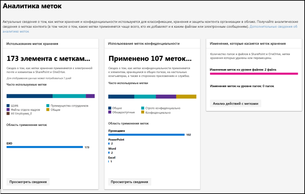
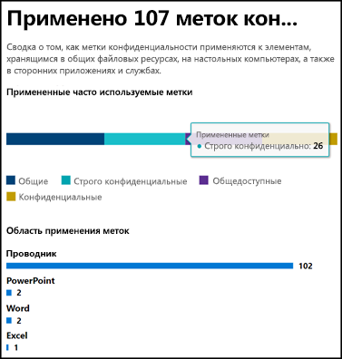
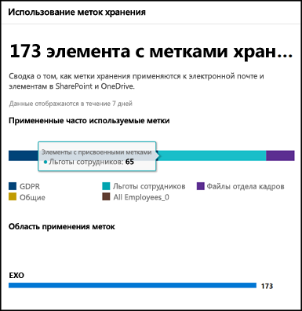
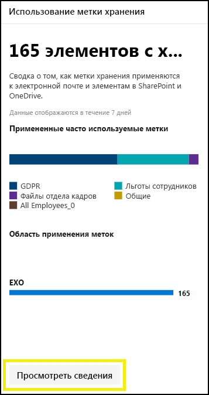
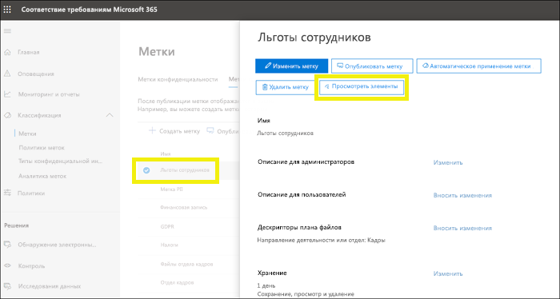
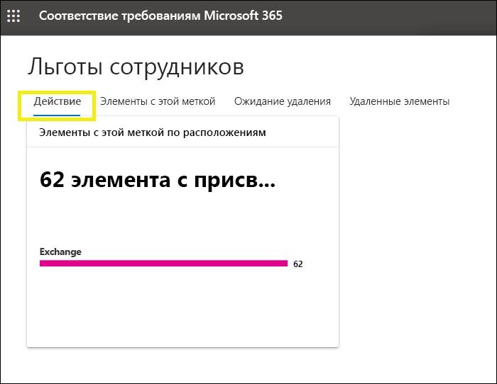
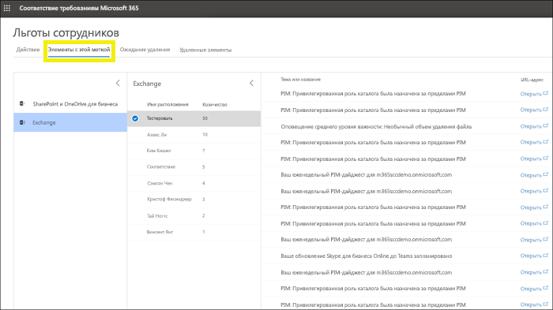

# Просмотр использования меток с помощью аналитики метокView label usage with label analytics

После создания меток хранения и меток конфиденциальности рекомендуется просматривать, как они используется в клиенте.After you create your retention labels and sensitivity labels, you’ll want to see how they’re being used across your tenant. С помощью аналитики меток в Центре соответствия требованиям Microsoft 365 и Центре безопасности Microsoft 365 можно быстро просмотреть, какие метки используются чаще всего и где они применяются.With label analytics in the Microsoft 365 compliance center and Microsoft 365 security center, you can quickly see which labels are used the most and where they’re being applied.

Например, с помощью аналитики меток можно просмотреть:For example, with label analytics, you can view the:

- Общее количество меток хранения и меток конфиденциальности, примененных к содержимому.Total number of retention labels and sensitivity labels applied to content.
- Часто используемые метки и число применений каждой метки.Top labels and the count of how many times each label was applied.
- Расположения, где применяются метки, и общее число для каждого расположения.Locations where labels are applied and the count for each location.
- Число файлов и папок, для которых изменены или удалены метки хранения.Count for how many files and folders had their retention label changed or removed.

Аналитику меток можно найти в [Центре соответствия требованиям Microsoft 365](https://compliance.microsoft.com/labelanalytics) или [Центре безопасности Microsoft 365](https://security.microsoft.com/labelanalytics) > **Классификация** > **Аналитика меток**.You can find label analytics in the [Microsoft 365 compliance center](https://compliance.microsoft.com/labelanalytics) or [Microsoft 365 security center](https://security.microsoft.com/labelanalytics) > **Classification** > **Label analytics**.

## Использование меток конфиденциальностиSensitivity label usage

Данные об использовании меток конфиденциальности извлекаются из отчетов для Azure Information Protection. Дополнительные сведения см. в статье [Центр отчетов для Azure Information Protection](https://docs.microsoft.com/azure/information-protection/reports-aip).The data on sensitivity label usage is pulled from the reports for Azure Information Protection – for more information, see [Central reporting for Azure Information Protection](https://docs.microsoft.com/azure/information-protection/reports-aip).

Обратите внимание, что отчеты Azure Information Protection имеют [предварительные требования](/azure/information-protection/reports-aip#prerequisites), которые также применяются к аналитике меток в отношении меток конфиденциальности в Центре соответствия требованиям Microsoft 365 и Центре безопасности Microsoft 365.Note that the Azure Information Protection reports have [prerequisites](/azure/information-protection/reports-aip#prerequisites) that also apply to label analytics on sensitivity labels in the Microsoft 365 compliance center and Microsoft 365 security center. Например, требуется подписка на Azure, включающая журнал аналитики, так как эти отчеты являются результатом отправки событий аудита защиты сведений из клиентов и сканеров Azure Information Protection в централизованное расположение на основе службы Azure Log Analytics.For example, you need an Azure subscription that includes the Log Analytics because these reports are a result of sending information protection audit events from Azure Information Protection clients and scanners to a centralized location based on Azure Log Analytics service.

При использовании меток конфиденциальности:For sensitivity label usage:

- Задержка данных отсутствует.There is no latency in the data. Это отчет в режиме реального времени.This is a real-time report.
- Чтобы просмотреть подсчет для каждой популярной метки, наведите указатель мыши на гистограмму и прочитайте появившуюся подсказку.To see the count for each top label, point to the bar graph and read the tool tip that appears.
- Отчет отображает место применения меток конфиденциальности по приложениям (а для меток хранения — по расположениям).The report shows where sensitivity labels are applied per app (whereas retention labels are shown per location).

## Использование меток храненияRetention label usage

Этот отчет предоставляет обзор часто используемых меток и областей их применения.This report shows a quick view of what the top labels are and where they’re applied. Дополнительные сведения о присвоении меток к содержимому в SharePoint и OneDrive см. в статье [Просмотр действий с метками для документов](view-label-activity-for-documents.md).For more detailed information on how content in SharePoint and OneDrive is labeled, see [View label activity for documents](view-label-activity-for-documents.md).

При использовании меток хранения:For retention label usage:

- Данные собираются еженедельно, поэтому может потребоваться до семи дней для появления данных в отчете.Data is aggregated weekly, so it may take up to seven days for data to appear in the report.
- Чтобы просмотреть подсчет для каждой популярной метки, наведите указатель мыши на гистограмму и прочитайте появившуюся подсказку.To see the count for each top label, point to the bar graph and read the tool tip that appears.
- Отчет отображает место применения меток хранения по расположениям (а для меток конфиденциальности — по приложениям).The report shows where retention labels are applied per location (whereas sensitivity labels are shown per app).
- Для меток хранения это является сводкой данных за все время в клиенте; они не фильтруются по определенному диапазону дат.For retention labels, this is a summary of the all-time data in your tenant; it’s not filtered to a specific date range. Напротив, [Обозреватель действий с метками](view-label-activity-for-documents.md) отображает данные только за последние 30 дней.By contrast, the [Label Activity Explorer](view-label-activity-for-documents.md) shows data from only the past 30 days.

## Просмотр всего содержимого с определенной меткой храненияView all content with a specific retention label

В отчете об использовании меток хранения можно быстро просмотреть все содержимое с определенной присвоенной меткой.From the retention label usage report, you can quickly explore all content with that label applied. (Обратите внимание, что в настоящее время мы работаем над этой функцией, чтобы требовалось меньше действий для просмотра всего содержимого с меткой.)(Note that we're currently working on this feature, so that it will take fewer steps to view all the labeled content.)

Сначала выберите параметр **Просмотр сведений** в нижней части отчета.First, choose **View Details** at the bottom of the report.

Затем выберите метку хранения > **Обзор элементов** в области справа.Then choose a retention label > **Explore items** in the right pane.

Для этой метки можно выбрать вкладку **Действие**, чтобы просмотреть количество элементов с этой меткой по расположениям.For that label, you can choose the **Activity** tab to view a count of items with that label by location.

Вы также можете выбрать вкладку **Элементы с этой меткой**. Затем можно перейти в определенные расположения:You can also choose the **Items with this label** tab. Then you can drill into specific locations:

- Для Exchange Online появится список почтовых ящиков с числом помеченных элементов в каждом из них.For Exchange Online, you see a list of mailboxes with the count of labeled items in each mailbox.
- Для SharePoint Online и OneDrive для бизнеса появится список семейств веб-сайтов и учетных записей OneDrive с числом помеченных элементов в каждом расположении.For SharePoint Online and OneDrive for Business, you see a list of site collections and OneDrive accounts with the count of labeled items in each location.

При выборе почтового ящика или семейства веб-сайтов, вы можете просмотреть список элементов с этой меткой хранения в этом расположении.When you choose a mailbox or site collection, you can view a list of items with that retention label in that location.

## РазрешенияPermissions

Чтобы просматривать аналитику меток, вам должна быть присвоена одна из следующих ролей в Azure Active Directory:To view label analytics, you must be assigned one of the following roles in Azure Active Directory:

- Глобальный администраторGlobal administrator
- Администратор соответствия требованиямCompliance administrator
- Администратор безопасностиSecurity administrator
- Читатель безопасностиSecurity reader

Также обратите внимание, что эти отчеты используют Azure Monitor для хранения данных в рабочей области Log Analytics, принадлежащей вашей организации.In addition, note these reports use Azure Monitor to store the data in a Log Analytics workspace that your organization owns. Поэтому пользователя следует добавить как читателя в рабочую область Azure Monitoring, содержащую данные. Дополнительные сведения см. в разделе [Разрешения, необходимые для средств аналитики Azure Information Protection](https://docs.microsoft.com/azure/information-protection/reports-aip#permissions-required-for-azure-information-protection-analytics).Therefore, the user should be added as a reader to the Azure Monitoring worksapce that holds the data - for more information, see [Permissions required for Azure Information Protection analytics](https://docs.microsoft.com/azure/information-protection/reports-aip#permissions-required-for-azure-information-protection-analytics).

