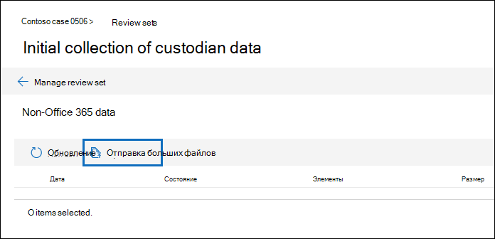

# Загрузка данных, отличных от Office 365, в свидетельство

Не все документы, которые могут потребоваться анализировать при расследовании данных, будут размещены в Office 365. С помощью функции импорта содержимого, отличной от Office 365, вы можете отправлять в доказательства документы, которые не находятся в Office 365, поэтому их можно проанализировать в расследовании данных.

>[!Note]
>Для расследования данных требуется Office 365 E3 с дополнительным соответствием по требованиям или с подпиской на систему с дополнительным соответствием в вашей организации. Если у вас нет этого плана и вы хотите попытаться использовать Расширенное обнаружение электронных данных, вы можете зарегистрироваться в пробной версии Office 365 Enterprise ~.

## До начала работы

Для использования функции отправки, отличной от Office 365, описанной в этой процедуре, необходимо следующее:

- Office 365 E3 с дополнительным подпискум на надстройку или на дополнительные требования.

- Все custodians, для которых содержимое, не относящееся к Office 365, должно быть отправлено в виде E3 с дополнительными лицензиями на надстройку или для установки и возврата.

- Существующее дело обнаружения электронных данных.

- Все файлы для отправки собраны в папки, для которых в одной папке есть папка хранитель, а имя папки в этом формате *Alias@domainname*. *Alias@domainname* должны быть пользователями псевдонимов Office 365 и домена. Вы можете собрать все *Alias@domainname* папки в корневую папку. Корневая папка может содержать только папки *Alias@domainname* , но в корневой папке не должно быть свободных файлов.

- Учетная запись, которая является диспетчером eDiscovery или Microsoft Azure Storage Tools, установленных на компьютере, который имеет доступ к структуре папки контента, отличной от Office 365.

- Установите AzCopy, что можно сделать, выполнив указанные ниже действия.https://docs.microsoft.com/azure/storage/common/storage-use-azcopy

## Отправка контента, отличного от Office 365, во временный анализ данных

1. Откройте * * * * исследование данных * *, после чего выполняется загрузка данных, отличных от Office 365.  Перейдите на вкладку **свидетельство** и выберите набор свидетельств, для которого необходимо загрузить данные 365, не относящиеся к Office.  Если вы еще не создали набор свидетельств, вы можете сделать это сейчас.  Наконец, щелкните **Управление свидетельством** , а затем **Просмотр отправок** в разделе данных, не относящемся к Office 365

2. Нажмите кнопку **отправить файлы** , чтобы запустить мастер импорта данных, не относящийся к Office 365.

3. На первом этапе мастера просто подготавливается безопасный большой двоичный объект Azure для отправляемых файлов.  После завершения подготовки нажмите кнопку " **Далее: Отправка файлов** ".

 
4. На шаге **Отправка файлов** укажите **путь к расположению файлов**, где находятся данные, не относящиеся к Office 365, которые планируется импортировать.  Задание правильного расположения гарантирует, что команда AzCopy будет правильно обновлена.

> [!NOTE]
> Если вы еще не установили AzCopy, вы можете сделать это следующим образом:https://docs.microsoft.com/azure/storage/common/storage-use-azcopy

5. Скопируйте предопределенную команду, щелкнув ссылку **Копировать в буфер обмена** . Запустите командную строку Windows, вставьте команду и нажмите клавишу ВВОД.  Файлы будут отправлены в безопасное хранилище BLOB-объектов Azure для следующего этапа.

6. Наконец, вернитесь к & соответствия требованиям безопасности и нажмите кнопку **Далее: обработка файлов** .  Это инициирует обработку, извлечение текста и индексацию отправленных файлов.  Вы можете отслеживать ход обработки здесь или на вкладке **задания** .  После завершения новые файлы будут доступны в наборе свидетельств.  После завершения обработки можно закрыть мастер.

