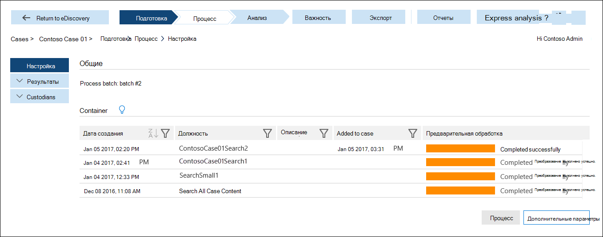

# Подготовка данных для расширенного обнаружения электронных данных (классический)

В этом разделе описывается, как загружать результаты поиска контента в случае с дополнительным обнаружением электронных данных (Classic). 
  
> [!IMPORTANT]
> Так как мы продолжим вкладывать новые версии расширенного обнаружения электронных данных, мы сообщаем выбытие Office 365 Advanced eDiscovery, также известное как *Advanced eDiscovery (классическая)* или *Advanced eDiscovery версии 1.0*. Если вы все еще используете Advanced eDiscovery 1.0, перейдите на версию [Advanced eDiscovery 2.0](overview-ediscovery-20.md) (также известную как *решение Advanced eDiscovery в Microsoft 365*) как можно скорее. Advanced eDiscovery 2.0 имеет те же функции, что и Advanced eDiscovery 1.0, а также множество новых возможностей, таких как управление для хранителя, управление коммуникацией и наборы для проверки. Дополнительные сведения о прекращении поддержки Advanced eDiscovery 1.0 см. в статье [Прекращение поддержки средств прежних версий eDiscovery](legacy-ediscovery-retirement.md#advanced-ediscovery-v10).  
  
## Шаг 1: подготовка данных Office 365 для расширенного обнаружения электронных данных

Для анализа данных с помощью расширенного обнаружения электронных данных можно использовать результаты поиска контента, который вы используете в &amp; центре безопасности Майкрософт 365 (на странице " **Поиск контента** " в центре безопасности &amp; соответствия требованиям Microsoft 365), или при поиске, связанном с вариантом обнаружения электронных данных, на странице **Обнаружение электронных** данных &amp; в центре безопасности и соответствия требованиям. 
  
Подробное описание действий по подготовке результатов поиска для анализа в Advanced eDiscovery приведено в статье [Подготовка результатов поиска для Office 365 Advanced eDiscovery](prepare-search-results-for-advanced-ediscovery.md).
  
> [!NOTE]
> Если у вас есть данные за пределами Office 365 и хотите импортировать их в Office 365, чтобы вы могли подготовить и проанализировать их в Advanced eDiscovery, ознакомьтесь со статьей [Обзор импорта PST-файлов в office 365](https://support.office.com/article/ba688e0a-0fcb-4bd7-8e57-2b669564ea84) и [архивации сторонних данных в Office 365](https://go.microsoft.com/fwlink/p/?linkid=716918). 
  
## Шаг 2: Загрузка данных результатов поиска в дело с дополнительным обнаружением электронных данных

После подготовки результатов поиска в центре безопасности &amp; и соответствия требованиям для анализа следующий шаг — загрузка результатов поиска в случае Advanced eDiscovery. Более подробную информацию можно найти в разделе [Run the process Module](run-the-process-module-in-advanced-ediscovery.md).
  
1. Перейдите по ссылке [https://protection.office.com](https://protection.office.com).
    
2. Войдите в Office 365 с помощью своей рабочей или учебной учетной записи.
    
3. Чтобы отобразился список дел в организации, в Центре безопасности и соответствия требованиям выберите **Поиск и исследование** \> **Обнаружение электронных данных**. 
    
4. Нажмите кнопку **Открыть** рядом с тем случае, в которое вы хотите загрузить данные в разделе Advanced eDiscovery. 
    
5. На странице **Главная** для этого дела выберите **Advanced eDiscovery**. 
    
    
  
    Отображается панель **подключения к расширенному** индикатору выполнения обнаружения электронных данных. При подключении к расширенному обнаружению электронных данных список контейнеров отображается на странице Настройка для этого случая. 
    
    
  
     Эти контейнеры представляют результаты поиска, подготовленные для анализа в ходе расширенного обнаружения электронных данных на этапе 1. Обратите внимание, что имя контейнера имеет то же имя, что и поиск контента, в случае в центре &amp; соответствия требованиям безопасности. Контейнеры в списке подготовлены. Если для расширенного обнаружения электронных данных были подготовлены другие пользовательские результаты поиска, соответствующие контейнеры не будут включены в список. 
    
6. Чтобы загрузить данные результатов поиска из контейнера в дело с дополнительным обнаружением электронных данных, выберите контейнер и нажмите кнопку **обработать**.
    
После добавления результатов поиска из центра безопасности &amp; и соответствия требованиям в Advanced eDiscovery, следующим шагом является использование средств расширенного обнаружения электронных данных для анализа и отбора данных, релевантных для случая. 
  
## См. также

[Расширенное обнаружение электронных данных (классический)](office-365-advanced-ediscovery.md)
  
[Настройка пользователей и обращений](set-up-users-and-cases-in-advanced-ediscovery.md)
  
[Анализ данных дела](analyze-case-data-with-advanced-ediscovery.md)
  
[Управление установкой релевантности](manage-relevance-setup-in-advanced-ediscovery.md)
  
[Использование модуля релевантности](use-relevance-in-advanced-ediscovery.md)
  
[Экспорт данных дела](export-case-data-in-advanced-ediscovery.md)

