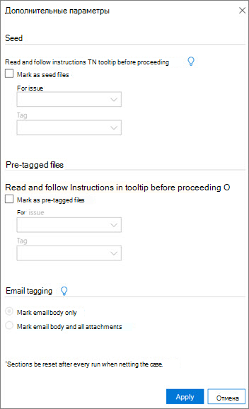

# Запуск модуля процесса и загрузка данных в Advanced eDiscovery (классический)

> [!NOTE]
> Advanced eDiscovery requires an Office 365 E3 with the Advanced Compliance add-on or an E5 subscription for your organization. If you don't have that plan and want to try Advanced eDiscovery, you can [sign up for a trial of Office 365 Enterprise E5](https://go.microsoft.com/fwlink/p/?LinkID=698279). 
  
В этом разделе описываются функциональные возможности модуля "расширенный процесс обнаружения электронных данных". 
  
Кроме данных файлов, метаданные, такие как тип файла, расширение, расположение или путь, Дата и время создания, автор, хранитель и тема, могут быть загружены в Расширенное обнаружение электронных данных и сохранены для каждого случая. Некоторые метаданные рассчитываются с помощью расширенного обнаружения электронных данных, например при загрузке собственных файлов. 
  
Расширенные функции обнаружения электронных данных предоставляют значения системных метаданных, такие как почти повторяющиеся группы или показатели релевантности. Администратор может добавить другие метаданные, например аннотации файлов. 
  
## Запущенный процесс

> [!NOTE]
> Номера пакетов присваиваются файлу во время процесса, чтобы разрешить отслеживание файлов. Пакетный номер также позволяет идентифицировать пакеты процессов для параметров повторной обработки. Дополнительные фильтры доступны для фильтрации по номеру пакета и сеансам. 
  
Выполните указанные ниже действия, чтобы выполнить процесс.
  
1. [Откройте компонент "Безопасность &amp; ". Центр соответствия требованиям](go-to-the-securitycompliance-center.md) . 
    
2. Перейдите к разделу ** &amp; Поиск** с \> **обнаружением электронных** данных и нажмите кнопку **Перейти к расширенному eDiscovery**.
    
3. В разделе Расширенные функции обнаружения электронных данных выберите соответствующее обращение на странице отображаемые **варианты** и нажмите кнопку **Перейти к регистру**.
    
4. В окне **Подготовка** \> **процесса** \> **установки**выберите контейнер из списка доступных контейнеров.
    
    
  
5. Нажмите **Дополнительные параметры...** , если вы хотите добавить контейнер в качестве начальных файлов или в качестве файлов, помеченных как готовые. 
    
    Используйте начальные файлы для ускорения обучения проблем с низким уровнем насыщенности (обычно не более 2%). Для начальных файлов рекомендуется выбирать разнообразные файлы и обрабатывать их по 20-50 для каждой из них (слишком большое число начальных файлов может исказить результаты релевантности). Начальные файлы должны быть проверены одним и тем же человеком, который будет обучать эту ошибку.
    
    Используйте файлы, помеченные предварительно тегами, для автоматизации обучения релевантности. Необходимо отметить по крайней мере 1 500 файлов и сохранить пропорции релевантности для нерелевантных файлов таким же образом, как и в коллекции, добавленной к релевантности. Эти файлы следует замечать вручную, и вы должны быть уверены в качестве тегов.
    
    
  
  - В разделе **SEED** : 
    
    Нажмите **Пометить как начальные файлы** , чтобы пометить контейнер как начальные файлы. Кроме того, в раскрывающемся списке **для устранения неполадок** необходимо назначить их для каждой из них. Выберите один **Relevant** из вариантов в раскрывающемся списке **тегов** или **не имеет отношения** . 
    
    > [!NOTE]
    > После того как вы задаете файлы как **начальные**, вы не сможете пометить их как **предварительно помеченные**. 
  
  - В разделе **файлы с тегами** : 
    
    Выберите пункт пометить **как предварительно помеченные файлы** , чтобы пометить контейнер как файлы, помеченные как готовые. Их также необходимо назначить в раскрывающемся списке **для устранения неполадок** . Выберите один **Relevant** из вариантов в раскрывающемся списке **тегов** или **не имеет отношения** . 
    
    > [!NOTE]
    > После того как вы задаете файлы в виде **предварительных тегов**, их нельзя пометить как **начальные**. 
  
  - В разделе " **теги электронной почты** ". Укажите, какая часть обработанного сообщения должна быть помечена как начальная или предварительно помеченная. 
    
6. Чтобы начать, нажмите кнопку **процесс**. По завершении отображаются результаты процесса.
    
7. Необязательно Если вам нужно назначить источники данных определенному хранитель, вы можете добавлять и изменять имена хранитель в **custodians** \> **управления** и назначать custodians в **custodians** \> **Assign**. 
    
Если вы добавляете к этому случаю, вы можете обработать его еще раз.
  
## Статьи по теме

[Advanced eDiscovery (классическая версия)](office-365-advanced-ediscovery.md)
  
[Просмотр результатов модуля процесса](view-process-module-results-in-advanced-ediscovery.md)

