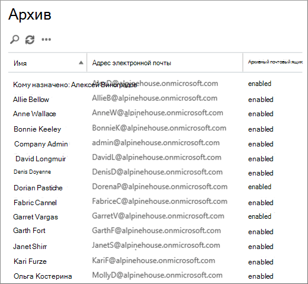
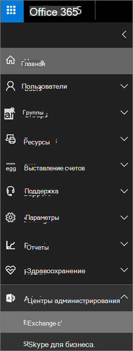
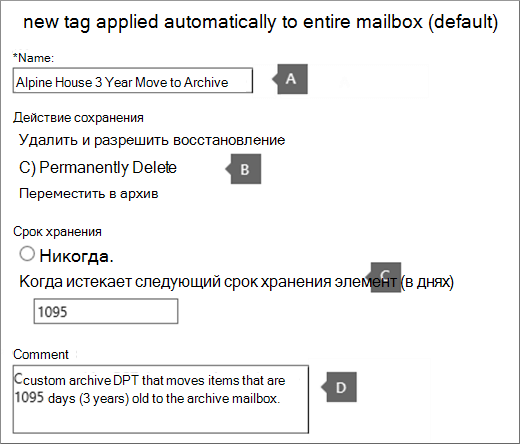
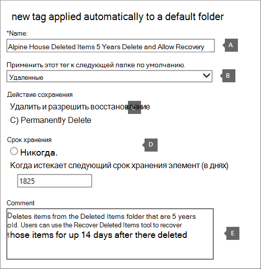
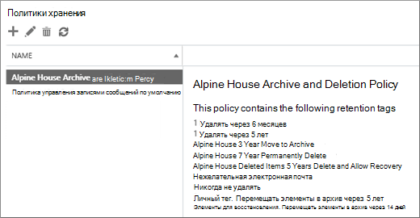

# <a name="set-up-an-archive-and-deletion-policy-for-mailboxes-in-your-organization"></a>Настройка политики архивации и удаления для почтовых ящиков в организации

 В Microsoft 365 администраторы могут создать политику архивации и удаления, которая автоматически перемещает элементы в архивный почтовый ящик пользователя и автоматически удаляет элементы из почтового ящика. Администратор выполняет это, создавая политику хранения, назначенную для почтовых ящиков, и перемещает элементы в архивный почтовый ящик пользователя по истечении определенного периода времени, а также удаляет элементы из почтового ящика после достижения определенного лимита. Фактические правила, определяющие, какие элементы были перемещены или удалены, а когда это происходит, называются тегами хранения. Теги хранения связаны с политикой хранения, которая в свою очередь назначена почтовому ящику пользователя. Тег хранения применяет параметры хранения к отдельным сообщениям и папкам в почтовом ящике пользователя. Он определяет срок хранения сообщения в почтовом ящике и действия, выполняемые при достижении сообщением указанного срока хранения. При достижении срок хранения сообщения он либо перемещается в архивный почтовый ящик пользователя, либо удаляется. 
  
Действия, описанные в этой статье, настраивают политику архивации и хранения для фиктивной организации Alpine House. Настройка этой политики включает в себя следующие задачи:
  
- Включение архивного почтового ящика для каждого пользователя в Организации. Это позволяет пользователям дополнительно добавить хранилище почтовых ящиков и обязательно для того, чтобы политика хранения могла перемещать элементы в архивный почтовый ящик. Кроме того, пользователи могут хранить архивные сведения, перемещая элементы в архивный почтовый ящик. 
    
- Создание трех настраиваемых тегов хранения, которые выполняют следующие действия: 
    
  - Автоматически перемещает элементы, которые старше 3 лет, в архивный почтовый ящик пользователя. Перемещение элементов в архивный почтовый ящик освобождает место в основном почтовом ящике пользователя.
    
  - Автоматически удаляет из папки "Удаленные" элементы, которые устарели на 5 лет. При этом также освобождается место в основном почтовом ящике пользователя. При необходимости у пользователя будет возможность восстановить эти элементы. Дополнительные сведения можно найти в сноске в разделе [Дополнительные сведения](#more-information) . 
    
  - Автоматически (и окончательно) удаляет элементы, старые из основного и архивного почтового ящика — 7 лет. Из-за нормативных требований некоторые организации должны хранить электронную почту в течение определенного периода времени. По истечении этого периода Организации может потребоваться окончательно удалить эти элементы почтовых ящиков пользователей. 
    
- Создание новой политики хранения и добавление в нее новых пользовательских тегов хранения. Кроме того, вы также добавляете встроенные теги хранения в новую политику хранения. Сюда входят персональные теги, которые пользователи могут назначать элементам в их почтовом ящике. Вы также добавите тег хранения, который переместит элементы из папки "элементы с возможностью восстановления" в основном почтовом ящике пользователя в папку "элементы с возможностью восстановления" в своем архивном почтовом ящике. Это помогает освободить место в папке "элементы с возможностью восстановления", когда их почтовые ящики помещается в удержание.
    
Вы можете выполнить некоторые или все действия, описанные в этой статье, чтобы настроить политику архивирования и удаления для почтовых ящиков в своей организации. Рекомендуется протестировать этот процесс на нескольких почтовых ящиках, прежде чем внедрять его во все почтовые ящики в Организации.
  
## <a name="before-you-set-up-an-archive-and-deletion-policy"></a>Перед настройкой политики архивации и удаления

- Для выполнения действий, описанных в этом разделе, необходимо быть глобальным администратором в Организации. 
    
-  При создании новой учетной записи пользователя и назначении пользователю лицензии на Exchange Online для пользователя автоматически создается почтовый ящик. После создания почтового ящика ему автоматически назначается политика хранения по умолчанию с именем Default управления ЗАПИСЯМИ сообщений Policy. В этой статье вы создадите новую политику хранения и назначите ее почтовым ящикам пользователей, заменив политику управления ЗАПИСЯМИ сообщений по умолчанию. В любой момент времени в почтовом ящике может быть назначена только одна политика хранения.
    
- Чтобы узнать больше о тегах хранения и политиках хранения в Exchange Online, ознакомьтесь с [разметкими хранения и политиками хранения](https://go.microsoft.com/fwlink/p/?LinkId=404424).
    
## <a name="step-1-enable-archive-mailboxes-for-users"></a>Шаг 1: включение архивных почтовых ящиков для пользователей

Первым шагом является включение архивного почтового ящика для каждого пользователя в Организации. Архивный почтовый ящик пользователя должен быть включен, чтобы тег хранения с действием хранения "переместить в архив" можно было переместить элемент после истечения срока хранения. 
  
> [!NOTE]
> Вы можете включить архивные почтовые ящики в любое время в течение этого процесса, пока они включены в некоторый момент до завершения процесса. Если архивный почтовый ящик не включен, никакие действия не выполняются ни для каких элементов, для которых назначена политика архивации. 
  
1. Перейдите по адресу [https://protection.office.com](https://protection.office.com).
    
2. Войдите в систему, используя свою учетную запись глобального администратора.
    
    
3. В центре безопасности & соответствия требованиям перейдите в архив управления **сведениями** \> **Archive**.
    
    Отображается список почтовых ящиков в Организации, а также включен или отключен соответствующий архивный почтовый ящик. 
    
4. Выберите все почтовые ящики, щелкнув первую из них в списке, удерживая клавишу **SHIFT** , а затем выбрав последнюю из списка. 
    
    > [!TIP]
    > На этом этапе предполагается, что архивные почтовые ящики не включены. Если у вас есть почтовые ящики с включенным архивом, удерживайте клавишу **CTRL** и щелкайте все почтовые ящики с отключенным архивным почтовым ящиком. Кроме того, можно щелкнуть заголовок столбца **архивного почтового ящика** , чтобы отсортировать строки в зависимости от того, включен или отключен архивный почтовый ящик, чтобы упростить выбор почтовых ящиков. 
  
5. В области сведений в разделе **массовое редактирование**нажмите кнопку **включить**.
    
    Отображается предупреждение о том, что элементы старше двух лет будут перемещены в новый архивный почтовый ящик. Это связано с тем, что политика хранения по умолчанию, назначенная новому почтовому ящику пользователя при его создании, содержит тег политики по умолчанию архива с сроком хранения в 2 года. Тег политики по умолчанию настраиваемого архива, который вы создадите на шаге 2, имеет срок хранения в 3 года. Это означает, что элементы, которые имеют 3 года или более ранних версий, будут перемещены в архивный почтовый ящик.
    
6. Нажмите кнопку **Да** , чтобы закрыть сообщение с предупреждением, и запустите процесс, чтобы включить архивный почтовый ящик для каждого выбранного почтового ящика. 
    
7. По завершении процесса нажмите кнопку **Обновить**  чтобы обновить список на странице **Архив** . 
    
    Архивный почтовый ящик включен для всех пользователей в Организации.
    
    
  
8. Не закрывайте Центр безопасности & соответствия требованиям. Вы будете использовать его на следующем этапе.
    
## <a name="step-2-create-new-retention-tags-for-the-archive-and-deletion-policies"></a>Шаг 2: создание новых тегов хранения для политик архивации и удаления

На этом этапе вы создадите три пользовательских тега хранения, описанные ранее.
  
- "Alpine House 3 Year Move to Archive" (настраиваемая политика архивации)
    
- Alpine House 7 год без возможности восстановления (настраиваемая политика удаления)
    
- Alpine House Deleted Items 5 years Delete and reallow Recovery (настраиваемый тег для папки "Удаленные")
    
Чтобы создать новые теги хранения, вы можете использовать центр администрирования Exchange в организации Exchange Online.
  
1. В центре безопасности & соответствия требованиям щелкните средство запуска приложений в левом верхнем углу, а затем щелкните плитку **Администратор** . 
    
2. В левой области навигации центра администрирования Microsoft 365 щелкните **центр администрирования**, а затем выберите **Exchange**.
    
    
  
3. В центре администрирования Exchange выберите теги **хранения управления соответствием требованиям** \> **Retention tags**
    
    Отобразится список тегов хранения для вашей организации.
    
### <a name="create-a-custom-archive-default-policy-tag"></a>Создание настраиваемого тега политики по умолчанию
  
Сначала вы создадите настраиваемый тег политики по умолчанию (DPT), который будет перемещать элементы в архивный почтовый ящик через 3 года. 
  
1. На странице " **теги хранения** " нажмите **создать тег**создать  , а затем автоматически Установите флажок **Применить автоматически ко всему почтовому ящику (по умолчанию)**. 
    
2. На странице **новый тег автоматически применяется ко всему почтовому ящику (по умолчанию)** заполните следующие поля: 
    
    
  
1. **Name (имя** ) Введите имя нового тега хранения. 
    
2. **Действие хранения** Выберите **переместить в архив** , чтобы переместить элементы в архивный почтовый ящик по истечении периода хранения. 
    
3. Срок **хранения** Выберите, **когда элемент достигает следующего срока хранения (в днях)**, а затем введите продолжительность периода хранения. В этом сценарии элементы будут перемещены в архивный почтовый ящик через 1095 дней (3 года).
    
4. **Comment** (необязательно) введите комментарий, поясняющий назначение настраиваемого тега хранения. 
    
3. Нажмите кнопку **сохранить** , чтобы создать настраиваемый Архив DPT. 
    
    Новый архив DPT отображается в списке тегов хранения.
    
### <a name="create-a-custom-deletion-default-policy-tag"></a>Создание настраиваемого тега политики по умолчанию для удаления
  
Далее вы создадите еще один настраиваемый DPT, но это будет политика удаления, которая окончательно удаляет элементы после 7 лет.
  
1. На странице " **теги хранения** " нажмите **создать тег**создать  , а затем автоматически Установите флажок **Применить автоматически ко всему почтовому ящику (по умолчанию)**. 
    
2. На странице **новый тег автоматически применяется ко всему почтовому ящику (по умолчанию)** заполните следующие поля: 
    
    
  
1. **Name (имя** ) Введите имя нового тега хранения. 
    
2. **Действие хранения** Выберите **навсегда удалить** , чтобы очистить элементы из почтового ящика по истечении срока хранения. 
    
3. Срок **хранения** Выберите, **когда элемент достигает следующего срока хранения (в днях)**, а затем введите продолжительность периода хранения. В этом случае элементы будут очищаться после 2555 дней (7 лет).
    
4. **Comment** (необязательно) введите комментарий, поясняющий назначение настраиваемого тега хранения. 
    
3. Нажмите кнопку **сохранить** , чтобы создать настраиваемое DPT удаления. 
    
    Новый DPT удаления отображается в списке тегов хранения.
    
### <a name="create-a-custom-retention-policy-tag-for-the-deleted-items-folder"></a>Создание настраиваемого тега политики хранения для папки "Удаленные"
  
Последний созданный тег хранения — это настраиваемый тег политики хранения (RPT) для папки "Удаленные". Этот тег удалит элементы в папке "Удаленные" через 5 лет и предоставляет период восстановления, когда пользователи могут использовать средство восстановления удаленных элементов для восстановления элемента.
  
1. На странице " **теги хранения** " нажмите **создать тег** создать  , а затем автоматически Установите флажок **применено к папке по умолчанию**. 
    
2. В **новом теге, автоматически примененном к странице папки по умолчанию** , заполните следующие поля: 
    
    
  
1. **Name (имя** ) Введите имя нового тега хранения. 
    
2. **Применять этот тег к следующей папке по умолчанию** В раскрывающемся списке выберите пункт **Удаленные элементы**.
    
3. **Действие хранения** Выберите пункт **Удалить и разрешить восстановление** , чтобы удалить элементы по истечении срока хранения, но разрешить пользователям восстанавливать удаленные элементы в течение срока хранения удаленных элементов (значение по умолчанию — 14 дней). 
    
4. Срок **хранения** Выберите, **когда элемент достигает следующего срока хранения (в днях)**, а затем введите продолжительность периода хранения. В этом случае элементы будут удалены по истечении 1825 дней (5 лет).
    
5. **Comment** (необязательно) введите комментарий, поясняющий назначение настраиваемого тега хранения. 
    
3. Нажмите кнопку **сохранить** , чтобы создать настраиваемый RPT для папки "Удаленные". 
    
    Новый RPT отображается в списке тегов хранения.

## <a name="step-3-create-a-new-retention-policy"></a>Шаг 3: создание новой политики хранения

После создания пользовательских тегов хранения следующим шагом является создание новой политики хранения и добавление тегов хранения. Вы добавите три настраиваемых тега хранения, созданные в шаге 2, и встроенные теги, упомянутые в первом разделе. На шаге 4 вы присвоите новую политику хранения почтовым ящикам пользователей.
  
1. В центре администрирования Exchange перейдите к разделу политики хранения **управления соответствием требованиям** \> **Retention policies**.
    
2. На странице " **политики хранения** " нажмите кнопку **создать**  .
    
3. В поле **имя** введите имя новой политики хранения; Например, " **Alpine House Archive and Repolicy Policy**". 
    
4. В разделе **теги хранения**нажмите кнопку **Добавить**  .
    
    Отобразится список тегов хранения в Организации. Обратите внимание на то, что отображаются настраиваемые теги, созданные в шаге 2.
    
5. Добавьте теги хранения 9, выделенные на следующем снимке экрана (эти теги подробно описаны в разделе [Дополнительные сведения](#more-information) ). Чтобы добавить тег хранения, выберите его и нажмите кнопку **Добавить**. 
    
    
  
    > [!TIP]
    > Можно выбрать несколько тегов хранения, удерживая нажатой клавишу **CTRL** и щелкая каждый тег. 
  
6. Добавив теги хранения, нажмите кнопку **ОК**.
    
7. На странице **Создание политики хранения** нажмите кнопку **сохранить** , чтобы создать новую политику. 
    
    Новая политика хранения появится в списке. Выберите его, чтобы отобразить теги хранения, связанные с ним, в области сведений.
    
    
  
## <a name="step-4-assign-the-new-retention-policy-to-user-mailboxes"></a>Шаг 4: назначение новой политики хранения почтовым ящикам пользователей

При создании нового почтового ящика по умолчанию ему назначается политика хранения с именем Default управления ЗАПИСЯМИ сообщений Policy. На этом этапе вы заменили эту политику хранения (так как для почтового ящика может быть назначена только одна политика хранения), назначая новую политику хранения, созданную на шаге 3, в почтовые ящики пользователей в Организации. На этом этапе предполагается, что новая политика будет назначена всем почтовым ящикам в Организации.
  
1. В Центре администрирования Exchange выберите элементы **Получатели** \> **Почтовые ящики**.
    
    Отобразится список всех почтовых ящиков пользователей в Организации. 
    
2. Выберите все почтовые ящики, щелкнув первую из них в списке, удерживая клавишу **SHIFT** , а затем выбрав последнюю из списка. 
    
3. В области сведений в правой части центра администрирования Exchange в разделе **массовое редактирование**щелкните **Дополнительные параметры**.
    
4. В разделе **Политика хранения** щелкните **Обновить**.
    
5. На странице " **массовое назначение политики хранения** " в раскрывающемся списке **выберите политику хранения** выберите политику хранения, созданную на шаге 3. Например, " **Архив и политика хранения" Alpine House**.
    
6. Нажмите кнопку **сохранить** , чтобы сохранить новое назначение политики хранения. 
    
7. Чтобы убедиться, что новая политика хранения была назначена почтовым ящикам, выполните следующие действия: выберите почтовый ящик на странице почтовые ящики и нажмите кнопку Изменить. 
    
1. Выберите почтовый ящик на странице **почтовые ящики** и нажмите кнопку **изменить**  . 
    
2. На странице свойств почтового ящика для выбранного пользователя нажмите кнопку **функции почтового ящика**.
    
    Имя новой политики, назначенной для почтового ящика, отображается в раскрывающемся списке **Политика хранения** . 

## <a name="optional-step-5-run-the-managed-folder-assistant-to-apply-the-new-settings"></a>Необязательно Шаг 5: запуск помощника для управляемых папок для применения новых параметров

После применения новой политики хранения к почтовым ящикам на шаге 4 может потребоваться до 7 дней в Exchange Online, чтобы новые параметры хранения применялись к почтовым ящикам. Это связано с тем, что процесс, называемый помощником для управляемых папок, обрабатывает почтовые ящики каждые 7 дней. Вместо ожидания запуска помощника для управляемых папок можно выполнить это, выполнив командлет **Start-ManagedFolderAssistant** в Exchange Online PowerShell. 
  
 **Что происходит при запуске помощника для управляемых папок?** Он применяет параметры в политике хранения, изучая элементы в почтовом ящике и определяя, подлежит ли они хранению. Затем он помечает элементы для хранения с соответствующим тегом хранения, а затем выполняет указанное действие хранения для элементов, срок хранения которых истек. 
  
Выполните действия, необходимые для подключения к Exchange Online PowerShell, а затем запустите помощник по работе с управляемыми папками для всех почтовых ящиков в Организации.

1. [Подключение к Exchange Online PowerShell](https://go.microsoft.com/fwlink/p/?LinkId=517283).
  
2. Выполните две следующие команды для запуска помощника по работе с управляемыми папками для всех почтовых ящиков пользователей в Организации.
    
    ```powershell
    $Mailboxes = Get-Mailbox -ResultSize Unlimited -Filter {RecipientTypeDetails -eq "UserMailbox"}
    ```

    ```powershell
    $Mailboxes.Identity | Start-ManagedFolderAssistant
    ```

Вот и все! Вы настроили политику архивирования и удаления для организации Alpine House.
  
## <a name="optional-step-6-make-the-new-retention-policy-the-default-for-your-organization"></a>Необязательно Шаг 6: назначение новой политики хранения для Организации по умолчанию

На шаге 4 необходимо назначить новую политику хранения существующим почтовым ящикам. Но вы можете настроить Exchange Online так, чтобы новая политика хранения приступила к новым почтовым ящикам, созданным в будущем. Это можно сделать с помощью Exchange Online PowerShell, чтобы обновить план почтовых ящиков по умолчанию для Организации. *План почтового ящика* — это шаблон, который автоматически настраивает свойства для новых почтовых ящиков.  На этом необязательном этапе вы можете заменить текущую политику хранения, назначенную плану почтовых ящиков (по умолчанию политика управления ЗАПИСЯМИ сообщений по умолчанию), на политику хранения, созданную на шаге 3. После обновления плана почтовых ящиков новая политика хранения будет назначена новым почтовым ящикам.

1. [Подключение к Exchange Online PowerShell](https://go.microsoft.com/fwlink/p/?LinkId=517283).

2. Выполните следующую команду, чтобы отобразить сведения о планах почтовых ящиков в Организации.

    ```powershell
    Get-MailboxPlan | Format-Table DisplayName,RetentionPolicy,IsDefault
    ```
    
    Обратите внимание на план почтовых ящиков, установленный по умолчанию.

3. Выполните следующую команду, чтобы назначить новую политику хранения, созданную на этапе 3 (например, " **Архив и политика хранения**" для "Alpine House"), в план почтовых ящиков по умолчанию. В этом примере предполагается, что имя плана почтовых ящиков по умолчанию — **ExchangeOnlineEnterprise**.

    ```powershell
    Set-MailboxPlan "ExchangeOnlineEnterprise" -RetentionPolicy "Alpine House Archive and Retention Policy"
    ```

4. Чтобы убедиться в том, что политика хранения, назначенная плану почтовых ящиков по умолчанию, была изменена, можно повторно выполнить команду в действии 2.

## <a name="more-information"></a>Дополнительные сведения

- Как рассчитан срок хранения? Срок хранения элементов почтового ящика рассчитывается на основе даты доставки или даты создания таких элементов, как черновики, которые не были отправлены, но созданы пользователем. Когда помощник для управляемых папок обрабатывает элементы в почтовом ящике, он помечает дату начала и дату окончания срока хранения для всех элементов, которые имеют теги хранения с действием хранения Удалить и разрешить восстановление или Удалить навсегда. Элементы с тегом архива помечаются датой перемещения. 
    
- В следующей таблице приведены дополнительные сведения о каждом теге хранения, который добавляется к настраиваемой политике хранения, созданной в соответствии с инструкциями, приведенными в этом разделе.
    
    |**Тег хранения**|**Что делает этот тег**|**Встроенные или настраиваемые?**|**Тип**|
    |:-----|:-----|:-----|:-----|
    |Перемещение в архив Alpine House 3 Year  <br/> |Перемещает элементы, которые старше 1095 дней (3 года), в архивный почтовый ящик.  <br/> |Настраиваемая (см [. шаг 2: создание новых тегов хранения для политик архивации и удаления](#step-2-create-new-retention-tags-for-the-archive-and-deletion-policies))  <br/> |Тег политики по умолчанию (Archive); Этот тег автоматически применяется ко всему почтовому ящику.  <br/> |
    |Alpine House 7 год окончательное удаление  <br/> |Окончательно удаляет элементы в основном почтовом ящике или архивном почтовом ящике, если они старше 7 лет.  <br/> |Настраиваемая (см [. шаг 2: создание новых тегов хранения для политик архивации и удаления](#step-2-create-new-retention-tags-for-the-archive-and-deletion-policies))  <br/> |Тег политики по умолчанию (удаление); Этот тег автоматически применяется ко всему почтовому ящику.  <br/> |
    |Alpine House Deleted Items 5 years Delete and reallow Recovery  <br/> |Удаляет элементы из папки "Удаленные", которые старше 5 лет. Пользователи могут восстановить эти элементы в течение 14 дней после их удаления.<sup>\*</sup> <br/> |Настраиваемая (см [. шаг 2: создание новых тегов хранения для политик архивации и удаления](#step-2-create-new-retention-tags-for-the-archive-and-deletion-policies))  <br/> |Тег политики хранения (удаленные элементы); Этот тег автоматически применяется к элементам в папке "Удаленные".  <br/> |
    |Элементы, которые можно восстановить в течение 14 дней перемещение в архив  <br/> |Перемещает элементы, которые находятся в папке "элементы с возможностью восстановления" в течение 14 дней, в папку "элементы с возможностью восстановления" в архивном почтовом ящике.  <br/> |Встроенные  <br/> |Тег политики хранения (элементы с возможностью восстановления); Этот тег автоматически применяется к элементам в папке "элементы с возможностью восстановления".  <br/> |
    |Нежелательная почта  <br/> |Окончательно удаляет элементы, которые находятся в папке "Нежелательная почта", в течение 30 дней. Пользователи могут восстановить эти элементы в течение 14 дней после их удаления.<sup>\*</sup> <br/> |Встроенные  <br/> |Тег политики хранения (Нежелательная почта); Этот тег автоматически применяется к элементам в папке "Нежелательная почта".  <br/> |
    |Удалять через 1 месяц  <br/> |Окончательно удаляет элементы старше 30 дней. Пользователи могут восстановить эти элементы в течение 14 дней после их удаления.<sup>\*</sup> <br/> |Встроенные  <br/> |Личного Этот тег может применяться пользователями.  <br/> |
    |Удалять через 1 год  <br/> |Окончательно удаляет элементы, которые старше 365 дней. Пользователи могут восстановить эти элементы в течение 14 дней после их удаления.<sup>\*</sup> <br/> |Встроенные  <br/> |Личного Этот тег может применяться пользователями.  <br/> |
    |Никогда не удалять  <br/> |Этот тег запрещает удаление элементов с помощью политики хранения.  <br/> |Встроенные  <br/> |Личного Этот тег может применяться пользователями.  <br/> |
    |Личный тег. Перемещать элементы в архив через 1 год  <br/> |Перемещает элементы в архивный почтовый ящик через 1 год.  <br/> |Встроенные  <br/> |Личного Этот тег может применяться пользователями.  <br/> |
   
    > <sup>\*</sup>Пользователи могут использовать средство восстановления удаленных элементов в Outlook и Outlook в Интернете (прежнее название — Outlook Web App) для восстановления удаленного элемента в период хранения удаленных элементов, который по умолчанию равен 14 дням в Exchange Online. Администратор может использовать Windows PowerShell, чтобы увеличить срок хранения удаленных элементов до 30 дней. Дополнительные сведения см. в статье [Восстановление удаленных элементов в Outlook для Windows](https://support.office.com/article/49e81f3c-c8f4-4426-a0b9-c0fd751d48ce) и [изменение срока хранения удаленных элементов для почтового ящика в Exchange Online](https://www.microsoft.com/?ref=go)
  
- Использование **элементов с возможностью восстановления в течение 14 дней перемещение в архивный** тег позволяет освободить дисковое пространство в папке "элементы с возможностью восстановления" в основном почтовом ящике пользователя. Это полезно, когда почтовый ящик пользователя находится на удержании, что означает, что почтовый ящик пользователя никогда не удаляется навсегда. Если вы не переместите элементы в архивный почтовый ящик, будет достигнута квота хранилища для папки "элементы с возможностью восстановления" в основном почтовом ящике. Дополнительные сведения об этом и способах их устранения см в статье [увеличение квоты элементов с возможностью восстановления для почтовых ящиков на удержании](https://go.microsoft.com/fwlink/p/?LinkId=786479).
