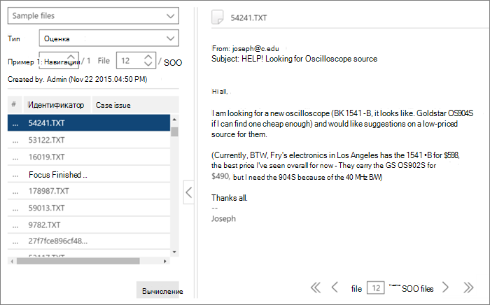

# Расстановка тегов и релевантности в Advanced eDiscovery (классический)

> [!NOTE]
> Чтобы можно было использовать Advanced eDiscovery, требуется подписка на Office 365 E3 с надстройкой Advanced Compliance или E5 для организации. Если у вас этого плана нет и вы хотите попробовать Advanced eDiscovery, можете [зарегистрироваться для получения пробной версии Office 365 корпоративный E5](https://go.microsoft.com/fwlink/p/?LinkID=698279). 
  
В этом разделе описывается процедура работы с дополнительным модулем обучения по релевантности eDiscovery. 
  
После завершения оценки в Advanced eDiscovery и перехода к этапу обучения релевантности учебный пример из 40 файлов добавляется на вкладку Теги для тегирования. 
  
## Обучение по релевантности

1. На вкладке **тег \> релевантности** область тегов отображается по умолчанию в левой области, а на экране отображаются файлы образцов, по одному для маркировки. 
    
    
  
    На вкладке **тег** отображается отображаемое имя файла. Это может быть путь, тема сообщения электронной почты, название или определенное пользователем имя. Чтобы скопировать идентификатор, путь к файлу или текстовый путь, щелкните правой кнопкой мыши путь к файлу. 
    
    В статистике с помощью вкладки **тегов** отображается номер примера файла (в верхней части левой области), число файлов, отображаемых в текущий момент, из итоговых файлов в примере (Нижняя часть правой области) и текущее общее число файлов с тегами в примере (внизу левой области), которые изменяются при разметке файлов. Это применимо ко всем разметке релевантности, будь то оценка, обучение, анализ или тестирование. 
    
    Значки, указывающие на наличие комментариев, тегов и файлов семьи, отображаются в представлении файлов на панели над файлом.
    
2. Определите релевантность файла для этой ситуации и пометьте файл с помощью кнопок значка метки или сочетаний клавиш, как показано в следующей таблице:

|**Параметр тегирования**|**Описание**|**Сочетание клавиш**|**Несколько проблем — сочетание клавиш для массовых тегов**|
|-----|-----|-----|-----|
|R    |Существенно    |Z    |Shift + Z    |
|нр    |Не релевантно    |X    |SHIFT + X    |
|Пропустить    |Пропустить    |C    |Shift + A    |
   
  - Если для файла существует несколько проблем, после разметки одной проблемы выделение перемещается на следующий вопрос (при наличии). 
    
  - Ключевые слова, которые были определены администратором или управляющим делами при выделении ключевых слов \> (параметры релевантности выделены ключевые слова), будут отображаться (в указанных цветах) для определения релевантных файлов при разметке тегами. Если у ключевого слова есть двойное подчеркивание, его можно щелкнуть, чтобы отобразить подсказку с описанием ключевого слова. 
    
    При необходимости на вкладке **тег** щелкните **параметры тегов** , чтобы задать следующие параметры: 
    
    
  
  - **Групповой тег**: Используйте этот параметр, чтобы назначить несколько проблем для файла, выбрав пункт **все** , чтобы задать тег для выбранного файла для всех проблем (переопределения, которые уже были помечены) или выбрав **остальные** , чтобы применить тег к оставшимся проблемам без тегов. Выбранный параметр действует во всех случаях этого пользователя до тех пор, пока он не будет изменен пользователем (значение параметра — для всех пользовательских вариантов). 
    
  - **Автоматический тег**: Установите этот флажок, чтобы задать другие проблемы для файла, как неприменимо после одной соответствующей разметки.
    
  - **Автоматический**перевод: Установите этот флажок, чтобы при разметке для последней или только непомеченной задачи при разметке отображался выбранный файл. 
    
    Пропущенные файлы не будут учитываться для обучения релевантности и оценки релевантности.
    
3. Комментарии с произвольным текстом, связанные с файлом, можно просматривать и редактировать с помощью параметра **Комментарий** в раскрывающемся списке области слева. (необязательный) 
    
4. Инструкции по разметке можно просмотреть, выбрав параметр **рекомендации по разметке** в раскрывающемся списке области слева. 
    
5. После того как вы закончите маркировку всех файлов в списке и будете готовы вычислить результаты, нажмите кнопку **вычислить**. Отображается вкладка **Отслеживание** . 
    
## Работа со списком образцов файлов

Список "примеры файлов" позволяет просматривать список файлов в учебном образце и выполнять различные действия с одним или несколькими файлами. На вкладке **тег** **релевантности** \> в области слева " **примеры файлов** " отображается список образцов файлов для обработки с процессами оценки, обучения, отслеживания и несоответствий. 
  
1. На вкладке **тег \> релевантности** в раскрывающемся списке области слева выберите пункт файлы примеров. Примеры файлов перечислены в левой области. 
    
    
  
2. Выберите определенный пример или номер файла, введя или выбрав его номер в полях **Sample** или **File** . 
    
  -   - Номер последовательности файлов указан в левом столбце списка отображаемых файлов на вкладке **тег** . Щелкнув заголовок, исходный порядок отображения файлов возвращается в исходный порядок. 
    
  - При нажатии строки файла в правой панели отображается его содержимое.
    
  - Переходить между файлами в текущем примере с помощью нижних параметров строки меню. Кроме того, доступны сочетания клавиш для навигации.
    
    Переход к первому файлу в примере: Shift + Ctrl +\<
    
    Переход к предыдущему файлу в примере: Shift +\<
    
    Переход к следующему файлу в примере: Shift +\>
    
    Переход к последнему файлу в примере: Shift + Ctrl +\>
    
## См. также

[Расширенное обнаружение электронных данных (классический)](office-365-advanced-ediscovery.md)
  
[Понимание оценки релевантности](assessment-in-relevance-in-advanced-ediscovery.md)
  
[Маркировка и оценка](tagging-and-assessment-in-advanced-ediscovery.md)
  
[Анализ релевантности отслеживания](track-relevance-analysis-in-advanced-ediscovery.md)
  
[Выбор на основе результатов](decision-based-on-the-results-in-advanced-ediscovery.md)
  
[Анализ релевантности тестирования](test-relevance-analysis-in-advanced-ediscovery.md)

