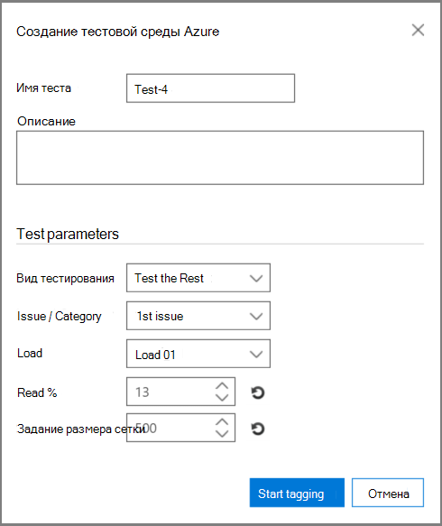

# Анализ релевантности тестирования в Office 365 Advanced eDiscovery

> [!NOTE]
> Чтобы можно было использовать Advanced eDiscovery, требуется подписка на Office 365 E3 с надстройкой Advanced Compliance или E5 для организации. Если у вас этого плана нет и вы хотите попробовать Advanced eDiscovery, можете [зарегистрироваться для получения пробной версии Office 365 корпоративный E5](https://go.microsoft.com/fwlink/p/?LinkID=698279). 
  
Вкладка тест в Advanced eDiscovery позволяет тестировать, сравнивать и проверять общее качество обработки. Эти тесты выполняются после пакетного вычисления. Размечая файлы в коллекции, эксперт делает последние сведения о том, действительно ли каждый из них имеет отношение к регистру. 
  
В сценариях с одним и несколькими проблемами тесты обычно выполняются для каждой проблемы. Результаты можно просматривать после каждого теста, а результаты тестирования можно переработать с указанным образцом тестовых файлов.
  
## Тестирование REST

Тест "тестирование REST" используется для проверки решений, связанных с отбором, например, для просмотра только файлов, относящихся к определенному показателю порогового значения релевантности, на основе итоговых дополнительных результатов обнаружения электронных данных. Эксперт просматривает пример файлов в выбранном показателе отсечки для оценки количества соответствующих файлов в этом наборе.
  
В этом тесте предоставляется статистика и сравнивается набор проверки и проверяется заполнение REST. Результаты набора проверки рассчитываются по релевантности во время обучения. Результаты включают вычисления на основе параметров и входных параметров, таких как:
  
- Протестируйте пример статистики количества файлов в примере и определенных релевантных файлов. 
    
- Табличное сравнение параметров заполнения для набора проверки и REST, например, количества файлов, оценочного количества релевантных файлов, оценки полноты и средней стоимости поиска дополнительного релевантного файла. Настройка параметров затрат может быть задана администратором.
    
1. Откройте вкладку **Проверка \> релевантности** . 
    
2. На вкладке **тест** нажмите кнопку **создать тест**. Откроется диалоговое окно **Создание теста** , как показано в следующем примере. 
    
    
  
3. В поле **имя теста**и **Описание**введите имя и описание.
    
4. В списке **тип теста** выберите пункт **Проверка оставшейся части**
    
5. В списке " **выдача и Категория** " выберите имя вопроса. 
    
6. В списке **Загрузка** выберите Load (загрузить). 
    
7. В разделе **Read% (чтение%**) примите значение по умолчанию или выберите значение для оценки релевантности. 
    
8. В поле **задать размер**или примите значение по умолчанию. Обратите внимание на то, что значки восстановления восстанавливают значения по умолчанию.
    
9. Нажмите кнопку **начать маркировку**. Создается пример теста.
    
10. Просмотрите и пометьте все файлы на вкладке **тег релевантности \> ** и по завершении нажмите кнопку **вычислить**.
    
11. На вкладке тест можно щелкнуть **Просмотреть результаты** , чтобы просмотреть результаты теста. Пример показан на следующем рисунке. 
    
    
  
На приведенном выше рисунке в разделе **примеры параметров** таблицы содержатся сведения о количестве файлов в образце, помеченном экспертом, и количестве соответствующих файлов, найденных в этом примере. 
  
Раздел " **параметры заполнения** " таблицы содержит результаты тестирования, в том числе набор проверки заполнения файлов с оценкой ниже выбранной отсечки и "оставшиеся" файлы с оценкой, превышающим выбранную отсечение. Для каждого заполнения отображаются следующие результаты: 
  
- Включает файлы с пороговой прочтением%
    
- Общее число файлов 
    
- Предполагаемое количество релевантных файлов 
    
- Оценка возможностей 
    
- Средняя стоимость проверки поиска другого соответствующего файла
    
## Тестирование фрагмента

Тест выполняет тестирование, аналогичный тесту "тестирование REST", но к сегменту набора файлов, указанному в релевантности Read%.
  
1. Откройте вкладку **Проверка \> релевантности** . 
    
2. На вкладке **тест** нажмите кнопку **создать тест**. Откроется диалоговое окно **Создание теста** . 
    
3. В поле имя и **Описание** **теста** введите данные.
    
4. В списке **тип теста** выберите пункт **Проверка среза**.
    
5. В списке " **Ошибка** " выберите имя вопроса. 
    
6. В списке **Загрузка** выберите Load (загрузить). 
    
7. В разделе **Чтение% между**примите значения по умолчанию: минимальное и большое значения диапазона или выберите значения для показателей релевантности. 
    
8. В поле Выбор **размера**выберите значение или примите значение по умолчанию.
    
    Значки восстановления восстанавливают значение по умолчанию.
    
9. Нажмите кнопку **начать маркировку**. Создается пример теста.
    
10. Просмотрите и пометьте все файлы на вкладке **тег релевантности \> ** и по завершении нажмите кнопку **вычислить**. 
    
11. На вкладке тест можно щелкнуть **Просмотреть результаты** , чтобы просмотреть результаты теста. 
    
## См. также

[Office 365 Advanced eDiscovery](office-365-advanced-ediscovery.md)
  
[Понимание оценки релевантности](assessment-in-relevance-in-advanced-ediscovery.md)
  
[Маркировка и оценка](tagging-and-assessment-in-advanced-ediscovery.md)
  
[Расстановка тегов и релевантности](tagging-and-relevance-training-in-advanced-ediscovery.md)
  
[Анализ релевантности отслеживания](track-relevance-analysis-in-advanced-ediscovery.md)
  
[Выбор на основе результатов](decision-based-on-the-results-in-advanced-ediscovery.md)

