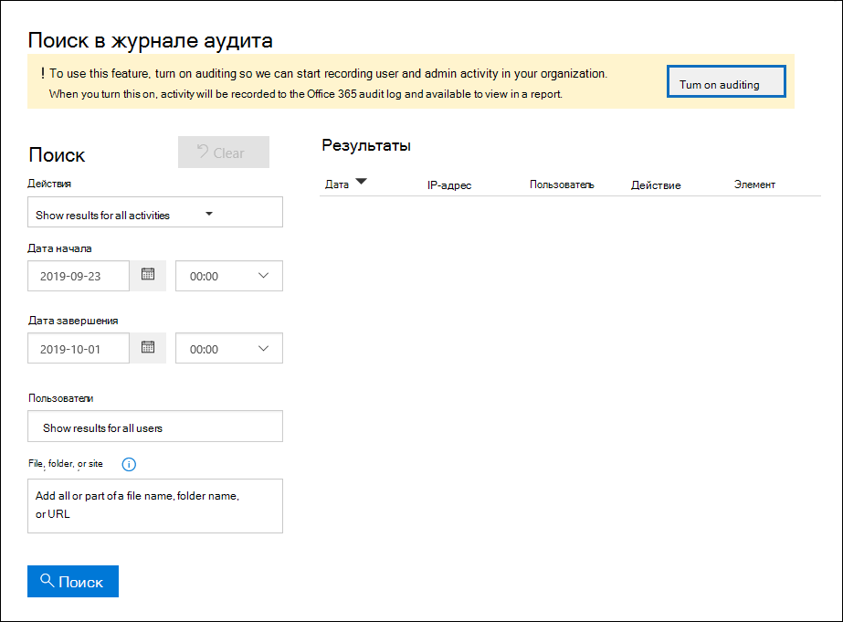

# <a name="turn-audit-log-search-on-or-off"></a>Включение и отключение поиска в журнале аудита

Перед началом поиска в журнале аудита необходимо включить ведение журнала аудита (или другого администратора). Когда включен Поиск в журнале аудита в центре безопасности & соответствия требованиям, действия пользователей и администраторов из вашей организации записываются в журнал аудита и хранятся в течение 90 дней, а также в соответствии с лицензией, назначенной пользователям. Тем не менее, в организации могут возникнуть причины, по которым не нужно заносить и хранить данные журнала аудита. В таких случаях глобальный администратор может отключить аудит в Microsoft 365.

> [!IMPORTANT]
> Если отключить поиск в журнале аудита в Microsoft 365, вы не сможете использовать API действий управления Office 365 или метку Azure для доступа к данным аудита в Организации. Чтобы отключить поиск в журнале аудита, выполнив действия, описанные в этой статье, это означает, что при поиске в журнале аудита с помощью центра безопасности & соответствия требованиям или при запуске командлета **Search-UnifiedAuditLog** в Exchange Online PowerShell не будет возвращено никаких результатов. Это также означает, что журналы аудита не будут доступны через API действий управления Office 365 или Sentinel.
  
## <a name="before-you-turn-audit-log-search-on-or-off"></a>Прежде чем включать или отключать поиск в журнале аудита

- Роль журналов аудита в Exchange Online должна быть назначена для включения или отключения поиска журнала аудита в организации Microsoft 365. По умолчанию эта роль назначается группам ролей "Управление соответствием требованиям" и "Управление организацией" на странице " **разрешения** " в центре администрирования Exchange. Глобальные администраторы в Microsoft 365 являются участниками группы ролей Управление организацией в Exchange Online. 
    
    > [!NOTE]
    > Пользователям необходимо назначить разрешения в Exchange Online, чтобы включить или отключить поиск в журнале аудита. Если вы назначили пользователям роль "журналы аудита" на странице " **разрешения** " центра безопасности & соответствия требованиям, они не смогут включать или отключать поиск в журнале аудита. Это вызвано тем, что базовый командлет является командлетом Exchange Online. 
    
- Пошаговые инструкции по поиску в журнале аудита приведены [в статье Поиск в журнале аудита в центре безопасности & соответствия требованиям](search-the-audit-log-in-security-and-compliance.md). Дополнительные сведения об API действий по управлению Microsoft 365 приведены в разделе [Начало работы с API управления microsoft 365](https://docs.microsoft.com/office/office-365-management-api/get-started-with-office-365-management-apis).
    
## <a name="turn-on-audit-log-search"></a>Включение поиска в журнале аудита

Для включения поиска журнала аудита в Microsoft 365 можно использовать центр безопасности & соответствия требованиям или PowerShell. После включения поиска в журнале аудита может потребоваться несколько часов, прежде чем вы сможете вернуть результаты при поиске в журнале аудита. Чтобы включить поиск журнала аудита, необходимо назначить роль журналов аудита в Exchange Online.
  
### <a name="use-the-security--compliance-center-to-turn-on-audit-log-search"></a>Использование центра безопасности & соответствия требованиям для включения поиска в журнале аудита

1. [Перейдите в центр безопасности & соответствия требованиям](https://protection.office.com) и войдите в систему.

2. В центре безопасности & соответствия требованиям выберите Поиск в **Search** \> **журнале аудита**поиска.

   Отображается баннер, в котором нужно включить аудит для записи действий пользователей и администраторов.

3. Щелкните **включить аудит**.

    
  
    Баннер обновляется, чтобы сказать, что журнал аудита подготавливается, и вы можете выполнять поиск действий пользователей и администраторов через несколько часов.

### <a name="use-powershell-to-turn-on-audit-log-search"></a>Включение поиска в журнале аудита с помощью PowerShell

1. [Подключение к PowerShell Exchange Online](https://go.microsoft.com/fwlink/p/?LinkID=396554)

2. Выполните следующую команду PowerShell, чтобы включить поиск журнала аудита в Office 365.

    ```powershell
    Set-AdminAuditLogConfig -UnifiedAuditLogIngestionEnabled $true
    ```

    Отображается сообщение о том, что изменение вступит в силу до 60 минут.
  
## <a name="turn-off-audit-log-search"></a>Отключение поиска в журнале аудита

Чтобы отключить поиск в журнале аудита, необходимо использовать удаленную оболочку PowerShell, подключенную к организации Exchange Online. Аналогично включению поиска в журнале аудита необходимо назначить роль журналов аудита в Exchange Online, чтобы отключить поиск в журнале аудита.
  
1. [Подключение к PowerShell Exchange Online](https://go.microsoft.com/fwlink/p/?LinkID=396554)

2. Выполните следующую команду PowerShell, чтобы отключить поиск в журнале аудита в Office 365.

    ```powershell
    Set-AdminAuditLogConfig -UnifiedAuditLogIngestionEnabled $false
    ```

3. Через некоторое время убедитесь, что поиск в журнале аудита отключен (отключен). Это можно сделать двумя способами:

    - В PowerShell выполните следующую команду:

    ```powershell
    Get-AdminAuditLogConfig | FL UnifiedAuditLogIngestionEnabled
    ```

      Значение `False` свойства _унифиедаудитлогинжестионенаблед_ указывает на то, что поиск журнала аудита отключен. 

    - В [центре безопасности & соответствия требованиям](https://protection.office.com)выберите Поиск в **Search** \> **журнале аудита**поиска.

      Отображается баннер, в котором необходимо включить аудит для записи действий пользователей и администраторов.