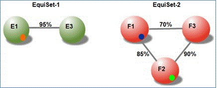

# Принцип подобия документов в Advanced eDiscovery (классический)Understand document similarity in Advanced eDiscovery (classic)

> [!NOTE]
> Чтобы можно было использовать Advanced eDiscovery, требуется подписка на Office 365 E3 с надстройкой Advanced Compliance или E5 для организации. Если у вас этого плана нет и вы хотите попробовать Advanced eDiscovery, можете [зарегистрироваться для получения пробной версии Office 365 корпоративный E5](https://go.microsoft.com/fwlink/p/?LinkID=698279).Advanced eDiscovery requires an Office 365 E3 with the Advanced Compliance add-on or an E5 subscription for your organization. If you don't have that plan and want to try Advanced eDiscovery, you can [sign up for a trial of Office 365 Enterprise E5](https://go.microsoft.com/fwlink/p/?LinkID=698279). 
  
В Advanced eDiscovery сходство документов — это минимальный уровень сходства, необходимый для двух документов, которые должны рассматриваться как почти повторяющиеся.In Advanced eDiscovery, Document Similarity is the minimal level of resemblance required for two documents to be considered as near-duplicates.
  
> [!TIP]
> Для большинства бизнес-приложений рекомендуется использовать значение подобия 60%-75%.For most business applications, it is recommended to use a Similarity value of 60%-75%. Для очень низкого качества оптического распознавания символов (OCR) можно применить меньшее значение подобия.For very poor quality optical character recognition (OCR) material, lower Similarity values can be applied. 
  
> [!NOTE]
> После настройки и запуска в заданном случае значение сходства не может быть изменено.After it's set and run for a given case, the Similarity value cannot be changed. 
  
В наборе NEAR-дублировать (ND) могут находиться документы с уровнем сходства ниже порога подобия.Within a Near-duplicate (ND) set, there may be documents with a level of resemblance below the Similarity threshold. Чтобы документ присоединился к набору ND, в наборе ND должен быть по крайней мере один документ с уровнем сходства, превышающим подобную степень.For a document to join an ND set, there must be at least one document in the ND set with a level of resemblance exceeding the Similarity. 
  
Например, предположим, что для параметра подобие задано значение 80%, а в документе F1 похож документ F2 на уровне 85%, а документ F2 напоминает документ F3 на уровне 90%.For example, assume the Similarity is set to 80%, document F1 resembles document F2 at a level of 85%, and document F2 resembles document F3 at a level of 90%. 
  
Тем не менее, в документе F1 может напоминаться документ F3 на уровне 70%, который ниже порогового значения.However, document F1 may resemble document F3 at a level of only 70%, which is below the threshold. Тем не менее, в этом примере документы F1, F2 и F3 отображаются в наборе ND.Nonetheless, in this example, documents F1, F2, and F3 all appear in the one ND set. Аналогично, при использовании значения подобия 80% могли быть созданы два набора: Екуисет – 1 и Екуисет – 2.Similarly, using a Similarity value of 80%, we may have created two sets, EquiSet-1 and EquiSet-2. Екуисет – 1 содержит документы E1 и E2.EquiSet-1 contains documents E1 and E2. Екуисет – 2 содержит документы F1, F2 и F3.Equiset-2 contains documents F1, F2, and F3. 
  
Уровни сходства иллюстрируются следующим образом:The levels of resemblance are illustrated as follows:
  

  
Предположим, что теперь вставлен другой документ, x1.Assume that another document, X1, is now inserted. Сходство между x1 и E3 составляет 87%.The resemblance between X1 and E3 is 87%. Аналогично, сходство между x1 и F1 составляет 92%.Similarly, the resemblance between X1 and F1 is 92%. В результате Екуисет – 1, Екуисет – 2 и x1 теперь объединены в один набор ND.As a result, EquiSet -1, EquiSet -2, and X1 are now combined into one ND set.
  

  
> [!NOTE]
> Если для одного набора ND назначены два документа, они останутся в одном наборе ND, даже если в набор добавляются дополнительные документы, или же при объединении наборов.If any two documents are assigned to one ND set, they will remain together in the same ND set, even if additional documents are added to the set or if the sets are merged. 
  
После объединения наборов сводный документ может измениться при добавлении новых документов в набор.After sets are merged, the Pivot document can change when new documents are added to a set. 
  
## См. такжеSee also

[Расширенное обнаружение электронных данных (классический)Advanced eDiscovery (classic)](office-365-advanced-ediscovery.md)
  
[Настройка параметров анализаSetting Analyze options](set-analyze-options-in-advanced-ediscovery.md)
  
[Настройка игнорируемого текстаSetting ignore text](set-ignore-text-in-advanced-ediscovery.md)
  
[Настройка дополнительных параметров анализаSetting Analyze advanced settings](set-analyze-advanced-settings-in-advanced-ediscovery.md)
  
[Просмотр результатов анализаViewing Analyze results](view-analyze-results-in-advanced-ediscovery.md)

