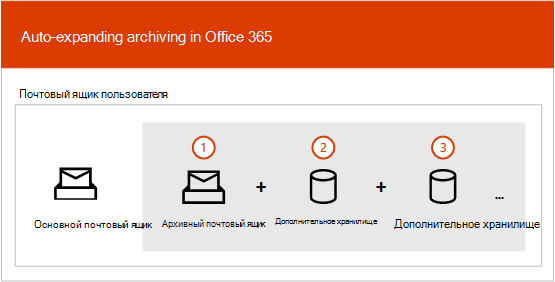
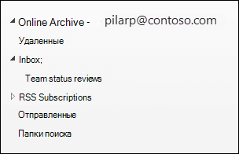

# Общие сведения о неограниченной архивации

В Office 365 архивные почтовые ящики предоставляют пользователям дополнительное место для хранения почтовых ящиков. После включения архивного почтового ящика пользователя доступно до 100 ГБ дополнительного хранилища. В прошлое при достижении квоты хранилища 100-GB организациям пришлось обратиться в корпорацию Майкрософт, чтобы запросить дополнительное место для архивного почтового ящика. Это больше не так.

Функция неограниченной архивации в Microsoft 365 (называемая *автоматически развертываемым архивом*) обеспечивает дополнительное хранилище в архивных почтовых ящиках. Когда достигается квота хранилища в архивном почтовом ящике, Microsoft 365 автоматически увеличивает размер архива, что означает, что пользователи не смогут использовать место для хранения почтовых ящиков, а администраторам не придется запрашивать дополнительное хранилище для архивных почтовых ящиков.

Пошаговые инструкции по включению автоматического развертывания архивации приведены в статье [Включение неограниченного архивирования](enable-unlimited-archiving.md).

> [!NOTE]
> Автоматически расширяющиеся архивы также доступны для общих почтовых ящиков. Для включения архива для общего почтового ящика требуется лицензия на Exchange Online (план 2) или лицензию на Exchange Online (план 1) с лицензией на архивацию на базе Exchange Online.

## Как работает автоматическое расширение архивации

Как описывалось ранее, дополнительное дисковое пространство для хранилища почтовых ящиков создается при включении архивного почтового ящика пользователя. Если включено автоматическое расширение архивации, Microsoft 365 периодически проверяет размер архивного почтового ящика. Когда архивный почтовый ящик становится близок к максимальному объему хранилища, Microsoft 365 автоматически создает дополнительное дисковое пространство для архива. Если пользователю не хватает этого дополнительного места для хранения, Microsoft 365 добавляет больше места для хранения в архив пользователя. Этот процесс выполняется автоматически, что означает, что администраторам не требуется запрашивать дополнительное хранилище архива или управлять автоматическим развертыванием архивации.

Ниже приведен краткий обзор процесса.

1. Архивация включена для почтового ящика пользователя или общего почтового ящика. Создается архивный почтовый ящик с размером 100 ГБ дискового пространства, а квота предупреждения для архивного почтового ящика равна 90 ГБ.

2. Администратор включает автоматическое расширение архивации для почтового ящика. Когда архивный почтовый ящик (включая папку "элементы с возможностью восстановления") достигнет размера 90 ГБ, он преобразуется в автоматически расширяемый Архив, а Microsoft 365 добавляет место для хранения в архив. Для подготовки дополнительного дискового пространства может потребоваться до 30 дней.

   > [!NOTE]
   > Если почтовый ящик размещается на удержании или назначенной политике хранения, квота хранилища для архивного почтового ящика увеличивается до 110 ГБ при включенном автоматическом развертывании архивации. Аналогично, квота предупреждения о архиве увеличивается до 100 ГБ.

3. Microsoft 365 автоматически добавляет дополнительное дисковое пространство при необходимости.

> [!IMPORTANT]
> Автоматическое расширение архива поддерживается только для почтовых ящиков, используемых для отдельных пользователей (или общих почтовых ящиков), при этом скорость роста не превышает 1 ГБ в день. Архивный почтовый ящик пользователя предназначен только для этого пользователя. Использование ведения журнала, правил транспорта или правил автоматической пересылки для копирования сообщений в архивный почтовый ящик не разрешено. Корпорация Майкрософт оставляет за собой право отказаться от неограниченного архивирования в случаях, когда архивный почтовый ящик пользователя используется для хранения архивных данных для других пользователей или в других случаях недопустимого использования.

## Что перемещается в дополнительное место для хранения архива?

Для эффективного использования автоматически развертываемого архивного хранилища папки могут быть перемещены. Microsoft 365 определяет, какие папки перемещаются, когда в архив добавляется дополнительное хранилище. Иногда при перемещении папки автоматически создаются одна или несколько вложенных папок, а элементы из исходной папки распространяются в эти папки для упрощения процесса перемещения. При просмотре части "Архив" списка папок в Outlook эти подпапки отображаются в исходной папке.  В соответствии с соглашением об именовании, которое Microsoft 365 использует для именования этих вложенных папок, используется ** \<имя\>папки _yyyy (создано в MMM DD, гггг h_mm)**, где:

- **гггг** — это год получения сообщений в папке.

- **MMM DD, гггг h_m** Дата и время создания вложенной папки в Office 365 в формате UTC, основанной на часовом поясе пользователя и региональных параметрах в Outlook.

На следующих снимках экрана показан список папок до и после перемещения сообщений в автоматически развернутый Архив.

 **Перед добавлением дополнительного хранилища**

 **После добавления дополнительного хранилища**

> [!NOTE]
> Как было сказано ранее, в Microsoft 365 элементы перемещаются в подпапки (и для них используется соглашение об именовании, описанное выше), чтобы обеспечить распространение контента в вспомогательный Архив. Но перемещение элементов в подпапки может быть не всегда. Иногда в вспомогательный Архив можно переместить всю папку. В этом случае папка сохранит исходное имя.  Она не будет очевидна в списке папок в Outlook, что папка была перемещена в вспомогательный Архив.

## Требования Outlook для доступа к элементам в автоматически развертываемом архиве

Чтобы получить доступ к сообщениям, хранящимся в автоматически развертываемом архиве, пользователи должны использовать один из следующих клиентов Outlook:

- Outlook 2016 или Outlook 2019 для Windows

- Outlook в Интернете

- Outlook 2016 или Outlook 2019 для Mac

Ниже приведено несколько моментов, которые следует учитывать при использовании Outlook или Outlook в Интернете для доступа к сообщениям, хранящимся в автоматически развертываемом архиве.

- Можно получить доступ к любой папке в архивном почтовом ящике, включая те, которые были перемещены в автоматически развернутую область хранения.

- Поиск элементов, перемещенных в дополнительную область хранения, возможен только путем поиска в самой папке. Это означает, что необходимо выбрать папку Архив в списке папок, чтобы выбрать параметр **Текущая папка** в качестве области поиска. Аналогичным образом, если папка в автоматически расширенной области хранения содержит вложенные папки, необходимо выполнять поиск каждой подпапки отдельно.

- Количество элементов в Outlook и счетчики чтения и непрочтений (в Outlook и Outlook в Интернете) в автоматически развернутом архиве могут быть неточными.

- Можно удалить элементы во вложенной папке, указывающие на автоматически развернутую область хранения, но саму папку невозможно удалить.

- Вы не можете использовать функцию восстановления удаленных элементов для восстановления элемента, который был удален из автоматически расширенной области хранения.

## Автоматическое расширение архивации и другие функции соответствия требованиям

В этом разделе объясняются функциональные возможности автоматического расширения архивации и других функций управления данными и обеспечения соответствия требованиям.

- **Обнаружение электронных данных:** При использовании средства обнаружения электронных данных, такого как поиск контента или обнаружение электронных данных на месте, также выполняется поиск дополнительных областей хранения в автоматически развертываемом архиве.

- **Хранение:** При помещении почтового ящика на удержание с помощью таких средств, как хранение для судебного разбирательства в Exchange Online или удержания eDiscovery и политики хранения в центре безопасности и соответствия требованиям, содержимое, расположенное в автоматическо развертываемом архиве, также размещается на удержании.

- **Управление записями сообщений (управления записями сообщений):** Если вы используете политики удаления управления ЗАПИСЯМИ сообщений в Exchange Online для окончательного удаления просроченных элементов почтовых ящиков, элементы с истекшим сроком действия, расположенные в автоматическом развернутом архиве, также будут удалены.

- **Служба импорта:** Вы можете использовать службу импорта Office 365 для импорта PST-файлов в автоматически развертываемый архив пользователя. Вы можете импортировать до 100 ГБ данных из PST-файлов в архивный почтовый ящик пользователя.

## Дополнительные сведения

Дополнительные технические сведения об автоматическом развертывании архивации можно найти в [статье Microsoft 365: автоматическое развертывание архивных вопросов и ответов](https://blogs.technet.microsoft.com/exchange/2018/04/09/office-365-auto-expanding-archives-faq/).
