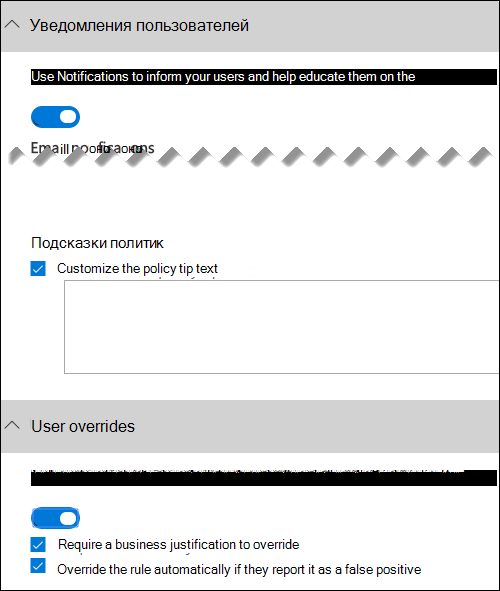
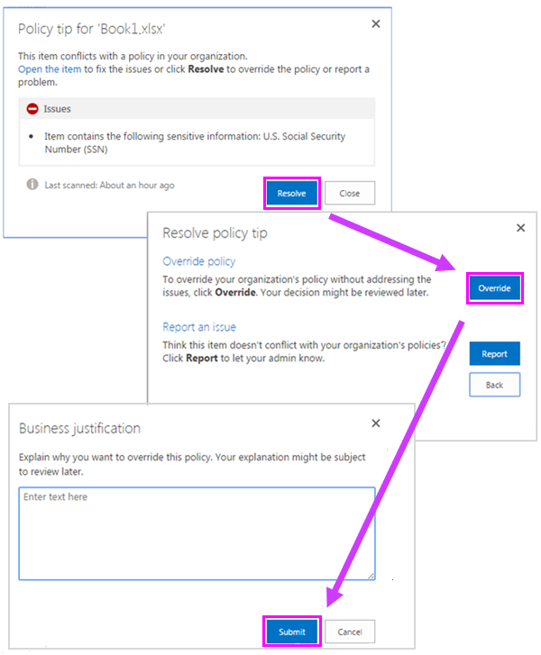
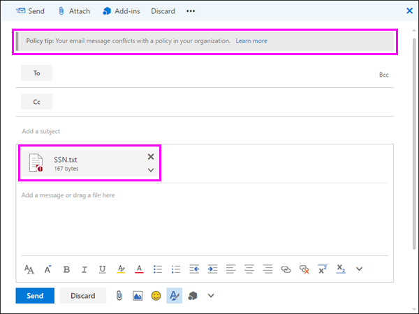
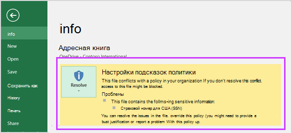

# Отправка почтовых уведомлений и отображение подсказок для политик защиты от потери данных

Вы можете использовать политику защиты от потери данных (DLP) для определения, отслеживания и защиты конфиденциальной информации в Office 365. Вы хотите, чтобы сотрудники вашей организации, работающие с этими конфиденциальными данными, оставались совместимыми с политиками защиты от потери данных, но вы не хотите блокировать их, не позволяя им выполнять свою работу. Именно здесь могут помочь уведомления электронной почты и подсказки политики.
  

  
Подсказка политики — это уведомление или предупреждение, которое появляется при работе с контентом, который конфликтует с политикой защиты от потери данных (например, контентом, таким как книга Excel на сайте OneDrive для бизнеса, который содержит персональные данные) и предоставляется внешним пользователем.
  
Вы можете использовать уведомления электронной почты и подсказки политики, чтобы увеличить осведомленность и помочь пользователям рассказать о политиках Организации. Кроме того, можно предоставить пользователям возможность переопределить политику, чтобы она не была заблокирована, если у них есть допустимые деловые нужды или если политика обнаруживает ложное срабатывание.
  
При создании политики &amp; защиты от потери данных в центре соответствия требованиям безопасности можно настроить следующие уведомления пользователей:
  
- Отправьте уведомление по электронной почте выбранным пользователям, описывающим эту ошибку.
    
- Отобразить подсказку политики для контента, который конфликтует с политикой DLP:
    
  - Для электронной почты в Outlook в Интернете и Outlook 2013 и более поздних версий подсказка политики отображается в верхней части сообщения над получателями во время составления сообщения.
    
  - Для документов в учетной записи OneDrive для бизнеса или на сайте SharePoint Online подсказка политики обозначается значком предупреждения, который отображается в элементе. Чтобы просмотреть дополнительные сведения, выберите элемент, а затем  области **сведений в** правом верхнем углу страницы, чтобы открыть область сведений. 
    
  - Для документов Excel, PowerPoint и Word, которые хранятся на сайте OneDrive для бизнеса или сайте SharePoint Online, включенном в политику защиты от потери данных, подсказка политики отображается на панели сообщений и в представлении Backstage ( **сведения о**меню \> " **файл** ").
    
## Добавление уведомлений пользователей в политику защиты от потери данных

При создании политики защиты от потери данных можно включить **пользовательские уведомления**. Если уведомления о пользователях включены, Microsoft 365 отправляет как уведомления электронной почты, так и подсказки политики. Вы можете настроить отправку уведомлений по электронной почте и текст подсказки политики.
  
1. Перейдите по ссылке [https://protection.office.com](https://protection.office.com).
    
2. Войдите с помощью рабочей или учебной учетной записи. Теперь вы находитесь в центре безопасности &amp; и соответствия требованиям.
    
3. В центре &amp; \> соответствия требованиям безопасности политика защиты \> от потери данных в левой панели и **Политика** \> **защиты** \> от потери данных **+ создать политику**.
    
    
  
4. Выберите шаблон политики DLP, который \> **защищает нужные**типы конфиденциальной информации.
    
    Чтобы начать с пустого шаблона, выберите **Настраиваемая** \> **настраиваемая политика** \> **Далее**.
    
5. Назовите политику \> **следующим**.
    
6. Чтобы выбрать расположения, которые должна защищать политика защиты от потери данных, выполните одно из следующих действий.
    
   - Выберите **все расположения в Office 365** \> : **Далее**.
    
   - Выберите пункт **Разрешить мне выбирать конкретные расположения** \> **Далее**.
    
   Чтобы включить или отключить все расположение, например все сообщения электронной почты Exchange или все учетные записи OneDrive, переключите **состояние** этого расположения. 
    
   Чтобы включить только определенные сайты SharePoint или учетные записи OneDrive, переключите его в **состояние** вкл., а затем щелкните ссылки в разделе **включить** , чтобы выбрать конкретные сайты или учетные записи. 
    
7. Нажмите кнопку **использовать дополнительные параметры** \> **Далее**.
    
8. Нажмите кнопку **+ создать правило**.
    
9. В редакторе правил в разделе **уведомления пользователей**переключите состояние на.
    
    

> [!NOTE]
> Политики защиты от потери данных применяются ко всем документам, которые соответствуют политике, независимо от того, являются ли эти документы новыми или существующими. Тем не менее, уведомление по электронной почте создается только в том случае, если новый контент соответствует существующей политике защиты от потери данных. Существующее содержимое защищено, но уведомления о пользователях не будут создаваться с помощью электронной почты.
  
## Параметры для настройки уведомлений по электронной почте

Для каждого правила в политике защиты от потери данных можно выполнить следующие действия:
  
- Отправьте уведомление выбранным пользователям. Эти люди могут включать владельца контента, пользователя, который последним изменил содержимое, владельца сайта, на котором хранится содержимое, или определенного пользователя.
    
- Настройка текста, включенного в уведомление, с помощью HTML или маркеров. Подробнее см. в следующем разделе.
    
> [!NOTE]
>  Уведомления по электронной почте можно отправлять только отдельным получателям, а не группам или спискам рассылки. Уведомление по электронной почте будет вызвано только новым контентом. Изменение существующего контента приведет к активации подсказок политики, но не уведомления по электронной почте. 
  

  
### Уведомление электронной почты по умолчанию

Уведомления содержат строку темы, которая начинается с выполняемого действия, например "уведомление", "сообщение заблокировано" для электронной почты или "доступ заблокирован" для документов. Если уведомление о документе, текст уведомления содержит ссылку на сайт, где хранится документ, и открывает подсказку политики для документа, где можно решить проблемы (см. раздел ниже о подсказках политики). Если уведомление о сообщении, уведомление включается в виде вложения в сообщение, которое соответствует политике защиты от потери данных.
  

  
По умолчанию в уведомлениях отображается текст, подобный следующему для элемента на сайте. Текст уведомления настраивается отдельно для каждого правила, поэтому отображаемый текст зависит от того, какое правило соответствует.

|**Если правило политики DLP делает это...**|**После этого уведомления по умолчанию для документов SharePoint или OneDrive для бизнеса имеют следующий текст...**|**В этом случае уведомление по умолчанию для сообщений Outlook выглядит так:...**|
|:-----|:-----|:-----|
|Отправляет уведомление, но не поддерживает переопределение    |Этот элемент вступает в противоречие с политикой в вашей организации.    |Сообщение электронной почты конфликтует с политикой в вашей организации.    |
|Блокирует доступ, отправляет уведомление и разрешает переопределение    |Этот элемент вступает в противоречие с политикой в вашей организации. Если вы не решите этот конфликт, доступ к этому файлу может быть заблокирован.    |Сообщение электронной почты конфликтует с политикой в вашей организации. Сообщение не было доставлено всем получателям.    |
|Блокирует доступ и отправляет уведомление    |Этот элемент вступает в противоречие с политикой в вашей организации. Доступ к этому элементу блокируется для всех пользователей за исключением его владельца, последнего модификатора и основного администратора семейства веб-сайтов.    |Сообщение электронной почты конфликтует с политикой в вашей организации. Сообщение не было доставлено всем получателям.    |
   
### Настраиваемое уведомление электронной почты

Вы можете создать настраиваемое уведомление электронной почты, а не отправлять уведомления по электронной почте пользователям или администраторам. Настраиваемое уведомление по электронной почте поддерживает HTML и имеет предельное значение в 5 000 символов. Вы можете использовать HTML, чтобы включить изображения, форматирование и другую фирменную символику в уведомлении.
  
Вы также можете настроить уведомления по электронной почте с помощью следующих маркеров. Эти маркеры представляют собой переменные, которые заменяются определенными сведениями в отправленном уведомлении.

|**Маркер**|**Описание**|
|:-----|:-----|
|%% AppliedActions%%    |Действия, применяемые к содержимому.    |
|%% ContentURL%%    |URL-адрес документа на сайте SharePoint Online или OneDrive для бизнеса.    |
|%% Матчедкондитионс%%    |Условия, сопоставляемые с содержимым. Используйте этот маркер для информирования пользователей о возможных проблемах с контентом.    |
   

  
## Параметры для настройки подсказок политики

Для каждого правила в политике защиты от потери данных можно настроить подсказку политики для следующих действий:
  
- Просто уведомите пользователя о том, что содержимое конфликтует с политикой защиты от потери данных, чтобы разрешить конфликт. Вы можете использовать текст по умолчанию (см. таблицы ниже) или ввести настраиваемый текст о политиках Организации.
    
- Разрешить пользователю переопределять политику защиты от потери данных. При необходимости можно выполнить следующие действия:
    
  - Потребовать от пользователя ввести Деловое обоснование для переопределения политики. Эти сведения записываются в журнал, и их можно просмотреть в разделе Отчеты **Reports** о защите от потери данных &amp; в разделе Отчеты центра безопасности и соответствия требованиям. 
    
  - Разрешить пользователю сообщать о ложном срабатывании и переопределять политику защиты от потери данных. Эта информация также записывается в журнал для создания отчетов, чтобы можно было использовать ложные срабатывания для точной настройки правил.
    

  
Например, вы можете применить к сайтам OneDrive для бизнеса политику DLP, которая обнаруживает персональные данные (PII), а эта политика имеет три правила:
  
1. Первое правило: Если в документе обнаружено менее пяти экземпляров этой конфиденциальной информации, а документ предоставляется пользователям в Организации, то при **отправке действия уведомления** отображается подсказка политики. Для подсказок политики не требуется выполнять переопределение, так как это правило просто уведомляет людей и не блокирует доступ. 
    
2. Второе правило: Если в документе обнаружено более пяти экземпляров этой конфиденциальной информации, а документ предоставляется пользователям в Организации, то действие **блокировать доступ к содержимому** ограничит разрешения для файла, а действие **Отправить уведомление** позволяет пользователям переопределять действия в этом правиле, предоставляя Деловое обоснование. Иногда для организации требуется, чтобы внутренние пользователи использовали личные данные, а политика защиты от потери данных не должна блокировать эту работу. 
    
3. Третье правило: Если в документе обнаружено более пяти экземпляров этой конфиденциальной информации, а документ предоставляется пользователям за пределами Организации, то действие **блокировать доступ к содержимому** ограничит разрешения для файла, а действие **Отправить уведомление** не разрешает пользователям переопределять действия, указанные в этом правиле, так как эти сведения доступны извне. В этом случае пользователям в вашей организации разрешается предоставлять общий доступ к данным вне Организации. 
    
Ниже приведены некоторые тонкие точки, которые необходимо знать об использовании подсказки политики для переопределения правила:
  
- Параметр Переопределение предназначен для правила и переопределяет все действия в правиле (за исключением отправки уведомления, которое не может быть переопределено).
    
- Контент может соответствовать нескольким правилам в политике защиты от потери данных, но будет отображаться только подсказка политики из наиболее ограниченного правила с наивысшим приоритетом. Например, вместо подсказки для правила, которое только отправляет уведомление, будет показана подсказка политики для правила, блокирующего доступ к контенту. Это позволяет избежать вывода сразу нескольких подсказок политики.
    
- Если подсказки политики самого строгого правила разрешают пользователям переопределять его, то также будут переопределены все остальные правила, которым соответствует контент.
    
## Подсказки политики на сайтах OneDrive для бизнеса и SharePoint Online

Если документ на сайте OneDrive для бизнеса или SharePoint Online соответствует правилу в политике защиты от потери данных, а это правило использует подсказки политики, то в подсказках политики отображаются специальные значки в документе:
  
1. Если правило отправляет уведомление о файле, отображается значок предупреждения.
    
2. Если правило блокирует доступ к документу, отображается значок заблокировано.
    
   
  
Чтобы выполнить действие над документом, можно \> выбрать **элемент выберите**  области сведений в правом верхнем углу страницы, чтобы открыть \> **подсказку политики просмотра**области сведений.
  
Подсказка политики перечисляет проблемы с содержимым, и если подсказка политики настроена с помощью этих параметров, можно выбрать **разрешение**, а затем **переопределить** подсказку политики или **сообщить о** ложном срабатывании. 
  

  

  
Политики защиты от потери данных синхронизируются с сайтами и изменяются в соответствии с ними периодически и асинхронно, поэтому между моментом создания политики защиты от потери данных и временем начала работы с подсказками политики может быть короткой задержкой. При разрешении или переопределении подсказки политики, когда значок в документе на сайте исчезает, может возникнуть подобная задержка.
  
### Текст по умолчанию для подсказок политики на сайтах

По умолчанию в подсказках политики отображается текст, подобный следующему для элемента на сайте. Текст уведомления настраивается отдельно для каждого правила, поэтому отображаемый текст зависит от того, какое правило соответствует.

|**Если правило политики DLP делает это...**|**После этого подсказка политики по умолчанию говорит**|
|:-----|:-----|
|Отправляет уведомление, но не поддерживает переопределение    |Этот элемент вступает в противоречие с политикой в вашей организации.    |
|Блокирует доступ, отправляет уведомление и разрешает переопределение    |Этот элемент вступает в противоречие с политикой в вашей организации. Если вы не решите этот конфликт, доступ к этому файлу может быть заблокирован.    |
|Блокирует доступ и отправляет уведомление    |Этот элемент вступает в противоречие с политикой в вашей организации. Доступ к этому элементу блокируется для всех пользователей за исключением его владельца, последнего модификатора и основного администратора семейства веб-сайтов.    |
   
### Настраиваемый текст для подсказок политики на сайтах

Текст для советов политики можно настроить отдельно от уведомления по электронной почте. В отличие от настраиваемого текста для уведомлений по электронной почте (см. выше), Пользовательский текст для подсказок политики не принимает HTML или маркеры. Вместо этого пользовательский текст подсказок политики представляет собой обычный текст с предельным числом в 256 символов.
  
## Подсказки политики в Outlook в Интернете и Outlook 2013 и более поздних версий

Когда вы создаете новую электронную почту в Outlook в Интернете и Outlook 2013 и более поздних версий, вы увидите подсказку политики, если добавляется контент, соответствующий правилу в политике защиты от потери данных, а в этом правиле используются подсказки политики. Подсказка политики отображается в верхней части сообщения, над получателем, пока сообщение составлено.
  

  
Подсказки политики работают, если конфиденциальные сведения отображаются в тексте сообщения, теме или даже вложении сообщения, как показано ниже.
  

  
Если подсказки политики настроены на разрешение переопределения, можно выбрать **Показать** \> **Переопределение** \> сведений введите Деловое обоснование или отчет о ложном \> положительном **переопределении**.
  

  

  
Обратите внимание, что при добавлении конфиденциальной информации в электронную почту может возникнуть задержка между добавлением конфиденциальной информации и появлением подсказки политики.

### Outlook 2013 и более поздних версий поддерживает вывод подсказок политики только для некоторых условий

В настоящее время Outlook 2013 и более поздних версий поддерживает вывод советов политики только для следующих условий:

- Содержимое содержит
- Общий доступ к контенту

Обратите внимание, что все эти условия работают в Outlook, где они будут сопоставлять контент и применяют защитные действия к содержимому. Но в настоящее время не поддерживаются подсказки политики для пользователей.
  
### Советы политики в центре администрирования Exchange и центре безопасности &amp; и соответствия требованиям

Подсказки политики могут работать с политиками защиты от потери данных и почтовыми политиками, созданными в центре администрирования Exchange, или с &amp; политиками защиты от потери данных, созданными в центре безопасности соответствия требованиям. Это связано с тем, что эти политики хранятся в разных расположениях, но подсказки политики можно изобразить только из одного места.
  
Если вы настроили подсказки политики в центре администрирования Exchange, любые подсказки политики, которые вы настроили &amp; в центре соответствия требованиям безопасности, не будут отображаться для пользователей в Outlook в Интернете и Outlook 2013 и более поздних версий до тех пор, пока вы не отключите советы в центре администрирования Exchange. Это гарантирует, что текущие правила для почтовых ящиков Exchange (которые также называются правилами транспорта) продолжат работу, пока не переключились &amp; на центр обеспечения безопасности.
  
Обратите внимание, что хотя подсказки политики могут рисовать только из одного места, уведомления по электронной почте всегда отправляются, даже если вы используете политики защиты &amp; от потери данных в центре безопасности и безопасности центра администрирования Exchange.
  
### Текст по умолчанию для подсказок политики в электронной почте

По умолчанию в подсказках политики отображается текст, подобный следующему для сообщений электронной почты.

|**Если правило политики DLP делает это...**|**После этого подсказка политики по умолчанию говорит**|
|:-----|:-----|
|Отправляет уведомление, но не поддерживает переопределение    |Ваша электронная почта конфликтует с политикой в вашей организации.    |
|Блокирует доступ, отправляет уведомление и разрешает переопределение    |Ваша электронная почта конфликтует с политикой в вашей организации.    |
|Блокирует доступ и отправляет уведомление    |Ваша электронная почта конфликтует с политикой в вашей организации.    |
   
## Подсказка политики в Excel, PowerPoint и Word

Когда люди работают с конфиденциальным контентом в настольных версиях Excel, PowerPoint и Word, подсказки политики могут уведомлять их в режиме реального времени о конфликте контента с политикой защиты от потери данных. Для этого необходимо, чтобы:
  
- Документ Office хранится на сайте OneDrive для бизнеса или SharePoint Online.
    
- Сайт включается в политику защиты от потери данных, которая настроена на использование подсказок политики.
    
Office Desktop Programs автоматически синхронизирует политики защиты от потери данных непосредственно из Office 365, а затем сканирует документы, чтобы убедиться, что они не конфликтуют с политиками защиты от потери данных и подсказками политики отображения в режиме реального времени.
  
В зависимости от того, как вы настроили подсказки политики в политике защиты от потери данных, пользователи могут просто игнорировать подсказку политики, переопределить политику с бизнес-обоснованием или без нее или сообщить о ложном срабатывании.
  
Подсказки политики отображаются на панели сообщений.
  

  
А подсказки политики также отображаются в представлении Backstage (на вкладке " **файл** "). 
  

  
Если подсказки политики в политике защиты от потери данных настроены с помощью этих параметров, можно нажать кнопку **Разрешить** , чтобы **переопределить** подсказку политики или **сообщить о** ложном срабатывании. 
  

  
В каждой из этих постольных приложений Office пользователи могут отключить подсказки политики. Если этот параметр отключен, подсказки политики, являющиеся простыми уведомлениями, не будут отображаться на панели сообщений или представлении Backstage (на вкладке " **файл** "). Однако подсказки политики, связанные с блокированием и переопределением, по-прежнему будут отображаться, и они по-прежнему будут получать уведомления по электронной почте. Кроме того, отключение подсказок политики не приводит к исключению документа из примененных к нему политик защиты от потери данных. 
  
### Текст по умолчанию для подсказок политики в Excel 2016, PowerPoint 2016 и Word 2016

По умолчанию подсказки политики отображают текст, аналогичный приведенному ниже, на панели сообщений и представлении Backstage открытого документа. Текст уведомления настраивается отдельно для каждого правила, поэтому отображаемый текст зависит от того, какое правило соответствует.

|**Если правило политики DLP делает это...**|**После этого подсказка политики по умолчанию говорит**|
|:-----|:-----|
|Отправляет уведомление, но не поддерживает переопределение    |Этот файл конфликтует с политикой Организации. Чтобы получить дополнительные сведения, перейдите в меню " **файл** ".    |
|Блокирует доступ, отправляет уведомление и разрешает переопределение    |Этот файл конфликтует с политикой Организации. Если вы не решите этот конфликт, доступ к этому файлу может быть заблокирован. Чтобы получить дополнительные сведения, перейдите в меню " **файл** ".    |
|Блокирует доступ и отправляет уведомление    |Этот файл конфликтует с политикой Организации. Если вы не решите этот конфликт, доступ к этому файлу может быть заблокирован. Чтобы получить дополнительные сведения, перейдите в меню " **файл** ".    |
   
### Настраиваемый текст для подсказок политики в Excel, PowerPoint и Word

Текст для советов политики можно настроить отдельно от уведомления по электронной почте. В отличие от настраиваемого текста для уведомлений по электронной почте (см. выше), Пользовательский текст для подсказок политики не принимает HTML или маркеры. Вместо этого пользовательский текст подсказок политики представляет собой обычный текст с предельным числом в 256 символов.
  
## Дополнительные сведения

- [Обзор политик защиты от потери данных](data-loss-prevention-policies.md)
    
- [Создание политики защиты от потери данных на основе шаблона](create-a-dlp-policy-from-a-template.md)
    
- [Создание политики защиты от потери данных для защиты документов с помощью FCI или других свойств](protect-documents-that-have-fci-or-other-properties.md)
    
- [Что входит в шаблоны политики защиты от потери данных](what-the-dlp-policy-templates-include.md)
    
- [Что позволяют искать типы конфиденциальной информации](what-the-sensitive-information-types-look-for.md)
