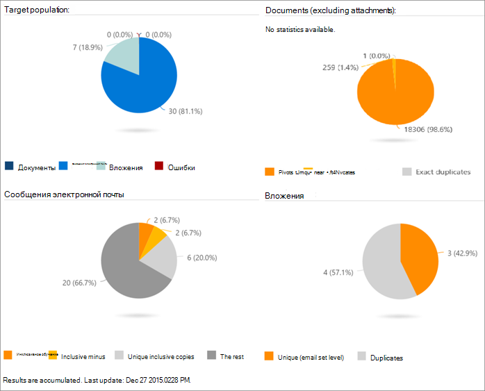

# Просмотр результатов анализа в Advanced eDiscovery (классический)

> [!NOTE]
> Advanced eDiscovery requires an Office 365 E3 with the Advanced Compliance add-on or an E5 subscription for your organization. If you don't have that plan and want to try Advanced eDiscovery, you can [sign up for a trial of Office 365 Enterprise E5](https://go.microsoft.com/fwlink/p/?LinkID=698279). 
  
Во время расширенного обнаружения электронных данных результаты и результаты для процесса анализа можно просматривать в различных экранах, как описано ниже.
  
## Просмотр состояния задачи анализа

** \> \> \> Состояние задачи подготовить анализ результатов**позволяет отобразить состояние, которое отображается во время и после анализа выполнения процесса. 
  

  
Отображаемые задачи могут различаться в зависимости от выбранных параметров. 
  
- **ND/ET: Программа установки**: подготовка к запуску, например, задает параметры Run и Case.
    
- **ND/ET: ND**: обрабатывает анализ файлов практических копий.
    
- **ND/ET: расчет et**: выполняет анализ цепочки электронных сообщений для всего набора электронной почты.
    
- **ND/ET: сводки и сходства**: выполняет сведение и обработку подобия файла.
    
- **ND/ET: Metadata Update**: завершает новые данные, собранные для файлов в базе данных.
    
- **Темы: вычисление тем**: выполнение анализа тем. (Отображается, только если выбрано.)
    
- **Состояние задачи**: Эта строка отображается после завершения задачи. Во время выполнения задач отображается длительность выполнения.
    
> [!NOTE]
> Результаты анализа результатов практических дубликатов и почтовых потоков (ND и ED) применяются к количеству обрабатываемых документов. В него не включены точные повторяющиеся файлы. 
  
## Просмотр состояния почти повторяющихся и почтовых потоков

В результатах **целевого** заполнения отображается количество документов, сообщений электронной почты, вложений и ошибок в целевом заполнении. 
  
В результатах **документов** отображается количество сводных таблиц, уникальных посторонних и повторяющихся файлов. 
  
В результатах **электронной почты** отображается количество включительно включительно, уникальные Инклюзивные копии и остальные сообщения электронной почты. Ниже приведены различные типы результатов электронной почты. 
  
- **Включительно**: включающая электронная почта — узел завершения в цепочке электронной почты и содержит все предыдущие истории этого потока. В результате проверяющий может безопасно сосредоточиться на инклюзивной электронной почте без необходимости чтения предыдущих сообщений в потоке. 
    
- **Включительно**: инклюзивная электронная почта обозначается как инклюзивное минус, если существует одно или несколько вложений, связанных с родителями инклюзивного сообщения. В этом контексте термин родитель используется для сообщений, расположенных выше в цепочке сообщений электронной почты или беседах, включенных в конкретную электронную почту. Проверяющий может использовать индикатор инклюзивного минуса в качестве сигнала, хотя это может быть необязательно для просмотра контента инклюзивных родителей электронной почты, может быть полезен Просмотр вложений, связанных с родителями невключающих путей. 
    
- **Инклюзивная копия**: включающая электронная почта считается инклюзивной копией, если она является копией другого сообщения, помеченной как включающая или инклюзивная минус. Другими словами, это сообщение имеет те же тема и основной текст, что и другое сообщение, и, как и, в том же узле. Так как Инклюзивные сообщения копии содержат одинаковое содержимое, они обычно могут пропускаться в процессе проверки. 
    
- **REST**: это указывает на то, что сообщение электронной почты не содержит уникального содержимого и поэтому не попадает ни на какие три категории. Эти сообщения электронной почты не требуется проверять. Если сообщение содержит вложение, которое не находится в более поздней инклюзивной электронной почте, то, возможно, необходимо проверить вложение. Это определяется тем, что в потоке существует инклюзивная почта минуса.
    
Результаты **вложений** отображают количество вложений, в соответствии с такими типами, как уникальные и повторяющиеся. 
  

  
## См. также

[Advanced eDiscovery (классическая версия)](office-365-advanced-ediscovery.md)
  
[Сведения о сходстве документов](understand-document-similarity-in-advanced-ediscovery.md)
  
[Настройка параметров анализа](set-analyze-options-in-advanced-ediscovery.md)
  
[Настройка игнорируемого текста](set-ignore-text-in-advanced-ediscovery.md)
  
[Настройка дополнительных параметров анализа](view-analyze-results-in-advanced-ediscovery.md)

