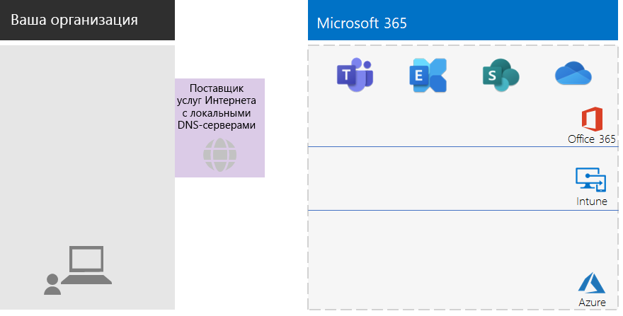
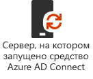
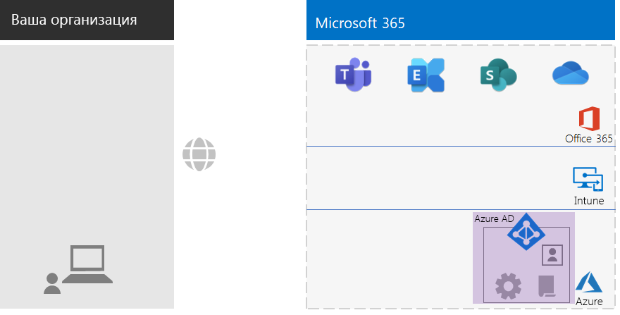
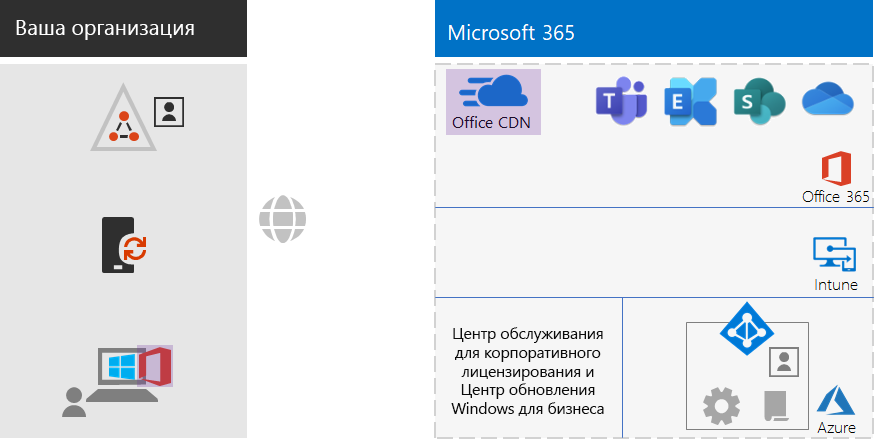
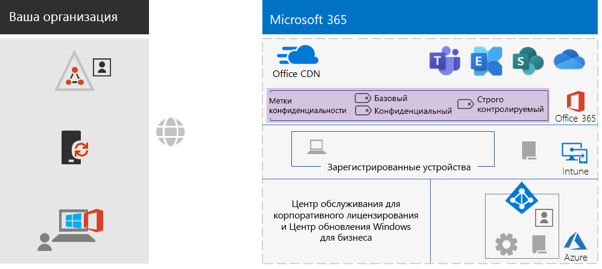
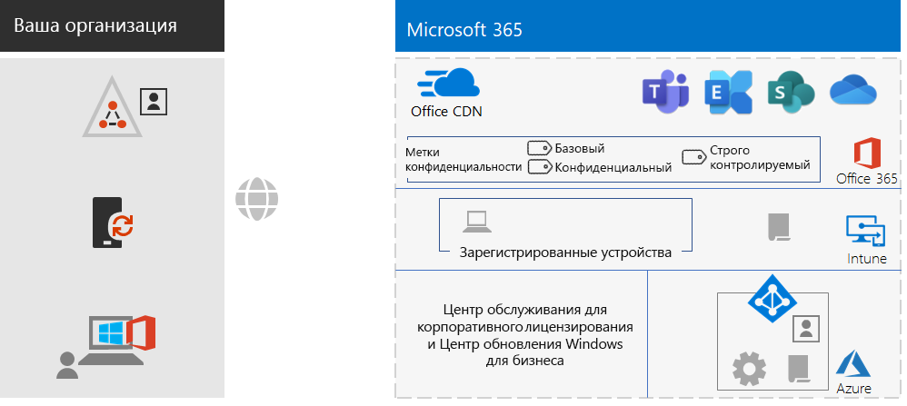

# Базовая инфраструктура Microsoft 365 для предприятий для некорпоративных организаций

Некорпоративные организации также могут развернуть Microsoft 365 для предприятий, чтобы воспользоваться преимуществами интегрированной и безопасной инфраструктуры, удобной для совместной работы и развития творческого потенциала. Характерные особенности некорпоративных организаций:

- Локальная инфраструктура — небольшая (серверы электронной почты, файловые серверы и домен доменных служб Active Directory) или вовсе отсутствует.
- Небольшая численность ИТ-отдела, причем большинство ИТ-сотрудников занимаются задачами широкого профиля, а не специализируются на определенных задачах, таких как сети или электронная почта.

Для небольших некорпоративных организаций корпорация Майкрософт предлагает [Microsoft 365 бизнес](https://www.microsoft.com/microsoft-365/business). Однако существуют причины, по которым вам может потребоваться Microsoft 365 для предприятий, например:

- Вашей организации требуется или в будущем потребуется более 300 лицензий Microsoft 365, тогда как в Microsoft 365 бизнес это максимальное количество.
- Вашей организации требуются расширенные возможности эффективной работы, голосовой связи и аналитики, недоступные в Microsoft 365 бизнес.

В этой статье приведена упрощенная пошаговая инструкция по развертыванию базовой инфраструктуры Microsoft 365 для предприятий для вашей некорпоративной организации.

## Во-первых, необходимо настроить подписку.

Нужно настроить домены системы доменных имен (DNS) для своей подписки. Если у вас уже есть подписка на Office 365, то это должно быть уже сделано. Если нет, то выполните инструкции, перечисленные в статье [Добавление домена в Office 365](https://docs.microsoft.com/office365/admin/setup/add-domain?view=o365-worldwide).

Затем нужно настроить дополнительные параметры безопасности для Microsoft 365. Выполните инструкции, перечисленные в статье [Настройка усиленной защиты](https://docs.microsoft.com/office365/securitycompliance/tenant-wide-setup-for-increased-security).

## Этап 1. Сеть

В некорпоративных организациях обычно используется локальное подключение к Интернету, при этом не используются прокси-серверы, брандмауэры и устройства проверки пакетов. У поставщика услуг Интернета (ISP), обслуживающего каждый офис, имеется локальный для этого региона DNS-сервер, поэтому трафик направляется на сетевое расположение Microsoft 365, ближайшее к офисам и работающим в этих офисах локальным пользователям. Дополнительные сведения см. в статье [Настройка локальных подключений к Интернету для всех офисов](networking-dns-resolution-same-location.md).

Таким образом, необходимо убедиться у поставщика услуг Интернета, что подключение в каждом офисе:

- Использует локальный DNS-сервер для этого региона.
- Пригодно для существующих и будущих потребностей при увеличении объема используемых облачных служб Microsoft 365.

Если вы используете прокси-серверы, брандмауэры или средства проверки пакетов, сведения по оптимизации производительности служб Microsoft 365 см. в статье [Настройка обхода трафика](networking-configure-proxies-firewalls.md).

### Конфигурация на этом этапе

Вот наглядное сводное представление, на котором выделен элемент 1-го этапа. **У вашей организации** может быть несколько офисов, в каждом из которых используется локальное подключение к Интернету, при этом поставщик услуг Интернета использует локальный DNS-сервер для этого региона. Используя подключение к Интернету, пользователи в каждом офисе подключаются к ближайшему расположению сети Microsoft 365 и к ресурсам вашей подписки Microsoft 365.

## Этап 2. Идентификация

Каждый сотрудник вашей организации должен иметь возможность войти в систему. Для этого требуется учетная запись пользователя в клиенте Azure Active Directory (Azure AD) вашей подписки Microsoft 365 для предприятий. Для размещения учетных записей используются группы. Другие группы используются для общения и для получения доступа к разрешенным ресурсам, например к сайтам SharePoint Online или к команде. 

### Учетные записи администратора

Для защиты учетных записей глобальных администраторов необходимо включить требование стойких паролей и многофакторной проверки подлинности (MFA). Дополнительные сведения см. в статье [Защита учетных записей глобальных администраторов](identity-create-protect-global-admins.md#protect-global-administrator-accounts).

Если в вашей организации требуется высокий уровень безопасности и вы используете Microsoft 365 E5, используйте службу Privileged Identity Management в Azure AD, чтобы включить предоставление своевременного доступа администраторам. Дополнительные сведения см. в статье [Настройка глобальных администраторов по требованию](identity-create-protect-global-admins.md#identity-pim).

### Рекомендации для групп

Если у вас есть локальный домен AD DS, используйте эти группы в Microsoft 365 для предприятий в качестве групп в Azure AD.

Если у вас нет локального домена AD DS, создайте группы безопасности в Azure AD со следующими уровнями безопасности.

| Уровень безопасности | Описание | Примеры |
|:-------|:-----|:-----|
| Базовый | Это минимальный стандарт по умолчанию, используемый для защиты данных и удостоверений устройств, обращающихся к данным.    Этот уровень используется для большей части данных организации, находящихся под управлением большей части пользователей. | Группы для рядовых сотрудников, включая направления продаж, маркетинга, поддержки, администрирования и производства. |
| Конфиденциальный | На этом уровне обеспечивается дополнительная безопасность для данных, которым требуется более надежная защита по сравнению с базовым уровнем. В состав этих групп входят пользователи, которые используют и создают конфиденциальные данные, относящиеся к отделам и проектам, не предназначенным для всеобщего доступа. | Группы продуктов и маркетинга, занимающиеся разработкой будущих продуктов |
| Строго контролируемый | Это высший уровень защиты, обычно он требуется для относительно небольшого объема строго засекреченных данных, относящихся к интеллектуальной собственности или к коммерческим тайнам. Также этот уровень необходим для данным, для которых обязательно выполнение требований безопасности. |  Исследовательские, юридические и финансовые группы, а также группы, в которых хранятся или используются данные по клиентам или партнерам. |
||||

### Гибридная идентификация

Если у вас есть локальный домен AD DS, необходимо синхронизировать набор учетных записей пользователей, групп и контактов вашего домена с клиентом Azure AD вашей подписки Microsoft 365 для предприятий. Для ваших некорпоративных пользователей настройте Azure AD Connect на сервере с синхронизацией хэша паролей (PHS). Дополнительные сведения см. в разделе [Синхронизация удостоверений](identity-add-user-accounts.md#synchronize-identities-for-hybrid-identity).

### Более безопасный доступ пользователей с помощью политик условного доступа

Azure AD проверяет условия входа пользователей и может задействовать политики условного доступа, чтобы предоставить или запретить доступ, а также требовать выполнения дальнейших действий для завершения входа. Например, если служба Azure AD определит, что вход происходит в условиях среднего или высокого риска, она может потребовать, чтобы пользователь прошел многофакторную проверку подлинности для завершения входа.

Политики условного доступа применяются к учетным записям пользователей или группам. Чтобы упростить назначение политик условного доступа, создайте в организации следующие группы безопасности AD:

- BASELINE

  Содержит группы и учетные записи пользователей с доступом к базовым данным.

- SENSITIVE

  Содержит группы и учетные записи пользователей с доступом к конфиденциальным данным.

- HIGHLY-REGULATED

  Содержит группы или учетные записи пользователей с доступом к строго контролируемым данным.

- COND-ACCESS-EXCLUDE

  Пустая группа, которую можно использовать, чтобы временно исключать пользователей из политик условного доступа.

Ниже приведен список политик условного доступа Azure AD, которые следует включить или создать.

| Политика условного доступа Azure AD | Группы, к которым применяется эта политика |
|:------|:-----|
| Базовая политика: требовать многофакторную проверку подлинности для администраторов | Эта политика применяется к ролям администраторов, поэтому нет необходимости создавать группы. Эту политику просто нужно включить. Все остальные политики необходимо создать и включить. |
| Блокировать клиенты, не поддерживающие современную проверку подлинности | В параметрах политики выберите "Все пользователи". |
| Требовать многофакторную проверку подлинности при среднем или высоком риске входа (требуется Microsoft 365 E5) | BASELINE |
| Требовать многофакторную проверку подлинности при среднем или высоком риске входа (требуется Microsoft 365 E5) | SENSITIVE |
| Всегда требовать многофакторную проверку подлинности | HIGHLY-REGULATED |
| Требовать использования одобренных приложений на устройствах с iOS и Android | BASELINE, SENSITIVE, HIGHLY-REGULATED |
| Требовать использования соответствующих политике компьютеров | BASELINE |
| Требовать использования соответствующих политике компьютеров, устройств с iOS и Android | SENSITIVE, HIGHLY-REGULATED |
|||

Здесь нужно создать и включить политику риска пользователей в службе защиты идентификации Azure AD (требуется Microsoft 365 E5)

| Политика риска пользователя в службе защиты идентификации Azure AD | Группы, к которым применяется эта политика |
|:------|:-----|
| Пользователи с высоким уровнем риска должны сменить пароль | В параметрах политики выберите "Все пользователи". |
|||

Инструкции см. в статье [Основные политики идентификации и доступа для устройств](identity-access-policies.md).

### Упрощение управления с помощью групп

Ниже описаны некоторые функции, позволяющие упростить управление группами и лицензированием.

| Функция | Использование |
|:------|:-----|
| Самостоятельное управление группами | Разрешите управление группами Azure AD владельцам групп, а не ИТ-специалистам. Дополнительные сведения см. в статье [Самостоятельное управление группами](identity-use-group-management.md#allow-users-to-create-and-manage-their-own-groups). |
| Динамическое членство в группах | Настройте автоматическое добавление или удаление учетных записей пользователей из групп Azure AD на основании атрибутов учетных записей пользователей, таких как отдел или страна. Дополнительные сведения см. в статье [Динамическое членство в группах](identity-use-group-management.md#set-up-dynamic-group-membership). |
| Групповое лицензирование | Используйте членство в группах, чтобы автоматически назначать лицензии учетным записям пользователей или отменять назначение. Дополнительные сведения см. в статье [Групповое лицензирование](identity-use-group-management.md#set-up-automatic-licensing). |
|  |  |

При использовании группового лицензирования создайте группу с названием LICENSED. В этой группе будут содержаться имена учетных записей пользователей, которым назначается лицензия Microsoft 365 для предприятий.

### Мониторинг доступа пользователей

Если вы используете Microsoft 365 E5, можно использовать защиту идентификации Azure AD для мониторинга и анализа попыток входа пользователей на предмет компрометации учетных данных. Дополнительные сведения см. в статье [Защита от компрометации учетных данных](identity-secure-user-sign-ins.md#protect-against-credential-compromise).

### Конфигурация на этом этапе

Вот наглядное представление этапа "Идентификация" для гибридной идентификации, на котором выделены существующие и новые элементы.

 
Новые и выделенные элементы гибридной идентификации включают:
 
|||
|:------:|:-----|
|  | Локальный домен AD DS с учетными записями пользователей и группами. |
|  | Сервер под управлением Windows, на котором запущено решение Azure AD Connect. |
|  | Синхронизированный набор учетных записей пользователей и групп AD DS в Azure AD. |
|  | Параметры Azure AD для проверки подлинности, защиты глобальных учетных записей и более удобного управления группами и лицензиями. |
|  | Политики условного доступа Azure AD. |
|||

Вот наглядное представление этапа "Идентификация" для облачной идентификации, на котором выделены новые элементы.

 
Новые и выделенные элементы облачной идентификации включают:
 
|||
|:------:|:-----|
|  | Учетные записи пользователей и группы в Azure AD. |
|  | Параметры Azure AD для проверки подлинности, защиты глобальных учетных записей и более удобного управления группами и лицензиями. |
|  | Политики условного доступа Azure AD. |
|||

## Этап 3. Windows 10 Корпоративная

Чтобы убедиться, что устройства с Windows 10 Корпоративная интегрированы в инфраструктуру удостоверений и безопасности Microsoft 365 для предприятий, можно использовать следующие способы:

- Гибридная среда (есть локальный домен AD DS)

  Все существующие устройства с Windows 10 Корпоративная, уже присоединенные к вашему домену AD DS, необходимо подключить к клиенту Azure AD Инструкции см. в статье [Настройка гибридных устройств, присоединенных к Azure Active Directory](https://go.microsoft.com/fwlink/p/?linkid=872870).

  Все новые устройства с Windows 10 Корпоративная необходимо присоединить к домену AD DS, а затем присоединить к клиенту Azure AD.

  Все устройства с Windows 10 Корпоративная необходимо зарегистрировать в службе управления мобильными устройствами. Инструкции см. в статье [Регистрация устройств с Windows 10 в Intune с помощью групповой политики](https://go.microsoft.com/fwlink/p/?linkid=872871).

- Только облачная среда (нет локального домена AD DS)

  Присоедините каждое устройство с Windows 10 Корпоративная к клиенту Azure AD своей подписки.

  Дополнительные сведения см. в статье [Присоединение рабочего устройства к сети организации](https://docs.microsoft.com/azure/active-directory/user-help/user-help-join-device-on-network).

После установки и присоединения на все устройства с Windows 10 Корпоративная будут автоматически устанавливать устанавливаться обновления из облачной службы Центра обновления Windows для бизнеса. В некорпоративных организациях обычно не нужно настраивать инфраструктуру для распространения и установки обновлений Windows 10.

### Конфигурация на этом этапе

Вот наглядное представление этапа развертывания Windows 10 Корпоративная, на котором выделены новые элементы.

 
Новые и выделенные элементы этапа "Windows 10 Корпоративная" включают:

|||
|:------:|:-----|
|  | ОС Windows 10 Корпоративная установлена на устройствах с Windows, например, на локальном ноутбуке. |
|  | Центр обслуживания корпоративного лицензирования предоставляет образы для новой установки Windows 10 Корпоративная; служба Центра обновления Windows для бизнеса предоставляет последние обновления. |
|||

## Этап 4. Office 365 профессиональный плюс

В состав Microsoft 365 для предприятий входит Office 365 профессиональный плюс — версия Microsoft Office, доступная по подписке. Office 365 профессиональный плюс, как и Office 2016 или Office 2019, устанавливается непосредственно на клиентских устройствах. При этом Office 365 профессиональный плюс получает обновления, регулярно включающие новые функции. Дополнительные сведения см. в статье [Office 365 профессиональный плюс на предприятии](https://docs.microsoft.com/deployoffice/about-office-365-proplus-in-the-enterprise).

В некорпоративной организации необходимо вручную установить Office 365 профессиональный плюс на устройствах, в том числе устройствах с Windows, iOS и Android. Это можно сделать при подготовке новых устройств к использованию, также это могут сделать пользователи в процессе перехода на новую инфраструктуру.

Как бы то ни было, администратор или пользователь входят на портал Office 365 в https://portal.office.com. На **главной вкладке Microsoft Office** щелкните **Установить Office** и пройдите все шаги процесса установки.

Обновления компонентов Office 365 профессиональный плюс ежемесячно устанавливаются на все компьютеры, на которых установлен этот пакет. В некорпоративных организациях обычно не нужно настраивать инфраструктуру для распространения и установки обновлений Office 365 профессиональный плюс. 

### Конфигурация на этом этапе

Вот наглядное представление этапа развертывания Office 365 профессиональный плюс, на котором выделены новые элементы.

 
Новые и выделенные элементы этапа "Office 365 профессиональный плюс" включают:
 
|||
|:------:|:-----|
|  | Пакет Office 365 профессиональный плюс установлен на устройствах, например, на локальном ноутбуке. |
|  | Устройства обращаются в сеть доставки содержимого Office (CDN) для Office 365 профессиональный плюс, чтобы получать обновления для Office 365 профессиональный плюс. |
|||

## Этап 5. Управление мобильными устройствами

Microsoft 365 для предприятий включает Microsoft Intune для управления мобильными устройствами. С помощью Intune можно управлять устройствами с Windows, iOS, Android и macOS, чтобы защитить ресурсы организации, включая данные. В Intune используются учетные записи пользователей, групп и компьютеров в Azure AD.

В Intune поддерживается два способа управления мобильными устройствами:

- Управление мобильными устройствами (MDM) при регистрации устройств в Intune. После регистрации эти устройства становятся управляемыми, они могут получать политики, правила и параметры, используемые в вашей организации. Как правило, такие устройства принадлежат вашей организации и выдаются сотрудникам.

- Пользователи со своими собственными личными устройствами могут не желать регистрировать эти устройства или разрешать управление своими устройствами системе Intune с вашими политиками и параметрами. Тем не менее, вам все равно нужно защитить ресурсы и данные организации. В этом случае вы можете защитить свои приложения с помощью управления мобильными приложениями (MAM).  

Политики Intune могут обеспечить соответствие устройств требованиям и защиту приложений. Вот список политик Intune, которые необходимо создать.

| Политики Intune | Группы, к которым применяется эта политика |
|:------|:-----|
| Политика соответствия устройства требованиям для Windows | BASELINE, SENSITIVE, HIGHLY-REGULATED |
| Политика соответствия устройства требованиям для iOS | SENSITIVE, HIGHLY-REGULATED |
| Политика соответствия устройства требованиям для macOS | SENSITIVE, HIGHLY-REGULATED |
| Политика соответствия устройства требованиям для Android и Android Enterprise | SENSITIVE, HIGHLY-REGULATED |
| Политика защиты приложений для iOS | BASELINE, SENSITIVE, HIGHLY-REGULATED |
| Политика защиты приложений для macOS | BASELINE, SENSITIVE, HIGHLY-REGULATED |
| Политика защиты приложений для Android и Android Enterprise | BASELINE, SENSITIVE, HIGHLY-REGULATED |
|||
    
Инструкции см. в статье [Основные политики идентификации и доступа для устройств](identity-access-policies.md).

### Конфигурация на этом этапе

Вот наглядное представление этапа "Управление мобильными устройствами", на котором выделены новые элементы.

 
Новые и выделенные элементы этапа "Управление мобильными устройствами" включают:

|||
|:------:|:-----|
|  | Устройства, зарегистрированные в Intune: в качестве примера показан локальный ноутбук под управлением Windows 10 Корпоративная. |
|  | Политики Intune для обеспечения соответствия устройств и защиты приложений. |
|||

## Этап 6. Защита данных

В Microsoft 365 для предприятий предусмотрен целый ряд функций защиты информации, с помощью которых можно по-разному классифицировать данные, применяя к ним различные уровни управления, безопасности и защиты. 

Например, для обычной переписки большинства сотрудников и для документов, над которыми работают эти сотрудники, требуется некоторый базовый уровень защиты. Для финансовых записей, данных о клиентах и интеллектуальной собственности требуется более высокий уровень защиты.

Первый шаг в стратегии защиты информации состоит в определении уровней защиты. Во многих организациях используются следующие уровни, которые уже применяются для политик условного доступа:

- Базовый

  Примеры данных: обычная деловая переписка (электронная почта) и файлы администраторов, специалистов по продажам и сотрудников службы поддержки.

- Конфиденциальный

  Примеры данных: финансовые и юридические сведения, данные об исследованиях и разработке новых продуктов или услуг.

- Строго контролируемый

  Примеры данных: личные сведения ваших клиентов и партнеров, интеллектуальная собственность или стратегические планы вашей организации.

На основе этих уровней безопасности необходимо определить и применить:

- Пользовательские типы конфиденциальной информации

  В Microsoft 365 предусмотрен широкий набор типов конфиденциальной информации, например, номера медицинского страхования или номера кредитных карт. Если в предоставленном списке нет нужного вам типа информации, можно создать собственный тип.

- Метки хранения

  Необходимо определить, как долго следует хранить документы определенных типов или с определенным содержимым в соответствии с правилами организации и региональными нормативными требованиями. Это задачу можно решить для электронной почты и документов с помощью меток хранения. Метки хранения также можно использовать совместно с политиками защиты от потери данных, которые могут ограничивать общий доступ к файлам или электронной почте за пределами организации.

- Метки конфиденциальности

  Можно помечать сообщения электронной почты и документы, используя именованные метки конфиденциальности, чтобы можно было применять дополнительные уровни безопасности. Это могут быть водяные знаки, шифрование и разрешения, указывающие, кому разрешен доступ к электронной почте или документу, и какие действия разрешены.

Дополнительные сведения см. в статье [Типы классификации Microsoft 365](infoprotect-configure-classification.md#microsoft-365-classification-types).

Если вы используете метки конфиденциальности с разрешениями, можно создать дополнительные группы безопасности Office 365, чтобы определить, каким пользователям доступны те или иные действия с электронной почтой и документами с примененными метками конфиденциальности. 

Например, нужно создать метку конфиденциальности RESEARCH, чтобы защитить электронную почту и документы исследовательской группы. Вы определяете, что:

- Исследователи должны иметь возможность изменения документов, помеченных меткой конфиденциальности RESEARCH.
- Сотрудники, не связанные с исследовательской деятельностью, должны иметь только возможность просмотра документов, помеченных меткой конфиденциальности RESEARCH. 

Это означает, что нужно создать и настроить еще две дополнительные группы Office 365:

- RESEARCH-ALL
- RESEARCH-VIEW

Эти группы и их разрешения входит в состав конфигурации метки конфиденциальности RESEARCH.

Если метки конфиденциальности настроены с групповыми разрешениями, необходимо управлять членством в этих группах.

### Конфигурация на этом этапе

Вот наглядное представление этапа "Защита информации", на котором выделены новые элементы.

 
Новые и выделенные элементы этапа "Защита информации" включают:
 
|||
|:------:|:-----|
|  | Метки конфиденциальности для трех уровней безопасности, применяемых пользователями к документам и электронной почте. |
|||

Пользовательские типы данных и метки хранения не показаны.

## Адаптация

Благодаря инфраструктуре Microsoft 365 для предприятий вы можете легко осуществить адаптацию новых сотрудников.

### Новое устройство с Windows 10 Корпоративная

Перед выдачей сотруднику нового устройства с Windows 10 Корпоративная:

- Если используется гибридная идентификация

  Подключите устройство к домену AD DS, присоедините устройство к клиенту Azure AD, затем зарегистрируйте устройство в Intune.

- Если используется только облачная идентификация

  Подключите устройство к клиенту AD DS.

### Существующий сотрудник с учетной записью пользователя AD DS

При первоначальном переходе вашей организации, если используется гибридная идентификация, добавьте учетную запись пользователя AD DS в следующие группы Azure AD:

- LICENSED
- Соответствующие группы безопасности AD DS или Azure AD, являющиеся участниками групп BASELINE, SENSITIVE и HIGHLY-REGULATED в Azure AD
- Группы меток конфиденциальности (по мере необходимости)

Существующий сотрудник уже должен быть уже добавлен в соответствующие группы AD DS на уровне рабочих групп, отделов и регионов.

В центре администрирования Microsoft 365 можно добавить учетную запись пользователя для нескольких групп Azure AD. В окне свойств учетной записи пользователя щелкните **Управление группами > Добавление членства в группах**.

Если вы хотите использовать оболочку PowerShell, см данную [загружаемую книгу Excel](https://github.com/MicrosoftDocs/microsoft-365-docs/raw/public/microsoft-365/enterprise/media/deploy-foundation-infrastructure-non-enterprises/Group-License-Mgmt-PowerShell.xlsx), которая создает команды PowerShell на основе указанной учетной записи пользователя и выбранных имен групп.

### Новый сотрудник с полностью облачной учетной записью

При первоначальном переходе вашей организации, если используется только облачная идентификация, добавьте учетную запись нового пользователя в следующие группы:

- LICENSED
- Соответствующие группы безопасности Azure AD, являющиеся участниками групп BASELINE, SENSITIVE и HIGHLY-REGULATED в Azure AD
- Группы на уровне рабочих групп, отделов и регионов
- Группы меток конфиденциальности (по мере необходимости)

### Начальный вход в Microsoft 365

Когда сотрудники впервые входят в Microsoft 365, попросите их:

1. Войти на свои устройства с помощью учетных данных своих учетных записей пользователей.
2. В веб-браузере войти на портал Office 365 по адресу https://portal.office.com.
3. На **главной вкладке Office 365** щелкнуть **Установить Office**, чтобы установить Office 365 профессиональный плюс на свои устройства.

## Итоговые результаты

Ниже приведены результаты настройки базовой инфраструктуры Microsoft 365 для предприятий для некорпоративной организации.

### Результаты для инфраструктуры

После построения и настройки инфраструктуры Microsoft 365 для предприятий у вас должно быть следующее:

- Локальное подключение к Интернету в каждом офисе с достаточной пропускной способностью. Такое подключение предоставляется поставщиком услуг Интернета, использующим локальный DNS-сервер для этого региона.
- При использовании гибридной идентификации служба Azure AD Connect должна работать на сервере, который синхронизирует ваш локальный домен AD DS с вашим клиентом Azure AD.
- Следующие группы:
  - LICENSED
  - COND-ACCESS-EXCLUDE
  - Соответствующие группы безопасности AD DS или Azure AD, также являющиеся участниками групп BASELINE, SENSITIVE и HIGHLY-REGULATED в Azure AD 
  - Группы на уровне рабочих групп, отделов и регионов
  - Группы меток конфиденциальности Office 365 (по мере необходимости)
- Политики условного доступа для входа в Azure AD, использующие группы BASELINE, SENSITIVE, HIGHLY-REGULATED и COND-ACCESS-EXCLUDE в Azure AD.
- Политики соответствия устройств и приложений требованиям в Intune.
- Пользовательские типы конфиденциальной информации (по мере необходимости).
- Метки хранения (по мере необходимости).
- Метки конфиденциальности (по мере необходимости).

Вот наглядное сводное представление инфраструктуры, если в организации используется гибридная идентификация, включающая ваш домен AD DS, сервер Azure AD Connect и синхронизированных пользователей и группы AD DS.

 
Вот наглядное сводное представление инфраструктуры, если организация использует только облачную идентификацию.
 

### Результаты для сотрудников

После перехода на новую инфраструктуру у каждого сотрудника должно быть следующее:

- Высокоскоростной локальный сетевой канал, соединяющий используемое устройство с облачными службами Microsoft 365 в этом регионе.
- Учетная запись, являющаяся участником следующих групп:
   - LICENSED
   - Соответствующие группы безопасности AD DS или Azure AD, также являющиеся участниками групп BASELINE, SENSITIVE и HIGHLY-REGULATED в Azure AD для политик условного доступа 
   - Соответствующие группы на уровне рабочих групп, отделов и регионов
   - Группы меток конфиденциальности Office 365 (по мере необходимости)
- Новое устройство с Windows 10 Корпоративная, при этом:
   - Это устройство присоединено к клиенту Azure AD (только облачное решение) или одновременно к клиенту Azure AD и к вашему домену AD DS (гибридное решение).
   - Это устройство автоматически обновляется, получая последние улучшения продукта и улучшения безопасности Windows 10 Корпоративная.
   - На это устройство установлен пакет Office 365 профессиональный плюс, который автоматически обновляется, получая последние улучшения продукта и улучшения безопасности Office.
   - Это устройство зарегистрировано в Intune и подчиняется политикам соответствия устройств и политикам защиты приложений в Intune.

## Следующий шаг

Развертывание [нагрузок и сценариев](deploy-workloads.md) с использованием возможностей и конфигурации базовой инфраструктуры Microsoft 365 для предприятий.
