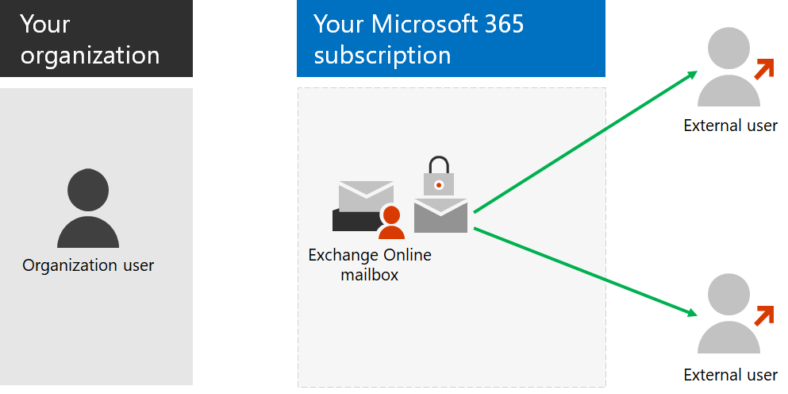
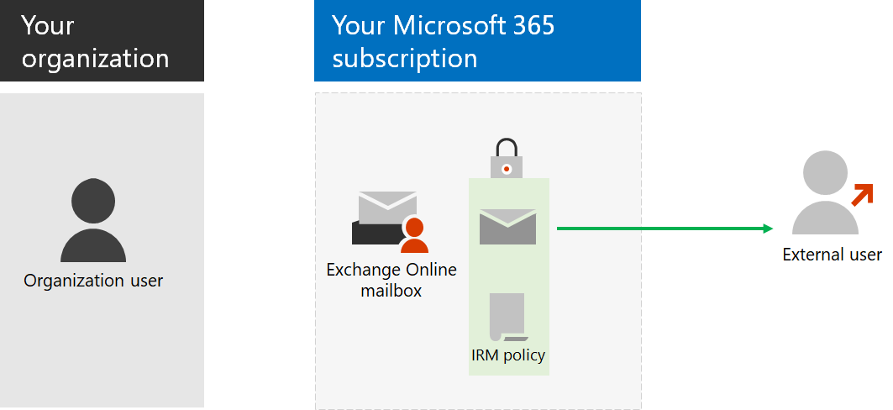
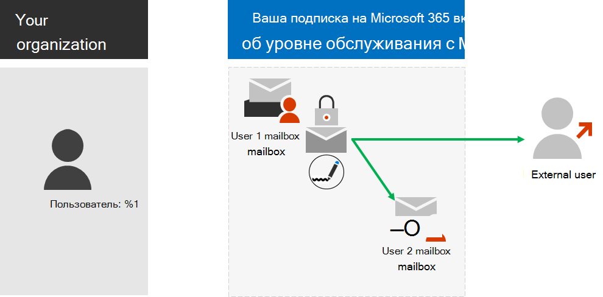

# Шаг 6. Настройка шифрования электронной почтыStep 6: Configure email encryption

*Этот этап не является обязательным. Он применяется к планам E3 и E5 Microsoft 365 корпоративный.**This step is optional and applies to both the E3 and E5 versions of Microsoft 365 Enterprise*

В Microsoft 365 существует три типа шифрования электронной почты.There are three types of email encryption in Microsoft 365.

|||
|:-------|:-----|
| Шифрование сообщений Office (OME)Office Message Encryption (OME) | Шифрование для электронной почты Exchange Online, отправляемое за прев Организации.Encryption for Exchange Online email sent outside your organization. |
| (IRM) Управления Правами На Доступ К ДаннымInformation Rights Management (IRM) | Шифрование и разрешения, которые передаются вместе с сообщением электронной почты.Encryption and permissions that travel with the email. |
| Secure/Multipurpose Internet Mail Extensions (S/MIME)Secure/Multipurpose Internet Mail Extensions (S/MIME) | Защита электронной почты с шифрованием и цифровыми подписями.Email protection with encryption and digital signatures. |
|||

## Шифрование сообщений Office 365Office 365 Message Encryption

С помощью OME организация может отправлять и получать зашифрованные сообщения электронной почты между людьми в Организации и за ее пределами.With OME, your organization can send and receive encrypted email messages between people inside and outside your organization. OME работает с Outlook.com, Yahoo!, Gmail и другими почтовыми службами.OME works with Outlook.com, Yahoo!, Gmail, and other email services. Шифрование сообщений электронной почты гарантирует, что только предназначенные получатели могут просматривать сообщение.Email message encryption helps ensure that only intended recipients can view the message.

Вы настраиваете правила транспорта, определяющие условия для шифрования.You set up transport rules that define the conditions for encryption. Когда пользователь отправляет сообщение, соответствующее правилу, шифрование применяется автоматически.When a user sends a message that matches a rule, encryption is applied automatically.

Для просмотра зашифрованных сообщений получатели могут либо получить одноразовый пароль, войти с помощью учетной записи Майкрософт, либо войти с помощью рабочей или учебной учетной записи, сопоставленной с Microsoft 365.To view encrypted messages, recipients can either get a one-time passcode, sign in with a Microsoft account, or sign in with a work or school account associated with Microsoft 365. Получатели также могут отправлять зашифрованные ответы.Recipients can also send encrypted replies. Для просмотра зашифрованных сообщений и отправки зашифрованных ответов им не требуется собственная подписка на Microsoft 365.They don't need their own Microsoft 365 subscription to view encrypted messages or send encrypted replies.

Дополнительные сведения см. в статье [Шифрование сообщений Office 365](https://docs.microsoft.com/Office365/SecurityCompliance/ome).For more information, see [Office 365 Message Encryption](https://docs.microsoft.com/Office365/SecurityCompliance/ome).

## IRMIRM

Служба управления правами на доступ к данным (IRM) в Microsoft 365 помогает защитить информацию с помощью дополнительного шифрования и применением интеллектуальной политики, указывающей, кто может выполнять эти действия.IRM in Microsoft 365 helps you secure your information with additional encryption and by applying an intelligent policy that specifies who has access what they can do. Для сообщений электронной почты можно использовать IRM для шифрования и применять ограничения использования.For email messages, you can use IRM for encryption and to apply usage restrictions. Например, вы можете указать, что некоторые получатели имеют все возможности по управлению электронной почтой, а у некоторых нет возможности печатать или пересылать электронную почту.For example, you can specify that some recipients have all abilities to manage the email and some do not have the ability to print or forward the email. 

Политики управления правами на доступ к данным настраиваются в Microsoft 365 и могут применяться к документам в SharePoint Online и сообщениям электронной почты.IRM policies are configured within Microsoft 365 and can apply to documents in SharePoint Online and email messages. Электронная почта с защитой IRM включает примененные параметры политики и передается вместе с ней.An IRM-protected email includes the applied policy settings applied and travel with it. 

Когда получатель открывает сообщение электронной почты с включенной политикой, параметры политики используются для расшифровки сообщения и определения того, что может делать получатель.When the recipient opens the email with the included policy, the policy settings are used to decrypt the message and determine what the recipient can do with it. 

Дополнительные сведения см. в разделе [Управление правами на доступ к данным в Exchange Online]( https://docs.microsoft.com/office365/SecurityCompliance/information-rights-management-in-exchange-online).For more information, see [Information Rights Management in Exchange Online]( https://docs.microsoft.com/office365/SecurityCompliance/information-rights-management-in-exchange-online).

## S/MIME;S/MIME

S/MIME это решение для защиты электронной почты на основе цифровых сертификатов, которое позволяет выполнять шифрование и цифровую подпись сообщения.S/MIME is a digital certificate-based email-based protection solution that allows you to both encrypt and digitally sign a message. Шифрование сообщений гарантирует, что только указанный получатель сможет открыть и прочитать сообщение.The message encryption helps ensure that only the intended recipient can open and read the message. Цифровая подпись помогает получателю проверить подлинность отправителя и определить, что она была отправлена только отправителю.A digital signature helps the recipient validate the identity of the sender and determine that only the sender could have sent it.

S/MIME можно использовать для электронной почты с другими почтовыми ящиками в вашей подписке на Microsoft 365 или внешним пользователям.S/MIME can be used for email to other mailboxes in your Microsoft 365 subscription or to external users.
Шифрование сообщений и Цифровые подписи возможны благодаря использованию цифровых сертификатов, которые содержат открытые и закрытые ключи для шифрования и расшифровки сообщений, а также для создания и проверки цифровых подписей.Both message encryption and digital signatures are made possible through the use of digital certificates that contain the public and private keys for encrypting or decrypting messages and creating and verifying digital signatures.
Чтобы использовать S/MIME, необходимо иметь общедоступные ключи для каждого получателя.To use S/MIME, you must have the public keys for each recipient. Получатели сохраняют собственные закрытые ключи, которые должны быть защищены.Recipients maintain their own private keys, which must remain secure. Если закрытый ключ скомпрометирован, необходимо получить новый цифровой сертификат и перераспределить общедоступные ключи всем потенциальным отправителям.If your private key is compromised, you need to get a new digital certificate and redistribute public keys to all potential senders.

Дополнительные сведения см. в статье [S/MIME для подписи и шифрования сообщений](https://docs.microsoft.com/Exchange/policy-and-compliance/smime).    For more information, see [S/MIME for message signing and encryption](https://docs.microsoft.com/Exchange/policy-and-compliance/smime).

Прежде чем перейти к следующему шагу, проверьте [условия](infoprotect-exit-criteria.md#crit-infoprotect-step6), при выполнении которых можно считать данный шаг завершенным.As an interim checkpoint, see the [exit criteria](infoprotect-exit-criteria.md#crit-infoprotect-step6) corresponding to this step.

## Следующий шагNext step

|||
|:-------|:-----|
||[Настройка управления привилегированным доступом для Office 365Configure privileged access management for Office 365](infoprotect-configure-privileged-access-management.md)|
