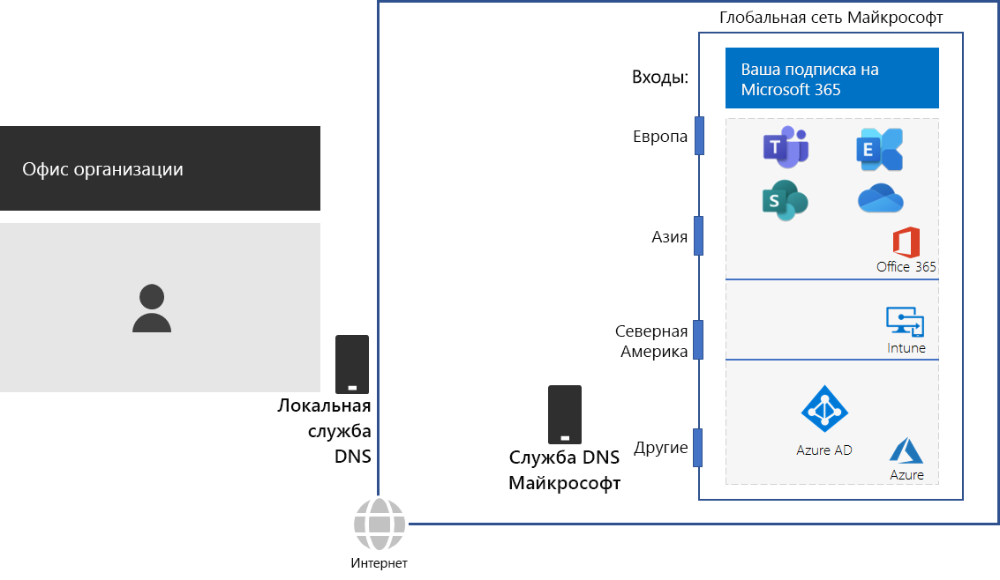

# Шаг 2. Настройка локальных подключений к Интернету для всех офисов

*Этот шаг — обязательный; он применяется к планам E3 и E5 Microsoft 365 корпоративный.*

На шаге 2 вы настраиваете локальные подключения к Интернету с использованием локальных DNS-серверов для всех офисов. Это необходимо для того, чтобы снизить задержку подключения и обеспечить подключение локальных клиентских компьютеров к ближайшей точке входа в облачные службы Microsoft 365.

В традиционных сетях для крупных организаций Интернет-трафик передается по сетевой магистрали на центральное подключение к Интернету. Это не способствует оптимизации производительности глобально распределенной инфраструктуры SaaS, включающей продукты Office 365 и Intune в Microsoft 365.

Глобальная сеть Майкрософт включает инфраструктуру *Distributed Service Front Door* — высокодоступную и масштабируемую граничную область сети с географически распределенными расположениями. Она разрывает подключение конечных пользователей в серверной части и эффективно перенаправляет трафик в глобальной сети Майкрософт.

Для обеспечения максимальной производительности локальные клиенты должны иметь доступ к ближайшему расположению Front Door, а не отправлять трафик через сетевую магистраль на расположение, ближайшее к центральному подключению организации к Интернету.

Приведем пример.

Если пользователь в парижском филиале хочет получить доступ к сайту SharePoint Online, 

1. то для разрешения имени, например contoso.sharepoint.com, направляется запрос DNS. 
2. DNS-сервер, предоставляемый поставщиком услуг Интернета, пересылает его на DNS-сервер Майкрософт.
3. DNS-серверы Майкрософт сопоставляют исходный IP-адрес перенаправленного запроса DNS с регионом, которому назначен этот адрес. DNS-сервер Майкрософт сообщает в ответ IP-адрес ближайшего расположения Front Door в сети Майкрософт в Европе.
4. DNS-сервер поставщика услуг Интернета отправляет этот IP-адрес пользователю.
5. Пользователь инициирует подключение к серверу SharePoint через Front Door в Европе.

Чтобы направлять клиентский запрос в ближайшее расположение Front Door, DNS-серверы Майкрософт используют запросы DNS, соответствующие исходному запросу клиента на подключение.  Поэтому для минимальной задержки в сети:

- Все офисы вашей организации должны иметь локальные подключения к Интернету для сетевого трафика категории [Оптимизировать](https://docs.microsoft.com/office365/enterprise/office-365-network-connectivity-principles#new-office-365-endpoint-categories).
- Каждое локальное подключение к Интернету должно использовать региональный DNS-сервер для исходящего интернет-трафика из этого места.

Дополнительную информацию см. в разделе [Локальная организация исходящего трафика для сетевых подключений](https://docs.microsoft.com/office365/enterprise/office-365-network-connectivity-principles#egress-network-connections-locally). 

Чтобы протестировать, насколько близко вы находитесь к точке входа в глобальную сеть Майкрософт, а также к точке подключения сети организации к поставщику услуг Интернета, воспользуйтесь [средством подключения сети Office 365](https://connectivity.office.com/).

Прежде чем перейти к следующему шагу, проверьте [условия](networking-exit-criteria.md#crit-networking-step2), при выполнении которых можно считать данный шаг завершенным.

## Следующий шаг

|||
|:-------|:-----|
||[Удаление разворотов пакетов](networking-avoid-network-hairpins.md)|
