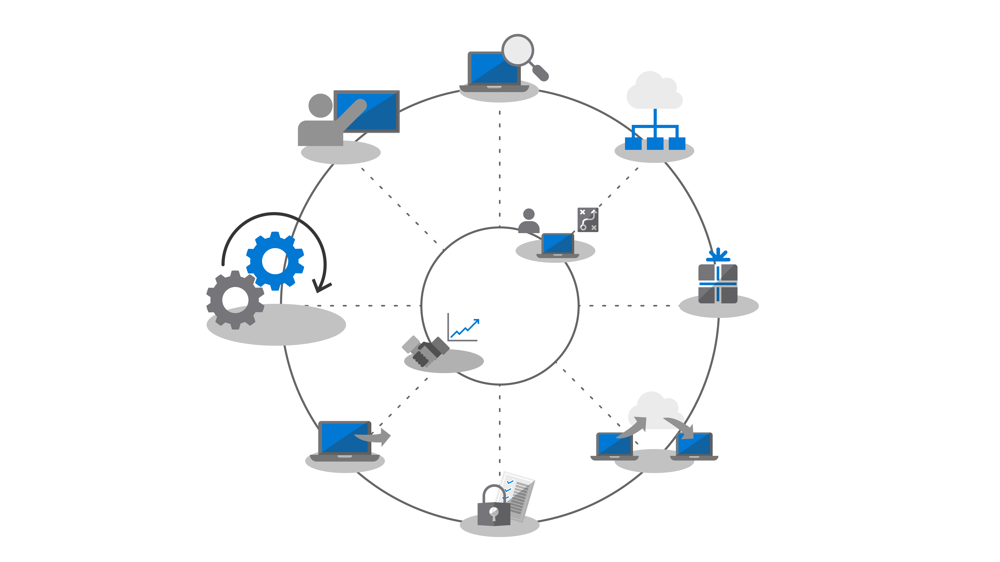
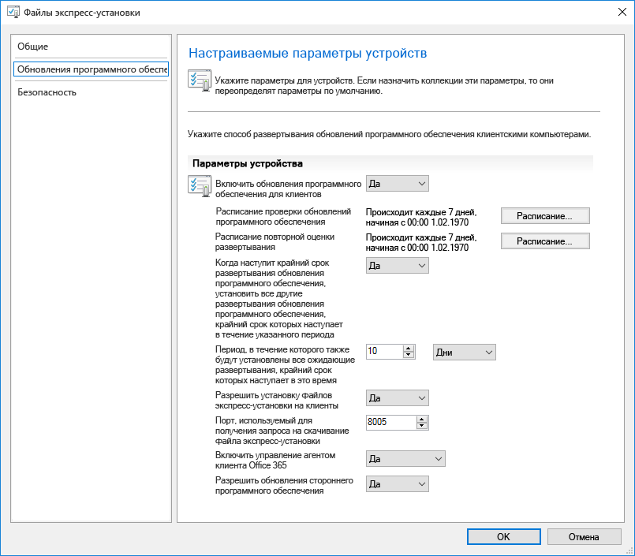
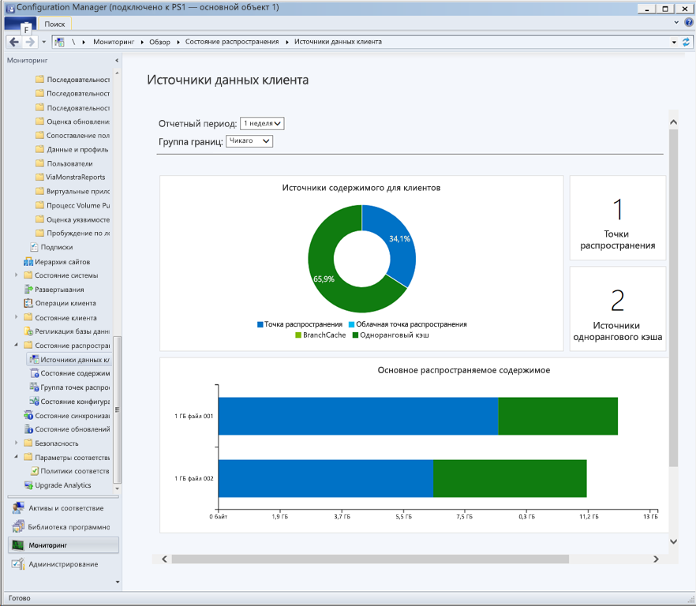
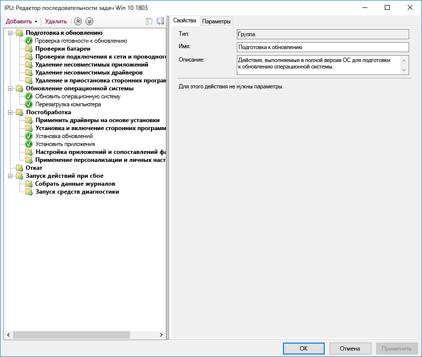

# Этап 7. Обслуживание Windows и Office

<table>
<thead>
<td></td>
<td>
<strong>Этап 7. Обслуживание Windows и Office</strong>

Both Windows 10 and Microsoft 365 Apps for enterprise continually add new capabilities to keep bringing user experiences and security forward with the latest innovations. Learn how to stay current with semi-annual and monthly updates, how the new servicing model works and the tools and options you have.
</td>
<td></td>
</thead>
</table>

>[!NOTE]
>Обслуживание Windows и Office — седьмой этап рекомендуемого нами процесса развертывания, который охватывает аспекты планирования полугодичных обновлений компонентов. Полный процесс развертывания для настольных ПК описан в статье [Центр развертывания компьютеров](https://aka.ms/HowToShift).
>

И в Windows 10, и в приложениях Microsoft 365 для предприятий представлены новые варианты обслуживания, модели поддержки и расписания обновления. Эти изменения помогают своевременно добавлять новые возможности. Вместе с этими обновлениями предоставляются новые параметры конфигурации, позволяющие использовать подходящие вам планы обслуживания. Узнайте, как подготовиться к обновлениям Semi-Annual Channel с новыми компонентами и возможностями в Windows 10 и в приложениях Microsoft 365 для предприятий, а также использовать новые возможности в Microsoft Endpoint Configuration Manager (Current Branch).

[Помощь клиентам в переходе на Windows 10 и приложения Microsoft 365 для предприятий](https://www.microsoft.com/microsoft-365/blog/2018/09/06/helping-customers-shift-to-a-modern-desktop/)

## Типы обновлений

Обновления делятся на две основные категории: обновления компонентов и исправления с обновлениями для системы безопасности, содержащие накопительные пакеты исправлений ошибок, а также улучшений безопасности и надежности. Что касается частоты, для Windows и Office доступен канал Semi-Annual Channel, предоставляющий новые возможности дважды в год (в марте и сентябре), в то время как исправления и обновления для системы безопасности выпускаются ежемесячно. Кроме того, исключительно для приложений Office 365 мы предоставляем обновления в Актуальном канале, которые полностью поддерживаются и содержат как новые возможности, так и исправления.

Если вы привыкли более продолжительному циклу обновления ОС и приложений, вы можете спросить:

  - Будут ли обновления совместимыми?

  - Потребуется ли постоянная переподготовка пользователей?

  - Каковы риски?

Чтобы ответить на эти вопросы и объяснить преимущества более частой доставки новых возможностей, мы рассмотрим некоторые особенности этого подхода.

### Преимущества обновлений компонентов

First, we’ve moved away from the model of the past that would introduce huge waves of change around every three years to now incremental smaller changes with feature updates twice per year. Why? With technology trends moving so fast in addition to rapidly evolving security threats, this keeps experiences and protections current. Some of the security related updates for example can’t just be delivered by monthly security updates or antivirus signature files; they may be low-level changes platform, like virtualization-based security.

[Краткое руководство по модели "Windows как услуга"](https://docs.microsoft.com/windows/deployment/update/waas-quick-start)

[Устранение угроз с помощью функций безопасности Windows 10](https://docs.microsoft.com/windows/security/threat-protection/overview-of-threat-mitigations-in-windows-10%20%20)

### Преимущества модели накопительных пакетов обновления

Second delivering quality and security updates as a cumulative update package corrects many of the issues of the past. It used to be that you might pick and choose sometimes from a dozen updates or more each month for both Windows and Office. As you can imagine, this creates a nearly impossible set of test matrices for support. Also, if you install a version of Windows or Office that is a year or more old, it might take hours or sometimes days to apply all updates delivered since that version was released.

With the cumulative model, you’re always one update away from being current and in doing so the number of monthly updates that you need to deploy is reduced. Each update builds upon updates from previous months and contains all of the fixes that you need to get current. Cumulative updates are especially helpful when PCs has been turned off for several months because they are in storage waiting to be reassigned to a different user.

### Расширенная проверка обновлений

Еще одно преимущество заключается в том, что перед широким развертыванием обновлений мы сначала выпускаем сборки через программы предварительной оценки [Office](https://products.office.com/office-insider?tab=Windows-Desktop) и [Windows](https://insider.windows.com/), что позволяет нам собирать диагностические данные и отзывы до выпуска общедоступной версии. В настоящее время программы предварительной оценки открыты для всех, поэтому вы можете заранее осваивать новые обновления. К моменту выпуска мы собираем диагностические данные с миллионов конфигураций, поэтому можем быть уверены в качестве общедоступных обновлений.

И еще: сборки для участников программы предварительной оценки Приложений Microsoft 365 для предприятий основаны на обновлениях Monthly Channel, поэтому если вы используете Semi-Annual Channel для Office, чтобы доставлять обновления компонентов дважды в год, как и для Windows, то вы можете проверять эти сборки заранее, а также использовать выпуски Полугодового канала (предварительной корпоративной версии).

### Вспомогательные средства управления

We've also thought through how to make the deployment of updates seamless to you. Configuration Manager (Current Branch) is updated frequently to support the roll-out of these updates to Windows and Office and any new capabilities.

[Развертывание обновлений Windows 10 с помощью Configuration Manager](https://docs.microsoft.com/windows/deployment/update/waas-manage-updates-configuration-manager)

[Управление приложениями Microsoft 365 для предприятий с помощью диспетчера конфигураций](https://docs.microsoft.com/mem/configmgr/sum/deploy-use/manage-office-365-proplus-updates)

## Общие сведения о каналах для Windows и Office

Для Windows 10 предлагается три канала обслуживания:

- [**Программа предварительной оценки Windows**](https://docs.microsoft.com/windows/deployment/update/waas-overview#windows-insider) для тестирования организациями новых возможностей обновления и предоставления отзыва о них
- **Semi-Annual Channel** предоставляет новые функции в выпусках обновления компонентов два раза в год
- **Long Term Servicing Channel** предназначен только для специальных устройств, которым требуется вариант обслуживания с более длительным сроком действия

Для Microsoft 365 предлагается четыре канала обслуживания:

- [**Программа предварительной оценки Office**](https://products.office.com/office-insider) для тестирования организациями новых возможностей и функций Office, которые находятся в разработке, и предоставления отзыва о них
- **Актуальный канал** для предоставления пользователям новейших возможностей Office по мере их выпуска
- **Полугодовой канал (корпоративный)** предоставляет новые функции в новых компонентах только два раза в год
- **Полугодовой канал (предварительная корпоративная версия)**  — полностью поддерживаемая сборка Office, которая позволяет пилотным пользователям и тестировщикам совместимости приложений тестировать и проверять следующий выпуск Полугодового канала (корпоративного)

Подробные сведения о каналах обслуживания Windows и Office см. в указанных ниже статьях.

- [Обзор модели "Windows как услуга"](https://docs.microsoft.com/windows/deployment/update/waas-overview#servicing-channels)
- [Обзор каналов обновления для приложений Microsoft 365](https://docs.microsoft.com/DeployOffice/overview-update-channels#BKMK_SAC)

## Поэтапное развертывание обновлений

Now let’s shift gears to how you will roll out these updates. For any release, we recommend at least three deployment phases for IT – validation, piloting and broad production deployment. Once you’re up and running on Windows 10 and Microsoft 365 Apps for enterprise, you'll use monthly servicing to stay current with critical security and quality updates, then you’ll move to semi-annual servicing for new features.

### Ежемесячное обновление

The service model is designed so you can choose to limit the roll-out of new features to twice per year, and if needed you can even skip a semi-annual update and continue receiving quality and security updates. As mentioned, the cumulative nature of monthly updates means each will increase in size per month.

#### Экспресс-обновления

Using a technology called "Express Updates" in Windows and Binary Delta Compression in Office, we can reduce the download size significantly. In both approaches, the update engines compare what’s on the PC and finds only the differentials needed to update what’s there.

[Описание исправлений Windows 10 и сведения об окончании выпуска разностных обновлений](https://techcommunity.microsoft.com/t5/Windows-IT-Pro-Blog/Windows-10-quality-updates-explained-amp-the-end-of-delta/ba-p/214426)

Центр обновления Windows для бизнеса и Windows Server Update Services уже давно поддерживают экспресс-обновления, но теперь мы добавили их поддержку в Microsoft Endpoint Configuration Manager (Current Branch).

#### Двоичное разностное сжатие

Двоичное разностное сжатие в Office используется только при обновлении последней версии приложений Microsoft 365 для предприятий. Для использования этого подхода необходимо обновлять предыдущую сборку и нельзя пропускать обновления.

Windows and Office update channels can be managed via Configuration Manager using the standard approval and targeting process. Additionally, you can use policy settings in Office and Windows to enforce update channels used, as well as related settings.

### Полугодичные обновления

Итак, мы рассмотрели ежемесячные обновления. Теперь перейдем к более масштабным полугодичным обновлениям.

Как упоминалось в статье "Готовность устройств и приложений", подготовку к этим крупным обновлениям следует начать с помощью тех же средств обеспечения готовности, которые мы настроили на 1-м этапе развертывания.

As for tooling, you can use policy settings with Windows Update for Business, software update management via Microsoft Endpoint Configuration Manager (Current Branch), Windows Server Update Services (WSUS), or update policies set by Microsoft Intune. If you are concerned about network bandwidth, see Step 2: Directory and Network Readiness, to learn about your options to reduce network traffic via Delivery Optimization and other peer to peer caching technologies.

[Windows Semi-Annual Channel](https://docs.microsoft.com/windows/deployment/update/waas-overview#semi-annual-channel)

[Полугодовой канал (корпоративный) для Приложений Microsoft 365 для предприятий](https://docs.microsoft.com/DeployOffice/overview-update-channels#BKMK_SAC)

#### Последовательности задач обновления

Установка крупных обновлений компонентов с помощью стандартных методик управления обновлениями ПО поддерживается, но многие организации выбирают последовательность задач обновления в Microsoft Endpoint Configuration Manager (Current Branch) или Microsoft Deployment Toolkit.

Последовательность задач позволяет создавать собственные проверки или задачи ДО установки обновления компонентов, а также выполнять пользовательские задачи ПОСЛЕ установки самого обновления. Задачи после обновления могут включать временную остановку служб, если это требуется во время обновления, установку и замену драйверов, обновления приложений, а также параметры персонализации панели задач или меню "Пуск" в Windows 10.

If you’re already using task sequences to migrate your Windows 7 machines to Windows 10 and are well-versed with those tools, this is a great place to start and provides ultimate control. While you can use a single task sequence for the entire upgrade, it is quite common that organizations use two task sequences. One task sequence for making sure the machines are ready for the upgrade, that silently pre-stages all the required setup files on target computers, and one to do the actual upgrade. This approach ensures that your user productivity is less impacted.

[Создание последовательности задач для обновления операционной системы в Configuration Manager](https://docs.microsoft.com/mem/configmgr/osd/deploy-use/create-a-task-sequence-to-upgrade-an-operating-system)

#### Поддержка обновлений компонентов в полугодовом канале

[Как было объявлено в сентябре 2018 г.](https://www.microsoft.com/microsoft-365/blog/2018/09/06/helping-customers-shift-to-a-modern-desktop/), сроки поддержки обновлений Semi-Annual Channel будут основаны на описанной ниже модели.

  - Все поддерживаемые в данный момент обновления компонентов Windows 10 Корпоративная и Windows 10 для образовательных учреждений, начиная с версии 1607, будут поддерживаться в течение 30 месяцев со дня их первоначального выпуска.

  - Все последующие обновления компонентов, начиная с версии 1809, выпущенные в сентябре, будут поддерживаться в течение 30 месяцев со дня их выпуска.

  - Будущие обновления компонентов, выпущенные в марте, начиная с версии 1903, будут поддерживаться в течение 18 месяцев со дня их выпуска.

  - Полугодичные обновления приложений Microsoft 365 для предприятий будут поддерживаться в течение 18 месяцев.

#### Дополнительные варианты автоматизации установки помимо последовательностей задач

Если вы не используете последовательности задач обновления, то теперь вы можете выполнять дополнительные действия или применять файлы драйверов во время обновления компонентов до установки (до того, как программа установки выполнит проверки совместимости) или до фиксации (применения обновления).

[Что нового в программе установки Windows 10 версии 1803](https://docs.microsoft.com/windows/whats-new/whats-new-windows-10-version-1803%23windows-setup)

## Следующий этап 

## [Этап 8. Информирование и обучение пользователей](https://aka.ms/mdd8)

## Предыдущий этап 

## [Этап 6. Развертывание ОС и обновление компонентов](https://aka.ms/mdd6)
