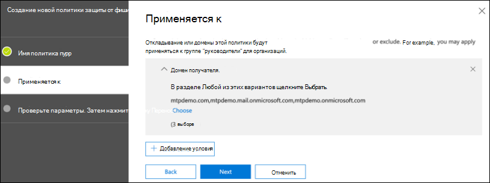
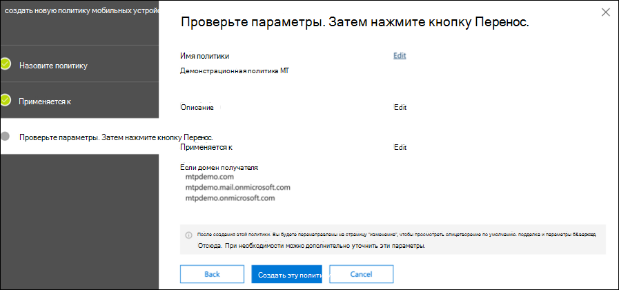
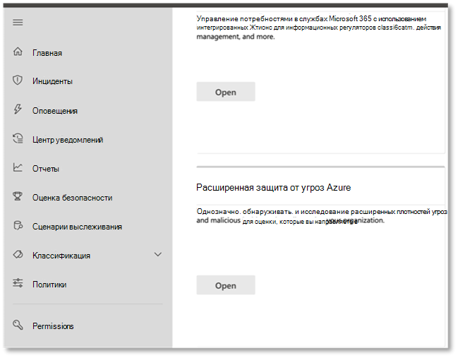

# Настройка принципов защиты от угроз Майкрософт для испытательной лабораторной среды

**Область применения:**
- Защита от угроз (Майкрософт)

Создание пробной лабораторной среды Майкрософт для защиты от угроз и развертывание выполняется в три этапа:

 
<table border="0" width="100%" align="center">
  <tr style="text-align:center;">
    <td align="center" style="width:25%; border:0;" >
      <a href= "https://docs.microsoft.com/microsoft-365/security/mtp/prepare-mtpeval?view=o365-worldwide"> 
        
       Этап 1: подготовка</a> 
    </td>
     <td align="center">
      <a href="https://docs.microsoft.com/microsoft-365/security/mtp/setup-mtpeval?view=o365-worldwide">
        
       Этап 2: Настройка</a> 
    </td>
    <td align="center" bgcolor="#d5f5e3">
      <a href="https://docs.microsoft.com/microsoft-365/security/mtp/config-mtpeval?view=o365-worldwide">
        
       Этап 3: Настройка встроенного &</a> 
</td>

  </tr>
</table>

В настоящее время вы намерены на этапе настройки.

Подготовка — это ключ к любому успешному развертыванию. В этой статье вы узнаете о точках, которые необходимо учесть при подготовке к развертыванию пакета ATP для защитника Microsoft.

## Основы защиты от угроз Майкрософт
Защита от угроз Майкрософт состоит из четырех базовых принципов. Несмотря на то, что один из них уже может обеспечить безопасность вашей сетевой организации, при использовании четырех базовых принципов защиты от угроз Майкрософт вы узнаете, что ваша организация является наибольшим значением.

  

В этом разделе приведутся инструкции по настройке:
-   Office 365 Advanced Threat Protection
-   Расширенная защита от угроз Azure 
-   Microsoft Cloud App Security
-   Advanced Threat Protection в Microsoft Defender

## Настройка Office 365 Advanced Threat protection
>[!NOTE]
>Пропустите этот шаг, если вы уже включили расширенную защиту от угроз для Office 365. 

Существует модуль PowerShell, который называется *рекомендуемой конфигурацией Office 365 Advanced Threat protection Analyzer (Orca)* , который помогает определить некоторые из этих параметров. При запуске с правами администратора в клиенте командлет Get-Оркарепорт поможет создать оценку параметров защиты от нежелательной почты, защиты от фишинга и других сообщений санацией. Вы можете скачать этот модуль из https://www.powershellgallery.com/packages/ORCA/. 

1. Перейдите к разделу**Threat management** > **Policy** [Безопасность & безопасности центра](https://protection.office.com/homepage) > соответствия требованиям Office 365.
  
 
2. Выберите пункт **Защита от фишинга ATP**, выберите **создать** и введите имя и описание политики. Нажмите кнопку **Далее**.
  

>[!NOTE]
>Измените политику защиты от фишинга ATP. Изменение **расширенного порога фишинга** на **2 агрессивно**.
 

3. Щелкните раскрывающееся меню **Добавить условие** и выберите домен (ы) в качестве домена получателя. Нажмите кнопку **Далее**.
  
 
4. Проверьте параметры. Щелкните **создать эту политику** для подтверждения. 
  
 
5. Выберите пункт **безопасные вложения ATP** и установите флажок **включить ATP для SharePoint, OneDrive и Microsoft Teams** .  
  

6. Нажмите значок +, чтобы создать новую политику безопасных вложений, примените ее к доменам получателя. Нажмите кнопку **Сохранить**.
  
 
7. Затем выберите политику **безопасных ссылок ATP** , а затем щелкните значок карандаша, чтобы изменить политику по умолчанию.

8. Убедитесь, что флажок не **отслеживать, когда пользователи щелкать ссылку "безопасные ссылки** " не установлен, а остальные параметры выбраны. Дополнительные сведения приведены в разделе [Параметры безопасных ссылок](https://docs.microsoft.com/microsoft-365/security/office-365-security/recommended-settings-for-eop-and-office365-atp?view=o365-worldwide) . Нажмите кнопку **Сохранить**. 
  

9. Затем выберите политику **защиты от вредоносных программ** , выберите значение по умолчанию и нажмите значок карандаша.

10. Нажмите кнопку **Параметры** и выберите Да, чтобы включить **ответ на обнаружение вредоносных программ**, **используя текст уведомления по умолчанию** . Включите **Фильтр общих типов вложений** . Нажмите кнопку **Сохранить**.
   
  
11. Перейдите к разделу >  [& безопасности Office 365](https://protection.office.com/homepage)**Поиск в журнале аудита** **поиска** > и включите аудит для.  
  

12. Интеграция Office 365 с пакетом ATP с помощью защитника Майкрософт. Перейдите в раздел >  [& безопасности Office 365 Security](https://protection.office.com/homepage)**Management** > **Explorer** и выберите **Параметры вдатп** в правом верхнем углу экрана. В диалоговом окне Подключение к Защитнику (Майкрософт) ATP включите параметр **подключиться к Windows ATP**.
  

## Настройка Advanced Threat Protection в Azure
>[!NOTE]
>Пропустите этот шаг, если вы уже включили службу Advanced Threat Protection в Azure

1. Перейдите в [Центр безопасности Microsoft 365](https://security.microsoft.com/info) > выберите **Дополнительные ресурсы** > **Azure Advanced Threat protection**.
  

2. Нажмите кнопку **создать** , чтобы запустить мастер Advanced Threat protection. 
   

3. Выберите **указать имя пользователя и пароль для подключения к лесу Active Directory**.  
  

4. Введите локальные учетные данные Active Directory. Это может быть любая учетная запись пользователя, имеющая доступ на чтение к Active Directory.
  

5. Затем выберите пункт **скачать файл установки и передачи датчиков** на контроллер домена. 
  

6. Выполните настройку датчика Azure ATP и начните выполнение мастера.
   
 
7. Нажмите кнопку **Далее** в разделе Тип развертывания Sensor (датчик).
   
 
8. Скопируйте ключ доступа, так как он понадобится для его последующего ввода в мастере.
  
 
9. Скопируйте в мастер ключ доступа и нажмите кнопку **установить**. 
   

10. Поздравляем, вы успешно настроили службу Advanced Threat Protection в Azure на контроллере домена.
  
 
11. В разделе Параметры [Azure Azure ATP](https://go.microsoft.com/fwlink/?linkid=2040449) выберите пункт **Защитник Windows ATP**, а затем включите переключатель. Нажмите кнопку **Сохранить**. 
  

>[!NOTE]
>Пакет ATP для защитника Windows изменен в качестве пакета ATP для защитника Майкрософт. Изменение фирменного стиля на всех наших порталах разбивается на согласованность.

## Настройка Microsoft Cloud App Security
>[!NOTE]
>Пропустите этот шаг, если вы уже включили Microsoft Cloud App Security. 

1. Перейдите в раздел [Microsoft 365 Security Center](https://security.microsoft.com/info) > **More Resources** > **Security Microsoft Cloud App Security**.
  

2. В информационном запросе для интеграции Azure ATP выберите **включить интеграцию данных Azure ATP**. 
   

>[!NOTE]
>Если вы не видите этот запрос, это может означать, что интеграция Azure ATP данных уже включена. Тем не менее, если вы не уверены, обратитесь к ИТ ИТ администратора, чтобы подтвердить. 

3. Перейдите к разделу **Параметры**, перейдите в раздел **Интеграция Azure ATP** вкл., а затем нажмите кнопку **сохранить**. 
  
>[!NOTE]
>Для новых экземпляров Azure ATP этот переключатель интеграции автоматически включается. Прежде чем переходить к следующему шагу, убедитесь, что интеграция Azure ATP включена.
 
4. В разделе Параметры облачного обнаружения выберите **Интеграция с защитником Майкрософт**, а затем включите интеграцию. Нажмите кнопку **Сохранить**.
  

5. В разделе Параметры облачного обнаружения выберите **обогащение пользователей**, а затем включите интеграцию с Azure Active Directory.
  

## Настройка Advanced Threat Protection в защитнике Майкрософт
>[!NOTE]
>Пропустите этот шаг, если вы уже включили Advanced Threat Protection в защитнике Microsoft.

1. Перейдите в раздел [Microsoft 365 Security Center](https://security.microsoft.com/info) > **More Resources** > **Center securitys Microsoft Защитник**. Нажмите кнопку **Open** (Открыть).
   
 
2. Следуйте инструкциям мастера Advanced Threat Protection в защитнике Майкрософт. Нажмите кнопку **Далее**. 
   

3. Выберите в зависимости от предпочтительного расположения хранилища данных, политики хранения данных, размера организации и согласия пользователя по предварительным функциям. 
   
>[!NOTE]
>После этого невозможно изменить некоторые параметры, такие как расположение хранилища данных. 
 

Нажмите кнопку **Далее**. 

4. Нажмите **продолжить** , чтобы подготовиться к работе клиента, который является ПАКЕТом ATP для защитника Майкрософт.
   

5. Применяйте конечные точки с помощью групповых политик, диспетчера конечных точек Майкрософт или запуска локального сценария для пакета ATP в защитнике Майкрософт. Для простоты в этом руководстве используется локальный скрипт.

6. Щелкните **скачать пакет** и скопируйте сценарий входящей миграции в конечные точки (s).  
   

7. В конечной точке запустите сценарий входящей миграции от имени администратора и нажмите Y.
   

8. Поздравляем, вы выполнили переплату для первой конечной точки.  
   

9. Скопируйте тест с определением в мастере Microsoft Defender ATP.
   

10. Скопируйте скрипт PowerShell в командную строку с повышенными привилегиями и запустите его. 
   

11. В мастере нажмите кнопку **начать с помощью ATP "защитник Майкрософт"** .
   
 
12. Посетите [Центр безопасности защитника Microsoft](https://securitycenter.windows.com/). Перейдите в раздел **Параметры** и выберите **Дополнительные функции**. 
   

13. Включите интеграцию с **Advanced Threat Protection в Azure**.  
   

14. Включите интеграцию с **Microsoft Office 365 Threat Intelligence**.
   

15. Включите интеграцию с **Microsoft Cloud App Security**.
   

16. Прокрутите список вниз и нажмите кнопку **сохранить настройки** , чтобы подтвердить новые интеграции.
   

## Дальнейшие действия
[Включите защиту от угроз Майкрософт](https://docs.microsoft.com/microsoft-365/security/mtp/mtp-enable?view=o365-worldwide#start-using-the-service) и [Создайте тестовое оповещение](generate-test-alert.md).
