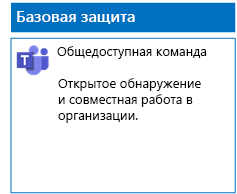
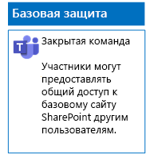
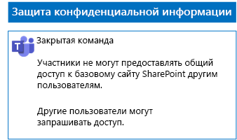
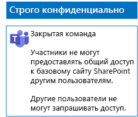

# Развертывание команд с тремя уровнями защиты файловDeploy teams for three tiers of protection for files

В этой статье показано создание и развертывание базовых, конфиденциальных и строго конфиденциальных команд.Use the steps in this article to design and deploy baseline, sensitive, and highly confidential teams. Дополнительные сведения об этих трех уровнях защиты см. в статье [Защита файлов в Microsoft Teams](secure-files-in-teams.md).For more information about these three tiers of protection, see [Secure files in Microsoft Teams](secure-files-in-teams.md).

## Команды базового уровняBaseline teams

Базовая защита распространяется на общедоступные и закрытые команды.Baseline protection includes both public and private teams. Обнаруживать общедоступные команды и получать к ним доступ может любой пользователь в организации.Public teams can be discovered and accessed by anybody in the organization. Частный сайт могут найти и открыть только члены группы Office 365, связанной с этой командой.Private sites can only be discovered and accessed by members of the Office 365 group associated with the team. Оба типа команд позволяют участникам делиться содержимым сайта.Both of these types of teams allow members to share the site with others.

### ОбщедоступноеPublic

Следуйте инструкциям, приведенным в [этой статье](https://support.office.com/article/174adf5f-846b-4780-b765-de1a0a737e2b), чтобы создать команду базового уровня с открытым доступом и соответствующими разрешениями.Follow the instructions in [this article](https://support.office.com/article/174adf5f-846b-4780-b765-de1a0a737e2b) to create a baseline Team with public access and permissions.

Ниже показана итоговая конфигурация.Here is your resulting configuration.

### Личные сведенияPrivate

Следуйте инструкциям, приведенным в [этой статье](https://support.office.com/article/174adf5f-846b-4780-b765-de1a0a737e2b), чтобы создать команду базового уровня с закрытым доступом и соответствующими разрешениями.Follow the instructions in [this article](https://support.office.com/article/174adf5f-846b-4780-b765-de1a0a737e2b) to create a baseline Team with private access and permissions.

Ниже показана итоговая конфигурация.Here is your resulting configuration.

## Конфиденциальные командыSensitive teams

Для работы с конфиденциальными командами необходимо сначала [создать закрытую команду](https://support.office.com/article/174adf5f-846b-4780-b765-de1a0a737e2b).For a sensitive team, you start by [creating a private team](https://support.office.com/article/174adf5f-846b-4780-b765-de1a0a737e2b).

После этого настройте базовый сайт SharePoint таким образом, чтобы предотвратить общий доступ к нему для участников команды.Next, you configure the underlying SharePoint site to prevent sharing by team members.

1. На панели инструментов команды щелкните **Файлы**.In the tool bar for the team, click **Files**.

2. Щелкните многоточие, а затем — **Открыть в SharePoint**.Click the ellipsis, and then click **Open in SharePoint**.

3. На панели инструментов базового сайта SharePoint щелкните значок параметров и выберите вариант **Разрешения для сайта**.In the tool bar of the underlying SharePoint site, click the settings icon, and then click **Site permissions**.

4. В области **Разрешения для сайта** в разделе **Параметры общего доступа** щелкните **Изменить параметры общего доступа**.In the **Site permissions** pane, under **Sharing Settings**, click **Change sharing settings**.

5. В разделе **Разрешения на предоставление общего доступа** выберите **Только владельцы сайта могут делиться файлами, папками и сайтом** и щелкните **Сохранить**.Under **Sharing permissions**, choose **Only site owners can share files, folders, and the site**, and then click **Save**.

Ниже показана итоговая конфигурация.Here is your resulting configuration.

## Строго конфиденциальные командыHighly confidential teams

Для работы со строго конфиденциальными командами необходимо сначала [создать закрытую команду](https://support.office.com/article/174adf5f-846b-4780-b765-de1a0a737e2b).With a highly confidential team, you start by [creating a private team](https://support.office.com/article/174adf5f-846b-4780-b765-de1a0a737e2b).

После этого настройте базовый сайт SharePoint таким образом, чтобы предотвратить общий доступ к нему для участников команды и запретить запросы на доступ от лиц, не являющихся участниками команды.Next, you configure the underlying SharePoint site to prevent sharing by team members and the requesting of access by non-members of the team.

1. На панели инструментов команды щелкните **Файлы**.In the tool bar for the team, click **Files**.

2. Щелкните многоточие, а затем — **Открыть в SharePoint**.Click the ellipsis, and then click **Open in SharePoint**.

3. На панели инструментов базового сайта SharePoint щелкните значок параметров и выберите вариант **Разрешения для сайта**.In the tool bar of the underlying SharePoint site, click the settings icon, and then click **Site permissions**.

4. В области **Разрешения для сайта** в разделе **Параметры общего доступа** щелкните **Изменить параметры общего доступа**.In the **Site permissions** pane, under **Sharing Settings**, click **Change sharing settings**.

5. В разделе **Разрешения на предоставление общего доступа** установите флажок **Только владельцы сайта могут делиться файлами, папками и сайтом**.Under **Sharing permissions**, choose **Only site owners can share files, folders, and the site**.

6. Отключите параметр **Разрешить запросы на доступ** и нажмите кнопку **Сохранить**.Turn off **Allow access requests**, and then click **Save**.

Ниже показана итоговая конфигурация.Here is your resulting configuration.

## Дальнейшие действияNext step

[Защита файлов в командах с помощью меток хранения и политики защиты от потери данныхProtect files in teams with retention labels and DLP](deploy-teams-retention-DLP.md)

## См. такжеSee also

[Защита файлов в Microsoft TeamsSecure files in Microsoft Teams](secure-files-in-teams.md)

[Освоение облака и гибридные решенияCloud adoption and hybrid solutions](https://docs.microsoft.com/office365/enterprise/cloud-adoption-and-hybrid-solutions)
