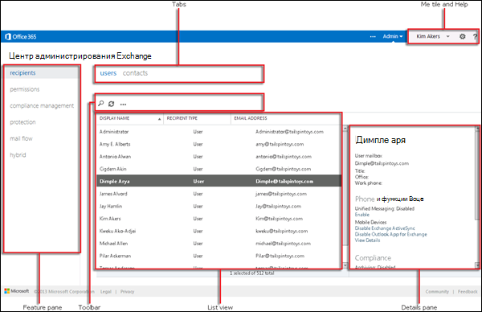

# Центр администрирования Exchange в Exchange Online Protection

Центр администрирования Exchange — это веб-консоль управления для Microsoft Exchange Online Protection.

Ищете версию этой статьи в Exchange Server? Обратитесь к [центру администрирования Exchange в Exchange Server](https://docs.microsoft.com/exchange/architecture/client-access/exchange-admin-center).

Ищете версию этой статьи для Exchange Online? Обратитесь к [центру администрирования Exchange в Exchange Online](https://docs.microsoft.com/exchange/exchange-admin-center).

## Вход в Центр администрирования Exchange

В большинстве случаев клиенты EOP будут получать доступ к центру администрирования Exchange через центр администрирования Microsoft 365. Ссылка на Exchange Online Protection расположена в раскрывающемся меню на плитке **Администратор**, находящейся рядом с плиткой **Я**. Чтобы перейти в Центр администрирования Exchange, щелкните плитку **Администратор** и в раскрывающемся меню выберите **Exchange Online Protection**.

Перейти к странице входа в Центр администрирования Exchange можно также непосредственно по URL-адресу: `https://admin.protection.outlook.com/ecp/<companydomain>`. Например, `https://admin.protection.outlook.com/ecp/contoso.onmicrosoft.com`. После того как вы укажете свои учетные данные пользователя, вы перейдете непосредственно в Центр администрирования Exchange.

## Общие элементы пользовательского интерфейса в Центре администрирования Exchange

В этом разделе рассматриваются элементы интерфейса пользователя в Центре администрирования Exchange.

### Панель "Функции"

Это первый уровень навигации для большинства заданий, выполняемых в Центре администрирования Exchange. Панель функций состоит из областей функций.

1. **Получатели**: в этой области отображаются внутренние пользователи и внешние контакты.

2. **Разрешения**: здесь вы будете управлять ролями администраторов.

3. **Управление соответствием**: в этой области находятся журналы аудита и отчеты, например отчет о группе ролей администраторов.

4. **Защита**: здесь вы можете управлять защитой от вредоносных программ и нежелательной почты для вашей организации, а также управлять сообщениями в карантине.

5. **Поток обработки почты**: в этой области можно управлять правилами, обслуживаемыми доменами и соединителями, а также выполнять трассировку сообщений.

### Вкладки

Вкладки — это второй уровень навигации. Каждый из компонентов содержит различные вкладки, на каждой из которых будет представлена функция.

### Панель инструментов

При выборе большинства вкладок отображается панель инструментов. Панель инструментов содержит значки, которые выполняют определенное действие. Значки и их действия описаны в следующей таблице.

|**Значок**|**Имя**|**Действие**|
|:-----|:-----|:-----|
||"Добавить", "Создать"|Используйте этот значок для создания нового объекта. Некоторые из этих значков имеют стрелку вниз, щелкнув которую, можно отобразить дополнительные объекты, которые можно создать.|
||Изменить|Используйте этот значок для редактирования объекта.|
||Удаление|Используйте этот значок для удаления объекта. У некоторых значков удаления есть стрелка вниз, которая позволяет отобразить дополнительные параметры.|
||Поиск|Этот значок позволяет открыть поле поиска, в котором можно ввести фразу поиска для объекта, который требуется найти.|
||Обновить|Используйте этот значок, чтобы обновить представление списка.|
||Дополнительные параметры|Используйте этот значок для просмотра дополнительных действий, которые можно выполнить для объектов этой вкладки. Например, при нажатии этого значка в области **Получатели \> Пользователи** отображается параметр для выполнения **расширенного поиска**.  |
||Стрелка вверх и стрелка вниз|Используйте эти значки для изменения приоритета объекта.|
||Удалить|Используйте этот значок, чтобы удалять объекты из списка.|

### Представление списка

При выборе вкладки в большинстве случаев отображается представление списка. Лимит просмотра в Центре администрирования Exchange составляет около 10 000 объектов. Кроме того, включено постраничное разделение, так что вы можете листать страницы результатов.

### Область сведений

При выборе объекта в представлении списка информация об этом объекте отображается в области сведений. В некоторых случаях область сведений включает задачи управления.

### Иконка "Я" и справка

Плитка **Я** позволяет выйти из Центра администрирования Exchange и войти в него как другой пользователь. При помощи раскрывающегося меню справки **Справка** можно выполнять следующие действия:

1. **Справка**: щелкните  справки, чтобы просмотреть содержимое справки в Интернете.

2. **Отключить всплывающее**окно справки: при создании или редактировании объекта всплывающая справка отображается в контекстной справке для полей. Вы можете отключить подменю справки или включить его, если оно отключено.

3. **Авторские права**: щелкните эту ссылку, чтобы прочитать уведомление об авторских правах для Exchange Online Protection.

4. **Конфиденциальность**: щелкните, чтобы прочитать политику конфиденциальности для Exchange Online Protection.

## Поддерживаемые веб-браузеры

Для оптимальной работы с центром администрирования Exchange рекомендуется всегда использовать новейшие браузеры, клиенты Office и приложения. We also recommend that you install software updates when they become available. Дополнительные сведения о поддерживаемых браузерах и требованиях к системе для службы приведены в разделе [требования к системе для Office](https://products.office.com/office-system-requirements).

## Поддерживаемые в EOP языки

Для Exchange Online Protection доступны и поддерживаются следующие языки.

- Амхарский

- Арабский

- Баскский (Basque)

- Бенгальский (Индия)

- Болгарский

- Каталонский

- китайский (упрощенное письмо);

- китайский (традиционный);

- хорватский;

- чешский;

- датский;

- голландский;

- голландский;

- английский;

- эстонский;

- Филиппинский (Филиппины)

- финский;

- французский;

- Галисийский

- немецкий;

- греческий;

- Гуджарати

- иврит;

- хинди;

- венгерский;

- Исландский

- индонезийский;

- итальянский;

- японский;

- Каннада

- Казахский

- Суахили

- корейский;

- латышский;

- литовский;

- Малайский (Бруней-Даруссалам)

- Малайский (Малайзия)

- Малаялам

- Маратхи

- Норвежский (букмол)

- Норвежский (нюнорск)

- Ория

- Персидский

- польский;

- португальский (Бразилия);

- португальский (Португалия);

- румынский;

- русский;

- Сербскохорватский (кириллица, Сербия)

- сербский (латиница);

- словацкий;

- словенский;

- испанский;

- шведский;

- Тамильский

- Телугу

- тайский;

- турецкий;

- украинский;

- Урду

- Вьетнамский

- Валлийский

