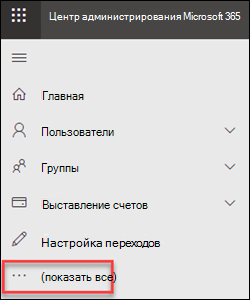
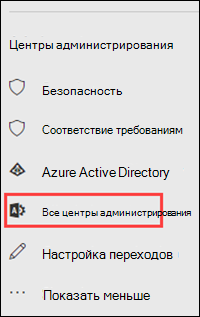

# Центр администрирования Exchange в автономном EOPExchange admin center in standalone EOP

Центр администрирования Exchange — это веб-консоль управления для отдельной Exchange Online Protection (EOP).The Exchange admin center (EAC) is a web-based management console for standalone Exchange Online Protection (EOP).

Ищете версию этой статьи для Exchange Online?Looking for the Exchange Online version of this topic? Обратитесь к [центру администрирования Exchange в Exchange Online](https://docs.microsoft.com/exchange/exchange-admin-center).See [Exchange admin center in Exchange Online](https://docs.microsoft.com/exchange/exchange-admin-center).

## Открытие центра администрирования Exchange в EOPOpen the EAC in EOP

Автономные клиенты EOP могут получать доступ к центру администрирования Exchange с помощью следующих методов:Standalone EOP customers can access the EAC by using the following methods:

- **В центре администрирования Microsoft 365**:**From the Microsoft 365 admin center**:

  1. Перейдите к разделу <https://admin.microsoft.com> и выберите команду **Показать все**.Go to <https://admin.microsoft.com> and click **Show all**.

     

  2. В открывшемся разделе **центры администрирования** выберите **все центры администрирования**.In the **Admin centers** section that appears, click **All admin centers**.

     

  3. На открывшейся странице **все центры администрирования** выберите **Exchange Online Protection**.On the **All admin centers** page that appears, click **Exchange Online Protection**.

- Перейдите непосредственно к `https://admin.protection.outlook.com/ecp/` .Go directly to `https://admin.protection.outlook.com/ecp/`.

## Общие элементы пользовательского интерфейса в центре администрирования Exchange в EOPCommon user interface elements in the EAC in EOP

В этом разделе рассматриваются элементы интерфейса пользователя в Центре администрирования Exchange.This section describes the user interface elements that are found in the EAC.

### Панель "Функции"Feature Pane

Это первый уровень навигации для большинства заданий, выполняемых в Центре администрирования Exchange. Панель функций состоит из областей функций.This is the first level of navigation for most of the tasks you'll perform in the EAC. The feature pane is organized by feature areas.

- **Получатели**: в этой области отображаются группы и внешние контакты.**Recipients**: This is where you'll view groups and external contacts.

- **Разрешения**: здесь вы будете управлять ролями администраторов.**Permissions**: This where you'll manage admin roles.

- **Управление соответствием**: здесь вы найдете отчет группы ролей администраторов и отчет по журналу аудита действий администратора.**Compliance Management**: This is where you'll find the administrator role group report and the admin audit log report.

- **Protection**: в этой области можно управлять политиками защиты от вредоносных программ, политикой фильтрации подключений по умолчанию и DKIM.**Protection**: This is where you can manage anti-malware policies, the default connection filter policy, and DKIM.

  > [!NOTE]
  > Следует управлять политиками защиты от вредоносных программ и политикой фильтрации подключений по умолчанию в центре безопасности & соответствия требованиям.You should manage anti-malware policies and the default connection filter policy in the Security & Compliance Center. Дополнительную информацию можно узнать [в статье Настройка политик защиты от вредоносных программ в EOP](configure-anti-malware-policies.md) и [Настройка ФИЛЬТРАЦИИ подключений в EOP](configure-the-connection-filter-policy.md).For more information, see [Configure anti-malware policies in EOP](configure-anti-malware-policies.md) and [Configure connection filtering in EOP](configure-the-connection-filter-policy.md).

- **Поток обработки почты**: здесь вы будете управлять правилами потока обработки почты (также называемыми правилами транспорта), обслуживаемыми доменами и соединителями, а также с местом, где можно запустить трассировку сообщений.**Mail Flow**: This is where you'll manage mail flow rules (also known as transport rules), accepted domains, and connectors, as well as where you can go to run message trace.

- **Гибридная**среда: в этой области можно запустить [Мастер гибридной конфигурации](https://docs.microsoft.com/Exchange/hybrid-configuration-wizard), а также установить [модуль PowerShell для Exchange Online](https://docs.microsoft.com/powershell/exchange/mfa-connect-to-exchange-online-powershell).**Hybrid**: This is where you can run the [Hybrid Configuration Wizard](https://docs.microsoft.com/Exchange/hybrid-configuration-wizard), and where you can install the [Exchange Online PowerShell module](https://docs.microsoft.com/powershell/exchange/mfa-connect-to-exchange-online-powershell).

### ВкладкиTabs

Вкладки — это второй уровень навигации.The tabs are your second level of navigation. Каждый из компонентов содержит различные вкладки, на каждой из которых будет представлена функция.Each of the feature areas contains various tabs, each representing a feature.

### Панель инструментовToolbar

При выборе большинства вкладок отображается панель инструментов. Панель инструментов содержит значки, которые выполняют определенное действие. Значки и их действия описаны в следующей таблице.When you click most tabs, you'll see a toolbar. The toolbar has icons that perform a specific action. The following table describes the icons and their actions.

||||
|---|---|---|
|**Значок****Icon**|**Имя****Name**|**Действие****Action**|
||"Добавить", "Создать"Add, New|Используйте этот значок для создания нового объекта. Некоторые из этих значков имеют стрелку вниз, щелкнув которую, можно отобразить дополнительные объекты, которые можно создать.Use this icon to create a new object. Some of these icons have an associated down arrow you can click to show additional objects you can create.|
||ИзменитьEdit|Используйте этот значок для редактирования объекта.Use this icon to edit an object.|
||УдалениеDelete|Используйте этот значок для удаления объекта. У некоторых значков удаления есть стрелка вниз, которая позволяет отобразить дополнительные параметры.Use this icon to delete an object. Some delete icons have a down arrow you can click to show additional options.|
||ПоискSearch|Этот значок позволяет открыть поле поиска, в котором можно ввести фразу поиска для объекта, который требуется найти.Use this icon to open a search box in which you can type the search phrase for an object you want to find.|
||ОбновитьRefresh|Используйте этот значок, чтобы обновить представление списка.Use this icon to refresh the list view.|
||Дополнительные параметрыMore options|Используйте этот значок для просмотра дополнительных действий, которые можно выполнить для объектов этой вкладки. Например, при нажатии этого значка в области **Получатели \> Пользователи** отображается параметр для выполнения **расширенного поиска**.  Use this icon to view more actions you can perform for that tab's objects. For example, in **Recipients \> Users** clicking this icon shows the option to perform an **Advanced Search**.|
||Стрелка вверх и стрелка внизUp arrow and down arrow|Используйте эти значки для изменения приоритета объекта.Use these icons to move an object's priority up or down.|
||УдалитьRemove|Используйте этот значок, чтобы удалять объекты из списка.Use this icon to remove objects from a list.|
|

### Представление спискаList View

При выборе вкладки в большинстве случаев отображается представление списка. Лимит просмотра в Центре администрирования Exchange составляет около 10 000 объектов. Кроме того, включено постраничное разделение, так что вы можете листать страницы результатов.When you select a tab, in most cases you'll see a list view. The viewable limit with the EAC list view is approximately 10,000 objects. In addition, paging is included so that you can page to results.

### Область сведенийDetails Pane

При выборе объекта в представлении списка информация об этом объекте отображается в области сведений. В некоторых случаях область сведений включает задачи управления.When you select an object from the list view, information about that object is displayed in the details pane. In some cases the details pane includes management tasks.

### Иконка "Я" и справкаMe tile and Help

Плитка **Я** позволяет выйти из Центра администрирования Exchange и войти в него как другой пользователь. При помощи раскрывающегося меню справки **Справка** можно выполнять следующие действия:The **Me** tile allows you to sign out the EAC and sign in as a different user. From the **Help** drop-down menu, you can perform the following actions:

- **Справка**: щелкните  чтобы просмотреть содержимое справки в Интернете.**Help**: Click  to view the online help content.

- **Обратная связь**: Оставьте отзыв.**Feedback**: Leave feedback.

- **Сообщество**: опубликуйте вопрос для поиска ответов на форумах сообщества.**Community**: Post a question for find answers in the community forums.

- **Отключить всплывающее**окно справки: при создании или редактировании объекта всплывающая справка отображается в контекстной справке для полей.**Disable Help bubble**: The Help bubble displays contextual help for fields when you create or edit an object. Вы можете отключить подменю справки или включить его, если оно отключено.You can turn off the Help bubble or turn it on if it has been disabled.

- **Показать ведение журнала команды**: откроется новое окно с эквивалентными командами PowerShell в зависимости от того, что было настроено в центре администрирования Exchange.**Show Command Logging**: A new window opens that shows the equivalent PowerShell commands based on what you configured in EAC.

## Поддерживаемые веб-браузерыSupported Browsers

Для оптимальной работы с центром администрирования Exchange рекомендуется всегда использовать новейшие браузеры, клиенты Office и приложения.For the best experience using the EAC, we recommend that you always use the latest browsers, Office clients, and apps. We also recommend that you install software updates when they become available.We also recommend that you install software updates when they become available. Дополнительные сведения о поддерживаемых браузерах и требованиях к системе для службы приведены в разделе [требования к системе для Office](https://products.office.com/office-system-requirements).For more information about the supported browsers and system requirements for the service, see [System requirements for Office](https://products.office.com/office-system-requirements).

## Поддерживаемые языкиSupported languages

Следующие языки поддерживаются и доступны для центра администрирования Exchange в автономной EOP.The following languages are supported and available for the EAC in standalone EOP.

- АмхарскийAmharic

- АрабскийArabic

- Баскский (Basque)Basque (Basque)

- Бенгальский (Индия)Bengali (India)

- БолгарскийBulgarian

- КаталонскийCatalan

- китайский (упрощенное письмо);Chinese (Simplified)

- китайский (традиционный);Chinese (Traditional)

- хорватский;Croatian

- чешский;Czech

- датский;Danish

- голландский;Dutch

- голландский;Dutch

- английский;English

- эстонский;Estonian

- Филиппинский (Филиппины)Filipino (Philippines)

- финский;Finnish

- французский;French

- ГалисийскийGalician

- немецкий;German

- греческий;Greek

- ГуджаратиGujarati

- иврит;Hebrew

- хинди;Hindi

- венгерский;Hungarian

- ИсландскийIcelandic

- индонезийский;Indonesian

- итальянский;Italian

- японский;Japanese

- КаннадаKannada

- КазахскийKazakh

- СуахилиKiswahili

- корейский;Korean

- латышский;Latvian

- литовский;Lithuanian

- Малайский (Бруней-Даруссалам)Malay (Brunei Darussalam)

- Малайский (Малайзия)Malay (Malaysia)

- МалаяламMalayalam

- МаратхиMarathi

- Норвежский (букмол)Norwegian (Bokmål)

- Норвежский (нюнорск)Norwegian (Nynorsk)

- ОрияOriya

- ПерсидскийPersian

- польский;Polish

- португальский (Бразилия);Portuguese (Brazil)

- португальский (Португалия);Portuguese (Portugal)

- румынский;Romanian

- русский;Russian

- Сербскохорватский (кириллица, Сербия)Serbian (Cyrillic, Serbia)

- сербский (латиница);Serbian (Latin)

- словацкий;Slovak

- словенский;Slovenian

- испанский;Spanish

- шведский;Swedish

- ТамильскийTamil

- ТелугуTelugu

- тайский;Thai

- турецкий;Turkish

- украинский;Ukrainian

- УрдуUrdu

- ВьетнамскийVietnamese

- ВаллийскийWelsh
