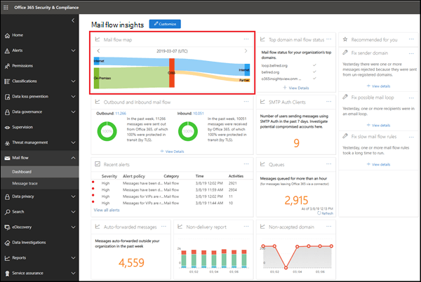
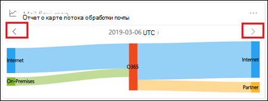

# Отчет о карте потока обработки почты

Этот отчет предоставляет подробные сведения о том, как почтовые сообщения проходят через вашу организацию. Вы можете использовать эти сведения для изучения шаблонов, выявления аномалий и устранения проблем по мере их возникновения.

## Мини-приложение карты почтовых ящиков

По умолчанию в карте почтовых ящиков показан шаблон почтовых ящиков высокого уровня с предыдущего дня. Для разных дней можно использовать стрелки влево и вправо. При наведении курсора мыши на каждую область в отчете будет показан объем почты в Организации и из нее, как показано на следующей схеме:

## Основные сведения о карте почтовых ящиков

Щелкнув мини-приложение **карты почтовых ящиков** , вы перейдете к отчету **карты процесса обработки почты** . Вы можете увидеть более детализированный уровень отчетов, щелкнув таблица Просмотр сведений для просмотра подробных данных. Вы также можете скачать подробный отчет, щелкнув запрос отчет.

## Сведения

По умолчанию для параметра **Показать данные** задано значение **Обзор**. Если щелкнуть раскрывающийся список и выбрать **сведения**, представление будет переключаться на сведения о уровне домена.

Отображаются домены верхнего отправителя и получателя, и остальные домены будут помещены в **другие** , как показано на следующих схемах:

## Связанная аналитика

Связанные сведения отображаются под схемой почтовых процессов, если они доступны (например, для получения сведений о домене отправителя или в цикле обработки почты).

## См. также

Для получения дополнительных сведений о других аналитиках почтовых ящиков в панели мониторинга обработки почты ознакомьтесь с разрешениями [почтовых ящиков в центре безопасности & соответствия требованиям](mail-flow-insights-v2.md).
