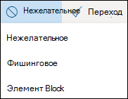
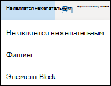

# <a name="report-junk-and-phishing-email-in-outlook-on-the-web-in-office-365"></a><span data-ttu-id="3c5fc-103">Отправка нежелательных и фишинговых сообщений электронной почты в Outlook в Интернете в Office 365</span><span class="sxs-lookup"><span data-stu-id="3c5fc-103">Report junk and phishing email in Outlook on the web in Office 365</span></span>

<span data-ttu-id="3c5fc-104">Если вы являетесь клиентом Office 365 с почтовыми ящиками Exchange Online, вы можете использовать встроенные параметры отчетов в Outlook в Интернете (прежнее название — Outlook Web App) для отправки ложных срабатываний (хорошее сообщение электронной почты отмечено как спам), ложные отрицательные (недопустимые сообщения электронной почты) и фишинговые сообщения для Exchange Online Protection (EOP).</span><span class="sxs-lookup"><span data-stu-id="3c5fc-104">If you're an Office 365 customer with Exchange Online mailboxes, you can use the built-in reporting options in Outlook on the web (formerly known as Outlook Web App) to submit false positives (good email marked as spam), false negatives (bad email allowed) and phishing messages to Exchange Online Protection (EOP).</span></span>

## <a name="what-do-you-need-to-know-before-you-begin"></a><span data-ttu-id="3c5fc-105">Что нужно знать перед началом работы</span><span class="sxs-lookup"><span data-stu-id="3c5fc-105">What do you need to know before you begin?</span></span>

- <span data-ttu-id="3c5fc-106">Если вы являетесь администратором в организации Office 365 с почтовыми ящиками Exchange Online, рекомендуем использовать портал отправки в центре безопасности & соответствия требованиям Office 365.</span><span class="sxs-lookup"><span data-stu-id="3c5fc-106">If you're an admin in an Office 365 organization with Exchange Online mailboxes, we recommend that you use the Submissions portal in the Office 365 Security & Compliance Center.</span></span> <span data-ttu-id="3c5fc-107">Дополнительные сведения см. в [статье Использование отправки администратором для отправки подозреваемой спама, фишинга, URL-адресов и файлов в корпорацию Майкрософт](admin-submission.md).</span><span class="sxs-lookup"><span data-stu-id="3c5fc-107">For more information, see [Use Admin Submission to submit suspected spam, phish, URLs, and files to Microsoft](admin-submission.md).</span></span>

- <span data-ttu-id="3c5fc-108">Администраторы могут отключить или разрешить пользователям сообщать о сообщениях в корпорацию Майкрософт в Outlook в Интернете.</span><span class="sxs-lookup"><span data-stu-id="3c5fc-108">Admins can disable or enable the ability for users to report messages to Microsoft in Outlook on the web.</span></span> <span data-ttu-id="3c5fc-109">Дополнительные сведения см. в разделе [Отключение или Включение отчетов о нежелательной почте в Outlook в Интернете](#disable-or-enable-junk-email-reporting-in-outlook-on-the-web) далее в этом разделе.</span><span class="sxs-lookup"><span data-stu-id="3c5fc-109">For details, see the [Disable or enable junk email reporting in Outlook on the web](#disable-or-enable-junk-email-reporting-in-outlook-on-the-web) section later in this topic.</span></span>

- <span data-ttu-id="3c5fc-110">Дополнительные сведения о сообщениях отчетов в корпорацию Майкрософт можно найти [в статье сообщения и файлы отчетов в корпорацию Майкрософт в Office 365](report-junk-email-messages-to-microsoft.md).</span><span class="sxs-lookup"><span data-stu-id="3c5fc-110">For more information about reporting messages to Microsoft, see [Report messages and files to Microsoft in Office 365](report-junk-email-messages-to-microsoft.md).</span></span>

## <a name="report-spam-and-phishing-messages-in-outlook-on-the-web"></a><span data-ttu-id="3c5fc-111">Составление отчетов о нежелательной почте и фишинговых сообщениях в Outlook в Интернете</span><span class="sxs-lookup"><span data-stu-id="3c5fc-111">Report spam and phishing messages in Outlook on the web</span></span>

1. <span data-ttu-id="3c5fc-112">Для сообщений в папке "Входящие" или любой другой папке, кроме нежелательной почты, используйте один из следующих способов для создания отчетов о нежелательной почте и фишинговых сообщениях.</span><span class="sxs-lookup"><span data-stu-id="3c5fc-112">For messages in the Inbox or any other email folder except Junk Email, use either of the following methods to report spam and phishing messages:</span></span>

   - <span data-ttu-id="3c5fc-113">Выберите сообщение, нажмите кнопку **Нежелательная почта** на панели инструментов, а затем выберите **нежелательные** или **Фишинг**.</span><span class="sxs-lookup"><span data-stu-id="3c5fc-113">Select the message, click **Junk** on the toolbar, and then select **Junk** or **Phishing**.</span></span>

     

   - <span data-ttu-id="3c5fc-115">Выберите одно или несколько сообщений, щелкните правой кнопкой мыши и выберите **Пометить как нежелательное**.</span><span class="sxs-lookup"><span data-stu-id="3c5fc-115">Select one or more messages, right-click, and then select **Mark as junk**.</span></span>

2. <span data-ttu-id="3c5fc-116">В появившемся диалоговом окне нажмите **отчет**.</span><span class="sxs-lookup"><span data-stu-id="3c5fc-116">In the dialog that appears, click **Report**.</span></span> <span data-ttu-id="3c5fc-117">Если вы передумали, щелкните **не сообщать**.</span><span class="sxs-lookup"><span data-stu-id="3c5fc-117">If you change your mind, click **Don't Report**.</span></span>

   

   

3. <span data-ttu-id="3c5fc-120">Выбранные сообщения будут отправлены в корпорацию Майкрософт для анализа.</span><span class="sxs-lookup"><span data-stu-id="3c5fc-120">The selected messages will be sent to Microsoft for analysis.</span></span> <span data-ttu-id="3c5fc-121">Чтобы убедиться, что сообщения отправлены, откройте папку **Отправленные** и просмотрите отправленные сообщения.</span><span class="sxs-lookup"><span data-stu-id="3c5fc-121">To confirm that the messages have been submitted, open your **Sent Items** folder to view the submitted messages.</span></span>

## <a name="report-non-spam-and-phishing-messages-from-the-junk-email-folder-in-outlook-on-the-web"></a><span data-ttu-id="3c5fc-122">Отправка сообщений о сообщениях о нежелательной почте и фишинге из папки "Нежелательная почта" в Outlook в Интернете</span><span class="sxs-lookup"><span data-stu-id="3c5fc-122">Report non-spam and phishing messages from the Junk Email folder in Outlook on the web</span></span>

1. <span data-ttu-id="3c5fc-123">В папке нежелательной почты используйте один из следующих способов, чтобы сообщить о ложных срабатываниях или фишинговых сообщениях.</span><span class="sxs-lookup"><span data-stu-id="3c5fc-123">In the Junk Email folder, use either of the following methods to report spam false positives or phishing messages:</span></span>

   - <span data-ttu-id="3c5fc-124">Выберите сообщение, щелкните **не спам** на панели инструментов, а затем выберите **не спам** или **Фишинг**.</span><span class="sxs-lookup"><span data-stu-id="3c5fc-124">Select the message, click **Not Junk** on the toolbar, and then select **Not Junk** or **Phishing**.</span></span>

     

   - <span data-ttu-id="3c5fc-126">Выберите одно или несколько сообщений, щелкните правой кнопкой мыши и выберите пункт **Пометить как не являющееся нежелательным**.</span><span class="sxs-lookup"><span data-stu-id="3c5fc-126">Select one or more messages, right-click, and then select **Mark as not junk**.</span></span>

2. <span data-ttu-id="3c5fc-127">В появившемся диалоговом окне прочитайте сведения и щелкните **отчет**.</span><span class="sxs-lookup"><span data-stu-id="3c5fc-127">In the dialog that appears, read the information and click **Report**.</span></span> <span data-ttu-id="3c5fc-128">Если вы передумали, щелкните **не сообщать**.</span><span class="sxs-lookup"><span data-stu-id="3c5fc-128">If you change your mind, click **Don't Report**.</span></span>

   

   

3. <span data-ttu-id="3c5fc-131">Выбранные сообщения будут отправлены в корпорацию Майкрософт для анализа.</span><span class="sxs-lookup"><span data-stu-id="3c5fc-131">The selected messages will be sent to Microsoft for analysis.</span></span> <span data-ttu-id="3c5fc-132">Чтобы убедиться, что сообщения отправлены, откройте папку **Отправленные** и просмотрите отправленные сообщения.</span><span class="sxs-lookup"><span data-stu-id="3c5fc-132">To confirm that the messages have been submitted, open your **Sent Items** folder to view the submitted messages.</span></span>

## <a name="disable-or-enable-junk-email-reporting-in-outlook-on-the-web"></a><span data-ttu-id="3c5fc-133">Отключение и Включение отчетов о нежелательной почте в Outlook в Интернете</span><span class="sxs-lookup"><span data-stu-id="3c5fc-133">Disable or enable junk email reporting in Outlook on the web</span></span>

<span data-ttu-id="3c5fc-134">По умолчанию пользователи могут сообщать о ложных срабатываниях нежелательной почты, ложных негативных и фишинговых сообщениях в корпорацию Майкрософт для анализа в Outlook в Интернете.</span><span class="sxs-lookup"><span data-stu-id="3c5fc-134">By default, users can report spam false positives, false negatives, and phishing messages to Microsoft for analysis in Outlook on the web.</span></span> <span data-ttu-id="3c5fc-135">Администраторы могут использовать Outlook в веб-политиках почтовых ящиков в Exchange Online, чтобы включать и отключать эту возможность, но только в Exchange Online PowerShell.</span><span class="sxs-lookup"><span data-stu-id="3c5fc-135">Admins can use Outlook on the web mailbox policies in Exchange Online to disable or enable this ability, but only in Exchange Online PowerShell.</span></span>

- <span data-ttu-id="3c5fc-136">Сведения о том, как подключиться к Exchange Online PowerShell, см. в статье [Подключение к Exchange Online PowerShell](https://docs.microsoft.com/powershell/exchange/exchange-online/connect-to-exchange-online-powershell/connect-to-exchange-online-powershell).</span><span class="sxs-lookup"><span data-stu-id="3c5fc-136">To connect to Exchange Online PowerShell, see [Connect to Exchange Online PowerShell](https://docs.microsoft.com/powershell/exchange/exchange-online/connect-to-exchange-online-powershell/connect-to-exchange-online-powershell).</span></span>

- <span data-ttu-id="3c5fc-137">Чтобы вы могли выполнить эти процедуры, вам должны быть назначены соответствующие разрешения.</span><span class="sxs-lookup"><span data-stu-id="3c5fc-137">You need to be assigned permissions before you can perform these procedures.</span></span> <span data-ttu-id="3c5fc-138">В частности, потребуются роли **получателей** или роли **получателей почты** в Exchange Online, которые назначаются группам ролей " **Управление организацией** " и " **Управление получателями** " по умолчанию.</span><span class="sxs-lookup"><span data-stu-id="3c5fc-138">Specifically you need the **Recipient Policies** or **Mail Recipients** roles in Exchange Online, which are assigned to the **Organization Management** and **Recipient Management** role groups by default.</span></span> <span data-ttu-id="3c5fc-139">Дополнительные сведения о группах ролей в Exchange Online можно узнать в статье [изменение групп ролей в Exchange Online](https://docs.microsoft.com/Exchange/permissions-exo/role-groups#modify-role-groups).</span><span class="sxs-lookup"><span data-stu-id="3c5fc-139">For more information about role groups in Exchange Online, see [Modify role groups in Exchange Online](https://docs.microsoft.com/Exchange/permissions-exo/role-groups#modify-role-groups).</span></span>

- <span data-ttu-id="3c5fc-140">Каждая организация имеет политику по умолчанию с именем OwaMailboxPolicy по умолчанию, но вы можете создавать настраиваемые политики.</span><span class="sxs-lookup"><span data-stu-id="3c5fc-140">Every organization has a default policy named OwaMailboxPolicy-Default, but you can create custom policies.</span></span> <span data-ttu-id="3c5fc-141">Настраиваемые политики применяются к пользователям с ограниченной областью действия перед политикой по умолчанию.</span><span class="sxs-lookup"><span data-stu-id="3c5fc-141">Custom policies are applied to scoped users before the default policy.</span></span> <span data-ttu-id="3c5fc-142">Для получения дополнительных сведений о политиках почтовых ящиков Outlook в Интернете просмотрите [политики почтовых ящиков Outlook в Exchange Online](https://docs.microsoft.com/Exchange/clients-and-mobile-in-exchange-online/outlook-on-the-web/outlook-web-app-mailbox-policies).</span><span class="sxs-lookup"><span data-stu-id="3c5fc-142">For more information about Outlook on the web mailbox policies, see [Outlook on the web mailbox policies in Exchange Online](https://docs.microsoft.com/Exchange/clients-and-mobile-in-exchange-online/outlook-on-the-web/outlook-web-app-mailbox-policies).</span></span>

1. <span data-ttu-id="3c5fc-143">Чтобы найти существующие политики почтовых ящиков Outlook в Интернете и состояние отчетов о нежелательной почте, выполните следующую команду:</span><span class="sxs-lookup"><span data-stu-id="3c5fc-143">To find your existing Outlook on the web mailbox policies and the status of junk email reporting, run the following command:</span></span>

   ```powershell
   Get-OwaMailboxPolicy | Format-Table Name,ReportJunkEmailEnabled
   ```

2. <span data-ttu-id="3c5fc-144">Чтобы включить или отключить отчеты о нежелательной почте в Outlook в Интернете, используйте следующий синтаксис:</span><span class="sxs-lookup"><span data-stu-id="3c5fc-144">To disable or enable junk email reporting in Outlook on the web, use the following syntax:</span></span>

   ```powershell
   Set-OwaMailboxPolicy -Identity "<OWAMailboxPolicyName>" -ReportJunkEmailEnabled <$true | $false>
   ```

   <span data-ttu-id="3c5fc-145">В этом примере отключается создание отчетов о нежелательной почте в политике по умолчанию.</span><span class="sxs-lookup"><span data-stu-id="3c5fc-145">This example disables junk email reporting in the default policy.</span></span>

   ```powershell
   Set-OwaMailboxPolicy -Identity "OwaMailboxPolicy-Default" -ReportJunkEmailEnabled $false
   ```

   <span data-ttu-id="3c5fc-146">В этом примере включена поддержка отчетов о нежелательной почте в пользовательской политике с именем Contoso Managers.</span><span class="sxs-lookup"><span data-stu-id="3c5fc-146">This example enabled junk email reporting in the custom policy named Contoso Managers.</span></span>

   ```powershell
   Set-OwaMailboxPolicy -Identity "Contoso Managers" -ReportJunkEmailEnabled $true
   ```

<span data-ttu-id="3c5fc-147">Подробные сведения о синтаксисе и параметрах можно найти в статье [Get – OwaMailboxPolicy](https://docs.microsoft.com/powershell/module/exchange/client-access/get-owamailboxpolicy) и [Set/OwaMailboxPolicy](https://docs.microsoft.com/powershell/module/exchange/client-access/set-owamailboxpolicy).</span><span class="sxs-lookup"><span data-stu-id="3c5fc-147">For detailed syntax and parameter information, see [Get-OwaMailboxPolicy](https://docs.microsoft.com/powershell/module/exchange/client-access/get-owamailboxpolicy) and [Set-OwaMailboxPolicy](https://docs.microsoft.com/powershell/module/exchange/client-access/set-owamailboxpolicy).</span></span>

### <a name="how-do-you-know-this-worked"></a><span data-ttu-id="3c5fc-148">Как убедиться, что все получилось?</span><span class="sxs-lookup"><span data-stu-id="3c5fc-148">How do you know this worked?</span></span>

<span data-ttu-id="3c5fc-149">Чтобы убедиться, что вы успешно включили или отключили отчеты о нежелательной почте в Outlook в Интернете, выполните одно из указанных ниже действий.</span><span class="sxs-lookup"><span data-stu-id="3c5fc-149">To verify that you've successfully enabled or disabled junk email reporting in Outlook on the web, use any of the following steps:</span></span>

- <span data-ttu-id="3c5fc-150">В Exchange Online PowerShell выполните следующую команду и проверьте значение свойства **репортжункемаиленаблед** :</span><span class="sxs-lookup"><span data-stu-id="3c5fc-150">In Exchange Online PowerShell, run the following command and verify the **ReportJunkEmailEnabled** property value:</span></span>

  ```powershell
  Get-OwaMailboxPolicy | Format-Table Name,ReportJunkEmailEnabled
  ```

- <span data-ttu-id="3c5fc-151">Откройте почтовый ящик затронутого пользователя в Outlook в Интернете и проверьте наличие нежелательных, нежелательных и фишинговых сообщений, доступных или нежелательных.</span><span class="sxs-lookup"><span data-stu-id="3c5fc-151">Open an affected user's mailbox in Outlook on the web, and verify the options to report junk, not junk, and phishing messages are available or not available.</span></span> <span data-ttu-id="3c5fc-152">Обратите внимание, что пользователь по-прежнему может помечать сообщения как нежелательные, фишинговые и нежелательные, но пользователи не могут отправлять отчеты в корпорацию Майкрософт.</span><span class="sxs-lookup"><span data-stu-id="3c5fc-152">Note that the user can still mark messages as junk, phishing, and not junk, but the user can't report them to Microsoft.</span></span>
