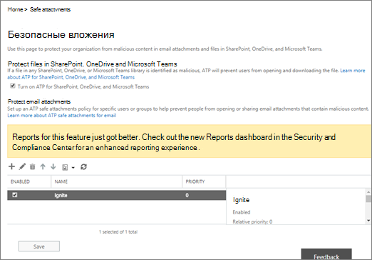

# Включить ATP для SharePoint, OneDrive и Microsoft Teams

> [!IMPORTANT]
> Эта статья предназначена для бизнес-клиентов, у которых есть [Office 365 Advanced Threat Protection](office-365-atp.md). Если вы являетесь домашним пользователем, который ищет сведения о безопасных ссылках в Outlook, ознакомьтесь со статьей [Advanced Outlook.com Security](https://support.microsoft.com/office/882d2243-eab9-4545-a58a-b36fee4a46e2).

[Office 365 ATP для SharePoint, OneDrive и Microsoft Teams](atp-for-spo-odb-and-teams.md) защищает организацию от случайного предоставления вредоносных файлов. При обнаружении вредоносного файла этот файл блокируется, чтобы никто не мог открыть, скопировать, переместить или предоставить к нему общий доступ до тех пор, пока не будут предприняты дальнейшие действия группы безопасности Организации. В этой статье описано, как включить ATP для SharePoint, OneDrive и Teams, настроить оповещения о обнаруженных файлах и выполнить следующие действия.

Для определения (или изменения) политик ATP необходимо назначить соответствующую роль. Некоторые примеры описаны в таблице ниже.

|Role|Где/как назначено|
|---------|---------|
|Глобальный администратор|Сотрудник, который подписывается на приобретение Microsoft 365, по умолчанию является глобальным администратором. (Чтобы узнать больше, ознакомьтесь со статьей [о ролях администратора майкрософт 365](https://docs.microsoft.com/microsoft-365/admin/add-users/about-admin-roles) .)|
|Администратор безопасности|Центр администрирования Azure Active Directory ( [https://aad.portal.azure.com](https://aad.portal.azure.com) )|
|Управление организациями в Exchange Online|Центр администрирования Exchange ( [https://outlook.office365.com/ecp](https://outlook.office365.com/ecp) )  или    Командлеты PowerShell (см. [Exchange Online PowerShell](https://docs.microsoft.com/powershell/exchange/exchange-online/exchange-online-powershell))|

## Включить ATP для SharePoint, OneDrive и Microsoft Teams

**Прежде чем приступить к этой процедуре, убедитесь, что ведение журнала аудита для вашей среды Microsoft 365 уже включено**. Это обычно делается для пользователей, которым назначена роль "журналы аудита" в Exchange Online. Дополнительные сведения см. в статье [Включение и отключение поиска в журнале аудита](../../compliance/turn-audit-log-search-on-or-off.md).

1. Перейдите на страницу [https://protection.office.com](https://protection.office.com) и войдите с помощью рабочей или учебной учетной записи.

2. В центре управления безопасностью & соответствия требованиям в области навигации слева в разделе **Управление угрозами**выберите пункт **Policy** \> **безопасные вложения**политики.

   

3. Выберите **включить ATP для SharePoint, OneDrive и Microsoft Teams**.

   

4. Нажмите кнопку **Сохранить**.

5. Просмотрите (и, соответственно, измените) [политики безопасных вложений](set-up-atp-safe-attachments-policies.md) в Организации и [политики безопасных ссылок](set-up-atp-safe-links-policies.md).

6. Предложен В качестве глобального администратора или администратора SharePoint Online выполните командлет **[Set-SPOTenant](https://docs.microsoft.com/powershell/module/sharepoint-online/Set-SPOTenant)** с параметром _дисалловинфектедфиледовнлоад_ , для которого задано *значение true*.

   - При установке для параметра значения *true* блокируются все действия для обнаруженных файлов (кроме DELETE). Пользователи не могут открывать, перемещать и копировать обнаруженные файлы, а также предоставлять к ним общий доступ.

   - Если задать для параметра *значение false* , все действия, кроме DELETE и download, блокируются. Пользователи могут принять решение о риске и скачать обнаруженный файл.

7. Разрешить распространение изменений в центрах обработки данных Microsoft 365 до 30 минут.

8. Предложен Перейдите к разделу Настройка оповещений для обнаруженных файлов.

Чтобы узнать больше об использовании PowerShell с Microsoft 365, ознакомьтесь [со статьей управление microsoft 365 с помощью PowerShell](https://docs.microsoft.com/office365/enterprise/powershell/manage-office-365-with-office-365-powershell).

Чтобы узнать больше о пользовательском интерфейсе, когда файл был определен как вредоносный, посмотрите, [что делать, когда вредоносный файл обнаружен в SharePoint Online, OneDrive или Microsoft Teams](https://support.microsoft.com/en-us/office/what-to-do-when-a-malicious-file-is-found-in-sharepoint-online-onedrive-or-microsoft-teams-01e902ad-a903-4e0f-b093-1e1ac0c37ad2).

## Настройка оповещений для обнаруженных файлов

Чтобы получать уведомления о том, что файл в SharePoint Online, OneDrive для бизнеса или Microsoft Teams определен как вредоносный, вы можете настроить оповещение.

1. В [центре безопасности & соответствия требованиям](https://protection.office.com)выберите **оповещения** \> **Управление оповещениями**.

2. Выберите **создать политику оповещений**.

3. Укажите имя оповещения. Например, можно ввести в библиотеки вредоносные файлы.

4. Введите описание оповещения. Например, вы можете ввести уведомление администраторов об обнаружении вредоносных файлов в SharePoint Online, OneDrive или Microsoft Teams.

5. В разделе **отправить это оповещение, когда...** выполните следующие действия:

   а) В списке **действия** выберите **обнаруженная вредоносная программа в файле**.

   б) Оставьте поле **Пользователи** пустым.

6. В разделе **отправить это оповещение по...** выберите одного или нескольких глобальных администраторов, администраторов безопасности или средств чтения безопасности, которые должны получать уведомление при обнаружении вредоносного файла.

7. Нажмите кнопку **Сохранить**.

Чтобы узнать больше об оповещениях, ознакомьтесь со статьей [Создание оповещений о действиях в центре безопасности & соответствия требованиям](../../compliance/create-activity-alerts.md).

## Дальнейшие действия

1. [Просмотр сведений о вредоносных файлах, обнаруженных в SharePoint, OneDrive или Microsoft Teams](malicious-files-detected-in-spo-odb-or-teams.md)

2. [Управление сообщениями и файлами, помещенными в карантин, от имени администратора в Microsoft 365](manage-quarantined-messages-and-files.md)
